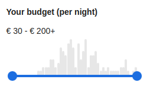

Ve skutečnosti existuje jen několik případů použití histogramů na e-commerce webech. Nejčastějším je cenový histogram, který slouží k filtrování produktů podle ceny. Příklad takového histogramu můžete vidět na webu Booking.com:



Je škoda, že se histogram nepoužívá častěji, protože je to velmi užitečný nástroj pro získání přehledu o rozložení hodnot atributů produktů s vysokou kardinalitou, jako je hmotnost, výška, šířka a podobně.

Datová struktura histogramu je optimalizována pro vykreslování na frontendu. Obsahuje následující pole:

- **`min`** – minimální hodnota atributu v aktuálním kontextu filtru
- **`max`** – maximální hodnota atributu v aktuálním kontextu filtru
- **`overallCount`** – počet prvků, jejichž hodnota atributu spadá do některého z intervalů (v podstatě součet všech výskytů v intervalech)
- **`buckets`** – *seřazené* pole intervalů, z nichž každý obsahuje následující pole:
  - **`threshold`** – minimální hodnota atributu v intervalu, maximální hodnota je threshold následujícího intervalu (nebo `max` pro poslední interval)
  - **`occurrences`** – počet prvků, jejichž hodnota atributu spadá do daného intervalu
  - **`requested`**:
    - obsahuje `true`, pokud dotaz neobsahoval žádné omezení [attributeBetween](../filtering/comparable.md#atribut-mezi)
      nebo [priceBetween](../filtering/price.md#cena-v-rozmezí)
    - obsahuje `true`, pokud dotaz obsahoval omezení [attributeBetween](../filtering/comparable.md#atribut-mezi)
      nebo [priceBetween](../filtering/price.md#cena-v-rozmezí) pro konkrétní atribut / cenu
      a threshold intervalu leží v rozsahu (včetně) tohoto omezení
    - v ostatních případech obsahuje `false`

## Histogram atributu

<LS to="e,j,r,c">

```evitaql-syntax
attributeHistogram(
    argument:int!,
    argument:enum(STANDARD|OPTIMIZED),
    argument:string+
)
```

<dl>
    <dt>argument:int!</dt>
    <dd>
        počet sloupců (intervalů) v histogramu; číslo by mělo být zvoleno tak, aby se histogram dobře vešel
        do dostupného prostoru na obrazovce
    </dd>
    <dt>argument:enum(STANDARD|OPTIMIZED)</dt>
    <dd>
        Chování výpočtu histogramu – buď STANDARD (výchozí), kdy je vrácen přesně požadovaný počet intervalů,
        nebo OPTIMIZED, kdy je počet sloupců snížen, pokud jsou data řídká a mezi intervaly by byly velké mezery
        (prázdné intervaly). Výsledkem jsou kompaktnější histogramy, které poskytují lepší uživatelský zážitek.
    </dd>
    <dt>argument:string+</dt>
    <dd>
        jeden nebo více názvů [atributů entity](../../use/schema.md#atributy), jejichž hodnoty budou použity pro generování histogramů
    </dd>
</dl>

</LS>

<LS to="e,j"><SourceClass>evita_api/src/main/java/io/evitadb/api/requestResponse/extraResult/AttributeHistogram.java</SourceClass></LS><LS to="c"><SourceClass>EvitaDB.Client/Models/ExtraResults/AttributeHistogram.cs</SourceClass></LS>
<LS to="g,r">histogram atributu</LS>
může být vypočítán z jakéhokoliv [filtrovatelného atributu](../../use/data-model.md#atributy-unikátní-filtrovatelné-řaditelné-lokalizované),
jehož typ je číselný. Histogram je počítán pouze z atributů prvků, které odpovídají aktuální povinné části filtru.
Intervalová omezení – tj. [`attributeBetween`](../filtering/comparable.md#atribut-mezi)
a [`priceBetween`](../filtering/price.md#cena-v-rozmezí) v části [`userFilter`](../filtering/behavioral.md#uživatelský-filtr)
jsou pro účely výpočtu histogramu vyloučena. Pokud by tomu tak nebylo, uživatel by při zužování rozsahu podle výsledků histogramu
byl tlačen do stále užšího a užšího rozsahu a nakonec by se dostal do slepé uličky.

Pro ukázku použití histogramu použijeme následující příklad:

<SourceCodeTabs requires="evita_test/evita_functional_tests/src/test/resources/META-INF/documentation/evitaql-init.java" langSpecificTabOnly>

[Histogram atributu nad atributy `width` a `height`](/documentation/user/en/query/requirements/examples/histogram/attribute-histogram.evitaql)

</SourceCodeTabs>

Zjednodušený výsledek vypadá takto:

<MDInclude sourceVariable="extraResults.AttributeHistogram">[Výsledek histogramu atributů `width` a `height`](/documentation/user/en/query/requirements/examples/histogram/attribute-histogram.evitaql.string.md)</MDInclude>

<Note type="info">

<NoteTitle toggles="true">

##### Výsledek histogramu atributů `width` a `height` ve formátu JSON

</NoteTitle>

Výsledek histogramu ve formátu JSON je trochu obsáhlejší, ale stále poměrně čitelný:

<LS to="e,j,c">

<MDInclude sourceVariable="extraResults.AttributeHistogram">[Výsledek histogramu atributů `width` a `height` ve formátu JSON](/documentation/user/en/query/requirements/examples/histogram/attribute-histogram.evitaql.json.md)</MDInclude>

</LS>
<LS to="g">

<MDInclude sourceVariable="data.queryProduct.extraResults.attributeHistogram">[Výsledek histogramu atributů `width` a `height` ve formátu JSON](/documentation/user/en/query/requirements/examples/histogram/attribute-histogram.graphql.json.md)</MDInclude>

</LS>
<LS to="r">

<MDInclude sourceVariable="extraResults.attributeHistogram">[Výsledek histogramu atributů `width` a `height` ve formátu JSON](/documentation/user/en/query/requirements/examples/histogram/attribute-histogram.rest.json.md)</MDInclude>

</LS>

</Note>

### Optimalizace obsahu histogramu atributu

Během uživatelského testování jsme zjistili, že histogramy s řídkými daty nejsou příliš užitečné. Kromě toho, že nevypadají dobře,
jsou často obtížně ovladatelné pomocí widgetu, který histogram ovládá a snaží se držet prahových hodnot intervalů.
Proto jsme zavedli nový režim výpočtu histogramu – `OPTIMIZED`. V tomto režimu se algoritmus výpočtu histogramu snaží
snížit počet intervalů, pokud jsou data řídká a mezi intervaly by byly velké mezery (prázdné intervaly).
Výsledkem jsou kompaktnější histogramy, které poskytují lepší uživatelský zážitek.

Pro ukázku optimalizace histogramu použijeme následující příklad:

<SourceCodeTabs requires="evita_test/evita_functional_tests/src/test/resources/META-INF/documentation/evitaql-init.java" langSpecificTabOnly>

[Optimalizovaný histogram atributu nad atributem `width`](/documentation/user/en/query/requirements/examples/histogram/attribute-histogram-optimized.evitaql)

</SourceCodeTabs>

Zjednodušený výsledek vypadá takto:

<MDInclude sourceVariable="extraResults.AttributeHistogram">[Výsledek optimalizovaného histogramu atributu `width`](/documentation/user/en/query/requirements/examples/histogram/attribute-histogram-optimized.evitaql.string.md)</MDInclude>

<Note type="info">

<NoteTitle toggles="true">

##### Optimalizovaný výsledek histogramu atributů `width` a `height` ve formátu JSON

</NoteTitle>

Optimalizovaný výsledek histogramu ve formátu JSON je trochu obsáhlejší, ale stále poměrně čitelný:

<LS to="e,j,c">

<MDInclude sourceVariable="extraResults.AttributeHistogram">[Výsledek optimalizovaného histogramu atributu `width`](/documentation/user/en/query/requirements/examples/histogram/attribute-histogram-optimized.evitaql.json.md)</MDInclude>

</LS>
<LS to="g">

<MDInclude sourceVariable="data.queryProduct.extraResults.attributeHistogram">[Výsledek optimalizovaného histogramu atributu `width`](/documentation/user/en/query/requirements/examples/histogram/attribute-histogram-optimized.graphql.json.md)</MDInclude>

</LS>
<LS to="r">

<MDInclude sourceVariable="extraResults.attributeHistogram">[Výsledek optimalizovaného histogramu atributu `width`](/documentation/user/en/query/requirements/examples/histogram/attribute-histogram-optimized.rest.json.md)</MDInclude>

</LS>

</Note>

Jak můžete vidět, počet intervalů byl upraven tak, aby odpovídal datům, na rozdíl od výchozího chování.

## Cenový histogram

<LS to="e,j,r,c">

```evitaql-syntax
priceHistogram(
    argument:int!,
    argument:enum(STANDARD|OPTIMIZED)
)
```

<dl>
    <dt>argument:int!</dt>
    <dd>
        počet sloupců (intervalů) v histogramu; číslo by mělo být zvoleno tak, aby se histogram dobře vešel
        do dostupného prostoru na obrazovce
    </dd>
    <dt>argument:enum(STANDARD|OPTIMIZED)</dt>
    <dd>
        Chování výpočtu histogramu – buď STANDARD (výchozí), kdy je vrácen přesně požadovaný počet intervalů,
        nebo OPTIMIZED, kdy je počet sloupců snížen, pokud jsou data řídká a mezi intervaly by byly velké mezery
        (prázdné intervaly). Výsledkem jsou kompaktnější histogramy, které poskytují lepší uživatelský zážitek.
    </dd>
</dl>

</LS>

<LS to="e,j"><SourceClass>evita_api/src/main/java/io/evitadb/api/requestResponse/extraResult/PriceHistogram.java</SourceClass></LS><LS to="c"><SourceClass>EvitaDB.Client/Models/ExtraResults/PriceHistogram.cs</SourceClass></LS>
<LS to="g,r">cenový histogram</LS>
je počítán z [prodejní ceny](../filtering/price.md). Intervalová omezení – tj.
[`attributeBetween`](../filtering/comparable.md#atribut-mezi) a [`priceBetween`](../filtering/price.md#cena-v-rozmezí)
v části [`userFilter`](../filtering/behavioral.md#uživatelský-filtr) jsou pro účely výpočtu histogramu vyloučena.
Pokud by tomu tak nebylo, uživatel by při zužování rozsahu podle výsledků histogramu byl tlačen do stále užšího a užšího rozsahu a nakonec by se dostal do slepé uličky.

Požadavek [`priceType`](price.md#typ-ceny) určuje zdrojovou vlastnost ceny pro výpočet histogramu. Pokud není zadán žádný požadavek, histogram zobrazuje cenu s daní.

Pro ukázku použití histogramu použijeme následující příklad:

<SourceCodeTabs requires="evita_test/evita_functional_tests/src/test/resources/META-INF/documentation/evitaql-init.java" langSpecificTabOnly>

[Cenový histogram](/documentation/user/en/query/requirements/examples/histogram/price-histogram.evitaql)

</SourceCodeTabs>

Zjednodušený výsledek vypadá takto:

<MDInclude sourceVariable="extraResults.PriceHistogram">[Výsledek cenového histogramu](/documentation/user/en/query/requirements/examples/histogram/price-histogram.evitaql.string.md)</MDInclude>

<Note type="info">

<NoteTitle toggles="true">

##### Výsledek cenového histogramu ve formátu JSON

</NoteTitle>

Výsledek histogramu ve formátu JSON je trochu obsáhlejší, ale stále poměrně čitelný:

<LS to="e,j,c">

<MDInclude sourceVariable="extraResults.PriceHistogram">[Výsledek cenového histogramu ve formátu JSON](/documentation/user/en/query/requirements/examples/histogram/price-histogram.evitaql.json.md)</MDInclude>

</LS>
<LS to="g">

<MDInclude sourceVariable="data.queryProduct.extraResults.priceHistogram">[Výsledek cenového histogramu ve formátu JSON](/documentation/user/en/query/requirements/examples/histogram/price-histogram.graphql.json.md)</MDInclude>

</LS>
<LS to="r">

<MDInclude sourceVariable="extraResults.priceHistogram">[Výsledek cenového histogramu ve formátu JSON](/documentation/user/en/query/requirements/examples/histogram/price-histogram.rest.json.md)</MDInclude>

</LS>

</Note>

### Optimalizace obsahu cenového histogramu

Během uživatelského testování jsme zjistili, že histogramy s řídkými daty nejsou příliš užitečné. Kromě toho, že nevypadají dobře,
jsou často obtížně ovladatelné pomocí widgetu, který histogram ovládá a snaží se držet prahových hodnot intervalů.
Proto jsme zavedli nový režim výpočtu histogramu – `OPTIMIZED`. V tomto režimu se algoritmus výpočtu histogramu snaží
snížit počet intervalů, pokud jsou data řídká a mezi intervaly by byly velké mezery (prázdné intervaly).
Výsledkem jsou kompaktnější histogramy, které poskytují lepší uživatelský zážitek.

Pro ukázku optimalizace histogramu použijeme následující příklad:

<SourceCodeTabs requires="evita_test/evita_functional_tests/src/test/resources/META-INF/documentation/evitaql-init.java" langSpecificTabOnly>

[Optimalizovaný cenový histogram](/documentation/user/en/query/requirements/examples/histogram/price-histogram-optimized.evitaql)

</SourceCodeTabs>

Zjednodušený výsledek vypadá takto:

<MDInclude sourceVariable="extraResults.PriceHistogram">[Výsledek optimalizovaného cenového histogramu](/documentation/user/en/query/requirements/examples/histogram/price-histogram-optimized.evitaql.string.md)</MDInclude>

<Note type="info">

<NoteTitle toggles="true">

##### Výsledek optimalizovaného cenového histogramu ve formátu JSON

</NoteTitle>

Optimalizovaný výsledek histogramu ve formátu JSON je trochu obsáhlejší, ale stále poměrně čitelný:

<LS to="e,j,s">

<MDInclude sourceVariable="extraResults.PriceHistogram">[Výsledek optimalizovaného cenového histogramu](/documentation/user/en/query/requirements/examples/histogram/price-histogram-optimized.evitaql.json.md)</MDInclude>

</LS>
<LS to="g">

<MDInclude sourceVariable="data.queryProduct.extraResults.priceHistogram">[Výsledek optimalizovaného cenového histogramu](/documentation/user/en/query/requirements/examples/histogram/price-histogram-optimized.graphql.json.md)</MDInclude>

</LS>
<LS to="r">

<MDInclude sourceVariable="extraResults.priceHistogram">[Výsledek optimalizovaného cenového histogramu](/documentation/user/en/query/requirements/examples/histogram/price-histogram-optimized.rest.json.md)</MDInclude>

</LS>

</Note>

Jak můžete vidět, počet intervalů byl upraven tak, aby odpovídal datům, na rozdíl od výchozího chování.