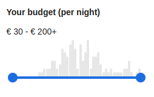

Ve skutečnosti existuje jen několik případů použití histogramů na e-commerce webech. Nejčastějším je cenový histogram, který slouží k filtrování produktů podle ceny. Příklad takového histogramu můžete vidět na webu Booking.com:



Je škoda, že histogram není používán častěji, protože je to velmi užitečný nástroj pro získání přehledu o rozložení hodnot atributů produktů s vysokou kardinalitou, jako je hmotnost, výška, šířka a podobně.

Datová struktura histogramu je optimalizována pro vykreslování na frontendu. Obsahuje následující pole:

- **`min`** - minimální hodnota atributu v aktuálním kontextu filtru
- **`max`** - maximální hodnota atributu v aktuálním kontextu filtru
- **`overallCount`** - počet prvků, jejichž hodnota atributu spadá do některého z bucketů (v podstatě součet všech výskytů v bucketech)
- **`buckets`** - *seřazené* pole bucketů, z nichž každý obsahuje následující pole:
  - **`threshold`** - minimální hodnota atributu v bucketu, maximální hodnota je threshold následujícího bucketu (nebo `max` pro poslední bucket)
  - **`occurrences`** - počet prvků, jejichž hodnota atributu spadá do bucketu
  - **`relativeFrequency`** - hodnota používaná pro vizualizaci výšky bucketu v UI (škála 0-100):
    - Pro **standardní histogramy**: procento z celkového počtu výskytů, vypočítané jako `(occurrences / overallCount) * 100`
    - Pro **equalizované histogramy**: normalizovaná hustota hodnot, která zohledňuje jak výskyty, tak šířku bucketu:
      1. Hrubá frekvence se vypočítá jako `occurrences * (totalRange / bucketWidth)` – tím se zvýhodní buckety s mnoha výskyty v úzkém rozsahu
      2. Hodnoty jsou pak normalizovány tak, aby součet všech bucketů byl 100
      3. Prázdné buckety mají vždy relativeFrequency = 0
  - **`requested`**:
    - obsahuje `true`, pokud dotaz neobsahoval žádné omezení [attributeBetween](../filtering/comparable.md#atribut-mezi) nebo [priceBetween](../filtering/price.md#cena-v-rozmezí)
    - obsahuje `true`, pokud dotaz obsahoval omezení [attributeBetween](../filtering/comparable.md#atribut-mezi) nebo [priceBetween](../filtering/price.md#cena-v-rozmezí) pro konkrétní atribut/cenu a threshold bucketu leží v rozsahu (včetně) tohoto omezení
    - obsahuje `false` v ostatních případech

<Note type="info">

Identita `overallCount = součet výskytů v bucketech` vždy platí. U histogramů vytvořených nad **zdrojem typu rozsah** (pouze referenční histogramy — viz [referenční histogramy](../../use/schema.md#referenční-histogramy)), může jeden prvek spadat do více bucketů najednou, takže `overallCount` může překročit počet unikátních přispívajících prvků. U každého histogramu nad skalárním zdrojem jsou tyto dvě hodnoty stejné.

`relativeFrequency` zůstává platnou vizualizací 0–100 v obou případech — je to poměr `occurrences` ku `overallCount` (standardní buckety stále dávají součet 100, equalizované buckety jsou stále normalizovány na 100) a u zdroje typu rozsah čitatel i jmenovatel počítají stejná překrytí. Jediný rozdíl je v interpretaci: výška bucketu u zdroje typu rozsah odráží podíl **(prvek × překrytý bucket)**, nikoliv podíl unikátních prvků, takže pozice pokryté více překrývajícími se rozsahy se zobrazí úměrně vyšší.

</Note>

## Histogram atributu

<LS to="e,j,r,c">

```evitaql-syntax
attributeHistogram(
    argument:int!,
    argument:enum(STANDARD|OPTIMIZED|EQUALIZED|EQUALIZED_OPTIMIZED),
    argument:string+
)
```

<dl>
    <dt>argument:int!</dt>
    <dd>
        počet sloupců (bucketů) v histogramu; počet by měl být zvolen tak, aby se histogram dobře vešel do dostupného prostoru na obrazovce
    </dd>
    <dt>argument:enum(STANDARD|OPTIMIZED|EQUALIZED|EQUALIZED_OPTIMIZED)</dt>
    <dd>
        Chování výpočtu histogramu:
        <ul>
            <li><strong>STANDARD</strong> (výchozí): Vrací přesně požadovaný počet bucketů se stejně širokými intervaly v celém rozsahu hodnot.</li>
            <li><strong>Optimalizováno</strong>: Vrací méně bucketů, pokud jsou data řídká, aby se předešlo velkým mezerám (prázdným bucketům).</li>
            <li><strong>Vyrovnáno</strong>: Vrací přesně požadovaný počet bucketů, ale hranice bucketů určuje podle kumulativní distribuční funkce tak, aby každý bucket pokrýval přibližně stejný podíl záznamů. To poskytuje lepší uživatelský zážitek při silně zkreslených datech.</li>
            <li><strong>EQUALIZED_OPTIMIZED</strong>: Kombinuje equalizované bucketing s optimalizací pro snížení počtu prázdných bucketů.</li>
        </ul>
    </dd>
    <dt>argument:string+</dt>
    <dd>
        jeden nebo více názvů [atributů entity](../../use/schema.md#atributy), jejichž hodnoty budou použity pro generování histogramů
    </dd>
</dl>

</LS>

<LS to="e,j"><SourceClass>evita_api/src/main/java/io/evitadb/api/requestResponse/extraResult/AttributeHistogram.java</SourceClass></LS><LS to="c"><SourceClass>EvitaDB.Client/Models/ExtraResults/AttributeHistogram.cs</SourceClass></LS>
<LS to="g,r">histogram atributu</LS>
lze vypočítat z libovolného [filtrovatelného atributu](../../use/data-model.md#atributy-unikátní-filtrovatelné-řaditelné-lokalizované), jehož typ je číselný. Histogram je počítán pouze z atributů prvků, které odpovídají aktuální povinné části filtru. Výběry rozsahů na atributech umístěné uvnitř
[`userFilter`](../filtering/behavioral.md#uživatelský-filtr) — jak
[`attributeBetween`](../filtering/comparable.md#atribut-mezi), tak
[`histogramHaving`](../filtering/references.md#histogram-having) — jsou **vyloučeny** ze základny histogramu atributu, aby se jezdec nesmršťoval pod vlastní rukojetí při jeho posouvání. Výběry facetů
([`facetHaving`](../filtering/references.md#facet-having)) a cenový rozsah
([`priceBetween`](../filtering/price.md#cena-v-rozmezí)) zůstávají aplikovány, takže histogram odráží rozsah hodnot atributů, které jsou skutečně dosažitelné v rámci aktuálního výběru facetů a cen. Důvod a konkrétní příklad jsou popsány v části [Uvolnění základny](#uvolnění-základny--slidery-se-nesmršťují-pod-vlastní-rukojetí) níže.

Pro ukázku použití histogramu použijeme následující příklad:

<SourceCodeTabs requires="evita_test/evita_documentation_tests/src/test/resources/META-INF/documentation/evitaql-init.java" langSpecificTabOnly>

[Histogram atributu nad atributy `width` a `height`](/documentation/user/en/query/requirements/examples/histogram/attribute-histogram.evitaql)

</SourceCodeTabs>

Zjednodušený výsledek vypadá takto:

<MDInclude sourceVariable="extraResults.AttributeHistogram">[Výsledek histogramu atributu `width` a `height`](/documentation/user/en/query/requirements/examples/histogram/attribute-histogram.evitaql.string.md)</MDInclude>

<Note type="info">

<NoteTitle toggles="true">

##### Výsledek histogramu atributu `width` a `height` ve formátu JSON

</NoteTitle>

Výsledek histogramu ve formátu JSON je trochu obsáhlejší, ale stále poměrně čitelný:

<LS to="e,j,c">

<MDInclude sourceVariable="extraResults.AttributeHistogram">[Výsledek histogramu atributu `width` a `height` ve formátu JSON](/documentation/user/en/query/requirements/examples/histogram/attribute-histogram.evitaql.json.md)</MDInclude>

</LS>
<LS to="g">

<MDInclude sourceVariable="data.queryProduct.extraResults.attributeHistogram">[Výsledek histogramu atributu `width` a `height` ve formátu JSON](/documentation/user/en/query/requirements/examples/histogram/attribute-histogram.graphql.json.md)</MDInclude>

</LS>
<LS to="r">

<MDInclude sourceVariable="extraResults.attributeHistogram">[Výsledek histogramu atributu `width` a `height` ve formátu JSON](/documentation/user/en/query/requirements/examples/histogram/attribute-histogram.rest.json.md)</MDInclude>

</LS>

</Note>

### Optimalizace obsahu histogramu atributu

Při uživatelském testování jsme zjistili, že histogramy s řídkými daty nejsou příliš užitečné. Kromě toho, že nevypadají dobře, jsou často obtížněji ovladatelné pomocí widgetu, který ovládá histogram a snaží se držet hranic bucketů. Proto jsme zavedli nový režim výpočtu histogramu - `OPTIMIZED`. V tomto režimu se algoritmus výpočtu histogramu snaží snížit počet bucketů, pokud jsou data řídká a mezi buckety by byly velké mezery (prázdné buckety). Výsledkem jsou kompaktnější histogramy, které poskytují lepší uživatelský zážitek.

Pro ukázku optimalizace histogramu použijeme následující příklad:

<SourceCodeTabs requires="evita_test/evita_documentation_tests/src/test/resources/META-INF/documentation/evitaql-init.java" langSpecificTabOnly>

[Optimalizovaný histogram atributu nad atributem `width`](/documentation/user/en/query/requirements/examples/histogram/attribute-histogram-optimized.evitaql)

</SourceCodeTabs>

Zjednodušený výsledek vypadá takto:

<MDInclude sourceVariable="extraResults.AttributeHistogram">[Výsledek optimalizovaného histogramu atributu `width`](/documentation/user/en/query/requirements/examples/histogram/attribute-histogram-optimized.evitaql.string.md)</MDInclude>

<Note type="info">

<NoteTitle toggles="true">

##### Optimalizovaný výsledek histogramu atributu `width` a `height` ve formátu JSON

</NoteTitle>

Optimalizovaný výsledek histogramu ve formátu JSON je trochu obsáhlejší, ale stále poměrně čitelný:

<LS to="e,j,c">

<MDInclude sourceVariable="extraResults.AttributeHistogram">[Výsledek optimalizovaného histogramu atributu `width`](/documentation/user/en/query/requirements/examples/histogram/attribute-histogram-optimized.evitaql.json.md)</MDInclude>

</LS>
<LS to="g">

<MDInclude sourceVariable="data.queryProduct.extraResults.attributeHistogram">[Výsledek optimalizovaného histogramu atributu `width`](/documentation/user/en/query/requirements/examples/histogram/attribute-histogram-optimized.graphql.json.md)</MDInclude>

</LS>
<LS to="r">

<MDInclude sourceVariable="extraResults.attributeHistogram">[Výsledek optimalizovaného histogramu atributu `width`](/documentation/user/en/query/requirements/examples/histogram/attribute-histogram-optimized.rest.json.md)</MDInclude>

</LS>

</Note>

Jak vidíte, počet bucketů byl upraven podle dat, na rozdíl od výchozího chování.

### Equalizace histogramu atributu

Standardní histogramy používají stejně široké buckety v celém rozsahu hodnot. To funguje dobře pro rovnoměrně rozložená data, ale může být problematické, pokud jsou data silně zkreslená. Například pokud 90 % produktů má šířku mezi 10–50 cm a pouze 10 % mezi 50–500 cm, stejně široké buckety by většinu produktů natlačily do prvních několika bucketů a v horním rozsahu by zůstalo mnoho prázdných bucketů.

Chování **EQUALIZED** toto řeší tím, že hranice bucketů určuje podle kumulativní distribuční funkce. Místo rozdělení rozsahu hodnot na stejné intervaly rozdělí *záznamy* do přibližně stejných skupin. Každý bucket pak pokrývá přibližně stejný počet položek, což poskytuje vyváženější a informativnější histogram.

Tato technika je inspirována [equalizací histogramu v obrazovém zpracování](https://www.howdoi.me/blog/slider-scale.html), upravená pro UX filtračních sliderů. Algoritmus:

1. Spočítá celkovou váhu (součet všech počtů záznamů)
2. Spočítá kumulativní frekvenci pro každou unikátní hodnotu
3. Umístí hranice bucketů v bodech, kde kumulativní frekvence překročí práh (i/počet bucketů)
4. Spočítá skutečné výskyty v každém výsledném bucketu

Pro ukázku equalizovaného histogramu použijeme následující příklad:

<SourceCodeTabs requires="evita_test/evita_documentation_tests/src/test/resources/META-INF/documentation/evitaql-init.java" langSpecificTabOnly>

[Equalizovaný histogram atributu nad atributem `width`](/documentation/user/en/query/requirements/examples/histogram/attribute-histogram-equalized.evitaql)

</SourceCodeTabs>

Zjednodušený výsledek vypadá takto:

<MDInclude sourceVariable="extraResults.AttributeHistogram">[Výsledek equalizovaného histogramu atributu `width`](/documentation/user/en/query/requirements/examples/histogram/attribute-histogram-equalized.evitaql.string.md)</MDInclude>

<Note type="info">

<NoteTitle toggles="true">

##### Výsledek equalizovaného histogramu atributu `width` ve formátu JSON

</NoteTitle>

Equalizovaný výsledek histogramu ve formátu JSON je trochu obsáhlejší, ale stále poměrně čitelný:

<LS to="e,j,c">

<MDInclude sourceVariable="extraResults.AttributeHistogram">[Výsledek equalizovaného histogramu atributu `width`](/documentation/user/en/query/requirements/examples/histogram/attribute-histogram-equalized.evitaql.json.md)</MDInclude>

</LS>
<LS to="g">

<MDInclude sourceVariable="data.queryProduct.extraResults.attributeHistogram">[Výsledek equalizovaného histogramu atributu `width`](/documentation/user/en/query/requirements/examples/histogram/attribute-histogram-equalized.graphql.json.md)</MDInclude>

</LS>
<LS to="r">

<MDInclude sourceVariable="extraResults.attributeHistogram">[Výsledek equalizovaného histogramu atributu `width`](/documentation/user/en/query/requirements/examples/histogram/attribute-histogram-equalized.rest.json.md)</MDInclude>

</LS>

</Note>

Jak vidíte, na rozdíl od standardních histogramů, kde jsou šířky bucketů stejné, equalizované histogramy upravují šířky bucketů tak, aby rozložily záznamy rovnoměrněji. Díky tomu je histogram užitečnější pro filtrování při zkresleném rozložení dat.

## Cenový histogram

<LS to="e,j,r,c">

```evitaql-syntax
priceHistogram(
    argument:int!,
    argument:enum(STANDARD|OPTIMIZED|EQUALIZED|EQUALIZED_OPTIMIZED)
)
```

<dl>
    <dt>argument:int!</dt>
    <dd>
        počet sloupců (bucketů) v histogramu; počet by měl být zvolen tak, aby se histogram dobře vešel do dostupného prostoru na obrazovce
    </dd>
    <dt>argument:enum(STANDARD|OPTIMIZED|EQUALIZED|EQUALIZED_OPTIMIZED)</dt>
    <dd>
        Chování výpočtu histogramu:
        <ul>
            <li><strong>STANDARD</strong> (výchozí): Vrací přesně požadovaný počet bucketů se stejně širokými intervaly v celém rozsahu hodnot.</li>
            <li><strong>OPTIMALIZOVÁNO</strong>: Vrací méně bucketů, pokud jsou data řídká, aby se předešlo velkým mezerám (prázdným bucketům).</li>
            <li><strong>Vyrovnáno</strong>: Vrací přesně požadovaný počet bucketů, ale hranice bucketů určuje podle kumulativní distribuční funkce tak, aby každý bucket pokrýval přibližně stejný podíl záznamů. To poskytuje lepší uživatelský zážitek při silně zkreslených datech.</li>
            <li><strong>EQUALIZED_OPTIMIZED</strong>: Kombinuje equalizované bucketing s optimalizací pro snížení počtu prázdných bucketů.</li>
        </ul>
    </dd>
</dl>

</LS>

<LS to="e,j"><SourceClass>evita_api/src/main/java/io/evitadb/api/requestResponse/extraResult/PriceHistogram.java</SourceClass></LS><LS to="c"><SourceClass>EvitaDB.Client/Models/ExtraResults/PriceHistogram.cs</SourceClass></LS>
<LS to="g,r">cenový histogram</LS>
je počítán z [prodejní ceny](../filtering/price.md). Pouze
[`priceBetween`](../filtering/price.md#cena-v-rozmezí) umístěný uvnitř
[`userFilter`](../filtering/behavioral.md#uživatelský-filtr) je **vyloučen** ze základny cenového histogramu, aby se cenový jezdec nesmršťoval pod vlastní rukojetí při jeho posouvání. Výběry rozsahů atributů
([`attributeBetween`](../filtering/comparable.md#atribut-mezi),
[`histogramHaving`](../filtering/references.md#histogram-having)) a výběry facetů
([`facetHaving`](../filtering/references.md#facet-having)) zůstávají aplikovány, takže cenový histogram odráží ceny, které jsou skutečně dosažitelné v rámci aktuálního výběru rozsahu atributů a facetů uživatele.

Požadavek [`priceType`](price.md#typ-ceny) určuje zdrojovou cenovou vlastnost pro výpočet histogramu. Pokud není zadán, histogram vizualizuje cenu s daní.

### Granularita cenového histogramu a zpracování vnitřních záznamů {#price-histogram-granularity}

Histogram odpovídá na otázku *"jaké ceny jsou dosažitelné v kandidátském poolu?"* Odpověď závisí na tom, jak kolekce zpracovává vnitřní záznamy (`PriceInnerRecordHandling`), protože to určuje, co představuje jeden cenový datový bod:

| Zpracování vnitřních záznamů | Datový bod histogramu na entitu |
|------------------------------|---------------------------------|
| `NONE`                       | Jeden — prodejní cena entity    |
| `SUM`                        | Jeden — součtová cena všech vnitřních záznamů |
| `LOWEST_PRICE`               | **Jeden pro každé id vnitřního záznamu** — vítězná cena každé varianty |

Pro ukázku použití histogramu použijeme následující příklad:

<SourceCodeTabs requires="evita_test/evita_documentation_tests/src/test/resources/META-INF/documentation/evitaql-init.java" langSpecificTabOnly>

[Cenový histogram](/documentation/user/en/query/requirements/examples/histogram/price-histogram.evitaql)

</SourceCodeTabs>

Zjednodušený výsledek vypadá takto:

<MDInclude sourceVariable="extraResults.PriceHistogram">[Výsledek cenového histogramu](/documentation/user/en/query/requirements/examples/histogram/price-histogram.evitaql.string.md)</MDInclude>

<Note type="info">

<NoteTitle toggles="true">

##### Výsledek cenového histogramu ve formátu JSON

</NoteTitle>

Výsledek histogramu ve formátu JSON je trochu obsáhlejší, ale stále poměrně čitelný:

<LS to="e,j,c">

<MDInclude sourceVariable="extraResults.PriceHistogram">[Výsledek cenového histogramu ve formátu JSON](/documentation/user/en/query/requirements/examples/histogram/price-histogram.evitaql.json.md)</MDInclude>

</LS>
<LS to="g">

<MDInclude sourceVariable="data.queryProduct.extraResults.priceHistogram">[Výsledek cenového histogramu ve formátu JSON](/documentation/user/en/query/requirements/examples/histogram/price-histogram.graphql.json.md)</MDInclude>

</LS>
<LS to="r">

<MDInclude sourceVariable="extraResults.priceHistogram">[Výsledek cenového histogramu ve formátu JSON](/documentation/user/en/query/requirements/examples/histogram/price-histogram.rest.json.md)</MDInclude>

</LS>

</Note>

### Optimalizace obsahu cenového histogramu

Při uživatelském testování jsme zjistili, že histogramy s řídkými daty nejsou příliš užitečné. Kromě toho, že nevypadají dobře, jsou často obtížněji ovladatelné pomocí widgetu, který ovládá histogram a snaží se držet hranic bucketů. Proto jsme zavedli nový režim výpočtu histogramu - `OPTIMIZED`. V tomto režimu se algoritmus výpočtu histogramu snaží snížit počet bucketů, pokud jsou data řídká a mezi buckety by byly velké mezery (prázdné buckety). Výsledkem jsou kompaktnější histogramy, které poskytují lepší uživatelský zážitek.

Pro ukázku optimalizace histogramu použijeme následující příklad:

<SourceCodeTabs requires="evita_test/evita_documentation_tests/src/test/resources/META-INF/documentation/evitaql-init.java" langSpecificTabOnly>

[Optimalizovaný cenový histogram](/documentation/user/en/query/requirements/examples/histogram/price-histogram-optimized.evitaql)

</SourceCodeTabs>

Zjednodušený výsledek vypadá takto:

<MDInclude sourceVariable="extraResults.PriceHistogram">[Výsledek optimalizovaného cenového histogramu](/documentation/user/en/query/requirements/examples/histogram/price-histogram-optimized.evitaql.string.md)</MDInclude>

<Note type="info">

<NoteTitle toggles="true">

##### Výsledek optimalizovaného cenového histogramu ve formátu JSON

</NoteTitle>

Optimalizovaný výsledek histogramu ve formátu JSON je trochu obsáhlejší, ale stále poměrně čitelný:

<LS to="e,j,c">

<MDInclude sourceVariable="extraResults.PriceHistogram">[Výsledek optimalizovaného cenového histogramu](/documentation/user/en/query/requirements/examples/histogram/price-histogram-optimized.evitaql.json.md)</MDInclude>

</LS>
<LS to="g">

<MDInclude sourceVariable="data.queryProduct.extraResults.priceHistogram">[Výsledek optimalizovaného cenového histogramu](/documentation/user/en/query/requirements/examples/histogram/price-histogram-optimized.graphql.json.md)</MDInclude>

</LS>
<LS to="r">

<MDInclude sourceVariable="extraResults.priceHistogram">[Výsledek optimalizovaného cenového histogramu](/documentation/user/en/query/requirements/examples/histogram/price-histogram-optimized.rest.json.md)</MDInclude>

</LS>

</Note>

Jak vidíte, počet bucketů byl upraven podle dat, na rozdíl od výchozího chování.

### Equalizace cenového histogramu

Stejně jako u histogramů atributů, standardní cenové histogramy používají stejně široké buckety, což může být problematické u zkreslených rozložení cen. Například na tržišti, kde většina položek stojí 10–50 $ a jen pár luxusních položek 500–5000 $, by stejně široké buckety plýtvaly místem slideru na drahém (ale řídkém) konci.

Chování **EQUALIZED** pro cenové histogramy umisťuje hranice bucketů podle kumulativní distribuční funkce, takže každý bucket pokrývá přibližně stejný počet produktů. To poskytuje lepší zážitek z filtrování, zejména pro e-commerce katalogy s různorodými cenovými rozsahy.

Pro ukázku equalizovaného cenového histogramu použijeme následující příklad:

<SourceCodeTabs requires="evita_test/evita_documentation_tests/src/test/resources/META-INF/documentation/evitaql-init.java" langSpecificTabOnly>

[Equalizovaný cenový histogram](/documentation/user/en/query/requirements/examples/histogram/price-histogram-equalized.evitaql)

</SourceCodeTabs>

Zjednodušený výsledek vypadá takto:

<MDInclude sourceVariable="extraResults.PriceHistogram">[Výsledek equalizovaného cenového histogramu](/documentation/user/en/query/requirements/examples/histogram/price-histogram-equalized.evitaql.string.md)</MDInclude>

<Note type="info">

<NoteTitle toggles="true">

##### Výsledek equalizovaného cenového histogramu ve formátu JSON

</NoteTitle>

Equalizovaný výsledek histogramu ve formátu JSON je trochu obsáhlejší, ale stále poměrně čitelný:

<LS to="e,j,c">

<MDInclude sourceVariable="extraResults.PriceHistogram">[Výsledek equalizovaného cenového histogramu](/documentation/user/en/query/requirements/examples/histogram/price-histogram-equalized.evitaql.json.md)</MDInclude>

</LS>
<LS to="g">

<MDInclude sourceVariable="data.queryProduct.extraResults.priceHistogram">[Výsledek equalizovaného cenového histogramu](/documentation/user/en/query/requirements/examples/histogram/price-histogram-equalized.graphql.json.md)</MDInclude>

</LS>
<LS to="r">

<MDInclude sourceVariable="extraResults.priceHistogram">[Výsledek equalizovaného cenového histogramu](/documentation/user/en/query/requirements/examples/histogram/price-histogram-equalized.rest.json.md)</MDInclude>

</LS>

</Note>

Jak vidíte, hranice bucketů jsou umístěny tak, aby produkty byly rozloženy rovnoměrněji v rozsahu slideru.

## Uvolnění základny — slidery se nesmršťují pod vlastní rukojetí

Každý histogram odpovídá na otázku "co by bylo dosažitelné, kdybych pustil tento slider a posunul ho na krajní hodnoty?" Histogram, jehož rozsah `[min, max]` by se zmenšil pokaždé, když uživatel posune slider dovnitř, by uživatele uvěznil ve smršťujícím se rozsahu — každý posun by zmenšil prostor pro další posun a návrat na širší rozsah by byl nemožný bez resetování slideru na plný rozsah. Aby se tomu zabránilo, základna `[min, max]` každého histogramu musí **skrýt vlastní výběry rozsahu uživatele**, ale zároveň respektovat výběry provedené na jiných filtračních plochách (tlačítka facetů, cenový slider atd.).

### Jak evitaDB aplikuje uvolnění

evitaDB klasifikuje každé dítě [`userFilter`](../filtering/behavioral.md#uživatelský-filtr) do jedné ze tří vzájemně se vylučujících *filtračních ploch*:

1. **Slidery rozsahu atributů** — [`attributeBetween`](../filtering/comparable.md#atribut-mezi) a
   [`histogramHaving`](../filtering/references.md#histogram-having). Ty ovládají histogramy atributů, jak na běžných atributech entit, tak na referenčních úrovních.
2. **Výběry facetů** — [`facetHaving`](../filtering/references.md#facet-having). Ty ovládají souhrn facetů a jeho výpočty dopadu.
3. **Cenový rozsah** — [`priceBetween`](../filtering/price.md#cena-v-rozmezí). Ten ovládá cenový histogram.

Když se počítá extra-výsledek (histogram atributu, souhrn facetů s dopadem, cenový histogram), evitaDB odstraní **pouze tu plochu, ke které výsledek patří** a ostatní dvě ponechá aplikované. Hlavní stránka entity vrácená dotazem je stále zúžena **všemi třemi** plochami — uvolnění se týká výhradně rozsahů `[min, max]` a rozložení bucketů v extra-výsledcích.

### Konkrétní příklad

Představme si, že uživatel prohlíží `Product` a provedl tři nezávislé výběry:

```evitaql
userFilter(
    facetHaving("brand", entityHaving(attributeEquals("code", "amazon"))),
    attributeBetween("height", 50, 120),
    priceBetween(100, 500)
)
```

a dotaz také požaduje `attributeHistogram(20, "height", "width")`, `priceHistogram(20)` a souhrn facetů s `IMPACT`. evitaDB vypočítá čtyři základny v jednom průchodu:

| Výpočet sám pro sebe | Co základna skrývá | Co základna ponechává aplikované |
|----------------------|--------------------|----------------------------------|
| **histogram výšky**  | všechny slidery rozsahu atributů — `attributeBetween("height", …)` a všechny ostatní `attributeBetween` nebo `histogramHaving` ve stejném `userFilter` | `facetHaving("brand", …)`, `priceBetween(100, 500)` |
| **histogram šířky**  | totéž — všechny slidery rozsahu atributů jsou odstraněny pro jakýkoliv histogram atributu v dotazu | `facetHaving("brand", …)`, `priceBetween(100, 500)` |
| **dopad facetů** pro jiné značky | každý výběr `facetHaving` | `attributeBetween("height", …)`, `priceBetween(100, 500)` |
| **cenový histogram** | `priceBetween(100, 500)` | `facetHaving("brand", …)`, `attributeBetween("height", …)` |

To také znamená, že **přidání druhého slideru na stejné filtrační ploše nesmršťuje ten první**: pokud dotaz obsahuje jak `attributeBetween("height", 50, 120)`, tak `attributeBetween("width", 10, 40)`, každý histogram atributu je počítán s *oběma* slidery odstraněnými, takže žádný slider nesmršťuje `[min, max]` toho druhého při posouvání.

### Doporučené nosiče rozsahu

Vyberte dítě `userFilter`, které odpovídá tomu, kde slider žije — každý je evitaDB rozpoznán jako nosič rozsahu a je odstraněn ze základny příslušného histogramu:

| Slider je na … | Doporučené dítě `userFilter` |
|----------------|------------------------------|
| běžný atribut entity (`Product.width`, `Product.height`, …) | [`attributeBetween`](../filtering/comparable.md#atribut-mezi) |
| referenční úrovni histogramu (např. `parameterValues.height` na `Product`) | [`histogramHaving`](../filtering/references.md#histogram-having) — preferovaný nosič pro referenční histogramy; také rozlišuje mezi více histogramy na stejné referenci |
| prodejní ceně | [`priceBetween`](../filtering/price.md#cena-v-rozmezí) |
| výběru facetu | [`facetHaving`](../filtering/references.md#facet-having) |

Běžný [`referenceHaving`](../filtering/references.md#reference-having) **není** akceptován uvnitř `userFilter` — nemá sliderovou sémantiku a neúčastní se uvolnění základny. Pro nosiče sliderů na referencích použijte [`histogramHaving`](../filtering/references.md#histogram-having).