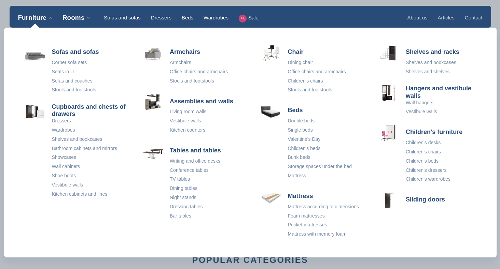
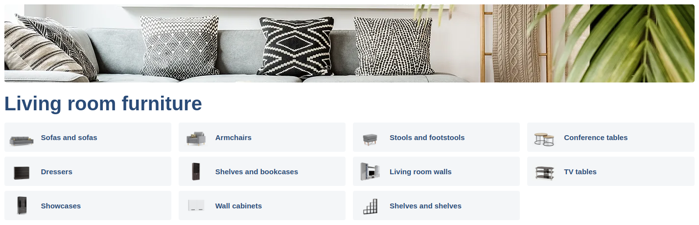
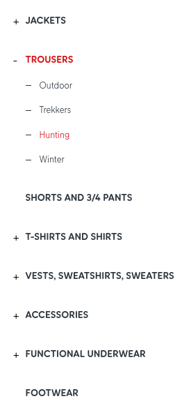

Menu je běžný způsob navigace v katalogu. Často se používá k zobrazení kategorií a podkategorií. Tato kapitola poskytuje příklady, jak vykreslit menu kategorií v typických scénářích. Menu lze vykreslit společně s vypsanými položkami v rámci jednoho požadavku. Neměli byste potřebovat samostatný požadavek na vykreslení menu, pokud jej nepředvyrábíte kvůli cachování (což je dobrá praxe u velkých variant menu, jako je [mega-menu](#mega-menu)). Všechny příklady v této kapitole budou dotazovat kolekci `Product` pro získání příslušného menu kategorií, ale nebudou vypisovat samotné produkty, jak by tomu bylo v reálném scénáři.

Ukázkové dotazy také neobsahují žádná filtrační omezení na produkty. V reálném scénáři byste obvykle chtěli produkty filtrovat podle určitých kritérií, jako je dostupnost, cena nebo jiné atributy. Tato omezení byste museli do dotazu přidat podle svých požadavků. Přítomnost takových omezení by také ovlivnila výsledky výpočtu menu, automaticky by vyřadila ty kategorie, které neobsahují produkty odpovídající omezením (pokud neumožníte, aby [`LEAVE_EMPTY`](../query/requirements/hierarchy.md#hierarchie-reference) kategorie zůstaly).

## Mega menu

Mega menu obvykle zobrazuje dvě až tři úrovně kategorií a podkategorií. Často se používá ve velkých e-commerce aplikacích. Vypadá takto:

Následující příklad ukazuje, jak získat všechna data potřebná k vykreslení mega-menu v jednom dotazu:

<SourceCodeTabs requires="evita_test/evita_functional_tests/src/test/resources/META-INF/documentation/evitaql-init.java" langSpecificTabOnly>

[Dotaz na data pro dvouúrovňové mega menu](/documentation/user/en/solve/examples/render-category-menu/mega-menu.evitaql)

</SourceCodeTabs>

Což vytvoří následující výsledek:

<LS to="e,j,c">

<MDInclude sourceVariable="extraResults.Hierarchy.referenceHierarchies.categories.megaMenu">[Výsledek pro mega-menu](/documentation/user/en/solve/examples/render-category-menu/mega-menu.evitaql.json.md)</MDInclude>

</LS>

<LS to="g">

<MDInclude sourceVariable="data.queryProduct.extraResults.hierarchy.categories.megaMenu">[Výsledek pro mega-menu](/documentation/user/en/solve/examples/render-category-menu/mega-menu.graphql.json.md)</MDInclude>

</LS>

<LS to="r">

<MDInclude sourceVariable="extraResults.hierarchy.categories.megaMenu">[Výsledek pro mega-menu](/documentation/user/en/solve/examples/render-category-menu/mega-menu.rest.json.md)</MDInclude>

</LS>

Někdy budete chtít zobrazit počet produktů v každé kategorii. 
Toho lze dosáhnout přidáním požadavku na <LS to="e,j,c,r">[`QUERIED_ENTITY_COUNT` statistiky](../query/requirements/hierarchy.md#statistics)</LS><LS to="g">[`queriedEntityCount` statistiky](../query/requirements/hierarchy.md#statistics)</LS> do dotazu:

<SourceCodeTabs requires="evita_test/evita_functional_tests/src/test/resources/META-INF/documentation/evitaql-init.java" langSpecificTabOnly>

[Dotaz na data pro dvouúrovňové mega menu se statistikami produktů](/documentation/user/en/solve/examples/render-category-menu/mega-menu-with-product-statistics.evitaql)

</SourceCodeTabs>

<Note type="warning">

<strong>Pozor!</strong> Výpočet statistik v tomto případě pravděpodobně vyžaduje projít všechny produkty v databázi (pokud jsou přiřazeny k některé z kategorií v hierarchii). To může být nákladná operace a nedoporučujeme ji provádět při každém požadavku. Zvažte předvyrábění mega-menu a cachování výsledku. Nebo se ujistěte, že je povolená a správně nakonfigurovaná cache evitaDB. Pokud je požadavek na mega-menu opakován často, měl by být pravděpodobně cachován, protože výpočet menu je náročná operace.

</Note>

Výsledky nyní také obsahují počet produktů odpovídajících filtru v každé z kategorií:

<LS to="e,j,c">

<MDInclude sourceVariable="extraResults.Hierarchy.referenceHierarchies.categories.megaMenu">[Výsledek pro mega-menu](/documentation/user/en/solve/examples/render-category-menu/mega-menu-with-product-statistics.evitaql.json.md)</MDInclude>

</LS>

<LS to="g">

<MDInclude sourceVariable="data.queryProduct.extraResults.hierarchy.categories.megaMenu">[Výsledek pro mega-menu](/documentation/user/en/solve/examples/render-category-menu/mega-menu-with-product-statistics.graphql.json.md)</MDInclude>

</LS>

<LS to="r">

<MDInclude sourceVariable="extraResults.hierarchy.categories.megaMenu">[Výsledek pro mega-menu](/documentation/user/en/solve/examples/render-category-menu/mega-menu-with-product-statistics.rest.json.md)</MDInclude>

</LS>

## Dynamické rozbalovací menu

Dalším běžným scénářem je dynamické rozbalovací menu. Je podobné mega menu, ale obvykle se používá v administrátorských rozhraních. Pro ilustraci tohoto typu menu se podívejte na následující obrazovku:

Menu zobrazuje pouze jednu úroveň kategorií s možností otevřít každou z nich na požádání. Pro vykreslení takového menu potřebujete velmi jednoduchý dotaz, ale musí obsahovat požadavek na výpočet <LS to="e,j,c,r">[`CHILDREN_COUNT` statistiky](../query/requirements/hierarchy.md#statistics)</LS><LS to="g">[`childrenCount` statistiky](../query/requirements/hierarchy.md#statistics)</LS>:

<SourceCodeTabs requires="evita_test/evita_functional_tests/src/test/resources/META-INF/documentation/evitaql-init.java" langSpecificTabOnly>

[Dotaz na data pro dynamické rozbalovací menu](/documentation/user/en/solve/examples/render-category-menu/dynamic-collapsible-menu.evitaql)

</SourceCodeTabs>

Výsledek bude obsahovat počet podkategorií v každé kategorii, takže můžete zobrazit znaménko plus vedle názvu kategorie a umožnit uživateli rozbalit kategorii:

<LS to="e,j,c">

<MDInclude sourceVariable="extraResults.Hierarchy.referenceHierarchies.categories.dynamicMenu">[Výsledek pro nejvyšší úroveň dynamického menu](/documentation/user/en/solve/examples/render-category-menu/dynamic-collapsible-menu.evitaql.json.md)</MDInclude>

</LS>

<LS to="g">

<MDInclude sourceVariable="data.queryProduct.extraResults.hierarchy.categories.dynamicMenu">[Výsledek pro nejvyšší úroveň dynamického menu](/documentation/user/en/solve/examples/render-category-menu/dynamic-collapsible-menu.graphql.json.md)</MDInclude>

</LS>

<LS to="r">

<MDInclude sourceVariable="extraResults.hierarchy.categories.dynamicMenu">[Výsledek pro nejvyšší úroveň dynamického menu](/documentation/user/en/solve/examples/render-category-menu/dynamic-collapsible-menu.rest.json.md)</MDInclude>

</LS>

Když uživatel rozbalí kategorii, můžete provést další dotaz pro získání podkategorií rozbalených kategorií podobným způsobem:

<SourceCodeTabs requires="evita_test/evita_functional_tests/src/test/resources/META-INF/documentation/evitaql-init.java" langSpecificTabOnly>

[Dotaz na data pro vnořené kategorie v dynamickém menu](/documentation/user/en/solve/examples/render-category-menu/dynamic-collapsible-menu-sub-category.evitaql)

</SourceCodeTabs>

Všimněte si, že primární klíč nadřazené kategorie je použit ve filtru požadavku na výpočet subhierarchie. Také <LS to="e,j,c">`stop(level(1))`</LS><LS to="g,r">`stopAt: { level: 1 }`</LS> bylo nahrazeno <LS to="e,j,c">`stop(distance(1))`</LS><LS to="g,r">`stopAt: { distance: 1 }`</LS>, protože úroveň je pro každého rodiče kategorie jiná, zatímco vzdálenost je relativní k nadřazenému uzlu a umožňuje nám vyjádřit získanou hloubku obecnějším způsobem. 
Výsledek bude totožný s výpisem kořenových kategorií:

<LS to="e,j,c">

<MDInclude sourceVariable="extraResults.Hierarchy.referenceHierarchies.categories.dynamicMenuSubcategories">[Výsledek pro vnořené kategorie v dynamickém menu](/documentation/user/en/solve/examples/render-category-menu/dynamic-collapsible-menu-sub-category.evitaql.json.md)</MDInclude>

</LS>

<LS to="g">

<MDInclude sourceVariable="data.queryProduct.extraResults.hierarchy.categories.dynamicMenuSubcategories">[Výsledek pro vnořené kategorie v dynamickém menu](/documentation/user/en/solve/examples/render-category-menu/dynamic-collapsible-menu-sub-category.graphql.json.md)</MDInclude>

</LS>

<LS to="r">

<MDInclude sourceVariable="extraResults.hierarchy.categories.dynamicMenuSubcategories">[Výsledek pro vnořené kategorie v dynamickém menu](/documentation/user/en/solve/examples/render-category-menu/dynamic-collapsible-menu-sub-category.rest.json.md)</MDInclude>

</LS>

## Výpis podkategorií

Je poměrně běžné vypsat několik propagovaných podkategorií aktuální kategorie těsně nad seznamem produktů. Podobné výpisy najdete po celém webu:

Následující dotaz vám pomůže získat takový seznam pro libovolný z vykreslených výpisů kategorií:

<SourceCodeTabs requires="evita_test/evita_functional_tests/src/test/resources/META-INF/documentation/evitaql-init.java" langSpecificTabOnly>

[Dotaz na data pro výpis podkategorií](/documentation/user/en/solve/examples/render-category-menu/sub-categories-listing.evitaql)

</SourceCodeTabs>

Protože používáme požadavek [`children`](../query/requirements/hierarchy.md#children), výsledek bude vypočítán správně i v případě, že se aktuální kategorie změní v části filtru `hierarchyWithin`, a vždy bude obsahovat aktuálně filtrovanou kategorii spolu s jednou úrovní jejích podkategorií:

<LS to="e,j,c">

<MDInclude sourceVariable="extraResults.Hierarchy.referenceHierarchies.categories.subcategories">[Výsledek pro výpis podkategorií](/documentation/user/en/solve/examples/render-category-menu/sub-categories-listing.evitaql.json.md)</MDInclude>

</LS>

<LS to="g">

<MDInclude sourceVariable="data.queryProduct.extraResults.hierarchy.categories.subcategories">[Výsledek pro výpis podkategorií](/documentation/user/en/solve/examples/render-category-menu/sub-categories-listing.graphql.json.md)</MDInclude>

</LS>

<LS to="r">

<MDInclude sourceVariable="extraResults.hierarchy.categories.subcategories">[Výsledek pro výpis podkategorií](/documentation/user/en/solve/examples/render-category-menu/sub-categories-listing.rest.json.md)</MDInclude>

</LS>

## Hybridní menu

Existuje mnoho variant menu, ale zakončeme náš článek příkladem hybridního menu. Toto menu se často používá jako druh vertikálního menu, které zobrazuje kategorie na kořenové úrovni s otevřenou osou k aktuálně vybrané kategorii, doplněné o sourozenecké kategorie na stejné úrovni. Vypadá takto:

Toto menu musí být složeno ze tří vypočítaných výsledků. První, nazvaný `topLevel`, bude obsahovat kategorie kořenové úrovně, druhý, nazvaný `siblings`, bude obsahovat sourozence aktuálně vybrané kategorie a třetí, nazvaný `parents`, bude obsahovat rodiče vybrané kategorie. Kombinací těchto tří výsledků můžete snadno vykreslit hybridní menu:

<SourceCodeTabs requires="evita_test/evita_functional_tests/src/test/resources/META-INF/documentation/evitaql-init.java" langSpecificTabOnly>

[Dotaz na data pro hybridní menu](/documentation/user/en/solve/examples/render-category-menu/hybrid-menu.evitaql)

</SourceCodeTabs>

Výsledek budou kategorie kořenové úrovně a sourozenci aktuálně vybrané kategorie:

<LS to="e,j,c">

<MDInclude sourceVariable="extraResults.Hierarchy.referenceHierarchies.categories">[Výsledek pro hybridní menu](/documentation/user/en/solve/examples/render-category-menu/hybrid-menu.evitaql.json.md)</MDInclude>

</LS>

<LS to="g">

<MDInclude sourceVariable="data.queryProduct.extraResults.hierarchy.categories">[Výsledek pro hybridní menu](/documentation/user/en/solve/examples/render-category-menu/hybrid-menu.graphql.json.md)</MDInclude>

</LS>

<LS to="r">

<MDInclude sourceVariable="extraResults.hierarchy.categories">[Výsledek pro hybridní menu](/documentation/user/en/solve/examples/render-category-menu/hybrid-menu.rest.json.md)</MDInclude>

</LS>

## Skrytí částí stromu kategorií

Někdy jste si možná všimli, že určitá část regálů v nákupních centrech je za oponou – protože se připravuje nová prodejní plocha se specializovanou nabídkou. Podobně se v katalozích často připravují nové sekce, ke kterým mají přístup pouze lidé, kteří na nich pracují. V našem demo datasetu máme atribut s názvem `status`, který může mít hodnotu `ACTIVE` nebo `PRIVATE`. Hodnota `ACTIVE` znamená, že kategorie ještě není připravena pro veřejnost a proto by neměla být v menu viditelná a přístupná. Toho lze dosáhnout tak, že produkty vypíšete a menu vykreslíte pro návštěvníky pomocí následujícího dotazu:

<SourceCodeTabs requires="evita_test/evita_functional_tests/src/test/resources/META-INF/documentation/evitaql-init.java" langSpecificTabOnly>

[Dotaz na data pro menu bez soukromých kategorií](/documentation/user/en/solve/examples/render-category-menu/excluding-private-categories.evitaql)

</SourceCodeTabs>

Dočasné nabídky lze řešit podobně elegantně. Představme si, že chceme v kategorii *Příslušenství* předem připravit *"Vánoční elektroniku"*, která zahrnuje LED světla na stromeček, pyrotechniku apod. Pokud v entitě kategorie vytvoříme atribut typu `DateTimeRange` s názvem `validity` a nastavíme jeho hodnotu pouze na období Vánoc (jak jsme to udělali v našem demo datasetu), můžeme pak definovat následující dotaz:

<SourceCodeTabs requires="evita_test/evita_functional_tests/src/test/resources/META-INF/documentation/evitaql-init.java" langSpecificTabOnly>

[Dotaz na data pro menu bez kategorií s prošlou platností](/documentation/user/en/solve/examples/render-category-menu/excluding-expired-categories.evitaql)

</SourceCodeTabs>

Tedy: vypiš mi všechny produkty v kategorii `accessories`, za předpokladu, že jsou v kategorii bez definované platnosti nebo mají definovaný rozsah platnosti, který zahrnuje aktuální okamžik. Všimněte si, že ve výsledku není kategorie *"Vánoční elektronika"*, protože v tuto chvíli není platná. Pokud však dotaz trochu upravíme a posuneme čas do období Vánoc, tuto kategorii ve výsledku získáme:

<SourceCodeTabs requires="evita_test/evita_functional_tests/src/test/resources/META-INF/documentation/evitaql-init.java" langSpecificTabOnly>

[Dotaz na data pro menu v období Vánoc](/documentation/user/en/solve/examples/render-category-menu/excluding-expired-categories-at-correct-time.evitaql)

</SourceCodeTabs>

<Note type="info">

Některé položky bývají zařazeny do více než jedné kategorie – například žvýkačky najdete v sekci *sladkosti* v obchodě, ale také u pokladen mezi produkty, na které máte čas se podívat před zaplacením. Pokud obchodní dům ohradí sekci sladkostí, protože ji předělává, měli byste přijít o možnost koupit žvýkačky u pokladny? Samozřejmě že ne. evitaDB se zachová stejně a pokud najde alespoň jeden odkaz na produkt ve viditelné části hierarchického stromu, zahrne tento produkt do výsledků vyhledávání.

</Note>