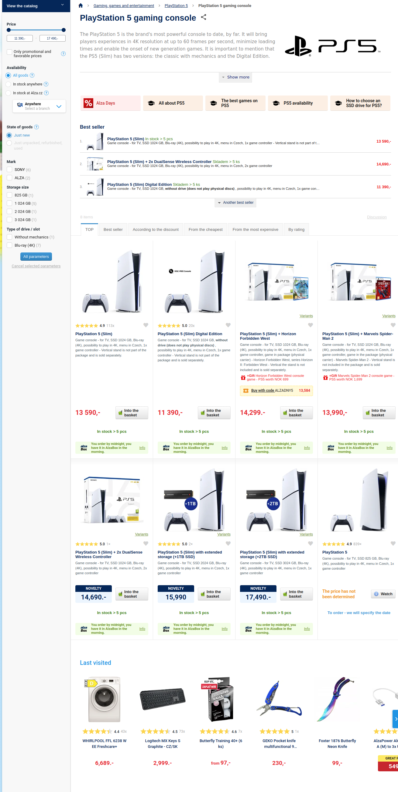

Typická stránka s výpisem produktů může vypadat takto:

Obvykle se skládá z následujících typických bloků:

1. [popis kategorie](#popis-kategorie) s bohatým obsahem
2. výpis produktů — někdy v různých variantách:
    - [běžný stránkovaný seznam](#výpis-produktů)
    - [N nejprodávanějších produktů](#nejprodávanější-produkty)
    - naposledy navštívené produkty
3. menu kategorií - na více místech:
    - [drobečková navigace](#drobečková-navigace)
    - [strom kategorií](render-category-menu.md#hybridní-menu)
    - [výpis podkategorií](render-category-menu.md#výpis-podkategorií)
4. možnosti filtrování a řazení:
    - [cenový filtr](#cenový-filtr)
    - [filtrování podle facety](#filtrování-podle-facety)
    - [vyhledávací pole](external-fulltext.md)
    - [možnosti řazení](#možnosti-řazení)

V tomto článku vysvětlíme, jaké dotazy lze použít k získání všech potřebných dat na základě schématu našeho demo datasetu. Pouze třetí blok - výpis kategorií - bude pokryt v [samostatném článku](render-category-menu.md), protože jeho rozsah je poměrně velký a zaslouží si vlastní analýzu.

## Popis kategorie

Stránka s výpisem produktů obvykle začíná názvem a popisem kategorie. Tyto informace jsou snadno dostupné načtením entity kategorie v konkrétním jazyce pomocí její unikátní URL:

<SourceCodeTabs requires="evita_test/evita_functional_tests/src/test/resources/META-INF/documentation/evitaql-init.java" langSpecificTabOnly>

[Získání popisu kategorie](/documentation/user/en/solve/examples/filtering-products-in-category/category-description.evitaql)

</SourceCodeTabs>

To vrátí požadovaná data:

<LS to="e,j,c">

<MDInclude sourceVariable="recordPage">[Výsledek pro popis kategorie](/documentation/user/en/solve/examples/filtering-products-in-category/category-description.evitaql.json.md)</MDInclude>

</LS>

<LS to="g">

<MDInclude>[Výsledek pro popis kategorie](/documentation/user/en/solve/examples/filtering-products-in-category/category-description.graphql.json.md)</MDInclude>

</LS>

<LS to="r">

<MDInclude>[Výsledek pro popis kategorie](/documentation/user/en/solve/examples/filtering-products-in-category/category-description.rest.json.md)</MDInclude>

</LS>

## Drobečková navigace

Drobečková navigace není typické menu kategorií, ale často se používá v e-commerce aplikacích. Pomáhá uživateli vrátit se zpět do nadřazených kategorií. Lze ji získat ze dvou zdrojů:

1. z entity kategorie samotné - pomocí referencí na entity a jejich informací o rodiči
2. z výpisu produktů - jako [požadavek menu `parents`](../query/requirements/hierarchy.md#parents)

První možnost je univerzálnější a lze ji použít nejen pro stránku detailu kategorie s výpisem produktů, ale také pro stránku detailu produktu, kde druhá možnost není použitelná, protože dotaz na detail produktu obvykle neobsahuje filtr [`hierarchyWithin`](../query/filtering/hierarchy.md#hierarchy-within) (protože jej tam nepotřebujeme).

Nejprve se podívejme, jak získat drobečkovou navigaci z entity kategorie:

<SourceCodeTabs requires="evita_test/evita_functional_tests/src/test/resources/META-INF/documentation/evitaql-init.java" langSpecificTabOnly>

[Získání dat pro drobečkovou navigaci](/documentation/user/en/solve/examples/filtering-products-in-category/breadcrumb-category.evitaql)

</SourceCodeTabs>

Jak vidíte, požadované informace o rodiči jsou součástí entity kategorie samotné:

<LS to="e,j,c">

<MDInclude sourceVariable="recordPage">[Výsledek pro drobečkovou navigaci kategorie](/documentation/user/en/solve/examples/filtering-products-in-category/breadcrumb-category.evitaql.json.md)</MDInclude>

</LS>

<LS to="g">

<MDInclude>[Výsledek pro drobečkovou navigaci kategorie](/documentation/user/en/solve/examples/filtering-products-in-category/breadcrumb-category.graphql.json.md)</MDInclude>

</LS>

<LS to="r">

<MDInclude>[Výsledek pro drobečkovou navigaci kategorie](/documentation/user/en/solve/examples/filtering-products-in-category/breadcrumb-category.rest.json.md)</MDInclude>

</LS>

Dále se podívejme, jak získat drobečkovou navigaci pro konkrétní produkt. Zde je situace složitější, protože produkt může (a v našem příkladu také patří) do více kategorií:

<SourceCodeTabs requires="evita_test/evita_functional_tests/src/test/resources/META-INF/documentation/evitaql-init.java" langSpecificTabOnly>

[Získání dat pro drobečkovou navigaci](/documentation/user/en/solve/examples/filtering-products-in-category/breadcrumb-product.evitaql)

</SourceCodeTabs>

V tomto případě jsou informace o rodiči součástí reference *categories* produktu a můžete vidět, že produkt patří do dvou takových kategorií: *Macbooks* a *Produkty v přípravě*. Obě mají zcela odlišné cesty k nadřazeným kategoriím. Pro vykreslení drobečkové navigace byste museli zvolit jednu z těchto cest pomocí nějaké heuristiky (například nejdelší cesta, naposledy navštívená kategorie apod.).

<LS to="e,j,c">

<MDInclude sourceVariable="recordPage">[Výsledek pro drobečkovou navigaci produktu](/documentation/user/en/solve/examples/filtering-products-in-category/breadcrumb-product.evitaql.json.md)</MDInclude>

</LS>

<LS to="g">

<MDInclude>[Výsledek pro drobečkovou navigaci produktu](/documentation/user/en/solve/examples/filtering-products-in-category/breadcrumb-product.graphql.json.md)</MDInclude>

</LS>

<LS to="r">

<MDInclude>[Výsledek pro drobečkovou navigaci produktu](/documentation/user/en/solve/examples/filtering-products-in-category/breadcrumb-product.rest.json.md)</MDInclude>

</LS>

## Výpis produktů

Pro výpis produktů v kategorii je třeba provést dotaz, který načte všechny produkty přiřazené ke kategorii. To se provádí dotazem na entitu `product` a filtrováním podle reference `categories` – která odkazuje na kategorii podle její unikátní URL *"/en/smartwatches"*:

<SourceCodeTabs requires="evita_test/evita_functional_tests/src/test/resources/META-INF/documentation/evitaql-init.java" langSpecificTabOnly>

[Získání výpisu produktů](/documentation/user/en/solve/examples/filtering-products-in-category/product-listing.evitaql)

</SourceCodeTabs>

Dotaz je pravděpodobně složitější, než byste čekali. Nejde jen o jednoduchý filtr reference `categories`, ale obsahuje mnoho dalších filtrů a požadavků. Pojďme si je rozebrat:

1. <LS to="e,j,c">**`entityLocaleEquals("en")`**</LS><LS to="g,r">**`entityLocaleEquals: en`**</LS> – omezuje pouze na produkty s anglickou lokalizací
2. <LS to="e,j,c">**`hierarchyWithin("categories", attributeEquals("url", "/en/smartwatches"))`**</LS><LS to="g,r">**`hierarchyCategoriesWithin: { ofParent: { attributeUrlEquals: "/en/smartwatches" } }`**</LS> – filtruje pouze produkty, které patří do kategorie s URL *"/en/smartwatches"* nebo jejích podkategorií
3. <LS to="e,j,c">**`attributeEquals("status", "ACTIVE")`**</LS><LS to="g,r">**`attributeStatusEquals: "ACTIVE"`**</LS> – filtruje pouze veřejné produkty, mohou existovat i produkty ve stavu *PRIVATE*, které vidí pouze zaměstnanci připravující produkt k publikaci
4. <LS to="e,j,c">**`or(attributeInRangeNow("validity"), attributeIsNull("validity"))`**</LS><LS to="g,r">**`or: [ { attributeValidityInRangeNow: true }, { attributeValidityIs: NULL } ]`**</LS> – filtruje pouze produkty, které jsou aktuálně platné nebo nemají platnost vůbec nastavenou
5. <LS to="e,j,c">**`referenceHaving("stocks", attributeGreaterThan("quantityOnStock", 0))`**</LS><LS to="g,r">**`referenceStocksHaving: [ { attributeQuantityOnStockGreaterThan: 0 } ]`**</LS> – filtruje pouze produkty, které jsou skutečně skladem (mají kladné množství na skladě) – nezáleží na tom, na kterém skladu (v systému může být více skladů)
6. <LS to="e,j,c">**`priceInCurrency("EUR"), priceInPriceLists("basic"), priceValidInNow()`**</LS><LS to="g,r">**`priceInCurrency: EUR, priceInPriceLists: ["basic"], priceValidInNow: true`**</LS> – filtruje pouze produkty, které mají platnou cenu v měně EUR a v ceníku *"basic"*

Pro vykreslení dlaždic produktů dotaz také obsahuje následující obsah v požadavku `entityFetch`:

1. <LS to="e,j,c">**`attributeContent("name")`**</LS><LS to="r">**`attributeContent: ["name"]`**</LS><LS to="g">**`attributes { name }`**</LS> – získá název produktu
2. <LS to="e,j,c">**`referenceContentWithAttributes("stocks", attributeContent("quantityOnStock"))`**</LS><LS to="r">**`referenceStocksContentWithAttributes: { attributeContent: ["quantityOnStock"] }`**</LS><LS to="g">**`stocks { attributes { quantityOnStock } }`**</LS> – získá množství na skladě
3. <LS to="e,j,c">**`priceContentRespectingFilter("reference")`**</LS><LS to="r">**`priceContentRespectingFilter: ["reference"]`**</LS><LS to="g">**`priceForSale { ... }, price(priceList: "reference") { ... }`**</LS> – získá prodejní cenu a referenční cenu pro výpočet slevy

Dotaz také požaduje pouze první stránku s 16 produkty pomocí požadavku `page(1, 16)`.

Dotaz je založen na demo modelu produktů. Pravděpodobně budete mít ve svém byznys doméně jiný model, ale principy dotazu budou stejné, takže tento dotaz můžete použít jako inspiraci.

Výsledek dotazu je seznam produktů s jejich atributy a referencemi:

<LS to="e,j,c">

<MDInclude sourceVariable="recordPage">[Výsledek pro výpis produktů](/documentation/user/en/solve/examples/filtering-products-in-category/product-listing.evitaql.json.md)</MDInclude>

</LS>

<LS to="g">

<MDInclude>[Výsledek pro výpis produktů](/documentation/user/en/solve/examples/filtering-products-in-category/product-listing.graphql.json.md)</MDInclude>

</LS>

<LS to="r">

<MDInclude>[Výsledek pro výpis produktů](/documentation/user/en/solve/examples/filtering-products-in-category/product-listing.rest.json.md)</MDInclude>

</LS>

### Nejprodávanější produkty

Pro výpis nejprodávanějších produktů byste použili podobný dotaz, ale s jinými možnostmi řazení a pravděpodobně i jinou velikostí stránky. Pro lepší čitelnost chceme dotaz na produkty zjednodušit na minimum:

<SourceCodeTabs requires="evita_test/evita_functional_tests/src/test/resources/META-INF/documentation/evitaql-init.java" langSpecificTabOnly>

[Získání nejprodávanějších produktů](/documentation/user/en/solve/examples/filtering-products-in-category/top-selling-products.evitaql)

</SourceCodeTabs>

Samozřejmě byste pravděpodobně potřebovali přidat podobnou sadu omezení jako ve standardním dotazu na výpis produktů.

<Note type="info">

Plánujeme zjednodušit řešení tohoto případu použití tím, že umožníme vracet různé sady alternativně seřazených výsledků v jednom dotazu. Tato funkce je popsána v [issue #479](https://github.com/FgForrest/evitaDB/issues/479) a tento článek aktualizujeme, jakmile bude funkce implementována.

</Note>

Výsledek dotazu je následující:

<LS to="e,j,c">

<MDInclude sourceVariable="recordPage">[Výsledek pro nejprodávanější produkty](/documentation/user/en/solve/examples/filtering-products-in-category/top-selling-products.evitaql.json.md)</MDInclude>

</LS>

<LS to="g">

<MDInclude>[Výsledek pro nejprodávanější produkty](/documentation/user/en/solve/examples/filtering-products-in-category/top-selling-products.graphql.json.md)</MDInclude>

</LS>

<LS to="r">

<MDInclude>[Výsledek pro nejprodávanější produkty](/documentation/user/en/solve/examples/filtering-products-in-category/top-selling-products.rest.json.md)</MDInclude>

</LS>

## Filtrování podle facety

Stránka s výpisem produktů obvykle obsahuje sadu filtrů, které umožňují uživateli zúžit seznam produktů. Tyto filtry se nazývají facetové filtry a evitaDB je sestavuje na základě referencí na entity označených jako *faceted*. Ačkoli můžete požadovat automaticky vypočítané facetové filtry ze všech dostupných referencí, obvykle požadujeme pouze některé z nich. Důvodem je, že chceme ovládat pořadí hlavních skupin facet a také chceme vybrat pouze ty reference, které jsou relevantní pro daný pohled. Například v našem datasetu je reference `categories` faceted, ale nedává smysl zobrazovat facet kategorie na stránce detailu kategorie. Na stránce detailu značky to však smysl má. Samozřejmě, pro referenci značky platí opačné potřeby.

Řekněme, že chceme na stránce detailu kategorie zobrazit filtry `brand` a `parameterValues`. Začneme nejprve filtrem značky, protože je poměrně jednoduchý a ihned ukazuje situaci, kdy uživatel již některé facety vybral:

<SourceCodeTabs requires="evita_test/evita_functional_tests/src/test/resources/META-INF/documentation/evitaql-init.java" langSpecificTabOnly>

[Získání facetových filtrů značky](/documentation/user/en/solve/examples/filtering-products-in-category/faceted-search-brand.evitaql)

</SourceCodeTabs>

Vrácené značky jsou seřazeny podle názvu vzestupně, značka *Apple* je označena jako požadovaná, což odkazuje na výběr uživatele v kontejneru `userFilter`, a výpočet obsahuje mnoho vypočtených čísel. Pro správné vykreslení UI filtru je třeba dodržet tato pravidla:

1. facety označené jako `requested` by měly být vykresleny jako *zaškrtnuté*
2. facety s `impact.hasSense` nastaveným na `false` by měly být vykresleny jako *neaktivní* (protože jejich výběr by nevrátil žádné výsledky, nemá smysl je vybírat)
3. facety ve skupině, která má alespoň jednu `requested`, by měly zobrazit `impact.difference` v závorce za názvem facety (někdy se uživateli zobrazuje pouze pozitivní dopad) – to představuje počet produktů, které by byly přidány do výsledné množiny výběrem této konkrétní reference
4. ostatní facety by měly zobrazit `count` v závorce za názvem facety – to představuje počet produktů, které mají tuto konkrétní referenci

Tato pravidla vzešla z uživatelského testování jako nejintuitivnější a nejpřátelštější způsob vykreslení filtru. Ale klidně experimentujte s vlastním nastavením. Vykreslený filtr podle výše uvedených pravidel by vypadal takto:

<MDInclude sourceVariable="extraResults.FacetSummary">[Výsledek pro facetové filtry značky](/documentation/user/en/solve/examples/filtering-products-in-category/faceted-search-brand.evitaql.string.md)</MDInclude>

Vztah značky je jednoduchý, ale hodnoty parametrů jsou složitější. Hodnota parametru (např. *modrá* nebo *červená*) patří k parametru, který slouží ke skupinování podobných hodnot (např. *barva*). Také chceme ovládat přítomnost parametru ve filtru pomocí vlastnosti nastavené na entitě parametru, aby administrátor mohl jednoduše rozhodnout, které parametry jsou relevantní pro filtrování a které ne.

Nakonec chceme vykreslit filtr se správně lokalizovanými názvy referencovaných entit a seřadit filtry podle vlastnosti `order` těchto entit. To je jeden z důvodů, proč stavíme naše facetové filtry na referencích na entity a ne na atributech entit (což je přístup, který můžete vidět v některých databázových systémech).

Konečný facetový dotaz vypadá takto:

<SourceCodeTabs requires="evita_test/evita_functional_tests/src/test/resources/META-INF/documentation/evitaql-init.java" langSpecificTabOnly>

[Získání facetových filtrů](/documentation/user/en/solve/examples/filtering-products-in-category/faceted-search.evitaql)

</SourceCodeTabs>

Na odpověď aplikujeme stejnou logiku vykreslení a výsledek je následující:

<MDInclude sourceVariable="extraResults.FacetSummary">[Výsledek pro facetové filtry značky](/documentation/user/en/solve/examples/filtering-products-in-category/faceted-search.evitaql.string.md)</MDInclude>

Nakonec budete chtít mít oba požadavky v jednom dotazu, ale projdeme si ještě několik dalších požadavků pro stránku detailu kategorie [než vše spojíme](#kompletní-dotazy-na-výpis-produktů-včetně-filtrování-a-řazení).

## Cenový filtr

Cena je obvykle jedním z hlavních faktorů při rozhodování uživatele o koupi produktu. Proto je řazení podle ceny a cenový filtr jedním z nejdůležitějších filtrů na stránce s výpisem produktů. Věříme, že cenový filtr by měl být vykreslen jako posuvník s rozsahem a histogramem zobrazujícím rozložení produktů v cenovém rozsahu.

Ukážeme si situaci, kdy uživatel již vybral určité cenové rozmezí:

<SourceCodeTabs requires="evita_test/evita_functional_tests/src/test/resources/META-INF/documentation/evitaql-init.java" langSpecificTabOnly>

[Získání cenového filtru](/documentation/user/en/solve/examples/filtering-products-in-category/price-filter.evitaql)

</SourceCodeTabs>

<Note type="warning">

Všimněte si, že pouze `priceBetween` je uvnitř kontejneru `userFilter`, což znamená, že ostatní podmínky týkající se ceny jsou povinné a systém je nesmí vynechat při žádném výpočtu výsledných dat.

</Note>

Výsledek dotazu je následující:

<LS to="e,j,c">

<MDInclude sourceVariable="extraResults.PriceHistogram">[Výsledek pro cenový filtr](/documentation/user/en/solve/examples/filtering-products-in-category/price-filter.evitaql.json.md)</MDInclude>

</LS>

<LS to="g">

<MDInclude sourceVariable="data.queryProduct.extraResults.priceHistogram">[Výsledek pro cenový filtr](/documentation/user/en/solve/examples/filtering-products-in-category/price-filter.graphql.json.md)</MDInclude>

</LS>

<LS to="r">

<MDInclude sourceVariable="extraResults.priceHistogram">[Výsledek pro cenový filtr](/documentation/user/en/solve/examples/filtering-products-in-category/price-filter.rest.json.md)</MDInclude>

</LS>

Při vykreslování histogramu najdete minimální cenu v odpovědi přímo v objektu `priceHistogram` (`min` a `max`) a jednotlivé "bucket" s dolní hranicí v poli `buckets`. `overallCount` představuje celkový počet produktů v histogramu (a v našem případě je roven počtu produktů v kategorii, protože všechny filtry produktů jsou povinné).

Bucket, které jsou překříženy výběrem uživatele, jsou označeny jako `requested` a můžete je vizualizovat jinak (například jinou barvou), abyste zvýraznili výběr uživatele.

## Možnosti řazení

Poslední částí stránky s výpisem produktů jsou možnosti řazení. Možnosti řazení jsou obvykle zobrazeny jako rozbalovací seznam nebo záložkové rozhraní. Nejčastější možnosti řazení jsou:

1. **Relevance** – výchozí možnost řazení, která je obvykle založena na nějaké předdefinované vlastnosti produktu určující pořadí. V našem případě by byla reprezentována řadicím omezením: <LS to="e,j,c">`orderBy(attributeNatural("order", ASC))`</LS><LS to="g,r">`orderBy: [ { attributeOrderNatural: ASC } ]`</LS>.
2. **Cena** – řazení podle ceny vzestupně nebo sestupně. V našem případě by byla reprezentována řadicím omezením: <LS to="e,j,c">`orderBy(priceNatural(DESC))`</LS><LS to="g,r">`orderBy: [ { priceNatural: DESC } ]`</LS>.
3. **Popularita** – řazení podle počtu prodejů nebo zobrazení. V našem případě by byla reprezentována řadicím omezením: <LS to="e,j,c">`orderBy(attributeNatural("rating", DESC))`</LS><LS to="g,r">`orderBy: [ { attributeRatingNatural: DESC } ]`</LS>.
4. **Abecedně** – řazení podle názvu vzestupně nebo sestupně. V našem případě by byla reprezentována řadicím omezením: <LS to="e,j,c">`orderBy(attributeNatural("name", ASC))`</LS><LS to="g,r">`orderBy: [ { attributeNameNatural: ASC } ]`</LS>.

Protože řazení je poměrně jednoduché, přeskočíme v této kapitole plné dotazy a přejdeme k poslední, kde uvidíme všechny aspekty stránky s výpisem produktů dohromady.

## Kompletní dotazy na výpis produktů včetně filtrování a řazení

Kombinací všech výše uvedených dotazů získáte následující dva dotazy:

<SourceCodeTabs requires="evita_test/evita_functional_tests/src/test/resources/META-INF/documentation/evitaql-init.java" langSpecificTabOnly>

[Detail kategorie s drobečkovou navigací](/documentation/user/en/solve/examples/filtering-products-in-category/category-details-with-breadcrumb.evitaql)

</SourceCodeTabs>

A dotaz na výpis produktů (vynecháváme dotaz na nejprodávanější produkty, protože by šlo jen o jednodušší verzi stejného dotazu s jinými možnostmi řazení):

<SourceCodeTabs requires="evita_test/evita_functional_tests/src/test/resources/META-INF/documentation/evitaql-init.java" langSpecificTabOnly>

[Výpis produktů s facetovými filtry a možnostmi řazení](/documentation/user/en/solve/examples/filtering-products-in-category/product-listing-with-facets-and-sorting.evitaql)

</SourceCodeTabs>

Takže nakonec, pro vykreslení stránky detailu kategorie s výpisem produktů, budete muset provést dva nebo tři dotazy. Dotaz vypadá složitě, ale ve srovnání se složitostí dotazů, které byste museli provádět v jiných databázových systémech, je poměrně jednoduchý a přímočarý.