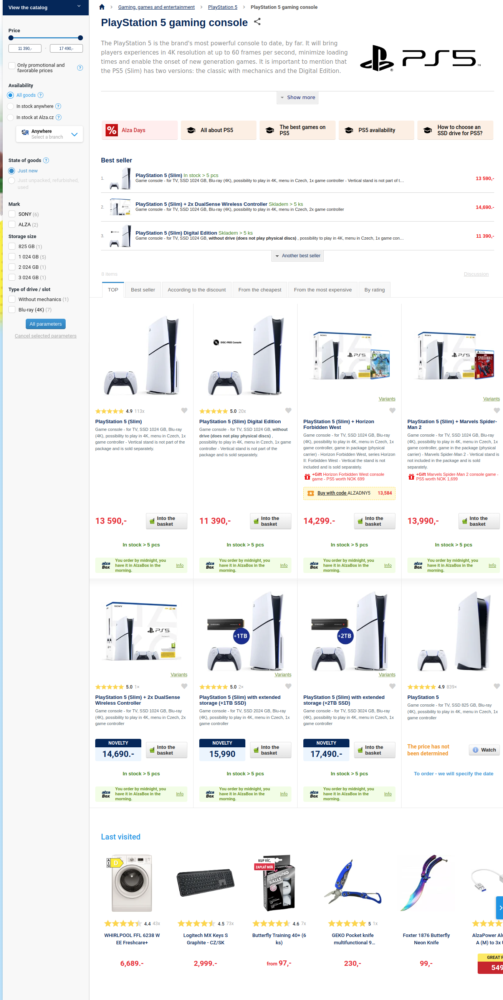

Typická stránka s výpisem produktů může vypadat takto:

Obvykle se skládá z následujících typických bloků:

1. [popis kategorie](#popis-kategorie) s bohatým obsahem
2. výpis produktů — někdy v různých variantách:
    - [běžný stránkovaný seznam](#výpis-produktů)
    - [N nejprodávanějších produktů](#nejprodávanější-produkty)
    - naposledy navštívené produkty
3. menu kategorií - na více místech:
    - [drobečková navigace](#drobečková-navigace)
    - [strom kategorií](render-category-menu.md#hybridní-menu)
    - [výpis podkategorií](render-category-menu.md#výpis-podkategorií)
4. možnosti filtrování a řazení:
    - [cenový filtr](#cenový-filtr)
    - [filtrování podle facety](#filtrování-podle-facety)
    - [vyhledávací pole](external-fulltext.md)
    - [možnosti řazení](#možnosti-řazení)

V tomto článku vysvětlíme, jaké dotazy lze použít k získání všech potřebných dat na základě schématu našeho demo datasetu. Pouze třetí blok - výpis kategorií - bude pokryt v [samostatném článku](render-category-menu.md), protože jeho rozsah je poměrně velký a zaslouží si vlastní analýzu.

## Popis kategorie

Stránka s výpisem produktů obvykle začíná názvem a popisem kategorie. Tyto informace jsou snadno dostupné 
načtením entity kategorie v konkrétním jazyce prostřednictvím její unikátní URL adresy:

<SourceCodeTabs requires="evita_test/evita_documentation_tests/src/test/resources/META-INF/documentation/evitaql-init.java" langSpecificTabOnly>

[Získání popisu kategorie](/documentation/user/en/solve/examples/filtering-products-in-category/category-description.evitaql)

</SourceCodeTabs>

To vrátí požadovaná data:

<LS to="e,j,c">

<MDInclude sourceVariable="recordPage">[Výsledek pro popis kategorie](/documentation/user/en/solve/examples/filtering-products-in-category/category-description.evitaql.json.md)</MDInclude>

</LS>

<LS to="g">

<MDInclude>[Výsledek pro popis kategorie](/documentation/user/en/solve/examples/filtering-products-in-category/category-description.graphql.json.md)</MDInclude>

</LS>

<LS to="r">

<MDInclude>[Výsledek pro popis kategorie](/documentation/user/en/solve/examples/filtering-products-in-category/category-description.rest.json.md)</MDInclude>

</LS>

## Breadcrumb

Breadcrumb není typické menu kategorií, ale často se používá v e-commerce aplikacích. Pomáhá uživateli navigovat zpět do nadřazených kategorií. Lze jej získat ze dvou zdrojů:

1. z entity kategorie samotné – prostřednictvím referencí na entity a jejich informací o rodičích
2. z výpisu produktů – jako požadavek menu [`parents`](../query/requirements/hierarchy.md#parents)

První možnost je univerzálnější a lze ji použít nejen na stránce detailu kategorie s výpisem produktů, ale také na stránce detailu produktu, kde druhá možnost není použitelná, protože dotaz na detail produktu obvykle neobsahuje filtr [`hierarchyWithin`](../query/filtering/hierarchy.md#hierarchy-within) (protože ho tam nepotřebujeme).

Nejprve se podívejme, jak získat breadcrumb z entity kategorie:

<SourceCodeTabs requires="evita_test/evita_documentation_tests/src/test/resources/META-INF/documentation/evitaql-init.java" langSpecificTabOnly>

[Získání dat pro breadcrumb](/documentation/user/en/solve/examples/filtering-products-in-category/breadcrumb-category.evitaql)

</SourceCodeTabs>

Jak vidíte, požadované informace o rodičích jsou součástí samotné entity kategorie:

<LS to="e,j,c">

<MDInclude sourceVariable="recordPage">[Výsledek pro breadcrumb kategorie](/documentation/user/en/solve/examples/filtering-products-in-category/breadcrumb-category.evitaql.json.md)</MDInclude>

</LS>

<LS to="g">

<MDInclude>[Výsledek pro breadcrumb kategorie](/documentation/user/en/solve/examples/filtering-products-in-category/breadcrumb-category.graphql.json.md)</MDInclude>

</LS>

<LS to="r">

<MDInclude>[Výsledek pro breadcrumb kategorie](/documentation/user/en/solve/examples/filtering-products-in-category/breadcrumb-category.rest.json.md)</MDInclude>

</LS>

Dále se podívejme, jak získat breadcrumb pro konkrétní produkt. Zde je situace složitější, protože produkt může (a v našem příkladu skutečně patří) do více kategorií:

<SourceCodeTabs requires="evita_test/evita_documentation_tests/src/test/resources/META-INF/documentation/evitaql-init.java" langSpecificTabOnly>

[Získání dat pro breadcrumb](/documentation/user/en/solve/examples/filtering-products-in-category/breadcrumb-product.evitaql)

</SourceCodeTabs>

V tomto případě jsou informace o rodičích součástí reference *categories* produktu a můžete vidět, že produkt patří do dvou takových kategorií: *Macbooky* a *Produkty v přípravě*. Obě mají zcela odlišné cesty nadřazených kategorií. Pro vykreslení breadcrumbu byste museli jednu z těchto cest vybrat pomocí nějaké heuristiky (například nejdelší cesta, naposledy navštívená kategorie apod.).

<LS to="e,j,c">

<MDInclude sourceVariable="recordPage">[Výsledek pro breadcrumb produktu](/documentation/user/en/solve/examples/filtering-products-in-category/breadcrumb-product.evitaql.json.md)</MDInclude>

</LS>

<LS to="g">

<MDInclude>[Výsledek pro breadcrumb produktu](/documentation/user/en/solve/examples/filtering-products-in-category/breadcrumb-product.graphql.json.md)</MDInclude>

</LS>

<LS to="r">

<MDInclude>[Výsledek pro breadcrumb produktu](/documentation/user/en/solve/examples/filtering-products-in-category/breadcrumb-product.rest.json.md)</MDInclude>

</LS>

## Výpis produktů

Pro zobrazení produktů v kategorii je potřeba provést dotaz, který získá všechny produkty přiřazené do dané kategorie. Toho dosáhnete dotazem na entitu `product` a filtrováním podle reference `categories` – která odkazuje na kategorii pomocí její unikátní URL *"/en/smartwatches"*:

<SourceCodeTabs requires="evita_test/evita_documentation_tests/src/test/resources/META-INF/documentation/evitaql-init.java" langSpecificTabOnly>

[Získání výpisu produktů](/documentation/user/en/solve/examples/filtering-products-in-category/product-listing.evitaql)

</SourceCodeTabs>

Dotaz je pravděpodobně složitější, než byste čekali. Nejedná se pouze o jednoduchý filtr reference `categories`, ale obsahuje řadu dalších filtrů a požadavků. Pojďme si je rozebrat:

1. <LS to="e,j,c">**`entityLocaleEquals("en")`**</LS><LS to="g,r">**`entityLocaleEquals: en`**</LS> – omezuje pouze na produkty s anglickou lokalizací
2. <LS to="e,j,c">**`hierarchyWithin("categories", attributeEquals("url", "/en/smartwatches"))`**</LS><LS to="g,r">**`hierarchyCategoriesWithin: { ofParent: { attributeUrlEquals: "/en/smartwatches" } }`**</LS> – filtruje pouze produkty, které patří do kategorie s URL *"/en/smartwatches"* nebo jejích podkategorií
3. <LS to="e,j,c">**`attributeEquals("status", "ACTIVE")`**</LS><LS to="g,r">**`attributeStatusEquals: "ACTIVE"`**</LS> – filtruje pouze veřejné produkty, mohou existovat i produkty ve stavu *PRIVATE*, které vidí pouze zaměstnanci připravující produkt k publikaci
4. <LS to="e,j,c">**`or(attributeInRangeNow("validity"), attributeIsNull("validity"))`**</LS><LS to="g,r">**`or: [ { attributeValidityInRangeNow: true }, { attributeValidityIs: NULL } ]`**</LS> – filtruje pouze produkty, které jsou aktuálně platné, nebo u nich není platnost nastavena vůbec
5. <LS to="e,j,c">**`referenceHaving("stocks", attributeGreaterThan("quantityOnStock", 0))`**</LS><LS to="g,r">**`referenceStocksHaving: [ { attributeQuantityOnStockGreaterThan: 0 } ]`**</LS> – filtruje pouze produkty, které jsou skutečně skladem (mají kladné množství na skladě) – nezáleží na tom, na kterém skladu (v systému může být více skladů)
6. <LS to="e,j,c">**`priceInCurrency("EUR"), priceInPriceLists("basic"), priceValidInNow()`**</LS><LS to="g,r">**`priceInCurrency: EUR, priceInPriceLists: ["basic"], priceValidInNow: true`**</LS> – filtruje pouze produkty, které mají platnou cenu v měně EUR a v ceníku *"basic"*

Aby bylo možné vykreslit dlaždice produktů, dotaz dále obsahuje následující obsah v požadavku `entityFetch`:

1. <LS to="e,j,c">**`attributeContent("name")`**</LS><LS to="r">**`attributeContent: ["name"]`**</LS><LS to="g">**`attributes { name }`**</LS> – získá název produktu
2. <LS to="e,j,c">**`referenceContentWithAttributes("stocks", attributeContent("quantityOnStock"))`**</LS><LS to="r">**`referenceStocksContentWithAttributes: { attributeContent: ["quantityOnStock"] }`**</LS><LS to="g">**`stocks { attributes { quantityOnStock } }`**</LS> – získá množství na skladě
3. <LS to="e,j,c">**`priceContentRespectingFilter("reference")`**</LS><LS to="r">**`priceContentRespectingFilter: ["reference"]`**</LS><LS to="g">**`priceForSale { ... }, price(priceList: "reference") { ... }`**</LS> – získá prodejní cenu a referenční cenu pro výpočet slevy

Dotaz také požaduje pouze první stránku se 16 produkty pomocí požadavku `page(1, 16)`.

Dotaz je založen na modelu produktů z demo sady. Ve vašem obchodním doménovém modelu budete mít pravděpodobně jiný model, ale principy dotazu zůstanou stejné, takže tento dotaz můžete použít jako inspiraci.

Výsledkem dotazu je seznam produktů s jejich atributy a referencemi:

<LS to="e,j,c">

<MDInclude sourceVariable="recordPage">[Výsledek pro výpis produktů](/documentation/user/en/solve/examples/filtering-products-in-category/product-listing.evitaql.json.md)</MDInclude>

</LS>

<LS to="g">

<MDInclude>[Výsledek pro výpis produktů](/documentation/user/en/solve/examples/filtering-products-in-category/product-listing.graphql.json.md)</MDInclude>

</LS>

<LS to="r">

<MDInclude>[Výsledek pro výpis produktů](/documentation/user/en/solve/examples/filtering-products-in-category/product-listing.rest.json.md)</MDInclude>

</LS>

### Nejprodávanější produkty

Pro zobrazení nejprodávanějších produktů použijete podobný dotaz, pouze s jinými možnostmi řazení a pravděpodobně také s jinou velikostí stránky. Pro lepší přehlednost chceme dotaz na produkty zjednodušit na naprosté minimum:

<SourceCodeTabs requires="evita_test/evita_documentation_tests/src/test/resources/META-INF/documentation/evitaql-init.java" langSpecificTabOnly>

[Získání nejprodávanějších produktů](/documentation/user/en/solve/examples/filtering-products-in-category/top-selling-products.evitaql)

</SourceCodeTabs>

Samozřejmě bude pravděpodobně potřeba přidat podobnou sadu omezení jako ve standardním dotazu pro výpis produktů.

<Note type="info">

Plánujeme toto řešení dále zjednodušit tím, že umožníme vracet různé sady alternativně seřazených výsledků v rámci jednoho dotazu. Tato funkce je popsána v [issue #479](https://github.com/FgForrest/evitaDB/issues/479) a tento článek aktualizujeme, jakmile bude funkce implementována.

</Note>

Výsledek dotazu vypadá následovně:

<LS to="e,j,c">

<MDInclude sourceVariable="recordPage">[Výsledek pro nejprodávanější produkty](/documentation/user/en/solve/examples/filtering-products-in-category/top-selling-products.evitaql.json.md)</MDInclude>

</LS>

<LS to="g">

<MDInclude>[Výsledek pro nejprodávanější produkty](/documentation/user/en/solve/examples/filtering-products-in-category/top-selling-products.graphql.json.md)</MDInclude>

</LS>

<LS to="r">

<MDInclude>[Výsledek pro nejprodávanější produkty](/documentation/user/en/solve/examples/filtering-products-in-category/top-selling-products.rest.json.md)</MDInclude>

</LS>

## Filtrování podle facety

Stránka s výpisem produktů obvykle obsahuje sadu filtrů, které uživateli umožňují zúžit seznam produktů. 
Těmto filtrům se říká facetové filtry a evitaDB je vytváří na základě referencí na entity označených jako *faceted*. 
Ačkoliv můžete požadovat automaticky vypočítané facetové filtry ze všech dostupných referencí, obvykle žádáme pouze 
některé z nich. Důvodem je, že chceme ovládat pořadí hlavních skupin facet a také chceme vybírat pouze ty reference, 
které jsou relevantní pro konkrétní pohled. Například v našem datasetu je reference `categories` označena jako faceted, 
ale nedává smysl zobrazovat facetové filtry kategorií na detailu kategorie. Naopak na detailu značky to smysl dává. 
Samozřejmě pro referenci značky platí opačné potřeby.

Představme si, že chceme na stránce detailu kategorie zobrazit filtry `brand` a `parameterValues`. Začneme nejprve 
filtrem podle značky, protože je poměrně jednoduchý a ihned ukazuje situaci, kdy uživatel již některé facety vybral:

<SourceCodeTabs requires="evita_test/evita_documentation_tests/src/test/resources/META-INF/documentation/evitaql-init.java" langSpecificTabOnly>

[Požadavek na facetové filtry značek](/documentation/user/en/solve/examples/filtering-products-in-category/faceted-search-brand.evitaql)

</SourceCodeTabs>

Vrácené značky jsou seřazeny podle názvu vzestupně, značka *Apple* je označena jako vyžádaná, což odkazuje na 
uživatelský výběr jedné ze značek v kontejneru `userFilter`, a výpočet obsahuje řadu vypočtených hodnot. Pro správné 
zobrazení uživatelského rozhraní filtru je třeba dodržet tato pravidla:

1. facety označené jako `requested` by měly být zobrazeny jako *zaškrtnuté*.
2. facety s `impact.hasSense` nastaveným na `false` by měly být zobrazeny jako *neaktivní* (protože pokud by byly vybrány, filtr by 
   nevrátil žádné výsledky, takže nemá smysl je vybírat)
3. facety ve skupině, která má alespoň jednu `requested`, by měly zobrazovat `impact.difference` v závorce za názvem facety 
   (někdy je uživateli prezentován pouze kladný dopad) – to představuje počet produktů, které by byly přidány do výsledku 
   výběrem této konkrétní reference.
4. ostatní facety by měly zobrazovat `count` v závorce za názvem facety – což představuje počet produktů,
   které tuto konkrétní referenci mají.

Tato pravidla vzešla z uživatelského testování jako nejintuitivnější a nejpřátelštější způsob zobrazení filtru. Klidně 
však experimentujte s vlastním nastavením. Zobrazený filtr podle výše uvedených pravidel by vypadal takto:

<MDInclude sourceVariable="extraResults.ReferenceSummary">[Výsledek pro facetové filtry značek](/documentation/user/en/solve/examples/filtering-products-in-category/faceted-search-brand.evitaql.string.md)</MDInclude>

Vztah ke značce je jednoduchý, ale hodnoty parametrů jsou složitější. Hodnota parametru (např. *modrá* nebo *červená*) 
patří k parametru, který slouží ke sdružování podobných hodnot (např. *barva*). Také chceme ovládat přítomnost 
parametru ve filtru pomocí vlastnosti nastavené na entitě parametru, aby administrátor mohl jednoduchým přepínačem v 
administraci rozhodnout, které parametry jsou pro filtrování relevantní a které nikoliv.

Nakonec chceme zobrazit filtr se správně lokalizovanými názvy referencovaných entit a řadit filtry
podle vlastnosti `order` těchto entit. To je jeden z důvodů, proč stavíme naše facetové filtry na referencích na entity 
a ne na atributech entit (což je přístup, který můžete vidět u některých databázových systémů).

Finální dotaz na facety vypadá takto:

<SourceCodeTabs requires="evita_test/evita_documentation_tests/src/test/resources/META-INF/documentation/evitaql-init.java" langSpecificTabOnly>

[Požadavek na facetové filtry](/documentation/user/en/solve/examples/filtering-products-in-category/faceted-search.evitaql)

</SourceCodeTabs>

Na odpověď aplikujeme stejnou logiku vykreslení a výsledek je následující:

<MDInclude sourceVariable="extraResults.ReferenceSummary">[Výsledek pro facetové filtry značek](/documentation/user/en/solve/examples/filtering-products-in-category/faceted-search.evitaql.string.md)</MDInclude>

Nakonec budete chtít mít oba požadavky v jednom dotazu, ale projdeme si ještě další požadavky
pro stránku detailu kategorie [než vše spojíme dohromady](#kompletní-dotazy-na-výpis-produktů-včetně-filtrování-a-řazení).

## Filtrování podle ceny

Cena je obvykle jedním z hlavních faktorů při rozhodování uživatele o koupi produktu. Proto je řazení podle ceny a cenový filtr jedním z nejdůležitějších filtrů na stránce s výpisem produktů. Domníváme se, že cenový filtr by měl být zobrazen jako posuvník s rozsahem a histogramem, který ukazuje rozložení produktů v daném cenovém rozpětí.

Ukážeme si situaci, kdy uživatel již zvolil určité cenové rozpětí:

<SourceCodeTabs requires="evita_test/evita_documentation_tests/src/test/resources/META-INF/documentation/evitaql-init.java" langSpecificTabOnly>

[Požadavek na cenový filtr](/documentation/user/en/solve/examples/filtering-products-in-category/price-filter.evitaql)

</SourceCodeTabs>

<Note type="warning">

Všimněte si, že pouze `priceBetween` je uvnitř kontejneru `userFilter`, což znamená, že ostatní podmínky týkající se ceny jsou povinné a systém je nesmí při žádném výpočtu výsledných dat vynechat.

</Note>

Výsledek dotazu je následující:

<LS to="e,j,c">

<MDInclude sourceVariable="extraResults.PriceHistogram">[Výsledek pro cenový filtr](/documentation/user/en/solve/examples/filtering-products-in-category/price-filter.evitaql.json.md)</MDInclude>

</LS>

<LS to="g">

<MDInclude sourceVariable="data.queryProduct.extraResults.priceHistogram">[Výsledek pro cenový filtr](/documentation/user/en/solve/examples/filtering-products-in-category/price-filter.graphql.json.md)</MDInclude>

</LS>

<LS to="r">

<MDInclude sourceVariable="extraResults.priceHistogram">[Výsledek pro cenový filtr](/documentation/user/en/solve/examples/filtering-products-in-category/price-filter.rest.json.md)</MDInclude>

</LS>

Při vykreslování histogramu najdete minimální cenu v odpovědi přímo v objektu `priceHistogram` (`min` a `max`) a jednotlivé intervaly s dolní hranicí v poli `buckets`. `overallCount` představuje celkový počet produktů v histogramu (a v našem případě je roven počtu produktů v kategorii, protože všechny filtry na produkty jsou povinné).

Intervaly, které jsou překryty uživatelským výběrem, jsou označeny jako `requested` a můžete je vizuálně odlišit (například jinou barvou), abyste uživateli ukázali jeho výběr.

## Možnosti řazení

Poslední částí stránky s výpisem produktů jsou možnosti řazení. Možnosti řazení jsou obvykle zobrazeny jako rozbalovací seznam nebo záložkové rozhraní. Nejčastější možnosti řazení jsou:

1. **Relevance** – výchozí možnost řazení, která je obvykle založena na nějaké předdefinované vlastnosti produktu určující pořadí. V našem případě by byla reprezentována řadicím omezením: <LS to="e,j,c">`orderBy(attributeNatural("order", ASC))`</LS><LS to="g,r">`orderBy: [ { attributeOrderNatural: ASC } ]`</LS>.
2. **Cena** – řazení podle ceny vzestupně nebo sestupně. V našem případě by byla reprezentována řadicím omezením: <LS to="e,j,c">`orderBy(priceNatural(DESC))`</LS><LS to="g,r">`orderBy: [ { priceNatural: DESC } ]`</LS>.
3. **Popularita** – řazení podle počtu prodejů nebo zobrazení. V našem případě by byla reprezentována řadicím omezením: <LS to="e,j,c">`orderBy(attributeNatural("rating", DESC))`</LS><LS to="g,r">`orderBy: [ { attributeRatingNatural: DESC } ]`</LS>.
4. **Abecedně** – řazení podle názvu vzestupně nebo sestupně. V našem případě by byla reprezentována řadicím omezením: <LS to="e,j,c">`orderBy(attributeNatural("name", ASC))`</LS><LS to="g,r">`orderBy: [ { attributeNameNatural: ASC } ]`</LS>.

Protože řazení je poměrně jednoduché, přeskočíme v této kapitole plné dotazy a přejdeme k poslední, kde uvidíme všechny aspekty stránky s výpisem produktů dohromady.

## Kompletní dotazy na výpis produktů včetně filtrování a řazení

Kombinací všech výše uvedených dotazů získáte následující dva dotazy:

<SourceCodeTabs requires="evita_test/evita_documentation_tests/src/test/resources/META-INF/documentation/evitaql-init.java" langSpecificTabOnly>

[Detaily kategorie s navigačním rozcestníkem](/documentation/user/en/solve/examples/filtering-products-in-category/category-details-with-breadcrumb.evitaql)

</SourceCodeTabs>

A dotaz na výpis produktů (dotaz na nejprodávanější produkty vynecháváme, protože by šlo pouze o jednodušší verzi 
tohoto dotazu s jinými možnostmi řazení):

<SourceCodeTabs requires="evita_test/evita_documentation_tests/src/test/resources/META-INF/documentation/evitaql-init.java" langSpecificTabOnly>

[Výpis produktů s filtrováním podle facety a možnostmi řazení](/documentation/user/en/solve/examples/filtering-products-in-category/product-listing-with-facets-and-sorting.evitaql)

</SourceCodeTabs>

Nakonec tedy pro zobrazení stránky detailu kategorie s výpisem produktů budete potřebovat provést dva nebo tři dotazy. 
Dotaz vypadá složitě, ale ve srovnání se složitostí dotazů, které byste museli zadávat v jiných databázových 
enginech, je poměrně jednoduchý a přímočarý.