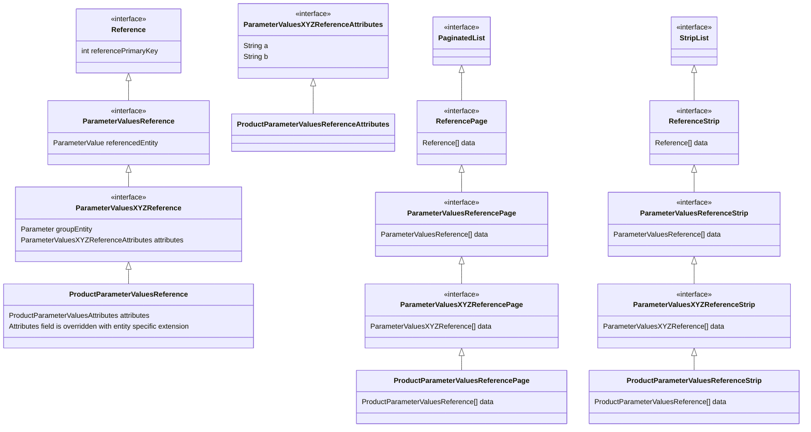
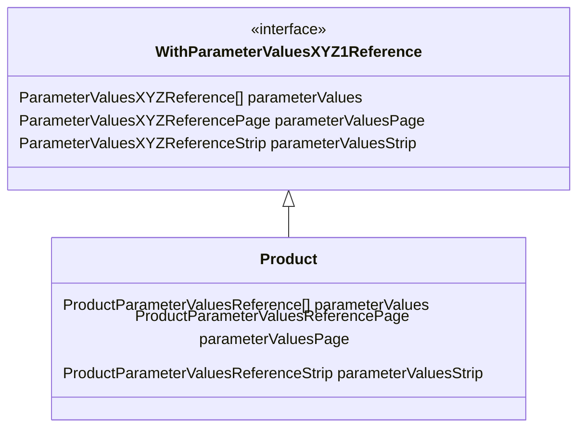

<LS to="e,j,c,r">
Tato kapitola popisuje GraphQL protokol pro evitaDB a nedává smysl pro jiné jazyky. Pokud vás zajímají
detaily implementace GraphQL, změňte prosím preferovaný jazyk v pravém horním rohu.
</LS>
<LS to="g">
[GraphQL](https://graphql.org/) API bylo vyvinuto tak, aby uživatelům umožnilo snadno dotazovat doménově specifická data z
evitaDB s vysokou mírou přizpůsobení dotazů a se samo-dokumentací, kterou GraphQL API poskytuje.

Hlavní myšlenkou naší implementace GraphQL API je, že schéma API je dynamicky generováno na základě
[interních schémat](/documentation/user/en/use/schema.md) evitaDB. To znamená, že uživatelé vidí pouze ta data, která
mohou skutečně získat. Nevidí žádné obecné řetězce názvů. Například, pokud jste v evitaDB definovali
entitu `Product` s atributy `code` a `name`, GraphQL API vám umožní dotazovat pouze tyto dva atributy
takto:

```graphql
getProduct {
    attributes {
        code
        name
    }
}
```

a navíc budou mít datové typy, které odpovídají těm, které jsou specifikovány v evitaDB, a ne nějaké obecné.

## Instance GraphQL API

<UsedTerms>
    <h4>Použité pojmy</h4>
    <dl>
        <dt>catalog data API</dt>
        <dd>
			Instance GraphQL API, která umožňuje dotazovat a aktualizovat skutečná data (typicky entity a související data)
            jednoho katalogu.

	        Vzor URL: `/gql/{catalog-name}`
        </dd>
        <dt>catalog schema API</dt>
        <dd>
            Instance GraphQL API, která umožňuje získávat a měnit vnitřní strukturu jednoho katalogu.

	        Vzor URL: `/gql/{catalog-name}/schema`
        </dd>
        <dt>system API</dt>
        <dd>
            Instance GraphQL API, která umožňuje spravovat samotnou evitaDB.

            Vzor URL: `/gql/system`
        </dd>
    </dl>
</UsedTerms>

Neexistuje jedna jediná instance GraphQL API pro celou instanci evitaDB. Místo toho má každý [katalog](/documentation/user/en/use/data-model.md#catalog) evitaDB
vlastní GraphQL API (ve skutečnosti má každý katalog dvě instance GraphQL API, ale o tom později) na vlastní URL s daty pouze z daného katalogu.
Navíc existuje ještě jedna instance GraphQL API, která je vyhrazena pro administraci evitaDB
(například vytváření nových katalogů, odstraňování existujících katalogů), nazývaná <Term>system API</Term>.

Každá URL instance GraphQL API začíná `/gql`, za kterou následuje katalogové jméno ve formátu URL pro konkrétní
API katalogu, nebo rezervované klíčové slovo `system` pro výše zmíněné <Term>system API</Term>. Pro každý katalog existuje
<Term>catalog data API</Term> umístěné na základní URL `/gql/{catalog name}` a <Term>catalog schema API</Term> umístěné na URL
`/gql/{catalog name}/schema`. <Term>catalog data API</Term> slouží k získávání a aktualizaci skutečných dat daného katalogu.
<Term>catalog schema API</Term> je spíše "introspekční" API, protože umožňuje uživatelům zobrazit a měnit interní schémata evitaDB,
což následně ovlivňuje schéma GraphQL API.

Každá instance GraphQL API podporuje pouze HTTP metodu `POST` pro provádění dotazů a mutací.

### Získání schématu GraphQL

Každá instance GraphQL API podporuje standardní [introspekční možnosti](https://graphql.org/learn/introspection/) pro rekonstrukci schématu GraphQL.
Kromě toho každá instance umožňuje získat rekonstruované schéma GraphQL ve formátu DSL pomocí
HTTP požadavku `GET` na URL instance. Například pro získání schématu GraphQL katalogu `fashion` můžete provést
následující HTTP požadavek:
```http request
GET /gql/fashion
```

<Note type="info">

<NoteTitle toggles="true">

##### Význam metody `GET` ve specifikaci GraphQL
</NoteTitle>

Jsme si vědomi, že tato implementace není správným způsobem použití metody `GET` dle specifikace GraphQL.
Nicméně jsme se rozhodli pro tuto implementaci, protože stejný přístup používáme pro získání OpenAPI specifikací REST API.
Také neplánujeme podporovat provádění dotazů a mutací pomocí metody `GET`, protože to zahrnuje zbytečné
escapování dotazovacího řetězce a podobně.

</Note>

<Note type="example">

<NoteTitle toggles="true">

##### Jaké URL adresy budou zpřístupněny pro sadu definovaných katalogů?
</NoteTitle>

Představme si, že máte katalogy `fashion` a `electronics`. evitaDB by zpřístupnila následující instance GraphQL API, každou
s vlastní relevantní GraphQL schématem:

- `/gql/fashion` - <Term>API pro data katalogu</Term> pro dotazování nebo aktualizaci skutečných dat katalogu `fashion`
- `/gql/fashion/schema` - <Term>API pro schéma katalogu</Term> pro zobrazení a úpravu vnitřní struktury katalogu `fashion`
- `/gql/electronics` - <Term>API pro data katalogu</Term> pro dotazování nebo aktualizaci skutečných dat katalogu `electronics`
- `/gql/electronics/schema` - <Term>API pro schéma katalogu</Term> pro zobrazení a úpravu vnitřní struktury katalogu `electronics`
- `/gql/system` - <Term>systémové API</Term> pro správu samotné evitaDB

</Note>

## Struktura API

### Struktura catalog data API

Jedno <Term>catalog data API</Term> pro jeden katalog obsahuje jen několik typů dotazů a mutací, ale většina z nich je "duplikována" pro
každou [kolekci](/documentation/user/en/use/data-model.md#collection) v rámci tohoto katalogu.
Každý dotaz nebo mutace pak přijímá argumenty a vrací data specifická pro danou kolekci a [její schéma](/documentation/user/en/use/schema.md#entity).

Kromě uživatelsky definovaných kolekcí existuje v GraphQL API pro každý katalog "virtuální" zjednodušená kolekce s názvem `entity`,
která umožňuje uživatelům získávat entity podle globálních atributů bez znalosti cílové kolekce. Nicméně "kolekce" `entity`
má k dispozici pouze omezenou sadu dotazů.

#### Model

Schéma se skládá především z:

- dynamických typů objektů entity
  - samostatné typy objektů pro každou kolekci na základě interního schématu evitaDB
- vstupních typů pro dotazovací omezení
  - kontejnery pro dotazování na entity na základě definic omezení evitaDB a interního schématu evitaDB
- společných pomocných typů
  - výčty, mutace atd.

##### Znovupoužitelnost

Ačkoli je většina typů generována na základě uživatelsky definovaného schématu bez vzájemných vazeb, existují některé
oblasti, kde můžeme automaticky vypočítat znovupoužitelné rozhraní typů. To může výrazně pomoci klientskému kódu
vytvářet znovupoužitelné komponenty.

Znovupoužitelné rozhraní typů lze nalézt v:

**Datových blocích**. Existují dvě základní implementace: stránkované seznamy
a pásové seznamy. Obvykle entity a reference implementují své vlastní rozšíření těchto rozhraní.

**Reference na entity** jsou rozděleny do několika úrovní rozhraní a objektových typů na základě rozsahu zobecnění:

- obecná reference na libovolnou entitu
  - lze k ní přistupovat z jakékoli reference na entitu
- reference na konkrétní entitu (např. `Category`)
  - lze k ní přistupovat z jakékoli reference na entitu, která cílí na tento typ entity
- reference na konkrétní entitu se sadou atributů a skupinou
  - lze k ní přistupovat z jakékoli reference na entitu, která cílí na tuto sadu dat
- konkrétní reference mezi konkrétní zdrojovou entitou a cílovou entitou (např. `Product` -> `ParameterValues`)
  - lze k ní přistupovat pouze z konkrétní zdrojové entity

<Note type="info">

<NoteTitle toggles="true">

##### Příklad hierarchie rozhraní referencí na entity
</NoteTitle>

Následující diagram ukazuje hierarchii rozhraní referencí na entity pro entitu `ParameterValues`, na kterou odkazuje entita `Product`.


</Note>

Aby bylo možné znovu použít také filtrování a řazení referencí přímo v řádku, je pro každou kombinaci názvu reference, typu referencované entity, sady atributů a skupiny generováno rozhraní `With*Reference`. Každá zdrojová entita pak implementuje takové rozhraní, které odpovídá její definici reference.

<Note type="info">

<NoteTitle toggles="true">

##### Příklad hierarchie rozhraní `With*Reference`

</NoteTitle>

Následující diagram ukazuje hierarchii rozhraní `With*Reference` pro entitu `ParameterValues`, která je dostupná na entitě `Product`.



</Note>

<Note type="info">

Zkoumáme další místa, kde bychom mohli generovat znovupoužitelné typy rozhraní na základě reálných případů použití.
Nechceme však zbytečně komplikovat schéma API jen kvůli této možnosti.

</Note>
  

### Struktura catalog schema API

Jedno <Term>catalog schema API</Term> pro jeden katalog obsahuje pouze základní dotazy a mutace pro každou
[kolekci](/documentation/user/en/use/data-model.md#collection) a nadřazený [katalog](/documentation/user/en/use/data-model.md#catalog)
pro získání nebo změnu jeho schématu.

#### Model

Schéma se skládá především z dynamicky generovaných objektových typů, které reprezentují různé komponenty schématu.

### Struktura system API

Na <Term>system API</Term> není nic speciálního, pouze sada základních dotazů a mutací.

## Dotazovací jazyk

evitaDB je dodávána s vlastním [dotazovacím jazykem](/documentation/user/en/query/basics.md), pro který má naše GraphQL API vlastní rozhraní.
Hlavní rozdíl mezi těmito dvěma je, že původní jazyk evitaDB má obecnou sadu omezení a nezajímá se o konkrétní
strukturu dat [kolekce](/documentation/user/en/use/data-model.md#collection), zatímco
verze GraphQL má stejná omezení, ale přizpůsobená na základě struktury dat [kolekce](/documentation/user/en/use/data-model.md#collection),
aby poskytla konkrétní dostupná omezení pro definovanou datovou strukturu.

Tato vlastní verze dotazovacího jazyka je možná, protože v našem GraphQL API je schéma dotazovacího jazyka dynamicky generováno
na základě [interních schémat kolekcí](/documentation/user/en/use/schema.md#entity), aby zobrazovalo pouze omezení, která
lze skutečně použít pro dotazování dat (což se také mění podle kontextu vnořených omezení). To také poskytuje argumenty omezení s datovými typy, které odpovídají
interním datům. To pomáhá se samo-dokumentací, protože nemusíte nutně znát
doménový model, jelikož většina GraphQL IDE automaticky doplňuje dostupná omezení ze schématu GraphQL API.

### Syntaxe dotazu a omezení

<MDInclude>[Syntaxe dotazu a omezení](/documentation/user/en/use/connectors/assets/dynamic-api-query-language-syntax.md)</MDInclude>

## Doporučené použití

Naše GraphQL API jsou v souladu s oficiální specifikací, takže je lze používat jako jakékoli jiné běžné GraphQL API, tj. se
standardními nástroji. Níže však uvádíme naše doporučení na nástroje atd., které používáme v evitaDB.

### Doporučená vývojová prostředí (IDE)

Vyvinuli jsme vlastní GUI nástroj nazvaný [evitaLab](https://evitadb.io/blog/09-our-new-web-client-evitalab), který podporuje GraphQL s užitečnými nástroji (např. vizualizace dat).
Obsahuje také další užitečné nástroje pro prozkoumávání instancí evitaDB, nejen pro práci s GraphQL API.
Proto je to naše doporučená volba IDE pro naše API.

Pokud však chcete použít obecný nástroj pro GraphQL, máme i pro to doporučení.
Během vývoje jsme narazili na několik nástrojů pro práci s GraphQL API a některé z nich jsme vyzkoušeli, ale doporučit můžeme jen několik z nich.

Pro desktopové IDE na testování a prozkoumávání GraphQL API se velmi osvědčil klient [Altair](https://altairgraphql.dev/). Je to
skvělý desktopový klient pro GraphQL API s vynikajícím doplňováním kódu a přehledným prohlížečem schématu API.
Můžete také použít obecnější desktopový HTTP klient jako [Insomnia](https://insomnia.rest/), který také nabízí nástroje pro GraphQL
s prohlížečem schématu API, i když v omezené míře. Lze použít i [Postman](https://www.postman.com/).
Obvykle můžete dokonce využít GraphQL pluginy ve svém vývojovém IDE, např. [IntelliJ IDEA](https://www.jetbrains.com/idea/)
nabízí [GraphQL plugin](https://plugins.jetbrains.com/plugin/8097-graphql), který se pěkně integruje do vašeho pracovního postupu,
i když neposkytuje dokumentaci API jako samostatná IDE.

Pokud hledáte webového klienta, kterého můžete integrovat do své aplikace, existuje oficiální lehký
[GraphiQL](https://github.com/graphql/graphiql), který poskytuje všechny základní nástroje, které byste mohli potřebovat.

Základní myšlenkou použití IDE je nejprve načíst schéma GraphQL API z jedné z výše uvedených URL, které jsou
vystaveny evitaDB. Poté prozkoumejte schéma API pomocí dokumentace/prohlížeče schématu API v IDE a začněte psát dotaz nebo mutaci, kterou odešlete na server.
V případě např. [Altair](https://altairgraphql.dev/) nemusíte schéma API procházet ručně, protože
Altair, stejně jako mnoho dalších, nabízí doplňování kódu v editoru na základě načteného schématu API.

### Doporučené klientské knihovny

Všechny dostupné knihovny najdete na [oficiální webové stránce GraphQL](https://graphql.org/code/#language-support), kde si můžete
vybrat pro svůj vlastní klientský jazyk. Některé dokonce dokáží generovat třídy/typy na základě schématu API, které můžete použít ve
své kódové základně.
</LS>