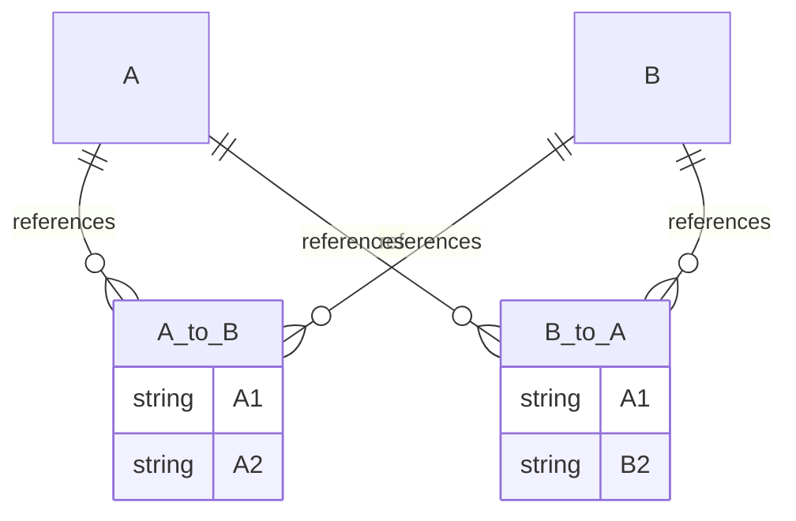

evitaDB interně udržuje schéma pro každou [entitní kolekci](data-model.md#kolekce) / [katalog](data-model.md#katalog), ačkoliv podporuje [uvolněný přístup](#evoluce), kdy je schéma automaticky vytvářeno na základě dat vložených do databáze.

Schéma není důležité pouze pro udržení konzistence dat, ale je také klíčovým zdrojem pro generování schémat webových API. Umožňuje nám vytvářet schémata [Open API](connectors/rest.md) a [GraphQL](connectors/graphql.md). Pokud věnujete pozornost definici schématu, budete odměněni pěknými, srozumitelnými a samodokumentujícími se API. Každý jednotlivý údaj ve schématu ovlivňuje vzhled webových API. Například kardinalita relace (nula nebo jedna, právě jedna, nula nebo více, jedna nebo více) ovlivňuje, zda API označí relaci jako volitelnou, vrací jednu hodnotu/objekt, nebo pole těchto hodnot. Filtrovatelné atributy jsou propagovány do dokumentovaných bloků dotazovacího jazyka, zatímco nefiltrovatelné atributy nikoliv. Datové typy atributů ovlivňují, jaké dotazovací podmínky lze v souvislosti s tímto atributem použít, a tak dále. Dokumentace, kterou napíšete ve schématu evitaDB, je propagována do všech vašich API. Více o této projekci si můžete přečíst ve specializovaných kapitolách dokumentace o Web API.

## Mutace a verzování

Schéma lze měnit pouze pomocí tzv. *mutací*. Ačkoliv je tento přístup poněkud zdlouhavý, má pro systém několik velkých výhod:

- **mutace představuje izolovanou změnu schématu** – to znamená, že klient provádějící změnu schématu posílá na server pouze rozdíly, což šetří síťový provoz a také umožňuje serverové logice, že nemusí interně řešit rozdíly
- **mutace je přímo použita jako položka [WAL](../deep-dive/transactions.md#2-zápis-do-write-ahead-logu)** – mutace představuje atomickou operaci v transakčním logu, který je distribuován napříč clusterem, a také místo, kde dochází k řešení konfliktů (pokud server obdrží podobné mutace ze dvou paralelních sezení, snadno rozhodne, zda vyhodit výjimku souběžné změny – pokud jsou mutace stejné, není konflikt; pokud jsou různé, první mutace je přijata a druhá odmítnuta s výjimkou)

Schéma je verzované – pokaždé, když je provedena mutace schématu, jeho číslo verze se zvýší o jedna. Pokud máte na straně klienta dvě instance schématu, snadno zjistíte, zda jsou stejné porovnáním jejich čísla verze, a pokud ne, která z nich je novější.

<Note type="question">

<NoteTitle toggles="true">

##### Opravdu musím všechny mutace psát ručně?
</NoteTitle>

Doufejme, že ne. Uvědomujeme si, že psaní mutací je zdlouhavé, a proto poskytujeme lepší podporu v našich driverech. Klientské drivery obalují neměnná schémata do builder objektů, takže můžete jednoduše volat metody pro úpravu a builder na konci vygeneruje seznam mutací. Viz [příklad](api/schema-api.md#deklarativní-definice-schématu).

Pokud však chcete používat evitaDB na platformě, která ještě není podporována konkrétním klientským driverem, musíte pracovat přímo s našimi webovými API, které přijímají pouze mutace, a nezbývá vám nic jiného než psát mutace přímo nebo si napsat vlastní klientský driver. Ale můžete jej dát jako open source a pomoci komunitě. Dejte nám o tom vědět!

</Note>

Všechny mutace schématu implementují rozhraní <LS to="j"><SourceClass>evita_api/src/main/java/io/evitadb/api/requestResponse/schema/mutation/SchemaMutation.java</SourceClass></LS><LS to="c"><SourceClass>EvitaDB.Client/Models/Schemas/Mutations/ISchemaMutation.cs</SourceClass></LS>

## Struktura

Existují následující typy schémat:

- [schéma katalogu](#katalog)
- [schéma entity](#entita)
- [schéma atributu](#atributy)
- [schéma složeného atributu pro řazení](#složené-atributy-pro-řazení)
- [schéma přidružených dat](#přidružená-data)
- [schéma reference](#reference)

### Katalog

Schéma katalogu obsahuje seznam [entitních schémat](#entita), `name` a `description` katalogu. Také uchovává slovník [globálních schémat atributů](#globální-schéma-atributu), které lze sdílet mezi více [entitními schématy](#entita).

<Note type="info">

<NoteTitle toggles="true">

##### Požadavky na názvy a varianty názvů
</NoteTitle>

Každý pojmenovaný datový objekt – [katalog](#katalog), [entita](#entita), [atribut](#atributy), [přidružená data](#přidružená-data) a [reference](#reference) musí být v rámci svého nadřazeného rozsahu jednoznačně identifikovatelný svým názvem.

Logika validace názvů a rezervovaná slova jsou obsaženy ve třídě <LS to="j,e,r,g"><SourceClass>evita_common/src/main/java/io/evitadb/utils/ClassifierUtils.java</SourceClass></LS><LS to="c"><SourceClass>EvitaDB.Client/Utils/ClassifierUtils.cs</SourceClass></LS>.

Ve schématu každého pojmenovaného objektu existuje také speciální vlastnost `nameVariants`. Obsahuje varianty názvu objektu v různých "vývojářských" notacích jako *camelCase*, *PascalCase*, *snake_case* a podobně. Kompletní výčet viz
<LS to="j,e,r,g"><SourceClass>evita_external_api/evita_external_api_core/src/main/java/io/evitadb/externalApi/api/catalog/schemaApi/model/NameVariantsDescriptor.java</SourceClass></LS><LS to="c"><SourceClass>EvitaDB.Client/Utils/NamingConvention.cs</SourceClass></LS>.

</Note>

<Note type="info">

<NoteTitle toggles="false">

##### Seznam mutací týkajících se katalogu
</NoteTitle>

Mutace na nejvyšší úrovni:

- **<LS to="j,e,r,g"><SourceClass>evita_api/src/main/java/io/evitadb/api/requestResponse/schema/mutation/catalog/CreateCatalogSchemaMutation.java</SourceClass></LS><LS to="c"><SourceClass>EvitaDB.Client/Models/Schemas/Mutations/Catalogs/CreateCatalogSchemaMutation.cs</SourceClass></LS>**
- **<LS to="j,e,r,g"><SourceClass>evita_api/src/main/java/io/evitadb/api/requestResponse/schema/mutation/catalog/RemoveCatalogSchemaMutation.java</SourceClass></LS><LS to="c"><SourceClass>EvitaDB.Client/Models/Schemas/Mutations/Catalogs/RemoveCatalogSchemaMutation.cs</SourceClass></LS>**
- **<LS to="j,e,r,g"><SourceClass>evita_api/src/main/java/io/evitadb/api/requestResponse/schema/mutation/catalog/ModifyCatalogSchemaMutation.java</SourceClass></LS><LS to="c"><SourceClass>EvitaDB.Client/Models/Schemas/Mutations/Catalogs/ModifyCatalogSchemaMutation.cs</SourceClass></LS>**

V rámci `ModifyCatalogSchemaMutation` můžete použít mutace:

- **<LS to="j,e,r,g"><SourceClass>evita_api/src/main/java/io/evitadb/api/requestResponse/schema/mutation/catalog/ModifyCatalogSchemaNameMutation.java</SourceClass></LS><LS to="c"><SourceClass>EvitaDB.Client/Models/Schemas/Mutations/Catalogs/ModifyCatalogSchemaNameMutation.cs</SourceClass></LS>**
- **<LS to="j,e,r,g"><SourceClass>evita_api/src/main/java/io/evitadb/api/requestResponse/schema/mutation/catalog/ModifyCatalogSchemaDescriptionMutation.java</SourceClass></LS><LS to="c"><SourceClass>EvitaDB.Client/Models/Schemas/Mutations/Catalogs/ModifyCatalogSchemaDescriptionMutation.cs</SourceClass></LS>**

A [mutace entity na nejvyšší úrovni](#entita).

<LS to="j,c">
Schéma katalogu je popsáno:
<LS to="j"><SourceClass>evita_api/src/main/java/io/evitadb/api/requestResponse/schema/CatalogSchemaContract.java</SourceClass></LS><LS to="c"><SourceClass>EvitaDB.Client/Models/Schemas/ICatalogSchema.cs</SourceClass></LS>
</LS>

</Note>

#### Globální schéma atributu

Globální schéma atributu má stejnou strukturu jako [schéma atributu](#atributy) s jednou další vlastností. Globální atribut může být označen jako `uniqueGlobally`, což znamená, že hodnoty takového atributu musí být unikátní napříč všemi entitami a typy entit v celém katalogu.

<Note type="question">

<NoteTitle toggles="true">

##### K čemu je dobrá globální jedinečnost?
</NoteTitle>

Je užitečná například pro URL entity, které chceme mít přirozeně unikátní mezi všemi entitami v katalogu. Globálně unikátní atribut nám umožňuje požádat evitaDB o entitu s konkrétní hodnotou, aniž bychom předem znali její typ. Řeší to situaci, kdy do vaší aplikace přijde nový požadavek a vy potřebujete zjistit, zda existuje entita, která mu odpovídá (bez ohledu na to, zda je to produkt, kategorie, značka, skupina nebo jakékoliv typy máte ve svém projektu).
</Note>

Globální atribut může být také použit jako "definice slovníku" pro atribut, který je použit ve více entitních kolekcích, a chceme zajistit, že je ve všech pojmenován a popsán stejně. Entitní kolekce nemůže definovat atribut se stejným názvem jako globální atribut. Může pouze "použít" globální atribut s tímto názvem a tím sdílet jeho kompletní definici.

<Note type="info">

<NoteTitle toggles="false">

##### Seznam mutací týkajících se globálního atributu
</NoteTitle>

- **<LS to="j,e,r,g"><SourceClass>evita_api/src/main/java/io/evitadb/api/requestResponse/schema/mutation/attribute/CreateGlobalAttributeSchemaMutation.java</SourceClass></LS><LS to="c"><SourceClass>EvitaDB.Client/Models/Schemas/Mutations/Attributes/CreateGlobalAttributeSchemaMutation.cs</SourceClass></LS>**
- **<LS to="j,e,r,g"><SourceClass>evita_api/src/main/java/io/evitadb/api/requestResponse/schema/mutation/attribute/UseGlobalAttributeSchemaMutation.java</SourceClass></LS><LS to="c"><SourceClass>EvitaDB.Client/Models/Schemas/Mutations/Attributes/UseGlobalAttributeSchemaMutation.cs</SourceClass></LS>**
- **<LS to="j,e,r,g"><SourceClass>evita_api/src/main/java/io/evitadb/api/requestResponse/schema/mutation/attribute/SetAttributeSchemaGloballyUniqueMutation.java</SourceClass></LS><LS to="c"><SourceClass>EvitaDB.Client/Models/Schemas/Mutations/Attributes/SetAttributeSchemaGloballyUniqueMutation.cs</SourceClass></LS>**

A samozřejmě všechny [standardní mutace atributů](#atributy).

<LS to="j,c">
Globální schéma atributu je popsáno:
<LS to="j"><SourceClass>evita_api/src/main/java/io/evitadb/api/requestResponse/schema/GlobalAttributeSchemaContract.java</SourceClass></LS>
<LS to="c"><SourceClass>EvitaDB.Client/Models/Schemas/IGlobalAttributeSchema.cs</SourceClass></LS>
</LS>

</Note>

### Entita

Schéma entity obsahuje informace o `name`, `description` a:

- [povolení generování primárního klíče](#generování-primárního-klíče)
- [limity evoluce](#evoluce)
- [povolené jazyky a měny](#jazyky-a-měny)
- [povolení hierarchické struktury](#umístění-v-hierarchii)
- [povolení cenových informací](#ceny)
- [atributy](#atributy)
- [složené atributy pro řazení](#složené-atributy-pro-řazení)
- [přidružená data](#přidružená-data)
- [reference](#reference)

Schéma entity může být označeno jako *deprecated* (zastaralé), což bude propagováno do generované dokumentace webového API.

<Note type="info">

<NoteTitle toggles="false">

##### Seznam mutací týkajících se typu entity
</NoteTitle>

<LS to="j,e,r,g">

Mutace entity na nejvyšší úrovni:

- **<LS to="j,e,r,g"><SourceClass>evita_api/src/main/java/io/evitadb/api/requestResponse/schema/mutation/catalog/CreateEntitySchemaMutation.java</SourceClass></LS><LS to="c"><SourceClass>EvitaDB.Client/Models/Schemas/Mutations/Catalogs/CreateEntitySchemaMutation.cs</SourceClass></LS>**
- **<LS to="j,e,r,g"><SourceClass>evita_api/src/main/java/io/evitadb/api/requestResponse/schema/mutation/catalog/RemoveEntitySchemaMutation.java</SourceClass></LS><LS to="c"><SourceClass>EvitaDB.Client/Models/Schemas/Mutations/Catalogs/RemoveEntitySchemaMutation.cs</SourceClass></LS>**
- **<LS to="j,e,r,g"><SourceClass>evita_api/src/main/java/io/evitadb/api/requestResponse/schema/mutation/catalog/ModifyEntitySchemaNameMutation.java</SourceClass></LS><LS to="c"><SourceClass>EvitaDB.Client/Models/Schemas/Mutations/Catalogs/ModifyEntitySchemaNameMutation.cs</SourceClass></LS>**
- **<LS to="j,e,r,g"><SourceClass>evita_api/src/main/java/io/evitadb/api/requestResponse/schema/mutation/catalog/ModifyEntitySchemaMutation.java</SourceClass></LS><LS to="c"><SourceClass>EvitaDB.Client/Models/Schemas/Mutations/Catalogs/ModifyEntitySchemaMutation.cs</SourceClass></LS>**

V rámci `ModifyEntitySchemaMutation` můžete použít mutace:

- **<LS to="j,e,r,g"><SourceClass>evita_api/src/main/java/io/evitadb/api/requestResponse/schema/mutation/entity/ModifyEntitySchemaDescriptionMutation.java</SourceClass></LS><LS to="c"><SourceClass>EvitaDB.Client/Models/Schemas/Mutations/Entities/ModifyEntitySchemaDescriptionMutation.cs</SourceClass></LS>**
- **<LS to="j,e,r,g"><SourceClass>evita_api/src/main/java/io/evitadb/api/requestResponse/schema/mutation/entity/ModifyEntitySchemaDeprecationNoticeMutation.java</SourceClass></LS><LS to="c"><SourceClass>EvitaDB.Client/Models/Schemas/Mutations/Entities/ModifyEntitySchemaDeprecationNoticeMutation.cs</SourceClass></LS>**

</LS>

<LS to="j,c">
Schéma entity je popsáno:
<LS to="j"><SourceClass>evita_api/src/main/java/io/evitadb/api/requestResponse/schema/EntitySchemaContract.java</SourceClass></LS>
<LS to="c"><SourceClass>EvitaDB.Client/Models/Schemas/IEntitySchema.cs</SourceClass></LS>
</LS>

</Note>

#### Generování primárního klíče

Pokud je povoleno generování primárního klíče, evitaDB přiřadí nově vložené entitě unikátní
<LS to="j,e,r,g">[int](https://docs.oracle.com/javase/tutorial/java/nutsandbolts/datatypes.html)</LS>
<LS to="c">[int](https://learn.microsoft.com/en-us/dotnet/api/system.int32)</LS> číslo. Primární klíč vždy začíná na `1` a zvyšuje se o `1`. evitaDB zaručuje jeho jedinečnost v rámci stejného typu entity. Primární klíče generované tímto způsobem jsou optimální pro binární operace ve využívaných datových strukturách.

<Note type="info">

<NoteTitle toggles="false">

##### Seznam mutací týkajících se primárního klíče
</NoteTitle>

V rámci `ModifyEntitySchemaMutation` můžete použít mutaci:

- **<LS to="j,e,r,g"><SourceClass>evita_api/src/main/java/io/evitadb/api/requestResponse/schema/mutation/entity/SetEntitySchemaWithGeneratedPrimaryKeyMutation.java</SourceClass></LS><LS to="c"><SourceClass>EvitaDB.Client/Models/Schemas/Mutations/Entities/SetEntitySchemaWithGeneratedPrimaryKeyMutation.cs</SourceClass></LS>**

</Note>

#### Evoluce

Doporučujeme přístup "schema-first", ale existují případy, kdy se nechcete zabývat schématem a chcete pouze vkládat a dotazovat data (například při rychlém prototypování). Když je vytvořen nový [katalog](data-model.md#katalog), je nastaven do režimu "automatické evoluce", kdy se schéma přizpůsobuje datům při prvním vložení. Pokud chcete mít nad schématem přísnou kontrolu, musíte evoluci omezit změnou výchozího schématu. V přísném režimu evitaDB vyhodí výjimku, pokud vstupní data porušují schéma.

Stále musíte ručně vytvářet [entitní kolekce](data-model.md#kolekce), ale poté můžete ihned vkládat data a schéma bude odpovídajícím způsobem vytvořeno. Existující schémata budou při každém vkládání/aktualizaci entity validována – nebude povoleno uložit stejný atribut jednou jako číslo a podruhé jako řetězec. První použití nastaví schéma, které musí být od té chvíle respektováno.

<Note type="info">
Pokud má první entita svůj primární klíč, evitaDB očekává, že všechny entity budou mít při vkládání nastavený primární klíč. Pokud má první entita primární klíč nastavený na `NULL`, evitaDB bude generovat primární klíče za vás a odmítne externí primární klíče. Nová schémata atributů jsou implicitně vytvořena jako `nullable`, `filterable` a datové typy, které nejsou polem, jako `sortable`. To znamená, že klient může ihned filtrovat/řadit téměř podle čehokoliv, ale samotná databáze bude spotřebovávat hodně prostředků. Reference budou vytvořeny jako `indexed`, ale ne `faceted`.
</Note>

Existuje několik dílčích uvolněných režimů mezi přísným a plně automatickým režimem evoluce – viz
<LS to="j,e,r,g"><SourceClass>evita_api/src/main/java/io/evitadb/api/requestResponse/schema/EvolutionMode.java</SourceClass></LS>
<LS to="c"><SourceClass>EvitaDB.Client/Models/Schemas/EvolutionMode.cs</SourceClass></LS> pro detaily.
Například – můžete přísně kontrolovat celé schéma, kromě nových definic jazyků nebo měn, které mohou být automaticky přidány při prvním použití.

<Note type="info">

<NoteTitle toggles="false">

##### Seznam mutací týkajících se režimu evoluce
</NoteTitle>

V rámci `ModifyEntitySchemaMutation` můžete použít mutace:

- **<LS to="j,e,r,g"><SourceClass>evita_api/src/main/java/io/evitadb/api/requestResponse/schema/mutation/entity/AllowEvolutionModeInEntitySchemaMutation.java</SourceClass></LS><LS to="c"><SourceClass>EvitaDB.Client/Models/Schemas/Mutations/Entities/AllowEvolutionModeInEntitySchemaMutation.cs</SourceClass></LS>**
- **<LS to="j,e,r,g"><SourceClass>evita_api/src/main/java/io/evitadb/api/requestResponse/schema/mutation/entity/DisallowEvolutionModeInEntitySchemaMutation.java</SourceClass></LS><LS to="c"><SourceClass>EvitaDB.Client/Models/Schemas/Mutations/Entities/DisallowEvolutionModeInEntitySchemaMutation.cs</SourceClass></LS>**

</Note>

#### Jazyky a měny

Schéma specifikuje seznam povolených měn a jazyků. Předpokládáme, že seznam povolených měn/jazyků bude poměrně malý (jednotky, maximálně nižší desítky) a pokud je systém zná předem, může pro každou z nich generovat enumy ve webových API. To pomáhá vývojářům psát dotazy s automatickým doplňováním. Dalším pozitivním efektem je, že e-commerce systémy často nerozšiřují seznam používaných měn nebo jazyků (protože je s tím obvykle spojeno mnoho ručních operací), a mít povolenou množinu hlídanou systémem eliminuje možnost vložení neplatných cen nebo lokalizací omylem.

<Note type="question">

<NoteTitle toggles="true">

##### Proč nejsou cenové seznamy uvedeny ve schématu, když měny ano?
</NoteTitle>

Cenové seznamy jsou blíže "datům" než jazyky nebo měny. Očekává se, že se množina cenových seznamů bude měnit velmi často a jejich počet může dosáhnout vysoké kardinality (tisíce, desetitisíce). Nebylo by praktické pro ně generovat hodnoty výčtu a měnit schémata Web API pokaždé, když je cenový seznam přidán nebo odebrán.
</Note>

<Note type="info">

<NoteTitle toggles="false">

##### Seznam mutací týkajících se jazyků a měn
</NoteTitle>

V rámci `ModifyEntitySchemaMutation` můžete použít mutace:

- **<LS to="j,e,r,g"><SourceClass>evita_api/src/main/java/io/evitadb/api/requestResponse/schema/mutation/entity/AllowCurrencyInEntitySchemaMutation.java</SourceClass></LS><LS to="c"><SourceClass>EvitaDB.Client/Models/Schemas/Mutations/Entities/AllowCurrencyInEntitySchemaMutation.cs</SourceClass></LS>**
- **<LS to="j,e,r,g"><SourceClass>evita_api/src/main/java/io/evitadb/api/requestResponse/schema/mutation/entity/DisallowCurrencyInEntitySchemaMutation.java</SourceClass></LS><LS to="c"><SourceClass>EvitaDB.Client/Models/Schemas/Mutations/Entities/DisallowCurrencyInEntitySchemaMutation.cs</SourceClass></LS>**
- **<LS to="j,e,r,g"><SourceClass>evita_api/src/main/java/io/evitadb/api/requestResponse/schema/mutation/entity/AllowLocaleInEntitySchemaMutation.java</SourceClass></LS><LS to="c"><SourceClass>EvitaDB.Client/Models/Schemas/Mutations/Entities/AllowLocaleInEntitySchemaMutation.cs</SourceClass></LS>**
- **<LS to="j,e,r,g"><SourceClass>evita_api/src/main/java/io/evitadb/api/requestResponse/schema/mutation/entity/DisallowLocaleInEntitySchemaMutation.java</SourceClass></LS><LS to="c"><SourceClass>EvitaDB.Client/Models/Schemas/Mutations/Entities/DisallowLocaleInEntitySchemaMutation.cs</SourceClass></LS>**

</Note>

#### Umístění v hierarchii

Pokud je povoleno umístění v hierarchii, entity tohoto typu mohou tvořit stromovou strukturu. Každá entita může mít maximálně jednoho rodiče a nula nebo více potomků. Ani hloubka stromu, ani počet sourozenců na každé úrovni není omezen.

Povolení umístění v hierarchii znamená vytvoření nové instance
<SourceClass>evita_engine/src/main/java/io/evitadb/index/hierarchy/HierarchyIndex.java</SourceClass> pro daný typ entity. Pokud jiná entita odkazuje na hierarchickou entitu a reference je označena jako *indexed*, je pro každou hierarchickou entitu vytvořen speciální
<SourceClass>evita_engine/src/main/java/io/evitadb/index/ReducedEntityIndex.java</SourceClass>. Tento index bude obsahovat zredukované indexy atributů a cen odkazující entity, což umožňuje rychlé vyhodnocení podmínek filtru [`withinHierarchy`](../query/filtering/hierarchy.md).

##### Sirotčí uzly v hierarchii

Typickým problémem při vytváření stromové struktury je pořadí, ve kterém jsou uzly do stromu připojovány. Aby byl strom konzistentní, měl by se začít od kořenových uzlů a postupně sestupovat po ose jejich potomků. To však není vždy snadné, když potřebujeme zkopírovat existující strom do externího systému (pro skriptování je mnohem jednodušší a výkonnější indexovat po dávkách v přirozeném pořadí záznamů). Podobná situace nastává, když je potřeba odstranit mezilehlý uzel stromu, ale jeho potomky nikoliv. Můžeme vývojáře nutit, aby před odstraněním rodiče převedli potomky k jiným rodičům, ale často nemají přímou kontrolu nad pořadím operací a nemohou to snadno udělat.

Proto evitaDB rozpoznává tzv. **sirotčí uzly v hierarchii**. Sirotčí uzel je uzel, který se deklaruje jako potomek rodičovského uzlu s určitým primárním klíčem, který evitaDB zatím nezná (nebo je sirotčí uzel sám). Sirotčí uzly se neúčastní vyhodnocování [dotazů na hierarchické struktury](../query/filtering/hierarchy.md), ale jsou přítomny v indexu. Pokud je uzel s odkazovaným primárním klíčem připojen do hlavního stromu hierarchie, sirotčí uzly (podstromy) jsou také připojeny. Tímto způsobem se strom hierarchie nakonec stane konzistentním.

<Note type="info">

<NoteTitle toggles="false">

##### Seznam mutací týkajících se umístění v hierarchii
</NoteTitle>

V rámci `ModifyEntitySchemaMutation` můžete použít mutaci:

- **<LS to="j,e,r,g"><SourceClass>evita_api/src/main/java/io/evitadb/api/requestResponse/schema/mutation/entity/SetEntitySchemaWithHierarchyMutation.java</SourceClass></LS><LS to="c"><SourceClass>EvitaDB.Client/Models/Schemas/Mutations/Entities/SetEntitySchemaWithHierarchyMutation.cs</SourceClass></LS>**

</Note>

### Ceny

Pokud jsou ceny povoleny, entity tohoto typu mohou mít s sebou spojenou sadu cen a mohou být [filtrovány](../query/filtering/price.md) a [řazeny](../query/ordering/price.md) podle cenových omezení. Jedna entita může mít nula nebo více cen (systém je navržen pro situace, kdy má entita desítky nebo stovky cen). Pro každou kombinaci `priceList` a `currency` existuje speciální
<SourceClass>evita_engine/src/main/java/io/evitadb/index/price/PriceListAndCurrencyPriceSuperIndex.java</SourceClass>.

<Note type="info">

<NoteTitle toggles="false">

##### Seznam mutací týkajících se umístění v hierarchii
</NoteTitle>

V rámci `ModifyEntitySchemaMutation` můžete použít mutaci:

- **<LS to="j,e,r,g"><SourceClass>evita_api/src/main/java/io/evitadb/api/requestResponse/schema/mutation/entity/SetEntitySchemaWithPriceMutation.java</SourceClass></LS><LS to="c"><SourceClass>EvitaDB.Client/Models/Schemas/Mutations/Entities/SetEntitySchemaWithPriceMutation.cs</SourceClass></LS>**

</Note>

### Atributy

Typ entity může mít nula nebo více atributů. Systém je navržen pro situace, kdy má entita desítky atributů. Měli byste věnovat pozornost počtu `filterable` / `sortable` / `unique` atributů. Pro každý filtrovatelný atribut existuje samostatná instance
<SourceClass>evita_engine/src/main/java/io/evitadb/index/attribute/FilterIndex.java</SourceClass>, pro každý řaditelný atribut
<SourceClass>evita_engine/src/main/java/io/evitadb/index/attribute/SortIndex.java</SourceClass> a pro každý unikátní atribut
<SourceClass>evita_engine/src/main/java/io/evitadb/index/attribute/UniqueIndex.java</SourceClass> nebo
<SourceClass>evita_engine/src/main/java/io/evitadb/index/attribute/GlobalUniqueIndex.java</SourceClass>. Atributy, které nejsou ani `filterable` / `sortable` / `unique`, nespotřebovávají operační paměť.

<LS to="j,e,r,g">

Schéma atributu může být označeno jako `localized`, což znamená, že má smysl pouze v konkrétní
<LS to="j,e,r,g">[locale](https://docs.oracle.com/en/java/javase/17/docs/api/java.base/java/util/Locale.html)</LS>
<LS to="c">[locale](https://learn.microsoft.com/en-us/dotnet/api/system.globalization.cultureinfo)</LS>.
</LS>

Schéma atributu může být označeno jako *deprecated* (zastaralé), což bude propagováno do generované dokumentace webového API.

<Note type="info">

<NoteTitle toggles="false">

##### Seznam mutací týkajících se atributu
</NoteTitle>

V rámci `ModifyEntitySchemaMutation` můžete použít mutaci:

- **<LS to="j,e,r,g"><SourceClass>evita_api/src/main/java/io/evitadb/api/requestResponse/schema/mutation/attribute/CreateAttributeSchemaMutation.java</SourceClass></LS><LS to="c"><SourceClass>EvitaDB.Client/Models/Schemas/Mutations/Attributes/CreateAttributeSchemaMutation.cs</SourceClass></LS>**
- **<LS to="j,e,r,g"><SourceClass>evita_api/src/main/java/io/evitadb/api/requestResponse/schema/mutation/attribute/RemoveAttributeSchemaMutation.java</SourceClass></LS><LS to="c"><SourceClass>EvitaDB.Client/Models/Schemas/Mutations/Attributes/RemoveAttributeSchemaMutation.cs</SourceClass></LS>**
- **<LS to="j,e,r,g"><SourceClass>evita_api/src/main/java/io/evitadb/api/requestResponse/schema/mutation/attribute/ModifyAttributeSchemaNameMutation.java</SourceClass></LS><LS to="c"><SourceClass>EvitaDB.Client/Models/Schemas/Mutations/Attributes/ModifyAttributeSchemaNameMutation.cs</SourceClass></LS>**
- **<LS to="j,e,r,g"><SourceClass>evita_api/src/main/java/io/evitadb/api/requestResponse/schema/mutation/attribute/ModifyAttributeSchemaDescriptionMutation.java</SourceClass></LS><LS to="c"><SourceClass>EvitaDB.Client/Models/Schemas/Mutations/Attributes/ModifyAttributeSchemaDescriptionMutation.cs</SourceClass></LS>**
- **<LS to="j,e,r,g"><SourceClass>evita_api/src/main/java/io/evitadb/api/requestResponse/schema/mutation/attribute/ModifyAttributeSchemaDefaultValueMutation.java</SourceClass></LS><LS to="c"><SourceClass>EvitaDB.Client/Models/Schemas/Mutations/Attributes/ModifyAttributeSchemaDefaultValueMutation.cs</SourceClass></LS>**
- **<LS to="j,e,r,g"><SourceClass>evita_api/src/main/java/io/evitadb/api/requestResponse/schema/mutation/attribute/ModifyAttributeSchemaDeprecationNoticeMutation.java</SourceClass></LS><LS to="c"><SourceClass>EvitaDB.Client/Models/Schemas/Mutations/Attributes/ModifyAttributeSchemaDeprecationNoticeMutation.cs</SourceClass></LS>**
- **<LS to="j,e,r,g"><SourceClass>evita_api/src/main/java/io/evitadb/api/requestResponse/schema/mutation/attribute/ModifyAttributeSchemaTypeMutation.java</SourceClass></LS><LS to="c"><SourceClass>EvitaDB.Client/Models/Schemas/Mutations/Attributes/ModifyAttributeSchemaTypeMutation.cs</SourceClass></LS>**
- **<LS to="j,e,r,g"><SourceClass>evita_api/src/main/java/io/evitadb/api/requestResponse/schema/mutation/attribute/SetAttributeSchemaFilterableMutation.java</SourceClass></LS><LS to="c"><SourceClass>EvitaDB.Client/Models/Schemas/Mutations/Attributes/SetAttributeSchemaFilterableMutation.cs</SourceClass></LS>**
- **<LS to="j,e,r,g"><SourceClass>evita_api/src/main/java/io/evitadb/api/requestResponse/schema/mutation/attribute/SetAttributeSchemaLocalizedMutation.java</SourceClass></LS><LS to="c"><SourceClass>EvitaDB.Client/Models/Schemas/Mutations/Attributes/SetAttributeSchemaLocalizedMutation.cs</SourceClass></LS>**
- **<LS to="j,e,r,g"><SourceClass>evita_api/src/main/java/io/evitadb/api/requestResponse/schema/mutation/attribute/SetAttributeSchemaNullableMutation.java</SourceClass></LS><LS to="c"><SourceClass>EvitaDB.Client/Models/Schemas/Mutations/Attributes/SetAttributeSchemaNullableMutation.cs</SourceClass></LS>**
- **<LS to="j,e,r,g"><SourceClass>evita_api/src/main/java/io/evitadb/api/requestResponse/schema/mutation/attribute/SetAttributeSchemaRepresentativeMutation.java</SourceClass></LS><LS to="c"><SourceClass>EvitaDB.Client/Models/Schemas/Mutations/Attributes/SetAttributeSchemaRepresentativeMutation.cs</SourceClass></LS>**
- **<LS to="j,e,r,g"><SourceClass>evita_api/src/main/java/io/evitadb/api/requestResponse/schema/mutation/attribute/SetAttributeSchemaSortableMutation.java</SourceClass></LS><LS to="c"><SourceClass>EvitaDB.Client/Models/Schemas/Mutations/Attributes/SetAttributeSchemaSortableMutation.cs</SourceClass></LS>**
- **<LS to="j,e,r,g"><SourceClass>evita_api/src/main/java/io/evitadb/api/requestResponse/schema/mutation/attribute/SetAttributeSchemaUniqueMutation.java</SourceClass></LS><LS to="c"><SourceClass>EvitaDB.Client/Models/Schemas/Mutations/Attributes/SetAttributeSchemaUniqueMutation.cs</SourceClass></LS>**

<LS to="j,c">
Schéma atributu je popsáno:
<LS to="j"><SourceClass>evita_api/src/main/java/io/evitadb/api/requestResponse/schema/AttributeSchemaContract.java</SourceClass></LS>
<LS to="c"><SourceClass>EvitaDB.Client/Models/Schemas/IAttributeSchema.cs</SourceClass></LS>
</LS>

</Note>

#### Výchozí hodnota

Atribut může mít definovanou výchozí hodnotu. Tato hodnota se použije, když je vytvořena nová entita a pro daný atribut nebyla přiřazena žádná hodnota. V žádné jiné situaci na výchozí hodnotě nezáleží.

#### Povolený počet desetinných míst

Nastavení povoleného počtu desetinných míst je optimalizace, která umožňuje převést bohaté číselné typy (například <LS to="j,e,r,g">[BigDecimal](https://docs.oracle.com/en/java/javase/17/docs/api/java.base/java/math/BigDecimal.html)</LS><LS to="c">[decimal](https://learn.microsoft.com/en-us/dotnet/api/system.decimal)</LS> pro přesné vyjádření čísla) na primitivní typ <LS to="j,e,r,g">[int](https://docs.oracle.com/javase/tutorial/java/nutsandbolts/datatypes.html)</LS><LS to="c">[int](https://learn.microsoft.com/en-us/dotnet/api/system.int32)</LS>, který je mnohem úspornější a lze jej použít pro rychlé binární vyhledávání v poli/bitsetu. Původní bohatý formát je stále přítomen v kontejneru atributu, ale interně databáze používá primitivní formu, pokud je atribut součástí podmínek filtru nebo řazení.

Pokud číslo nelze převést do kompaktní formy (například má více číslic ve zlomkové části, než je povoleno), je vyhozena výjimka a aktualizace entity je odmítnuta.

### Složené atributy pro řazení

Složený atribut pro řazení je virtuální atribut složený z hodnot několika jiných atributů, který lze použít pouze pro řazení. evitaDB vyžaduje předem připravený index řazení, aby mohla entity řadit. Tato skutečnost činí řazení mnohem rychlejším než ad-hoc řazení podle hodnoty atributu. Také mechanismus řazení v evitaDB je poněkud odlišný od toho, na co jste možná zvyklí. Pokud řadíte entity podle dvou atributů v klauzuli `orderBy` dotazu, evitaDB je nejprve seřadí podle prvního atributu (pokud je přítomen) a poté podle druhého (ale pouze ty, kde první atribut chybí). Pokud mají dvě entity stejnou hodnotu prvního atributu, nejsou řazeny podle druhého atributu, ale podle primárního klíče (vzestupně). Pokud chceme použít rychlé "předřazené" indexy, není jiná možnost, protože sekundární pořadí by nebylo známo až do doby dotazu.

Toto výchozí chování řazení podle více atributů není vždy žádoucí, proto evitaDB umožňuje definovat složený atribut pro řazení, což je virtuální atribut složený z hodnot několika jiných atributů. evitaDB vám také umožňuje určit pořadí "předřazovacího" chování (vzestupně/sestupně) pro každý z těchto atributů a také chování pro hodnoty NULL (první/poslední), pokud atribut v entitě zcela chybí. Složený atribut pro řazení se pak použije v klauzuli `orderBy` dotazu místo zadání více jednotlivých atributů, abyste dosáhli očekávaného chování řazení při zachování rychlosti "předřazených" indexů.

Složený atribut pro řazení je vytvořen pouze tehdy, pokud je alespoň jeden z jeho atributů v entitě přítomen. Tato skutečnost je zásadní pro standardní mechanismus řazení evitaDB, kde jsou takové entity předány dalšímu řadiči definovanému v dotazu (nebo jsou řazeny podle primárního klíče vzestupně, pokud není definován žádný další řadič).

Schéma složeného atributu pro řazení může být označeno jako *deprecated* (zastaralé), což bude propagováno do generované dokumentace webového API.

<Note type="info">

<NoteTitle toggles="false">

##### Seznam mutací týkajících se složeného atributu pro řazení
</NoteTitle>

V rámci `ModifyEntitySchemaMutation` můžete použít mutaci:

- **<LS to="j,e,r,g"><SourceClass>evita_api/src/main/java/io/evitadb/api/requestResponse/schema/mutation/sortableAttributeCompound/CreateSortableAttributeCompoundSchemaMutation.java</SourceClass></LS><LS to="c"><SourceClass>EvitaDB.Client/Models/Schemas/Mutations/SortableAttributeCompounds/CreateSortableAttributeCompoundSchemaMutation.cs</SourceClass></LS>**
- **<LS to="j,e,r,g"><SourceClass>evita_api/src/main/java/io/evitadb/api/requestResponse/schema/mutation/sortableAttributeCompound/RemoveSortableAttributeCompoundSchemaMutation.java</SourceClass></LS><LS to="c"><SourceClass>EvitaDB.Client/Models/Schemas/Mutations/SortableAttributeCompounds/RemoveSortableAttributeCompoundSchemaMutation.cs</SourceClass></LS>**
- **<LS to="j,e,r,g"><SourceClass>evita_api/src/main/java/io/evitadb/api/requestResponse/schema/mutation/sortableAttributeCompound/ModifySortableAttributeCompoundSchemaNameMutation.java</SourceClass></LS><LS to="c"><SourceClass>EvitaDB.Client/Models/Schemas/Mutations/SortableAttributeCompounds/ModifySortableAttributeCompoundSchemaNameMutation.cs</SourceClass></LS>**
- **<LS to="j,e,r,g"><SourceClass>evita_api/src/main/java/io/evitadb/api/requestResponse/schema/mutation/sortableAttributeCompound/ModifySortableAttributeCompoundSchemaDescriptionMutation.java</SourceClass></LS><LS to="c"><SourceClass>EvitaDB.Client/Models/Schemas/Mutations/SortableAttributeCompounds/ModifySortableAttributeCompoundSchemaDescriptionMutation.cs</SourceClass></LS>**
- **<LS to="j,e,r,g"><SourceClass>evita_api/src/main/java/io/evitadb/api/requestResponse/schema/mutation/sortableAttributeCompound/ModifySortableAttributeCompoundSchemaDeprecationNoticeMutation.java</SourceClass></LS><LS to="c"><SourceClass>EvitaDB.Client/Models/Schemas/Mutations/SortableAttributeCompounds/ModifySortableAttributeCompoundSchemaDeprecationNoticeMutation.cs</SourceClass></LS>**
- **<LS to="j,e,r,g"><SourceClass>evita_api/src/main/java/io/evitadb/api/requestResponse/schema/mutation/sortableAttributeCompound/SetSortableAttributeCompoundIndexedMutation.java</SourceClass></LS><LS to="c"><SourceClass>EvitaDB.Client/Models/Schemas/Mutations/SortableAttributeCompounds/SetSortableAttributeCompoundIndexedMutation.cs</SourceClass></LS>**

Schéma složeného atributu pro řazení je popsáno:
<LS to="j"><SourceClass>evita_api/src/main/java/io/evitadb/api/requestResponse/schema/SortableAttributeCompoundSchemaContract.java</SourceClass></LS><LS to="c"><SourceClass>EvitaDB.Client/Models/Schemas/ISortableAttributeCompoundSchema.cs</SourceClass></LS>

</Note>

### Přidružená data

Typ entity může mít nula nebo více přidružených dat. Systém je navržen pro situace, kdy má entita desítky přidružených datových položek.

Schéma přidružených dat může být označeno jako `localized`, což znamená, že má smysl pouze v konkrétní
<LS to="j,e,r,g">[locale](https://docs.oracle.com/en/java/javase/17/docs/api/java.base/java/util/Locale.html)</LS>
<LS to="c">[locale](https://learn.microsoft.com/en-us/dotnet/api/system.globalization.cultureinfo)</LS>.

Schéma přidružených dat může být označeno jako *deprecated* (zastaralé), což bude propagováno do generované dokumentace webového API.

<Note type="info">

<NoteTitle toggles="false">

##### Seznam mutací týkajících se přidružených dat
</NoteTitle>

V rámci `ModifyEntitySchemaMutation` můžete použít mutaci:

- **<LS to="j,e,r,g"><SourceClass>evita_api/src/main/java/io/evitadb/api/requestResponse/schema/mutation/associatedData/CreateAssociatedDataSchemaMutation.java</SourceClass></LS><LS to="c"><SourceClass>EvitaDB.Client/Models/Schemas/Mutations/AssociatedData/CreateAssociatedDataSchemaMutation.cs</SourceClass></LS>**
- **<LS to="j,e,r,g"><SourceClass>evita_api/src/main/java/io/evitadb/api/requestResponse/schema/mutation/associatedData/RemoveAssociatedDataSchemaMutation.java</SourceClass></LS><LS to="c"><SourceClass>EvitaDB.Client/Models/Schemas/Mutations/AssociatedData/RemoveAssociatedDataSchemaMutation.cs</SourceClass></LS>**
- **<LS to="j,e,r,g"><SourceClass>evita_api/src/main/java/io/evitadb/api/requestResponse/schema/mutation/associatedData/ModifyAssociatedDataSchemaNameMutation.java</SourceClass></LS><LS to="c"><SourceClass>EvitaDB.Client/Models/Schemas/Mutations/AssociatedData/ModifyAssociatedDataSchemaNameMutation.cs</SourceClass></LS>**
- **<LS to="j,e,r,g"><SourceClass>evita_api/src/main/java/io/evitadb/api/requestResponse/schema/mutation/associatedData/ModifyAssociatedDataSchemaDescriptionMutation.java</SourceClass></LS><LS to="c"><SourceClass>EvitaDB.Client/Models/Schemas/Mutations/AssociatedData/ModifyAssociatedDataSchemaDescriptionMutation.cs</SourceClass></LS>**
- **<LS to="j,e,r,g"><SourceClass>evita_api/src/main/java/io/evitadb/api/requestResponse/schema/mutation/associatedData/ModifyAssociatedDataSchemaDeprecationNoticeMutation.java</SourceClass></LS><LS to="c"><SourceClass>EvitaDB.Client/Models/Schemas/Mutations/AssociatedData/ModifyAssociatedDataSchemaDeprecationNoticeMutation.cs</SourceClass></LS>**
- **<LS to="j,e,r,g"><SourceClass>evita_api/src/main/java/io/evitadb/api/requestResponse/schema/mutation/associatedData/ModifyAssociatedDataSchemaTypeMutation.java</SourceClass></LS><LS to="c"><SourceClass>EvitaDB.Client/Models/Schemas/Mutations/AssociatedData/ModifyAssociatedDataSchemaTypeMutation.cs</SourceClass></LS>**
- **<LS to="j,e,r,g"><SourceClass>evita_api/src/main/java/io/evitadb/api/requestResponse/schema/mutation/associatedData/SetAssociatedDataSchemaLocalizedMutation.java</SourceClass></LS><LS to="c"><SourceClass>EvitaDB.Client/Models/Schemas/Mutations/AssociatedData/SetAssociatedDataSchemaLocalizedMutation.cs</SourceClass></LS>**
- **<LS to="j,e,r,g"><SourceClass>evita_api/src/main/java/io/evitadb/api/requestResponse/schema/mutation/associatedData/SetAssociatedDataSchemaNullableMutation.java</SourceClass></LS><LS to="c"><SourceClass>EvitaDB.Client/Models/Schemas/Mutations/AssociatedData/SetAssociatedDataSchemaNullableMutation.cs</SourceClass></LS>**

<LS to="j,c">
Schéma přidružených dat je popsáno: <LS to="j"><SourceClass>evita_api/src/main/java/io/evitadb/api/requestResponse/schema/AssociatedDataSchemaContract.java</SourceClass></LS><LS to="c"><SourceClass>EvitaDB.Client/Models/Schemas/IAssociatedDataSchema.cs</SourceClass></LS>
</LS>

</Note>

### Reference

Typ entity může mít nula nebo více referencí. Reference mohou být spravované nebo nespravované. Spravované reference odkazují na entity ve stejném katalogu a evitaDB může kontrolovat jejich konzistenci. Nespravované reference odkazují na entity, které jsou spravovány externími systémy mimo rozsah evitaDB. Entita může mít samoreferenci, která odkazuje na stejný typ entity. Typ entity může mít několik referencí na stejný typ entity.

Reference mohou mít nula nebo více atributů, které platí pouze pro konkrétní "odkaz" mezi těmito dvěma instancemi entity. [Globální atribut](#globální-schéma-atributu) nelze použít jako atribut reference. Jinak platí pro atributy reference stejná pravidla jako pro běžné atributy entity.

<Note type="info">

<NoteTitle toggles="false">

##### Seznam mutací týkajících se reference
</NoteTitle>

V rámci `ModifyEntitySchemaMutation` můžete použít mutaci:

- **<LS to="j,e,r,g"><SourceClass>evita_api/src/main/java/io/evitadb/api/requestResponse/schema/mutation/reference/CreateReferenceSchemaMutation.java</SourceClass></LS><LS to="c"><SourceClass>EvitaDB.Client/Models/Schemas/Mutations/References/CreateReferenceSchemaMutation.cs</SourceClass></LS>**
- **<LS to="j,e,r,g"><SourceClass>evita_api/src/main/java/io/evitadb/api/requestResponse/schema/mutation/reference/CreateReflectedReferenceSchemaMutation.java</SourceClass></LS><LS to="c"><SourceClass>EvitaDB.Client/Models/Schemas/Mutations/References/CreateReflectedReferenceSchemaMutation.cs</SourceClass></LS>**
- **<LS to="j,e,r,g"><SourceClass>evita_api/src/main/java/io/evitadb/api/requestResponse/schema/mutation/reference/CreateReflectedReferenceSchemaMutation.java</SourceClass></LS><LS to="c"><SourceClass>(zatím není podporováno v C# driveru – viz [issue 8](https://github.com/FgForrest/evitaDB-C-Sharp-client/issues/8))</SourceClass></LS>**
- **<LS to="j,e,r,g"><SourceClass>evita_api/src/main/java/io/evitadb/api/requestResponse/schema/mutation/reference/RemoveReferenceSchemaMutation.java</SourceClass></LS><LS to="c"><SourceClass>EvitaDB.Client/Models/Schemas/Mutations/References/RemoveReferenceSchemaMutation.cs</SourceClass></LS>**
- **<LS to="j,e,r,g"><SourceClass>evita_api/src/main/java/io/evitadb/api/requestResponse/schema/mutation/reference/ModifyReferenceSchemaNameMutation.java</SourceClass></LS><LS to="c"><SourceClass>EvitaDB.Client/Models/Schemas/Mutations/References/ModifyReferenceSchemaNameMutation.cs</SourceClass></LS>**
- **<LS to="j,e,r,g"><SourceClass>evita_api/src/main/java/io/evitadb/api/requestResponse/schema/mutation/reference/ModifyReferenceSchemaDescriptionMutation.java</SourceClass></LS><LS to="c"><SourceClass>EvitaDB.Client/Models/Schemas/Mutations/References/ModifyReferenceSchemaDescriptionMutation.cs</SourceClass></LS>**
- **<LS to="j,e,r,g"><SourceClass>evita_api/src/main/java/io/evitadb/api/requestResponse/schema/mutation/reference/ModifyReferenceSchemaDeprecationNoticeMutation.java</SourceClass></LS><LS to="c"><SourceClass>EvitaDB.Client/Models/Schemas/Mutations/References/ModifyReferenceSchemaDeprecationNoticeMutation.cs</SourceClass></LS>**
- **<LS to="j,e,r,g"><SourceClass>evita_api/src/main/java/io/evitadb/api/requestResponse/schema/mutation/reference/ModifyReferenceSchemaCardinalityMutation.java</SourceClass></LS><LS to="c"><SourceClass>EvitaDB.Client/Models/Schemas/Mutations/References/ModifyReferenceSchemaCardinalityMutation.cs</SourceClass></LS>**
- **<LS to="j,e,r,g"><SourceClass>evita_api/src/main/java/io/evitadb/api/requestResponse/schema/mutation/reference/ModifyReferenceSchemaRelatedEntityMutation.java</SourceClass></LS><LS to="c"><SourceClass>EvitaDB.Client/Models/Schemas/Mutations/References/ModifyReferenceSchemaRelatedEntityMutation.cs</SourceClass></LS>**
- **<LS to="j,e,r,g"><SourceClass>evita_api/src/main/java/io/evitadb/api/requestResponse/schema/mutation/reference/ModifyReferenceSchemaRelatedEntityGroupMutation.java</SourceClass></LS><LS to="c"><SourceClass>EvitaDB.Client/Models/Schemas/Mutations/References/ModifyReferenceSchemaRelatedEntityGroupMutation.cs</SourceClass></LS>**
- **<LS to="j,e,r,g"><SourceClass>evita_api/src/main/java/io/evitadb/api/requestResponse/schema/mutation/reference/ModifyReflectedReferenceAttributeInheritanceSchemaMutation.java</SourceClass></LS><LS to="c"><SourceClass>EvitaDB.Client/Models/Schemas/Mutations/References/ModifyReflectedReferenceAttributeInheritanceSchemaMutation.cs</SourceClass></LS>**
- **<LS to="j,e,r,g"><SourceClass>evita_api/src/main/java/io/evitadb/api/requestResponse/schema/mutation/reference/SetReferenceSchemaIndexedMutation.java</SourceClass></LS><LS to="c"><SourceClass>EvitaDB.Client/Models/Schemas/Mutations/References/SetReferenceSchemaIndexedMutation.cs</SourceClass></LS>**
- **<LS to="j,e,r,g"><SourceClass>evita_api/src/main/java/io/evitadb/api/requestResponse/schema/mutation/reference/SetReferenceSchemaFacetedMutation.java</SourceClass></LS><LS to="c"><SourceClass>EvitaDB.Client/Models/Schemas/Mutations/References/SetReferenceSchemaFacetedMutation.cs</SourceClass></LS>**
- **<LS to="j,e,r,g"><SourceClass>evita_api/src/main/java/io/evitadb/api/requestResponse/schema/mutation/reference/ModifyReferenceAttributeSchemaMutation.java</SourceClass></LS><LS to="c"><SourceClass>EvitaDB.Client/Models/Schemas/Mutations/References/ModifyReferenceAttributeSchemaMutation.cs</SourceClass></LS>**
- **<LS to="j,e,r,g"><SourceClass>evita_api/src/main/java/io/evitadb/api/requestResponse/schema/mutation/reference/ModifyReflectedReferenceAttributeInheritanceSchemaMutation.java</SourceClass></LS><LS to="c"><SourceClass>(zatím není podporováno v C# driveru – viz [issue 8](https://github.com/FgForrest/evitaDB-C-Sharp-client/issues/8))</SourceClass></LS>**

`ModifyReferenceAttributeSchemaMutation` očekává vnořené [mutace atributů](#atributy).

<LS to="j,c">
Schéma reference je popsáno:
<LS to="j"><SourceClass>evita_api/src/main/java/io/evitadb/api/requestResponse/schema/ReferenceSchemaContract.java</SourceClass></LS>
<LS to="c"><SourceClass>EvitaDB.Client/Models/Schemas/IReferenceSchema.cs</SourceClass></LS> a
<LS to="j"><SourceClass>evita_api/src/main/java/io/evitadb/api/requestResponse/schema/ReflectedReferenceSchemaContract.java</SourceClass></LS>
<LS to="c"><SourceClass>EvitaDB.Client/Models/Schemas/IReflectedReferenceSchema.cs</SourceClass></LS>
</LS>

</Note>

#### Směrovost reference

Reference jsou svou povahou jednosměrné, což znamená, že pokud reference směřuje z entity A na entitu B, neznamená to, že entita B automaticky odkazuje na entitu A. Je možné nastavit obousměrnou referenci vytvořením tzv. "reflektované reference" na druhém typu entity a identifikací původní reference, která má být reflektována. Reflektovaná reference může, ale nemusí, dědit atributy z původní reference, a může také definovat své vlastní samostatné atributy. To lze popsat následujícím ERD diagramem:

Reflektované reference jsou automaticky vytvářeny, aktualizovány a odstraňovány při manipulaci s původní referencí. Funguje to i opačně – při manipulaci s reflektovanou referencí je aktualizována původní reference.

<Note type="warning">

Existuje jemný rozdíl mezi původní referencí a reflektovanou referencí. Původní reference může existovat, i když odkazovaná entita ještě neexistuje (reference je sirotčí). Na druhou stranu, když vytvoříte reflektovanou referenci, odkazovaná entita musí existovat. Je to proto, že reflektovaná reference okamžitě vytvoří původní referenci a ta musí mít platný cíl. Toto chování je potřeba pro udržení konzistence při přesunu entit mezi různými [scopami](#scopy), které s původními a reflektovanými referencemi zacházejí odlišně.

</Note>

Pokud reference obsahuje atribut, který není definován na druhé straně, a reference je vytvořena – chybějící atribut na druhé straně je vytvořen s výchozí hodnotou (pokud taková výchozí hodnota není definována, je vyhozena výjimka).

#### Indexování referencí

Pro každou z referencí definovaných ve schématu entity musíte zvolit úroveň indexování. K dispozici jsou tři úrovně <SourceClass>evita_api/src/main/java/io/evitadb/api/requestResponse/schema/dto/ReferenceIndexType.java</SourceClass>:

<dl>
    <dt>NONE</dt>
    <dd>Reference nemá žádný dostupný index. To znamená, že reference nemůže být použita v žádném dotazovacím filtru nebo řazení. Použijte tento typ, pokud nepotřebujete filtrovat ani řadit podle existence reference nebo jakéhokoliv z jejích atributů a chcete minimalizovat spotřebu paměti a disku.</dd>
    <dt>FOR_FILTERING</dt>
    <dd>Reference má pouze základní index, který je nezbytný pro interpretaci filtračních podmínek [`referencedEntityHaving`](../query/filtering/references.md) a řazení [`referenceProperty`](../query/ordering/reference.md). Toto je minimální úroveň indexování, která umožňuje filtrovat podle existence reference a atributů reference. Použijte tento typ, pokud potřebujete základní možnosti filtrování reference, ale chcete minimalizovat spotřebu paměti a disku. Je vhodný pro reference, které nejsou často používány ve složitých dotazech nebo když je optimalizace úložiště důležitější než výkon dotazů. Toto je doporučený výchozí typ indexování referencí a je dostačující pro většinu případů použití.</dd>
    <dt>FOR_FILTERING_AND_PARTITIONING</dt>
    <dd>Reference má základní index potřebný pro filtrační podmínky [`referencedEntityHaving`](../query/filtering/references.md) a řazení [`referenceProperty`](../query/ordering/reference.md), a také partitioning indexy pro hlavní typ entity (tj. typ entity, který obsahuje schéma reference), což může výrazně urychlit provádění dotazu, pokud je reference součástí filtru dotazu. Toto pokročilé indexování vytváří další datové struktury umožňující efektivnější provádění dotazů rozdělením dat podle referenčních vztahů. To může výrazně zlepšit výkon složitých dotazů zahrnujících filtrování referencí, zejména při práci s velkými datovými sadami. Použijte tento typ, pokud je filtrování referencí často používáno v dotazech a výkon dotazů je kritický. Uvědomte si, že tato možnost vyžaduje více paměti a místa na disku ve srovnání s úrovní `FOR_FILTERING`.</dd>
</dl>

Partitioning indexy jsou reprezentovány <SourceClass>evita_engine/src/main/java/io/evitadb/index/ReducedEntityIndex.java</SourceClass> a takový index je vytvořen pro každou referenci použitou v jakékoliv entitě ve schématu a bude obsahovat podmnožinu indexů atributů, cen a dalších, zredukovanou pouze na entity s danou referencí. Uveďme příklad – máme typ entity `Product`, který má referenci `categories` na typ entity `Category`, která je indexována jako `FOR_FILTERING_AND_PARTITIONING`. Představme si, že potřebujeme najít všechny produkty zařazené do konkrétní kategorie, které zároveň splňují dalších deset podmínek (jsou publikované, aktuálně platné, mají dostupnou cenu v uživatelském cenovém seznamu a v EUR atd.). Takový dotaz můžeme vyhodnotit nad jedním velkým indexem, kde jsou tyto informace dostupné pro všechny známé produkty v databázi, nebo (pokud použijeme partitioning) můžeme použít mnohem menší index, ve kterém najdeme všechny potřebné informace pouze pro produkty, které mají platný odkaz na kategorii, pro kterou dotaz vyhodnocujeme. Logicky bude odpověď na dotaz výrazně rychlejší, protože množství prohledávaných dat je výrazně menší. Nevýhodou tohoto přístupu je, že vyžaduje poměrně velké množství paměti.

Pokud je reference označena jako *faceted*, je pro typ entity vytvořen speciální <SourceClass>evita_engine/src/main/java/io/evitadb/index/facet/FacetReferenceIndex.java</SourceClass>. Tento index obsahuje optimalizované datové struktury pro výpočet [souhrnu facet](../query/requirements/facet.md). Všechny instance referencí daného typu jsou pak vloženy do *facet reference indexu* (není možné vyloučit referenci z indexování ve facet reference indexu). Reference mohou (ale nemusí) být organizovány do facet skupin, které odkazují na *spravovaný* nebo *nespravovaný* typ entity.

#### Kardinalita reference

Každé schéma reference má určitou kardinalitu. Kardinalita popisuje očekávaný počet vztahů tohoto typu. V evitaDB definujeme pouze jednosměrné vztahy z pohledu entity. Řídíme se [standardy ERD modelování](https://www.gleek.io/blog/crows-foot-notation.html). Kardinalita ovlivňuje návrh schémat Web API (vracení pouze jedné reference nebo pole) a také nám pomáhá chránit konzistenci dat, aby odpovídala mentálnímu modelu tvůrce.

Pokud povolíte definici *duplicitních* referencí pomocí některého z typů kardinality: `ZERO_OR_MORE_WITH_DUPLICATES` nebo `ONE_OR_MORE_WITH_DUPLICATES`, budete moci definovat dvě reference na stejnou cílovou entitu v rámci jedné instance entity. V takovém případě musíte vybrat alespoň jeden atribut reference, který by obě reference odlišil, a nastavit jej jako `representative`. Reprezentativní atribut pak bude použit k identifikaci konkrétní reference při dotazování nebo manipulaci s entitou. Pokud není definován žádný reprezentativní atribut, je při pokusu o vytvoření duplicitních referencí vyhozena výjimka.

Existují situace, kdy se duplicitní reference hodí. Představte si, že máte typ entity `Product`, který má referenci `medias` na entitu typu `Media`. Chcete mít možnost propojit více mediálních položek s jedním produktem a zároveň je rozlišovat podle jejich role (například "náhled", "galerie", "video" atd.). V takovém případě můžete definovat atribut reference `role` jako `representative` a poté budete moci vytvořit více referencí na stejnou entitu `Media` s různými hodnotami `role`.

## Scopy

Scopy jsou oddělené oblasti paměti, kde jsou uloženy indexy entit. Scopy se používají k oddělení živých dat od archivovaných dat. Scopy slouží k obsluze tzv. "soft delete" – aplikace si může vybrat mezi tvrdým smazáním a archivací entity, což jednoduše přesune entitu do archivačního scope. Důvody této funkce jsou vysvětleny v [dedikovaném blogovém příspěvku](https://evitadb.io/blog/15-soft-delete).

Ve výchozím nastavení mají archivované entity pouze index primárního klíče. Je to proto, že archivované entity nejsou běžně dotazovány a jsou vyhledávány pouze podle primárního klíče. Tím, že neudržujeme indexy archivovaných entit, šetříme paměť a CPU. Mohou nastat případy, kdy chcete dotazovat archivované entity, a proto máte plnou kontrolu nad tím, které indexy jsou v archivačním scope udržovány při definici schématu entity. Uvědomte si, že čím více indexů udržujete, tím více paměti a CPU bude spotřebováno, jak bude seznam archivovaných entit růst.

### Změny v chování referencí

Když přesunete entitu z jednoho scope do druhého, původní reference jsou zachovány, zatímco reflektované reference jsou odstraněny, pokud není splněna některá z následujících podmínek:

- schéma reflektované reference není v cílovém scope označeno jako *indexed*
- schéma primární reference (tj. původní reference, která je reflektována) není v cílovém scope označeno jako *indexed*

Reflektované reference jsou něco, co udržuje engine evitaDB, a vyžaduje, aby v cílovém scope byly přítomny příslušné indexy, aby mohly fungovat. Ve výchozím nastavení archivační scope neudržuje žádné indexy kromě primárního klíče a několika dalších, které výslovně určíte ve schématu entity.

Proto jsou reflektované reference obvykle odstraněny, když je entita přesunuta do archivačního scope. Engine je může znovu vytvořit, pokud je entita přesunuta zpět do živého scope, kde příslušné indexy existují.

## Co dál?

Dalším logickým krokem je naučit se [jak definovat schéma](api/schema-api.md) pomocí API evitaDB. Můžete se ale také zajímat o [zápis](api/write-data.md) nebo [dotazování](api/query-data.md) dat.