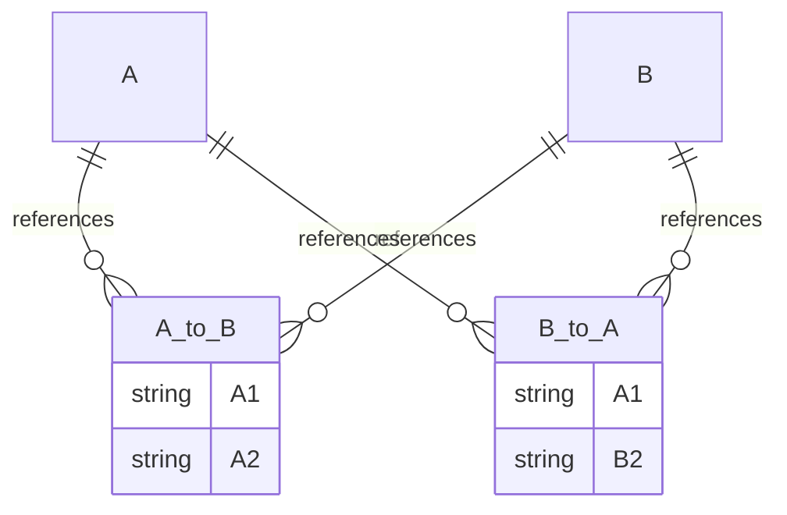

evitaDB interně udržuje schéma pro každou [entitní kolekci](data-model.md#kolekce) / [katalog](data-model.md#katalog), ačkoliv podporuje [uvolněný přístup](#evoluce), kdy je schéma automaticky vytvářeno na základě dat vložených do databáze.

Schéma není důležité pouze pro udržení konzistence dat, ale je také klíčovým zdrojem pro generování schémat webových API. Umožňuje nám vytvářet schémata [Open API](connectors/rest.md) a [GraphQL](connectors/graphql.md). Pokud věnujete pozornost definici schématu, budete odměněni pěknými, srozumitelnými a samodokumentujícími se API. Každý jednotlivý údaj ve schématu ovlivňuje vzhled webových API. Například kardinalita relace (nula nebo jedna, právě jedna, nula nebo více, jedna nebo více) ovlivňuje, zda API označí relaci jako volitelnou, vrací jednu hodnotu/objekt, nebo pole těchto hodnot. Filtrovatelné atributy jsou propagovány do dokumentovaných bloků dotazovacího jazyka, zatímco nefiltrovatelné atributy nikoliv. Datové typy atributů ovlivňují, jaké dotazovací podmínky lze v souvislosti s tímto atributem použít, a tak dále. Dokumentace, kterou napíšete ve schématu evitaDB, je propagována do všech vašich API. Více o této projekci si můžete přečíst ve specializovaných kapitolách dokumentace o Web API.

## Mutace a verzování

Schéma lze měnit pouze pomocí tzv. *mutací*. Ačkoliv je tento přístup poněkud zdlouhavý, má pro systém několik velkých výhod:

- **mutace představuje izolovanou změnu schématu** – to znamená, že klient provádějící změnu schématu posílá na server pouze rozdíly, což šetří síťový provoz a také umožňuje serverové logice, že nemusí interně řešit rozdíly
- **mutace je přímo použita jako položka [WAL](../deep-dive/transactions.md#2-zápis-do-write-ahead-logu)** – mutace představuje atomickou operaci v transakčním logu, který je distribuován napříč clusterem, a také místo, kde dochází k řešení konfliktů (pokud server obdrží podobné mutace ze dvou paralelních sezení, snadno rozhodne, zda vyhodit výjimku souběžné změny – pokud jsou mutace stejné, není konflikt; pokud jsou různé, první mutace je přijata a druhá odmítnuta s výjimkou)

Schéma je verzované – pokaždé, když je provedena mutace schématu, jeho číslo verze se zvýší o jedna. Pokud máte na straně klienta dvě instance schématu, snadno zjistíte, zda jsou stejné porovnáním jejich čísla verze, a pokud ne, která z nich je novější.

<Note type="question">

<NoteTitle toggles="true">

##### Opravdu musím všechny mutace psát ručně?
</NoteTitle>

Doufejme, že ne. Uvědomujeme si, že psaní mutací je zdlouhavé, a proto poskytujeme lepší podporu v našich driverech. Klientské drivery obalují neměnná schémata do builder objektů, takže můžete jednoduše volat metody pro úpravu a builder na konci vygeneruje seznam mutací. Viz [příklad](api/schema-api.md#deklarativní-definice-schématu).

Pokud však chcete používat evitaDB na platformě, která ještě není podporována konkrétním klientským driverem, musíte pracovat přímo s našimi webovými API, které přijímají pouze mutace, a nezbývá vám nic jiného než psát mutace přímo nebo si napsat vlastní klientský driver. Ale můžete jej dát jako open source a pomoci komunitě. Dejte nám o tom vědět!

</Note>

Všechny mutace schématu implementují rozhraní <LS to="j"><SourceClass>evita_api/src/main/java/io/evitadb/api/requestResponse/schema/mutation/SchemaMutation.java</SourceClass></LS><LS to="c"><SourceClass>EvitaDB.Client/Models/Schemas/Mutations/ISchemaMutation.cs</SourceClass></LS>

## Struktura

Existují následující typy schémat:

- [schéma katalogu](#katalog)
- [schéma entity](#entita)
- [schéma atributu](#atributy)
- [schéma složeného atributu pro řazení](#složeniny-řaditelných-atributů)
- [schéma asociovaných dat](#asociovaná-data)
- [schéma reference](#reference)

### Katalog

Schéma katalogu obsahuje seznam [schémat entit](#entita), `name` a `description` katalogu. Uchovává také
slovník [globálních schémat atributů](#globální-schéma-atributu), která mohou být sdílena mezi více
[schématy entit](#entita).

<Note type="info">

<NoteTitle toggles="true">

##### Požadavky na názvy a varianty názvů
</NoteTitle>

Každý pojmenovaný datový objekt – [katalog](#katalog), [entita](#entita), [atribut](#atributy),
[asociovaná data](#asociovaná-data) a [reference](#reference) musí být jednoznačně identifikovatelný svým názvem v rámci
nadřazeného rozsahu.

Logika validace názvu a rezervovaná slova jsou obsaženy ve třídě <LS to="j,e,r,g"><SourceClass>evita_common/src/main/java/io/evitadb/utils/ClassifierUtils.java</SourceClass></LS><LS to="c"><SourceClass>EvitaDB.Client/Utils/ClassifierUtils.cs</SourceClass></LS>.

V každém schématu pojmenovaného objektu existuje také speciální vlastnost `nameVariants`. Obsahuje varianty
názvu objektu v různých "vývojářských" notacích jako *camelCase*, *PascalCase*, *snake_case* a podobně. Kompletní výčet najdete v
<LS to="j,e,r,g"><SourceClass>evita_external_api/evita_external_api_core/src/main/java/io/evitadb/externalApi/api/catalog/schemaApi/model/NameVariantsDescriptor.java</SourceClass></LS><LS to="c"><SourceClass>EvitaDB.Client/Utils/NamingConvention.cs</SourceClass></LS>.

</Note>

<Note type="info">

<NoteTitle toggles="false">

##### Seznam mutací souvisejících s katalogem
</NoteTitle>

Mutace na nejvyšší úrovni:

- **<LS to="j,e,r,g"><SourceClass>evita_api/src/main/java/io/evitadb/api/requestResponse/schema/mutation/catalog/CreateCatalogSchemaMutation.java</SourceClass></LS><LS to="c"><SourceClass>EvitaDB.Client/Models/Schemas/Mutations/Catalogs/CreateCatalogSchemaMutation.cs</SourceClass></LS>**
- **<LS to="j,e,r,g"><SourceClass>evita_api/src/main/java/io/evitadb/api/requestResponse/schema/mutation/catalog/RemoveCatalogSchemaMutation.java</SourceClass></LS><LS to="c"><SourceClass>EvitaDB.Client/Models/Schemas/Mutations/Catalogs/RemoveCatalogSchemaMutation.cs</SourceClass></LS>**
- **<LS to="j,e,r,g"><SourceClass>evita_api/src/main/java/io/evitadb/api/requestResponse/schema/mutation/catalog/ModifyCatalogSchemaMutation.java</SourceClass></LS><LS to="c"><SourceClass>EvitaDB.Client/Models/Schemas/Mutations/Catalogs/ModifyCatalogSchemaMutation.cs</SourceClass></LS>**

V rámci `ModifyCatalogSchemaMutation` můžete použít mutace:

- **<LS to="j,e,r,g"><SourceClass>evita_api/src/main/java/io/evitadb/api/requestResponse/schema/mutation/catalog/ModifyCatalogSchemaNameMutation.java</SourceClass></LS><LS to="c"><SourceClass>EvitaDB.Client/Models/Schemas/Mutations/Catalogs/ModifyCatalogSchemaNameMutation.cs</SourceClass></LS>**
- **<LS to="j,e,r,g"><SourceClass>evita_api/src/main/java/io/evitadb/api/requestResponse/schema/mutation/catalog/ModifyCatalogSchemaDescriptionMutation.java</SourceClass></LS><LS to="c"><SourceClass>EvitaDB.Client/Models/Schemas/Mutations/Catalogs/ModifyCatalogSchemaDescriptionMutation.cs</SourceClass></LS>**

A také [mutace entit na nejvyšší úrovni](#entita).

<LS to="j,c">
Schéma katalogu je popsáno v:
<LS to="j"><SourceClass>evita_api/src/main/java/io/evitadb/api/requestResponse/schema/CatalogSchemaContract.java</SourceClass></LS><LS to="c"><SourceClass>EvitaDB.Client/Models/Schemas/ICatalogSchema.cs</SourceClass></LS>
</LS>

</Note>

#### Globální schéma atributu

Globální schéma atributu má stejnou strukturu jako [schéma atributu](#atributy) s jednou další
charakteristikou. Globální atribut může být označen jako `uniqueGlobally`, což znamená, že hodnoty takového atributu musí být
unikátní napříč všemi entitami a typy entit v celém katalogu.

<Note type="question">

<NoteTitle toggles="true">

##### K čemu je globální jedinečnost dobrá?
</NoteTitle>

Je užitečná například pro URL entity, které mají být přirozeně jedinečné mezi všemi entitami v katalogu. Globálně
jedinečný atribut nám umožňuje požádat evitaDB o entitu s konkrétní hodnotou, aniž bychom předem znali její typ.
To řeší případ, kdy do vaší aplikace přijde nový požadavek a potřebujete zjistit, zda existuje entita,
která mu odpovídá (bez ohledu na to, zda jde o produkt, kategorii, značku, skupinu nebo jakékoliv jiné typy ve vašem projektu).
</Note>

Globální atribut lze také použít jako "definici slovníku" pro atribut, který je využíván ve více kolekcích entit a chceme zajistit,
že bude ve všech pojmenován a popsán stejně. Kolekce entit nemůže definovat atribut se stejným názvem jako globální atribut.
Může pouze "použít" globální atribut s tímto názvem a tím sdílet jeho kompletní definici.

<Note type="info">

<NoteTitle toggles="false">

##### Seznam mutací souvisejících s globálním atributem
</NoteTitle>

- **<LS to="j,e,r,g"><SourceClass>evita_api/src/main/java/io/evitadb/api/requestResponse/schema/mutation/attribute/CreateGlobalAttributeSchemaMutation.java</SourceClass></LS><LS to="c"><SourceClass>EvitaDB.Client/Models/Schemas/Mutations/Attributes/CreateGlobalAttributeSchemaMutation.cs</SourceClass></LS>**
- **<LS to="j,e,r,g"><SourceClass>evita_api/src/main/java/io/evitadb/api/requestResponse/schema/mutation/attribute/UseGlobalAttributeSchemaMutation.java</SourceClass></LS><LS to="c"><SourceClass>EvitaDB.Client/Models/Schemas/Mutations/Attributes/UseGlobalAttributeSchemaMutation.cs</SourceClass></LS>**
- **<LS to="j,e,r,g"><SourceClass>evita_api/src/main/java/io/evitadb/api/requestResponse/schema/mutation/attribute/SetAttributeSchemaGloballyUniqueMutation.java</SourceClass></LS><LS to="c"><SourceClass>EvitaDB.Client/Models/Schemas/Mutations/Attributes/SetAttributeSchemaGloballyUniqueMutation.cs</SourceClass></LS>**

A samozřejmě všechny [standardní mutace atributů](#atributy).

<LS to="j,c">
Globální schéma atributu je popsáno v:
<LS to="j"><SourceClass>evita_api/src/main/java/io/evitadb/api/requestResponse/schema/GlobalAttributeSchemaContract.java</SourceClass></LS>
<LS to="c"><SourceClass>EvitaDB.Client/Models/Schemas/IGlobalAttributeSchema.cs</SourceClass></LS>
</LS>

</Note>

### Entita

Schéma entity obsahuje informace o `name`, `description` a:

- [povolení generování primárního klíče](#generování-primárního-klíče)
- [limity evoluce](#evoluce)
- [povolené jazyky a měny](#jazyky-a-měny)
- [povolení hierarchické struktury](#umístění-v-hierarchii)
- [povolení cenových informací](#ceny)
- [atributy](#atributy)
- [složené atributy pro řazení](#složeniny-řaditelných-atributů)
- [asociovaná data](#asociovaná-data)
- [reference](#reference)

Schéma entity může být označeno jako *zastaralé*, což se projeví i v generované dokumentaci webového API.

<Note type="info">

<NoteTitle toggles="false">

##### Seznam mutací souvisejících s typem entity
</NoteTitle>

<LS to="j,e,r,g">

Mutace entit na nejvyšší úrovni:

- **<LS to="j,e,r,g"><SourceClass>evita_api/src/main/java/io/evitadb/api/requestResponse/schema/mutation/catalog/CreateEntitySchemaMutation.java</SourceClass></LS><LS to="c"><SourceClass>EvitaDB.Client/Models/Schemas/Mutations/Catalogs/CreateEntitySchemaMutation.cs</SourceClass></LS>**
- **<LS to="j,e,r,g"><SourceClass>evita_api/src/main/java/io/evitadb/api/requestResponse/schema/mutation/catalog/RemoveEntitySchemaMutation.java</SourceClass></LS><LS to="c"><SourceClass>EvitaDB.Client/Models/Schemas/Mutations/Catalogs/RemoveEntitySchemaMutation.cs</SourceClass></LS>**
- **<LS to="j,e,r,g"><SourceClass>evita_api/src/main/java/io/evitadb/api/requestResponse/schema/mutation/catalog/ModifyEntitySchemaNameMutation.java</SourceClass></LS><LS to="c"><SourceClass>EvitaDB.Client/Models/Schemas/Mutations/Catalogs/ModifyEntitySchemaNameMutation.cs</SourceClass></LS>**
- **<LS to="j,e,r,g"><SourceClass>evita_api/src/main/java/io/evitadb/api/requestResponse/schema/mutation/catalog/ModifyEntitySchemaMutation.java</SourceClass></LS><LS to="c"><SourceClass>EvitaDB.Client/Models/Schemas/Mutations/Catalogs/ModifyEntitySchemaMutation.cs</SourceClass></LS>**

V rámci `ModifyEntitySchemaMutation` můžete použít mutace:

- **<LS to="j,e,r,g"><SourceClass>evita_api/src/main/java/io/evitadb/api/requestResponse/schema/mutation/entity/ModifyEntitySchemaDescriptionMutation.java</SourceClass></LS><LS to="c"><SourceClass>EvitaDB.Client/Models/Schemas/Mutations/Entities/ModifyEntitySchemaDescriptionMutation.cs</SourceClass></LS>**
- **<LS to="j,e,r,g"><SourceClass>evita_api/src/main/java/io/evitadb/api/requestResponse/schema/mutation/entity/ModifyEntitySchemaDeprecationNoticeMutation.java</SourceClass></LS><LS to="c"><SourceClass>EvitaDB.Client/Models/Schemas/Mutations/Entities/ModifyEntitySchemaDeprecationNoticeMutation.cs</SourceClass></LS>**

</LS>

<LS to="j,c">
Schéma entity je popsáno v:
<LS to="j"><SourceClass>evita_api/src/main/java/io/evitadb/api/requestResponse/schema/EntitySchemaContract.java</SourceClass></LS>
<LS to="c"><SourceClass>EvitaDB.Client/Models/Schemas/IEntitySchema.cs</SourceClass></LS>
</LS>

</Note>

#### Generování primárního klíče

Pokud je povoleno generování primárního klíče, evitaDB přiřadí nově vložené entitě unikátní
<LS to="j,e,r,g">[int](https://docs.oracle.com/javase/tutorial/java/nutsandbolts/datatypes.html)</LS>
<LS to="c">[int](https://learn.microsoft.com/en-us/dotnet/api/system.int32)</LS> číslo.
Primární klíč vždy začíná hodnotou `1` a zvyšuje se o `1`. evitaDB zaručuje jeho jedinečnost v rámci stejného
typu entity. Takto generované primární klíče jsou optimální pro binární operace ve využívaných datových strukturách.

<Note type="info">

<NoteTitle toggles="false">

##### Seznam mutací souvisejících s primárním klíčem
</NoteTitle>

V rámci `ModifyEntitySchemaMutation` můžete použít mutaci:

- **<LS to="j,e,r,g"><SourceClass>evita_api/src/main/java/io/evitadb/api/requestResponse/schema/mutation/entity/SetEntitySchemaWithGeneratedPrimaryKeyMutation.java</SourceClass></LS><LS to="c"><SourceClass>EvitaDB.Client/Models/Schemas/Mutations/Entities/SetEntitySchemaWithGeneratedPrimaryKeyMutation.cs</SourceClass></LS>**

</Note>

#### Evoluce

Doporučujeme přístup "schema-first", ale existují případy, kdy se nechcete zabývat schématem a chcete pouze
vkládat a dotazovat se na data (například při rychlém prototypování). Když je vytvořen nový [katalog](data-model.md#katalog), je nastaven
do režimu "automatické evoluce", kdy se schéma přizpůsobuje datům při prvním vložení. Pokud chcete mít nad schématem
přísnou kontrolu, musíte evoluci omezit změnou výchozího schématu. V přísném režimu evitaDB vyhodí výjimku,
pokud vstupní data poruší schéma.

Stále musíte ručně vytvořit [kolekce entit](data-model.md#kolekce), ale poté můžete ihned vkládat
svá data a schéma se podle toho vytvoří. Existující schémata budou stále validována při každém vkládání/aktualizaci entity –
nebude možné uložit stejný atribut jednou jako číslo a podruhé jako řetězec. První použití nastaví schéma, které musí být od té chvíle respektováno.

<Note type="info">
Pokud má první entita svůj primární klíč, evitaDB očekává, že všechny entity budou mít při vkládání nastavený primární klíč.
Pokud má první entita primární klíč nastaven na `NULL`, evitaDB vygeneruje primární klíče za vás a odmítne
externí primární klíče. Nová schémata atributů jsou implicitně vytvořena jako `nullable`, `filterable` a datové typy, které nejsou polem,
jako `sortable`. To znamená, že klient může ihned filtrovat/řadit téměř podle čehokoliv, ale samotná databáze bude spotřebovávat hodně prostředků.
Reference budou vytvořeny jako `indexed`, ale ne `faceted`.
</Note>

Existuje několik částečně volných režimů mezi přísným a plně automatickým režimem evoluce – podrobnosti viz
<LS to="j,e,r,g"><SourceClass>evita_api/src/main/java/io/evitadb/api/requestResponse/schema/EvolutionMode.java</SourceClass></LS>
<LS to="c"><SourceClass>EvitaDB.Client/Models/Schemas/EvolutionMode.cs</SourceClass></LS>.
Například – můžete přísně kontrolovat celé schéma, kromě nových definic jazyků nebo měn, které je povoleno přidávat automaticky při prvním použití.

<Note type="info">

<NoteTitle toggles="false">

##### Seznam mutací souvisejících s režimem evoluce
</NoteTitle>

V rámci `ModifyEntitySchemaMutation` můžete použít mutace:

- **<LS to="j,e,r,g"><SourceClass>evita_api/src/main/java/io/evitadb/api/requestResponse/schema/mutation/entity/AllowEvolutionModeInEntitySchemaMutation.java</SourceClass></LS><LS to="c"><SourceClass>EvitaDB.Client/Models/Schemas/Mutations/Entities/AllowEvolutionModeInEntitySchemaMutation.cs</SourceClass></LS>**
- **<LS to="j,e,r,g"><SourceClass>evita_api/src/main/java/io/evitadb/api/requestResponse/schema/mutation/entity/DisallowEvolutionModeInEntitySchemaMutation.java</SourceClass></LS><LS to="c"><SourceClass>EvitaDB.Client/Models/Schemas/Mutations/Entities/DisallowEvolutionModeInEntitySchemaMutation.cs</SourceClass></LS>**

</Note>

#### Jazyky a měny

Schéma určuje seznam povolených měn a jazyků. Předpokládáme, že seznam povolených měn/jazyků bude relativně malý
(jednotky, maximálně nižší desítky) a pokud je systém zná předem, může pro ně vygenerovat výčtové typy
pro webová API. To pomáhá vývojářům psát dotazy s automatickým doplňováním. Má to i další pozitivní efekt.
E-commerce systémy obvykle seznam používaných měn nebo jazyků příliš často nerozšiřují (protože je s tím spojeno mnoho
manuálních operací) a mít povolenou množinu hlídanou systémem eliminuje možnost vložení neplatných cen nebo lokalizací omylem.

<Note type="question">

<NoteTitle toggles="true">

##### Proč nejsou ceníky uvedeny ve schématu, když měny ano?
</NoteTitle>

Ceníky jsou blíže "datům" než jazyky nebo měny. Očekává se, že množina ceníků se bude měnit velmi často
a jejich počet může dosáhnout vysoké kardinality (tisíce, desetitisíce). Nebylo by praktické pro ně generovat
výčtové hodnoty a měnit schémata Web API pokaždé, když je ceník přidán nebo odebrán.
</Note>

<Note type="info">

<NoteTitle toggles="false">

##### Seznam mutací souvisejících s jazyky a měnami
</NoteTitle>

V rámci `ModifyEntitySchemaMutation` můžete použít mutace:

- **<LS to="j,e,r,g"><SourceClass>evita_api/src/main/java/io/evitadb/api/requestResponse/schema/mutation/entity/AllowCurrencyInEntitySchemaMutation.java</SourceClass></LS><LS to="c"><SourceClass>EvitaDB.Client/Models/Schemas/Mutations/Entities/AllowCurrencyInEntitySchemaMutation.cs</SourceClass></LS>**
- **<LS to="j,e,r,g"><SourceClass>evita_api/src/main/java/io/evitadb/api/requestResponse/schema/mutation/entity/DisallowCurrencyInEntitySchemaMutation.java</SourceClass></LS><LS to="c"><SourceClass>EvitaDB.Client/Models/Schemas/Mutations/Entities/DisallowCurrencyInEntitySchemaMutation.cs</SourceClass></LS>**
- **<LS to="j,e,r,g"><SourceClass>evita_api/src/main/java/io/evitadb/api/requestResponse/schema/mutation/entity/AllowLocaleInEntitySchemaMutation.java</SourceClass></LS><LS to="c"><SourceClass>EvitaDB.Client/Models/Schemas/Mutations/Entities/AllowLocaleInEntitySchemaMutation.cs</SourceClass></LS>**
- **<LS to="j,e,r,g"><SourceClass>evita_api/src/main/java/io/evitadb/api/requestResponse/schema/mutation/entity/DisallowLocaleInEntitySchemaMutation.java</SourceClass></LS><LS to="c"><SourceClass>EvitaDB.Client/Models/Schemas/Mutations/Entities/DisallowLocaleInEntitySchemaMutation.cs</SourceClass></LS>**

</Note>

#### Umístění v hierarchii

Pokud je povoleno umístění v hierarchii, entity tohoto typu mohou tvořit stromovou strukturu. Každá entita může mít maximálně
jednoho rodiče a nula nebo více potomků. Ani hloubka stromu, ani počet sourozenců na každé úrovni nejsou omezeny.

Povolení umístění v hierarchii znamená vytvoření nového
<SourceClass>evita_engine/src/main/java/io/evitadb/index/hierarchy/HierarchyIndex.java</SourceClass> pro daný
typ entity. Pokud jiná entita odkazuje na hierarchickou entitu a reference je označena jako *indexed*, je pro každou hierarchickou entitu vytvořen speciální
<SourceClass>evita_engine/src/main/java/io/evitadb/index/ReducedEntityIndex.java</SourceClass>. Tento index bude
uchovávat zredukované indexy atributů a cen odkazující entity, což umožňuje rychlé vyhodnocení
[filtračních podmínek `withinHierarchy`](../query/filtering/hierarchy.md).

##### Sirotčí uzly hierarchie

Typickým problémem při vytváření stromové struktury je pořadí, ve kterém jsou uzly do stromu připojovány. Aby byl strom konzistentní,
mělo by se začít od kořenových uzlů a postupně sestupovat po ose jejich potomků. To však není vždy snadné,
když potřebujeme zkopírovat existující strom do externího systému (pro skriptování je mnohem jednodušší a efektivnější indexovat po dávkách v přirozeném pořadí záznamů).
Podobná situace nastává, když je třeba odstranit mezilehlý uzel stromu, ale jeho potomky ne. Můžeme vývojáře nutit,
aby nejprve převedli potomky k jinému rodiči, než odstraní jejich rodiče, ale často nemají přímou kontrolu nad pořadím operací a nemohou to snadno provést.

Proto evitaDB rozpoznává tzv. **sirotčí uzly hierarchie**. Sirotčí uzel je uzel, který se deklaruje jako potomek rodičovského uzlu s určitým primárním klíčem,
který evitaDB ještě nezná (nebo je sirotčí uzel sám). Sirotčí uzly se neúčastní vyhodnocování
[dotazů na hierarchické struktury](../query/filtering/hierarchy.md),
ale jsou přítomny v indexu. Pokud je uzel s referencovaným primárním klíčem připojen do hlavního stromu hierarchie,
jsou sirotčí uzly (podstromy) také připojeny. Tímto způsobem se strom hierarchie nakonec stane konzistentním.

<Note type="info">

<NoteTitle toggles="false">

##### Seznam mutací souvisejících s umístěním v hierarchii
</NoteTitle>

V rámci `ModifyEntitySchemaMutation` můžete použít mutaci:

- **<LS to="j,e,r,g"><SourceClass>evita_api/src/main/java/io/evitadb/api/requestResponse/schema/mutation/entity/SetEntitySchemaWithHierarchyMutation.java</SourceClass></LS><LS to="c"><SourceClass>EvitaDB.Client/Models/Schemas/Mutations/Entities/SetEntitySchemaWithHierarchyMutation.cs</SourceClass></LS>**

</Note>

### Ceny

Pokud jsou ceny povoleny, entity tohoto typu mohou mít s sebou svázanou sadu cen a lze je
[filtrovat](../query/filtering/price.md) a [řadit](../query/ordering/price.md) podle cenových omezení. Jedna entita
může mít nula nebo více cen (systém je navržen pro situace, kdy má entita desítky nebo stovky cen).
Pro každou kombinaci `priceList` a `currency` existuje speciální
<SourceClass>evita_engine/src/main/java/io/evitadb/index/price/PriceListAndCurrencyPriceSuperIndex.java</SourceClass>.

<Note type="info">

<NoteTitle toggles="false">

##### Seznam mutací souvisejících s umístěním v hierarchii
</NoteTitle>

V rámci `ModifyEntitySchemaMutation` můžete použít mutaci:

- **<LS to="j,e,r,g"><SourceClass>evita_api/src/main/java/io/evitadb/api/requestResponse/schema/mutation/entity/SetEntitySchemaWithPriceMutation.java</SourceClass></LS><LS to="c"><SourceClass>EvitaDB.Client/Models/Schemas/Mutations/Entities/SetEntitySchemaWithPriceMutation.cs</SourceClass></LS>**

</Note>

### Atributy

Typ entity může mít nula nebo více atributů. Systém je navržen pro situace, kdy má entita desítky atributů. Měli byste věnovat pozornost počtu atributů `filterable` / `sortable` / `unique`. Pro každý filtrující atribut existuje samostatná instance
<SourceClass>evita_engine/src/main/java/io/evitadb/index/attribute/FilterIndex.java</SourceClass>, pro každý řaditelný atribut <SourceClass>evita_engine/src/main/java/io/evitadb/index/attribute/SortIndex.java</SourceClass> a pro každý unikátní atribut <SourceClass>evita_engine/src/main/java/io/evitadb/index/attribute/UniqueIndex.java</SourceClass>
nebo <SourceClass>evita_engine/src/main/java/io/evitadb/index/attribute/GlobalUniqueIndex.java</SourceClass>. Atributy, které nejsou `filterable` / `sortable` / `unique`, nespotřebovávají operační paměť.

Atribut, který nese filtrující index, může navíc využít [akcelerátor filtru](#akcelerátory-filtru), který poskytuje rychlejší odpovědi na určité podmínky za cenu větší paměti a vyšší zátěže při zápisu.

<LS to="j,e,r,g">

Schéma atributu může být označeno jako `localized`, což znamená, že dává smysl pouze v konkrétním
<LS to="j,e,r,g">[locale](https://docs.oracle.com/en/java/javase/17/docs/api/java.base/java/util/Locale.html)</LS>
<LS to="c">[locale](https://learn.microsoft.com/en-us/dotnet/api/system.globalization.cultureinfo)</LS>.
</LS>

Schéma atributu může být označeno jako *deprecated*, což se projeví v generované dokumentaci webového API.

<Note type="info">

<NoteTitle toggles="false">

##### Seznam mutací souvisejících s atributem
</NoteTitle>

V rámci `ModifyEntitySchemaMutation` můžete použít mutace:

- **<LS to="j,e,r,g"><SourceClass>evita_api/src/main/java/io/evitadb/api/requestResponse/schema/mutation/attribute/CreateAttributeSchemaMutation.java</SourceClass></LS><LS to="c"><SourceClass>EvitaDB.Client/Models/Schemas/Mutations/Attributes/CreateAttributeSchemaMutation.cs</SourceClass></LS>**
- **<LS to="j,e,r,g"><SourceClass>evita_api/src/main/java/io/evitadb/api/requestResponse/schema/mutation/attribute/RemoveAttributeSchemaMutation.java</SourceClass></LS><LS to="c"><SourceClass>EvitaDB.Client/Models/Schemas/Mutations/Attributes/RemoveAttributeSchemaMutation.cs</SourceClass></LS>**
- **<LS to="j,e,r,g"><SourceClass>evita_api/src/main/java/io/evitadb/api/requestResponse/schema/mutation/attribute/ModifyAttributeSchemaNameMutation.java</SourceClass></LS><LS to="c"><SourceClass>EvitaDB.Client/Models/Schemas/Mutations/Attributes/ModifyAttributeSchemaNameMutation.cs</SourceClass></LS>**
- **<LS to="j,e,r,g"><SourceClass>evita_api/src/main/java/io/evitadb/api/requestResponse/schema/mutation/attribute/ModifyAttributeSchemaDescriptionMutation.java</SourceClass></LS><LS to="c"><SourceClass>EvitaDB.Client/Models/Schemas/Mutations/Attributes/ModifyAttributeSchemaDescriptionMutation.cs</SourceClass></LS>**
- **<LS to="j,e,r,g"><SourceClass>evita_api/src/main/java/io/evitadb/api/requestResponse/schema/mutation/attribute/ModifyAttributeSchemaDefaultValueMutation.java</SourceClass></LS><LS to="c"><SourceClass>EvitaDB.Client/Models/Schemas/Mutations/Attributes/ModifyAttributeSchemaDefaultValueMutation.cs</SourceClass></LS>**
- **<LS to="j,e,r,g"><SourceClass>evita_api/src/main/java/io/evitadb/api/requestResponse/schema/mutation/attribute/ModifyAttributeSchemaDeprecationNoticeMutation.java</SourceClass></LS><LS to="c"><SourceClass>EvitaDB.Client/Models/Schemas/Mutations/Attributes/ModifyAttributeSchemaDeprecationNoticeMutation.cs</SourceClass></LS>**
- **<LS to="j,e,r,g"><SourceClass>evita_api/src/main/java/io/evitadb/api/requestResponse/schema/mutation/attribute/ModifyAttributeSchemaTypeMutation.java</SourceClass></LS><LS to="c"><SourceClass>EvitaDB.Client/Models/Schemas/Mutations/Attributes/ModifyAttributeSchemaTypeMutation.cs</SourceClass></LS>**
- **<LS to="j,e,r,g"><SourceClass>evita_api/src/main/java/io/evitadb/api/requestResponse/schema/mutation/attribute/SetAttributeSchemaAcceleratedMutation.java</SourceClass></LS>**
- **<LS to="j,e,r,g"><SourceClass>evita_api/src/main/java/io/evitadb/api/requestResponse/schema/mutation/attribute/SetAttributeSchemaFilterableMutation.java</SourceClass></LS><LS to="c"><SourceClass>EvitaDB.Client/Models/Schemas/Mutations/Attributes/SetAttributeSchemaFilterableMutation.cs</SourceClass></LS>**
- **<LS to="j,e,r,g"><SourceClass>evita_api/src/main/java/io/evitadb/api/requestResponse/schema/mutation/attribute/SetAttributeSchemaLocalizedMutation.java</SourceClass></LS><LS to="c"><SourceClass>EvitaDB.Client/Models/Schemas/Mutations/Attributes/SetAttributeSchemaLocalizedMutation.cs</SourceClass></LS>**
- **<LS to="j,e,r,g"><SourceClass>evita_api/src/main/java/io/evitadb/api/requestResponse/schema/mutation/attribute/SetAttributeSchemaNullableMutation.java</SourceClass></LS><LS to="c"><SourceClass>EvitaDB.Client/Models/Schemas/Mutations/Attributes/SetAttributeSchemaNullableMutation.cs</SourceClass></LS>**
- **<LS to="j,e,r,g"><SourceClass>evita_api/src/main/java/io/evitadb/api/requestResponse/schema/mutation/attribute/SetAttributeSchemaRepresentativeMutation.java</SourceClass></LS><LS to="c"><SourceClass>EvitaDB.Client/Models/Schemas/Mutations/Attributes/SetAttributeSchemaRepresentativeMutation.cs</SourceClass></LS>**
- **<LS to="j,e,r,g"><SourceClass>evita_api/src/main/java/io/evitadb/api/requestResponse/schema/mutation/attribute/SetAttributeSchemaSortableMutation.java</SourceClass></LS><LS to="c"><SourceClass>EvitaDB.Client/Models/Schemas/Mutations/Attributes/SetAttributeSchemaSortableMutation.cs</SourceClass></LS>**
- **<LS to="j,e,r,g"><SourceClass>evita_api/src/main/java/io/evitadb/api/requestResponse/schema/mutation/attribute/SetAttributeSchemaUniqueMutation.java</SourceClass></LS><LS to="c"><SourceClass>EvitaDB.Client/Models/Schemas/Mutations/Attributes/SetAttributeSchemaUniqueMutation.cs</SourceClass></LS>**

<LS to="j,c">
Schéma atributu je popsáno v:
<LS to="j"><SourceClass>evita_api/src/main/java/io/evitadb/api/requestResponse/schema/AttributeSchemaContract.java</SourceClass></LS>
<LS to="c"><SourceClass>EvitaDB.Client/Models/Schemas/IAttributeSchema.cs</SourceClass></LS>
</LS>

</Note>

#### Výchozí hodnota

Atribut může mít definovanou výchozí hodnotu. Tato hodnota se použije při vytvoření nové entity, pokud není konkrétnímu atributu přiřazena žádná hodnota. V žádné jiné situaci nemá výchozí hodnota význam.

#### Povolený počet desetinných míst

Nastavení povoleného počtu desetinných míst je optimalizace, která umožňuje převést bohaté číselné typy (například
<LS to="j,e,r,g">[BigDecimal](https://docs.oracle.com/en/java/javase/17/docs/api/java.base/java/math/BigDecimal.html)</LS><LS to="c">[decimal](https://learn.microsoft.com/en-us/dotnet/api/system.decimal)</LS> pro přesné
zobrazení čísel) na primitivní typ <LS to="j,e,r,g">[int](https://docs.oracle.com/javase/tutorial/java/nutsandbolts/datatypes.html)</LS><LS to="c">[int](https://learn.microsoft.com/en-us/dotnet/api/system.int32)</LS>, který je mnohem úspornější a lze jej použít pro rychlé binární vyhledávání v poli/bitset reprezentaci. Původní bohatý formát zůstává v kontejneru atributu, ale interně databáze používá primitivní formu, pokud je atribut součástí podmínek filtru nebo řazení.

Pokud nelze číslo převést do úsporné formy (například má více číslic v desetinné části, než se očekává),
je vyhozena výjimka a aktualizace entity je odmítnuta.

#### Akcelerátory filtru

Označení atributu jako `filterable` nebo `unique` vytvoří index, který najde entity podle přesné hodnoty nebo podle rozsahu hodnot, aniž by prohledával ostatní. Ne každý dotaz však může takový index využít. Dotaz typu *substring* – „dej mi produkty, jejichž kód obsahuje někde `epix`“ – nemůže, protože index seřazený podle celých hodnot nic neříká o tom, co je uprostřed těchto hodnot. evitaDB proto odpovídá tak, že postupně zkoumá každou jedinečnou hodnotu tohoto atributu. U kolekce s několika tisíci různými hodnotami je to dostatečně rychlé; u kolekce se stovkami tisíc je to nejpomalejší část dotazu.

**Akcelerátor filtru** je dodatečný index, který evitaDB udržuje vedle běžného indexu, aby mohl takový dotaz zodpovědět přímo. Akcelerátory nejsou nikdy zapnuty automaticky: každý z nich zabírá paměť po celou dobu, kdy jsou data načtena, a každý zápis nebo aktualizace tohoto atributu je o něco dražší. Deklarujete pouze ty, které vaše dotazy skutečně potřebují, na atributech, které je skutečně potřebují, a za ostatní nic neplatíte.

Dostupné akcelerátory jsou konstanty v
<SourceClass>evita_api/src/main/java/io/evitadb/api/requestResponse/schema/AttributeFilterAccelerator.java</SourceClass>.
Každá konstanta pojmenovává *schopnost, kterou index získává*, nikdy ne datovou strukturu, která ji poskytuje – struktura je interní detail a může se mezi verzemi měnit.

##### Deklarace akcelerátoru

Akcelerátor se deklaruje na atributu, vedle `filterable` / `unique` / `sortable`, ale nezávisle na nich.

<LS to="j">

```java
entitySchemaBuilder
	.withAttribute(
		"code", String.class,
		whichIs -> whichIs
			.unique()
			.acceleratedFor(AttributeFilterAccelerator.SUBSTRING_SEARCH)
	);
```

</LS>

Na builderu schématu atributu jsou k dispozici čtyři metody:

<dl>
    <dt>`acceleratedFor(accelerators...)`</dt>
    <dd>deklaruje uvedené akcelerátory ve výchozím rozsahu – tedy pro entity, které jsou aktivní a ne archivované</dd>
    <dt>`acceleratedForInScope(scope, accelerators...)`</dt>
    <dd>deklaruje je pro konkrétní [scope](#scopy), takže můžete akcelerovat pouze živá data, aniž byste platili za stejný index nad archivovanými daty</dd>
    <dt>`nonAcceleratedFor(accelerators...)`</dt>
    <dd>odebere uvedené akcelerátory ze všech rozsahů</dd>
    <dt>`nonAcceleratedForInScope(scope, accelerators...)`</dt>
    <dd>odebere je pouze z jednoho konkrétního rozsahu</dd>
</dl>

Akcelerátor zrychluje **existující** index, takže musí existovat něco, co lze akcelerovat: rozsah, ve kterém jej deklarujete, musí být také `filterable` nebo `unique`, jinak je deklarace odmítnuta. Stačí jeden z těchto příznaků – atribut `unique` je indexován ve stejné struktuře jako `filterable` – takže není třeba deklarovat oba jen kvůli akcelerátoru.

##### Vyhledávání podřetězce

`SUBSTRING_SEARCH` je v současnosti jediný akcelerátor. Zrychluje
[`attributeContains`](../query/filtering/string.md#attribut-obsahuje) a
[`attributeEndsWith`](../query/filtering/string.md#attribut-končí-na). Nikdy nemění *které* entity tyto podmínky vracejí – výsledky jsou identické s akcelerátorem i bez něj – pouze rychlost jejich nalezení.

**Jak to funguje.** Každý další kompromis vychází přímo z tohoto principu, proto si zaslouží odstavec. Když je akcelerátor zapnutý, evitaDB rozdělí každou hodnotu atributu na překrývající se trojice znaků: `garmin` se stane
`gar`, `arm`, `rmi`, `min`. Pro každou takovou trojici si pamatuje, které hodnoty ji obsahují. Hledaný vzor se rozdělí stejným způsobem a pouze hodnota obsahující *všechny* trojice vzoru může být kandidátem na shodu – evitaDB tedy protne tyto seznamy a pak přesně ověří hrst přeživších kandidátů. Místo zkoumání všech různých hodnot zkoumá pouze ty, které už vypadají slibně.

<Note type="question">

<NoteTitle toggles="true">

##### Proč není akcelerováno i `attributeStartsWith`?

</NoteTitle>

Protože už je rychlé a akcelerátor by ho zpomalil. Hodnoty jsou uloženy v seřazeném pořadí, takže vše začínající stejným prefixem je pohromadě: evitaDB skočí přímo na první takovou hodnotu a čte dál, dokud prefix odpovídá, aniž by se dotýkala ostatních. Pokud by se to směrovalo přes akcelerátor, znamenalo by to protínání seznamů trojic a následné ověřování kandidátů – více práce pro stejnou odpověď.

</Note>

**Kde lze deklarovat.** Při změně schématu se kontroluje každé z následujících pravidel a změna je odmítnuta, pokud není splněno:

<dl>
    <dt>typ atributu je `String` nebo `String[]`</dt>
    <dd>pouze text lze rozdělit na podřetězce; žádný jiný datový typ nelze</dd>
    <dt>jde o atribut entity, ne reference</dt>
    <dd>atributy sdílené napříč celým katalogem také vyhovují, ale atributy připojené k
    [reference](#reference) nikoli. Index je veden pro každou kolekci entit zvlášť a nikdy nevidí hodnoty uložené na referencích. Plánem je tuto restrikci v budoucnu zrušit</dd>
    <dt>kolekce entit ještě neobsahuje žádné entity</dt>
    <dd>index se plní při vkládání entit a evitaDB nemá způsob, jak jej zpětně vytvořit pro již existující data – akcelerátor tedy musí být deklarován před vložením první entity</dd>
</dl>

<Note type="warning">

<NoteTitle toggles="false">

##### Nelze zapnout tento akcelerátor pro již existující data
</NoteTitle>

Protože je deklarace odmítnuta u kolekce, která už obsahuje entity, není možné akcelerátor na existujícím, naplněném katalogu zapnout dodatečně.

Cesta dnes je vytvořit nový katalog, deklarovat v něm akcelerátor před vložením jakýchkoli dat, data do něj nahrát a pak původní katalog nahradit novým. Počítejte s tím při plánování migrace – jde o plný reimport, nikoli jen úpravu schématu.

</Note>

**Rozhodování, které atributy akcelerovat.** Náklady na paměť se platí za každý atribut a jsou značné, takže toto rozhodnutí si zaslouží více pozornosti než prosté příznaky `filterable` / `sortable` / `unique`:

- **Krátké hodnoty složené z mnoha různých znaků mají největší přínos** – kódy produktů, katalogová čísla, jména.
  Čím rozmanitější znaky, tím vzácnější je každá trojice znaků a tím méně kandidátů musí být ověřeno.
- **Dlouhé hodnoty složené z mála různých znaků mají nejmenší přínos.** Nejhorší případ je dlouhý čistě číselný identifikátor: s pouhými deseti číslicemi se některé trojice vyskytují ve třetině všech hodnot, takže průnik seznamů téměř nic nezúží a většinu práce stejně udělá ověřovací krok.
- **Hodnoty kratší než tři znaky nelze indexovat vůbec**, stejně jako hledané vzory kratší než tři znaky – takové dotazy tiše spadnou zpět na procházení všech hodnot. Atribut, který je dotazován pouze jedno- nebo dvouznakovými vzory, z akcelerátoru nic nezíská, přesto za něj platí plnou cenu.
- **Dvakrát zvažte hash, URL a dlouhý volný text.** To jsou nejdražší atributy pro akceleraci, protože téměř každá hodnota je jedinečná a dlouhá. U obsahového katalogu s přibližně milionem článků stál jeden dlouhý textový atribut asi 159 MB heapu, zatímco atribut s často se opakujícími hodnotami asi 21 MB. Akcelerace hrstky atributů, které byly skutečně hledány podle podřetězce, stála asi 184 MB celkem; akcelerace všech textových atributů v tomtéž katalogu by stála 743 MB, většina by padla na hash, identifikátory a URL, ve kterých nikdo nikdy nehledal.

**evitaDB akcelerátor nevyužívá vždy, záměrně.** Před použitím odhaduje engine, kolik hodnot lze vzorem vyloučit. Pokud je vzor tak běžný, že by odpovídal velké části hodnot, je použití akcelerátoru pomalejší než prostý průchod, a tak se použije průchod. Tento odhad je záměrně opatrný, takže občas je dotaz procházen, i když by akcelerátor byl rychlejší. Výsledky jsou však vždy stejné.

**Dotazy zapsané v rámci read-write session jsou vždy procházeny.** Akcelerátor odpovídá z poslední publikované verze dat, takže nevidí změny, které otevřená transakce provedla, ale ještě necommitla. Místo odpovědi, která by je ignorovala, evitaDB použije průchod pro celý dotaz. To je důležité například při importu nebo synchronizaci, kdy čtete s `attributeContains` ze stejné session, do které zapisujete: výsledky jsou správné, ale dorazí rychlostí průchodu. Pro akcelerovanou cestu čtěte v samostatné read-only session
(`evita.queryCatalog(...)`).

### Složeniny řaditelných atributů

Složenina řaditelných atributů je virtuální atribut složený z hodnot několika jiných atributů, který lze použít pouze pro řazení. evitaDB vyžaduje předem připravený index pro řazení entit. Tato skutečnost činí řazení mnohem rychlejším než ad-hoc řazení podle hodnoty atributu. Mechanismus řazení v evitaDB je také trochu odlišný od toho, na co můžete být zvyklí. Pokud řadíte entity podle dvou atributů v klauzuli `orderBy` dotazu, evitaDB je nejprve seřadí podle prvního atributu (pokud je přítomen) a pak podle druhého (ale pouze ty, kde první atribut chybí). Pokud mají dvě entity stejnou hodnotu prvního atributu, nejsou řazeny podle druhého atributu, ale podle primárního klíče (vzestupně). Pokud chceme využít rychlé „předřazené“ indexy, jinak to nejde, protože sekundární pořadí by nebylo známo až v době dotazu.

Toto výchozí chování řazení podle více atributů není vždy žádoucí, proto evitaDB umožňuje definovat složeninu řaditelných atributů, což je virtuální atribut složený z hodnot několika jiných atributů. evitaDB vám také umožňuje určit pořadí „předřazeného“ chování (vzestupně/sestupně) pro každý z těchto atributů a také chování pro hodnoty NULL (první/poslední), pokud atribut v entitě zcela chybí. Složenina řaditelných atributů se pak použije v klauzuli `orderBy` dotazu místo zadávání více jednotlivých atributů, abyste dosáhli očekávaného chování řazení při zachování rychlosti „předřazených“ indexů.

Složenina řaditelných atributů se vytvoří pouze tehdy, pokud je alespoň jeden z jejích atributů v entitě přítomen. Tato skutečnost je zásadní pro standardní mechanismus řazení v evitaDB, kde jsou takové entity předány dalšímu řadiči definovanému v dotazu (nebo řazeny podle primárního klíče vzestupně, pokud není definován žádný jiný řadič).

Schéma složeniny řaditelných atributů může být označeno jako *deprecated*, což se projeví v generované dokumentaci webového API.

<Note type="info">

<NoteTitle toggles="false">

##### Seznam mutací souvisejících se složeninou řaditelných atributů
</NoteTitle>

V rámci `ModifyEntitySchemaMutation` můžete použít mutace:

- **<LS to="j,e,r,g"><SourceClass>evita_api/src/main/java/io/evitadb/api/requestResponse/schema/mutation/sortableAttributeCompound/CreateSortableAttributeCompoundSchemaMutation.java</SourceClass></LS><LS to="c"><SourceClass>EvitaDB.Client/Models/Schemas/Mutations/SortableAttributeCompounds/CreateSortableAttributeCompoundSchemaMutation.cs</SourceClass></LS>**
- **<LS to="j,e,r,g"><SourceClass>evita_api/src/main/java/io/evitadb/api/requestResponse/schema/mutation/sortableAttributeCompound/RemoveSortableAttributeCompoundSchemaMutation.java</SourceClass></LS><LS to="c"><SourceClass>EvitaDB.Client/Models/Schemas/Mutations/SortableAttributeCompounds/RemoveSortableAttributeCompoundSchemaMutation.cs</SourceClass></LS>**
- **<LS to="j,e,r,g"><SourceClass>evita_api/src/main/java/io/evitadb/api/requestResponse/schema/mutation/sortableAttributeCompound/ModifySortableAttributeCompoundSchemaNameMutation.java</SourceClass></LS><LS to="c"><SourceClass>EvitaDB.Client/Models/Schemas/Mutations/SortableAttributeCompounds/ModifySortableAttributeCompoundSchemaNameMutation.cs</SourceClass></LS>**
- **<LS to="j,e,r,g"><SourceClass>evita_api/src/main/java/io/evitadb/api/requestResponse/schema/mutation/sortableAttributeCompound/ModifySortableAttributeCompoundSchemaDescriptionMutation.java</SourceClass></LS><LS to="c"><SourceClass>EvitaDB.Client/Models/Schemas/Mutations/SortableAttributeCompounds/ModifySortableAttributeCompoundSchemaDescriptionMutation.cs</SourceClass></LS>**
- **<LS to="j,e,r,g"><SourceClass>evita_api/src/main/java/io/evitadb/api/requestResponse/schema/mutation/sortableAttributeCompound/ModifySortableAttributeCompoundSchemaDeprecationNoticeMutation.java</SourceClass></LS><LS to="c"><SourceClass>EvitaDB.Client/Models/Schemas/Mutations/SortableAttributeCompounds/ModifySortableAttributeCompoundSchemaDeprecationNoticeMutation.cs</SourceClass></LS>**
- **<LS to="j,e,r,g"><SourceClass>evita_api/src/main/java/io/evitadb/api/requestResponse/schema/mutation/sortableAttributeCompound/SetSortableAttributeCompoundIndexedMutation.java</SourceClass></LS><LS to="c"><SourceClass>EvitaDB.Client/Models/Schemas/Mutations/SortableAttributeCompounds/SetSortableAttributeCompoundIndexedMutation.cs</SourceClass></LS>**

Schéma složeniny řaditelných atributů je popsáno v:
<LS to="j"><SourceClass>evita_api/src/main/java/io/evitadb/api/requestResponse/schema/SortableAttributeCompoundSchemaContract.java</SourceClass></LS><LS to="c"><SourceClass>EvitaDB.Client/Models/Schemas/ISortableAttributeCompoundSchema.cs</SourceClass></LS>

</Note>

### Asociovaná data

Typ entity může mít nula nebo více asociovaných dat. Systém je navržen pro situace, kdy má entita desítky položek asociovaných dat.

Schéma asociovaných dat může být označeno jako `localized`, což znamená, že dává smysl pouze v konkrétním
<LS to="j,e,r,g">[locale](https://docs.oracle.com/en/java/javase/17/docs/api/java.base/java/util/Locale.html)</LS>
<LS to="c">[locale](https://learn.microsoft.com/en-us/dotnet/api/system.globalization.cultureinfo)</LS>.

Schéma asociovaných dat může být označeno jako *deprecated*, což se projeví v generované dokumentaci webového API.

<Note type="info">

<NoteTitle toggles="false">

##### Seznam mutací souvisejících s asociovanými daty
</NoteTitle>

V rámci `ModifyEntitySchemaMutation` můžete použít mutace:

- **<LS to="j,e,r,g"><SourceClass>evita_api/src/main/java/io/evitadb/api/requestResponse/schema/mutation/associatedData/CreateAssociatedDataSchemaMutation.java</SourceClass></LS><LS to="c"><SourceClass>EvitaDB.Client/Models/Schemas/Mutations/AssociatedData/CreateAssociatedDataSchemaMutation.cs</SourceClass></LS>**
- **<LS to="j,e,r,g"><SourceClass>evita_api/src/main/java/io/evitadb/api/requestResponse/schema/mutation/associatedData/RemoveAssociatedDataSchemaMutation.java</SourceClass></LS><LS to="c"><SourceClass>EvitaDB.Client/Models/Schemas/Mutations/AssociatedData/RemoveAssociatedDataSchemaMutation.cs</SourceClass></LS>**
- **<LS to="j,e,r,g"><SourceClass>evita_api/src/main/java/io/evitadb/api/requestResponse/schema/mutation/associatedData/ModifyAssociatedDataSchemaNameMutation.java</SourceClass></LS><LS to="c"><SourceClass>EvitaDB.Client/Models/Schemas/Mutations/AssociatedData/ModifyAssociatedDataSchemaNameMutation.cs</SourceClass></LS>**
- **<LS to="j,e,r,g"><SourceClass>evita_api/src/main/java/io/evitadb/api/requestResponse/schema/mutation/associatedData/ModifyAssociatedDataSchemaDescriptionMutation.java</SourceClass></LS><LS to="c"><SourceClass>EvitaDB.Client/Models/Schemas/Mutations/AssociatedData/ModifyAssociatedDataSchemaDescriptionMutation.cs</SourceClass></LS>**
- **<LS to="j,e,r,g"><SourceClass>evita_api/src/main/java/io/evitadb/api/requestResponse/schema/mutation/associatedData/ModifyAssociatedDataSchemaDeprecationNoticeMutation.java</SourceClass></LS><LS to="c"><SourceClass>EvitaDB.Client/Models/Schemas/Mutations/AssociatedData/ModifyAssociatedDataSchemaDeprecationNoticeMutation.cs</SourceClass></LS>**
- **<LS to="j,e,r,g"><SourceClass>evita_api/src/main/java/io/evitadb/api/requestResponse/schema/mutation/associatedData/ModifyAssociatedDataSchemaTypeMutation.java</SourceClass></LS><LS to="c"><SourceClass>EvitaDB.Client/Models/Schemas/Mutations/AssociatedData/ModifyAssociatedDataSchemaTypeMutation.cs</SourceClass></LS>**
- **<LS to="j,e,r,g"><SourceClass>evita_api/src/main/java/io/evitadb/api/requestResponse/schema/mutation/associatedData/SetAssociatedDataSchemaLocalizedMutation.java</SourceClass></LS><LS to="c"><SourceClass>EvitaDB.Client/Models/Schemas/Mutations/AssociatedData/SetAssociatedDataSchemaLocalizedMutation.cs</SourceClass></LS>**
- **<LS to="j,e,r,g"><SourceClass>evita_api/src/main/java/io/evitadb/api/requestResponse/schema/mutation/associatedData/SetAssociatedDataSchemaNullableMutation.java</SourceClass></LS><LS to="c"><SourceClass>EvitaDB.Client/Models/Schemas/Mutations/AssociatedData/SetAssociatedDataSchemaNullableMutation.cs</SourceClass></LS>**

<LS to="j,c">
Schéma asociovaných dat je popsáno v: <LS to="j"><SourceClass>evita_api/src/main/java/io/evitadb/api/requestResponse/schema/AssociatedDataSchemaContract.java</SourceClass></LS><LS to="c"><SourceClass>EvitaDB.Client/Models/Schemas/IAssociatedDataSchema.cs</SourceClass></LS>
</LS>

</Note>

### Reference

Typ entity může mít žádné nebo více referencí. Reference mohou být spravované nebo nespravované. Spravované reference odkazují na entity ve stejném katalogu a evitaDB může kontrolovat jejich konzistenci. Nespravované reference odkazují na entity, které jsou spravovány externími systémy mimo rozsah evitaDB. Entita může mít samoodkaz, který odkazuje na stejný typ entity. Typ entity může mít několik referencí na stejný typ entity.

Reference mohou mít žádné nebo více atributů, které platí pouze pro konkrétní „spojení“ mezi těmito dvěma instancemi entit. [Globální atribut](#globální-schéma-atributu) nemůže být použit jako atribut reference. Jinak platí pro atributy referencí stejná pravidla jako pro běžné atributy entity.

<Note type="info">

<NoteTitle toggles="false">

##### Seznam mutací souvisejících s referencí
</NoteTitle>

V rámci `ModifyEntitySchemaMutation` můžete použít mutaci:

- **<LS to="j,e,r,g"><SourceClass>evita_api/src/main/java/io/evitadb/api/requestResponse/schema/mutation/reference/CreateReferenceSchemaMutation.java</SourceClass></LS><LS to="c"><SourceClass>EvitaDB.Client/Models/Schemas/Mutations/References/CreateReferenceSchemaMutation.cs</SourceClass></LS>**
- **<LS to="j,e,r,g"><SourceClass>evita_api/src/main/java/io/evitadb/api/requestResponse/schema/mutation/reference/CreateReflectedReferenceSchemaMutation.java</SourceClass></LS><LS to="c"><SourceClass>EvitaDB.Client/Models/Schemas/Mutations/References/CreateReflectedReferenceSchemaMutation.cs</SourceClass></LS>**
- **<LS to="j,e,r,g"><SourceClass>evita_api/src/main/java/io/evitadb/api/requestResponse/schema/mutation/reference/CreateReflectedReferenceSchemaMutation.java</SourceClass></LS><LS to="c"><SourceClass>(not yet supported in C# driver - see [issue 8](https://github.com/FgForrest/evitaDB-C-Sharp-client/issues/8))</SourceClass></LS>**
- **<LS to="j,e,r,g"><SourceClass>evita_api/src/main/java/io/evitadb/api/requestResponse/schema/mutation/reference/RemoveReferenceSchemaMutation.java</SourceClass></LS><LS to="c"><SourceClass>EvitaDB.Client/Models/Schemas/Mutations/References/RemoveReferenceSchemaMutation.cs</SourceClass></LS>**
- **<LS to="j,e,r,g"><SourceClass>evita_api/src/main/java/io/evitadb/api/requestResponse/schema/mutation/reference/ModifyReferenceSchemaNameMutation.java</SourceClass></LS><LS to="c"><SourceClass>EvitaDB.Client/Models/Schemas/Mutations/References/ModifyReferenceSchemaNameMutation.cs</SourceClass></LS>**
- **<LS to="j,e,r,g"><SourceClass>evita_api/src/main/java/io/evitadb/api/requestResponse/schema/mutation/reference/ModifyReferenceSchemaDescriptionMutation.java</SourceClass></LS><LS to="c"><SourceClass>EvitaDB.Client/Models/Schemas/Mutations/References/ModifyReferenceSchemaDescriptionMutation.cs</SourceClass></LS>**
- **<LS to="j,e,r,g"><SourceClass>evita_api/src/main/java/io/evitadb/api/requestResponse/schema/mutation/reference/ModifyReferenceSchemaDeprecationNoticeMutation.java</SourceClass></LS><LS to="c"><SourceClass>EvitaDB.Client/Models/Schemas/Mutations/References/ModifyReferenceSchemaDeprecationNoticeMutation.cs</SourceClass></LS>**
- **<LS to="j,e,r,g"><SourceClass>evita_api/src/main/java/io/evitadb/api/requestResponse/schema/mutation/reference/ModifyReferenceSchemaCardinalityMutation.java</SourceClass></LS><LS to="c"><SourceClass>EvitaDB.Client/Models/Schemas/Mutations/References/ModifyReferenceSchemaCardinalityMutation.cs</SourceClass></LS>**
- **<LS to="j,e,r,g"><SourceClass>evita_api/src/main/java/io/evitadb/api/requestResponse/schema/mutation/reference/ModifyReferenceSchemaRelatedEntityMutation.java</SourceClass></LS><LS to="c"><SourceClass>EvitaDB.Client/Models/Schemas/Mutations/References/ModifyReferenceSchemaRelatedEntityMutation.cs</SourceClass></LS>**
- **<LS to="j,e,r,g"><SourceClass>evita_api/src/main/java/io/evitadb/api/requestResponse/schema/mutation/reference/ModifyReferenceSchemaRelatedEntityGroupMutation.java</SourceClass></LS><LS to="c"><SourceClass>EvitaDB.Client/Models/Schemas/Mutations/References/ModifyReferenceSchemaRelatedEntityGroupMutation.cs</SourceClass></LS>**
- **<LS to="j,e,r,g"><SourceClass>evita_api/src/main/java/io/evitadb/api/requestResponse/schema/mutation/reference/ModifyReflectedReferenceAttributeInheritanceSchemaMutation.java</SourceClass></LS><LS to="c"><SourceClass>EvitaDB.Client/Models/Schemas/Mutations/References/ModifyReflectedReferenceAttributeInheritanceSchemaMutation.cs</SourceClass></LS>**
- **<LS to="j,e,r,g"><SourceClass>evita_api/src/main/java/io/evitadb/api/requestResponse/schema/mutation/reference/SetReferenceSchemaIndexedMutation.java</SourceClass></LS><LS to="c"><SourceClass>EvitaDB.Client/Models/Schemas/Mutations/References/SetReferenceSchemaIndexedMutation.cs</SourceClass></LS>**
- **<LS to="j,e,r,g"><SourceClass>evita_api/src/main/java/io/evitadb/api/requestResponse/schema/mutation/reference/SetReferenceSchemaFacetedMutation.java</SourceClass></LS><LS to="c"><SourceClass>EvitaDB.Client/Models/Schemas/Mutations/References/SetReferenceSchemaFacetedMutation.cs</SourceClass></LS>**
- **<LS to="j,e,r,g"><SourceClass>evita_api/src/main/java/io/evitadb/api/requestResponse/schema/mutation/reference/SetReferenceSchemaBucketedMutation.java</SourceClass></LS><LS to="c"><SourceClass>(not yet supported in C# driver)</SourceClass></LS>**
- **<LS to="j,e,r,g"><SourceClass>evita_api/src/main/java/io/evitadb/api/requestResponse/schema/mutation/reference/ModifyReferenceAttributeSchemaMutation.java</SourceClass></LS><LS to="c"><SourceClass>EvitaDB.Client/Models/Schemas/Mutations/References/ModifyReferenceAttributeSchemaMutation.cs</SourceClass></LS>**
- **<LS to="j,e,r,g"><SourceClass>evita_api/src/main/java/io/evitadb/api/requestResponse/schema/mutation/reference/ModifyReflectedReferenceAttributeInheritanceSchemaMutation.java</SourceClass></LS><LS to="c"><SourceClass>(not yet supported in C# driver - see [issue 8](https://github.com/FgForrest/evitaDB-C-Sharp-client/issues/8))</SourceClass></LS>**

`ModifyReferenceAttributeSchemaMutation` očekává vnořené [mutace atributů](#atributy).

<LS to="j,c">
Schéma reference je popsáno zde:
<LS to="j"><SourceClass>evita_api/src/main/java/io/evitadb/api/requestResponse/schema/ReferenceSchemaContract.java</SourceClass></LS>
<LS to="c"><SourceClass>EvitaDB.Client/Models/Schemas/IReferenceSchema.cs</SourceClass></LS> a
<LS to="j"><SourceClass>evita_api/src/main/java/io/evitadb/api/requestResponse/schema/ReflectedReferenceSchemaContract.java</SourceClass></LS>
<LS to="c"><SourceClass>EvitaDB.Client/Models/Schemas/IReflectedReferenceSchema.cs</SourceClass></LS>
</LS>

</Note>

#### Směrovost referencí

Reference jsou svou povahou jednosměrné, což znamená, že pokud reference směřuje z entity A na entitu B, neznamená to, že entita B automaticky odkazuje na entitu A. Je možné nastavit obousměrnou referenci vytvořením tzv. „odrážené reference“ na druhém typu entity a identifikací původní reference, která má být odražena. Odrážená reference může, ale nemusí dědit atributy z původní reference, a může také definovat své vlastní samostatné atributy. Toto lze popsat následujícím ERD diagramem:


```mermaid
erDiagram
    A ||--o{ A_to_B : references
    B ||--o{ A_to_B : references
    A_to_B {
        string A1
        string A2
    }
    B ||--o{ B_to_A : references
    A ||--o{ B_to_A : references
    B_to_A {
        string A1
        string B2
    }
```

Odrážené reference jsou automaticky vytvářeny, aktualizovány a odstraňovány při manipulaci s původní referencí. Funguje to i opačně – při manipulaci s odráženou referencí je aktualizována původní reference.

<Note type="warning">

Existuje jemný rozdíl mezi původní referencí a odráženou referencí. Původní reference může existovat, i když odkazovaná entita (zatím) neexistuje (reference je osiřelá). Na druhou stranu, když vytvoříte odráženou referenci, odkazovaná entita musí existovat. Je to proto, že odrážená reference okamžitě vytvoří původní referenci a ta musí mít platný cíl. Toto chování je potřeba pro zachování konzistence při přesunu entit mezi různými [scopami](#scopy), které s původními a odráženými referencemi zacházejí odlišně.

</Note>

Pokud reference obsahuje atribut, který není definován na druhé straně, a reference je vytvořena – chybějící atribut na druhé straně je vytvořen s výchozí hodnotou (pokud taková výchozí hodnota není definována, je vyhozena výjimka).

#### Indexování referencí

Pro každou z referencí definovaných ve schématu entity je potřeba zvolit úroveň indexování. K dispozici jsou tři úrovně <SourceClass>evita_api/src/main/java/io/evitadb/api/requestResponse/schema/dto/ReferenceIndexType.java</SourceClass>:

<dl>
    <dt>NONE</dt>
    <dd>Reference nemá k dispozici žádný index. To znamená, že reference nemůže být použita v žádném filtrování nebo řazení dotazů. Tento typ použijte, pokud nepotřebujete filtrovat ani řadit podle existence reference nebo jakéhokoli atributu reference a chcete minimalizovat využití paměti a disku.</dd>
    <dt>FOR_FILTERING</dt>
    <dd>Reference má pouze základní index, který je nutný pro podmínky filtru [`referencedEntityHaving`](../query/filtering/references.md) a interpretaci řazení [`referenceProperty`](../query/ordering/reference.md). Toto je minimální úroveň indexování, která umožňuje filtrovat podle existence reference a atributů reference. Tento typ použijte, pokud potřebujete základní možnosti filtrování referencí, ale chcete minimalizovat využití paměti a disku. Je vhodný pro reference, které nejsou často používány v komplexních dotazech, nebo když je optimalizace úložiště důležitější než výkon dotazů. Toto je doporučený výchozí typ indexování pro reference a je dostačující pro většinu případů použití.</dd>
    <dt>FOR_FILTERING_AND_PARTITIONING</dt>
    <dd>Reference má základní index potřebný pro podmínky filtru [`referencedEntityHaving`](../query/filtering/references.md) a interpretaci řazení [`referenceProperty`](../query/ordering/reference.md), a také partitioning indexy pro hlavní typ entity (tj. typ entity, který obsahuje schéma reference), což může výrazně urychlit provádění dotazu, když je reference součástí filtrování dotazu. Toto pokročilé indexování vytváří další datové struktury, které umožňují efektivnější provádění dotazů rozdělením dat na základě referenčních vztahů. To může výrazně zlepšit výkon u složitých dotazů zahrnujících filtrování referencí, zejména při práci s velkými datovými sadami. Tento typ použijte, pokud je filtrování referencí často používáno v dotazech a výkon dotazů je kritický. Uvědomte si, že tato možnost vyžaduje více paměti a diskového prostoru ve srovnání s úrovní `FOR_FILTERING`.</dd>
</dl>

Partitioning indexy jsou reprezentovány <SourceClass>evita_engine/src/main/java/io/evitadb/index/ReducedEntityIndex.java</SourceClass> a takový index je vytvořen pro každou referenci použitou v jakékoli entitě ve schématu a bude obsahovat podmnožinu atributů, cen a dalších indexů omezenou pouze na entity s danou referencí. Popišme si to na příkladu – řekněme, že máme typ entity `Product`, který má referenci `categories` na typ entity `Category`, která je indexována jako `FOR_FILTERING_AND_PARTITIONING`. Představme si, že potřebujeme najít všechny produkty zařazené do konkrétní kategorie, které zároveň splňují deset dalších podmínek (jsou publikované, aktuálně platné, mají dostupnou cenu v uživatelově ceníku a v EUR atd.). Takový dotaz můžeme vyhodnotit nad jedním velkým indexem, kde jsou tyto informace k dispozici pro všechny známé produkty v databázi, nebo (pokud použijeme partitioning) můžeme použít mnohem menší index, ve kterém najdeme všechny potřebné informace pouze pro produkty, které mají platný odkaz na kategorii, pro kterou tento dotaz vyhodnocujeme. Logicky bude odpověď na dotaz výrazně rychlejší, protože množství prohledávaných dat je výrazně menší. Nevýhodou tohoto přístupu je, že vyžaduje poměrně velké množství paměti.

##### Facety referencí

Pokud je reference označena jako *faceted*, je pro typ entity vytvořen speciální <SourceClass>evita_engine/src/main/java/io/evitadb/index/facet/FacetReferenceIndex.java</SourceClass>. Tento index obsahuje optimalizované datové struktury pro výpočet [souhrnu referencí](../query/requirements/reference.md#referenční-souhrn) — počty a statistiky, které pohánějí filtrování ve stylu zaškrtávacích políček v e-commerce UI (např. „Značka: Nike (42), Adidas (31), Puma (18)“).

Když je reference označena jako faceted, všechny její instance jsou vloženy do facet reference indexu. Reference mohou (ale nemusí) být organizovány do facet skupin, které odkazují na *spravovaný* nebo *nespravovaný* typ entity. Facet index je sestavován při **indexování** — když jsou entity vytvářeny nebo aktualizovány — takže výpočet [souhrnu referencí](../query/requirements/reference.md#referenční-souhrn) při dotazu čte přímo předem sestavený index a běží na plnou rychlost.

Ve výchozím nastavení **každá** instance faceted reference participuje ve facet indexu. Možnost [podmíněného indexování](#podmíněné-indexování-pomocí-výrazů) popsaná níže vám umožní toto zúžit pomocí výrazu.

##### Histogramy referencí

evitaDB může vypočítat [histogramy](../query/requirements/histogram.md) pro jakýkoli číselný filtrovatelný atribut entity prostřednictvím požadavku `attributeHistogram`. Tento přístup však vyžaduje, aby klient explicitně pojmenoval každý atribut, pro který chce histogramy. Když se sada relevantních atributů dynamicky mění — například když různé skupiny parametrů produktů potřebují různou prezentaci filtrů (některé jako zaškrtávací políčka, jiné jako posuvníky rozsahu) — musí si klient udržovat vlastní mapovací logiku, aby rozhodl, pro které atributy má histogramy požadovat. To vytváří složitou middleware a cache logiku na straně klienta.

**Indexování histogramu po skupinách** na referencích toto řeší tím, že histogramy činí nedílnou součástí schématu reference. Když je reference označena jako *bucketed*, evitaDB sestaví a udržuje index histogramu vedle facet indexu. Tyto histogramy na úrovni reference jsou pak **automaticky zahrnuty do [souhrnu referencí](../query/requirements/reference.md#referenční-souhrn)** — stejně jako facety. Klient jednoduše požádá o souhrn a obdrží jak počty pro facety (zaškrtávací políčka), tak intervalové histogramy v jediné odpovědi, bez nutnosti pojmenovávat jednotlivé atributy.

<Note type="info">

<NoteTitle toggles="true">

##### Facetová zaškrtávací políčka a bucketované posuvníky na jedné referenci

</NoteTitle>

Zvažte entitu Product s referencí `parameterValues` na ParameterValue, seskupenou podle Parameter. Každá skupina parametrů má atribut `inputWidgetType`, který určuje, jak má být prezentována uživateli:

- Parametry s `inputWidgetType == 'CHECKBOX'` → reference je **faceted** (uživatelé vybírají ze zaškrtávacích políček)
- Parametry s `inputWidgetType == 'INTERVAL'` → reference je **bucketed** pro histogram (uživatelé posouvají rozsahový posuvník)

Obě ošetření koexistují v jedné definici reference. [Podmíněné výrazy](#podmíněné-indexování-pomocí-výrazů) (`facetedPartially` a `bucketedPartially`) nasměrují každou skupinu na odpovídající typ indexu při indexování.

</Note>

Při definování histogramu zadáváte **výraz hodnoty** — [EvitaEL výraz](../query/expression-language.md), který určuje, jakou hodnotu atributu uložit jako hodnotu bucketu histogramu pro každou instanci reference. Například `$reference.referencedEntity.attributes['basicUnitValue']` získá atribut `basicUnitValue` z referencované entity. Každá reference může definovat více **pojmenovaných indexů histogramu** v každém scope — název histogramu identifikuje slot indexu a různé scope mohou používat různé výrazy hodnoty pro stejný název.

Výraz hodnoty může vyhodnotit buď na **skalární číselný** atribut (`Byte`, `Short`, `Integer`, `Long`, `BigDecimal`) nebo na **číselný rozsah** atribut (`ByteNumberRange`, `ShortNumberRange`, `IntegerNumberRange`, `LongNumberRange`, `BigDecimalNumberRange`). Jakýkoli jiný typ — včetně `DateTimeRange` a neskalárních čísel — je při definici schématu odmítnut. Stejně jako facety jsou všechna data histogramu sestavována při **indexování** — výraz hodnoty je vyhodnocen při vytváření nebo aktualizaci entit a dotazovací engine čte přímo předem sestavený index bez jakéhokoli vyhodnocování výrazů.

###### Zdroje histogramu typu rozsah

Když výraz hodnoty vyhodnotí na atribut typu `NumberRange`, instance reference nepřispívá jediným bodem — přispívá celým intervalem `[from, to]`. evitaDB indexuje krajní body rozsahu a při dotazu je každá instance reference započítána do **každého bucketu histogramu, se kterým se její interval překrývá**, s uzavřenou intervalovou sémantikou (rozsah je započítán jak na dolní, tak na horní hranici). Jediná instance reference, jejíž rozsah zasahuje do několika bucketů, tedy zvýší počet výskytů *každého* z těchto bucketů. `min` / `max` histogramu jsou převzaty z nejnižšího `from` a nejvyššího `to` napříč přispívajícími rozsahy a neomezené rozsahy (bez `from` nebo `to`) se účastní od/po příslušný konec rozpětí. Skalární a rozsahové histogramy mohou na stejné referenci koexistovat pod různými názvy histogramů.

<Note type="info">

Protože jeden prvek může spadat do více bucketů najednou, `overallCount` rozsahového histogramu (a součet výskytů v bucketech) počítá **(instance × překrytý bucket)**, nikoli odlišné instance referencí — obvykle je větší než počet přispívajících instancí. Toto je záměrné: dostupnostní nebo platnostní rozsah by měl „vyplnit“ každou pozici posuvníku, kterou pokrývá.

Na rozdíl od skalárních zdrojů nesmí rozsahový zdroj deklarovat výchozí hodnotu `?? value`. Chybějící rozsah prostě nepřispívá ničím, místo aby se zhroutil na bodovou hodnotu, takže zadání výchozí hodnoty je při definici schématu odmítnuto.

</Note>

Data histogramu jsou udržována ve stejných redukovaných indexech entit, které obsahují data facety — `ReducedGroupEntityIndex` pro seskupené reference a `ReferencedTypeEntityIndex` pro neseskupené reference. To činí výpočet histogramu při dotazu stejně rychlým jako výpočet souhrnu facety: data jsou již rozdělená a připravená.

##### Podmíněné indexování pomocí výrazů

Jak [indexování facety](#facety-referencí), tak [histogramy referencí](#histogramy-referencí) podporují podmíněnou účast prostřednictvím `facetedPartially` a `bucketedPartially`. Výraz `facetedPartially` řídí, které instance referencí jsou zahrnuty do facet indexu; výraz `bucketedPartially` řídí, které se účastní indexu histogramu. Když reference obsahuje jak facety, tak histogramy, mohou podmíněné výrazy rozdělit instance referencí do různých typů indexů — například nasměrovat parametry zaškrtávacího políčka do facet indexu a intervalové parametry do histogramového indexu, vše v jedné definici reference.

Oba výrazy používají stejný jazyk [EvitaEL výrazů](../query/expression-language.md) a jsou **vyhodnocovány při indexování** — tj. při vytváření nebo aktualizaci entit. Výsledek výrazu určuje, zda je každá jednotlivá instance reference přidána do příslušného indexu nebo z něj odstraněna. Výrazy nehrají žádnou roli při dotazování; v té době již indexy obsahují pouze instance referencí, které prošly svými podmínkami, a výpočet souhrnu běží na plnou rychlost.

**Přiřazení pro každý histogram (`assignedWhen`).** `bucketedPartially` je *brána na úrovni reference* — rozhoduje, které instance referencí jsou vůbec způsobilé pro bucketované indexování. Pojmenovaný histogram může navíc deklarovat selektor `assignedWhen`, který se aplikuje **navrch** této brány: mezi již způsobilými instancemi rozhoduje, které z nich naplní *tento konkrétní* histogram. Oba jsou kombinovány pomocí AND (`bucketedPartially && assignedWhen`). Protože každý pojmenovaný histogram nese svůj vlastní `assignedWhen`, několik histogramů na jedné referenci může vybírat překrývající se nebo disjunktní množiny instancí — instance přispívá do *každého* histogramu, jehož `assignedWhen` vyhodnotí na `true`, plus do jakéhokoli histogramu, který `assignedWhen` vůbec nedefinuje. Stejně jako ostatní podmíněné výrazy je `assignedWhen` vyhodnocován při indexování a používá stejné datové cesty `$entity` / `$reference` popsané níže.

**Dostupné datové cesty ve výrazu:**

Výraz dostává dvě kontextové proměnné — `$entity` (vlastnící entita) a `$reference` (konkrétní reference, která je vyhodnocována). Prostřednictvím nich můžete přistupovat k datům na vlastnické entitě, samotné referenci a — až o jeden skok — na referencované entitě, skupinové entitě nebo rodičovské entitě. Cesty jsou uvedeny níže od nejčastěji používaných po nejméně:

- `$reference.referencedEntity.attributes['x']` — atributy referencované entity (např. kontrola atributu `status` referencované kategorie)
- `$reference.groupEntity?.attributes['x']` — atributy skupinové entity (použijte `?.` pro bezpečnou navigaci, protože skupina může chybět)
- `$reference.attributes['x']` — atributy na úrovni reference (atributy na samotném spojení)
- `$entity.attributes['x']` — atributy vlastnické entity
- `$entity.parentEntity.attributes['x']` — atributy hierarchického rodiče vlastnické entity (rodič je stejný typ entity — toto je cesta napříč entitami)
- `$entity.parentEntity != null` — kontrola, zda má vlastnická entita vůbec rodiče
- `$entity.parent` — primární klíč rodiče vlastnické entity (integer)
- `$reference.referencedPrimaryKey` — primární klíč referencované entity (integer)

Můžete také přecházet do referencí referencované, skupinové nebo rodičovské entity a jejich atributů. Například `$reference.referencedEntity.references['tag'].any(($.attributes['weight'] ?? 0) > 5)` kontroluje, zda některá reference `tag` na referencované entitě má atribut `weight` větší než 5.

<Note type="info">

Výrazy mohou dosáhnout maximálně **jednu entitu hluboko** od vlastnické entity. Můžete přejít na referencovanou entitu, skupinovou entitu nebo rodičovskou entitu a číst její vlastnosti — včetně jejích vlastních referencí a jejich atributů — ale nemůžete pokračovat dále k třetí entitě. Toto omezení udržuje graf závislostí mezi entitami předvídatelný a zajišťuje, že změny lze efektivně sledovat a přehodnocovat.

</Note>

<Note type="info">

<NoteTitle toggles="true">

###### Automatické přeindexování při změně dat
</NoteTitle>

evitaDB analyzuje každý výraz při definici schématu, aby určila, na jakých datech závisí. Od té chvíle, kdykoli je příslušný atribut nebo reference změněna — i na *jiné* entitě (např. referencované entitě nebo skupinové entitě) — evitaDB automaticky znovu vyhodnotí výraz pro všechny ovlivněné instance referencí a podle toho aktualizuje facet nebo histogramový index. Toto probíhá transparentně během zápisu, takže indexy jsou vždy konzistentní s aktuálními daty a není potřeba žádné ruční přeindexování.

</Note>

<Note type="info">

<NoteTitle toggles="true">

###### Nepřeložitelné výrazy
</NoteTitle>

Ne všechny výrazy jsou podporovány. Každý výraz musí být při definici schématu přeložitelný do evitaDB `FilterBy` constraintu. Výrazy s dynamickými cestami atributů (kde název atributu není stringový literál) nebo nepodporovanými operátory jsou okamžitě odmítnuty s jasnou chybovou zprávou.

</Note>

<Note type="warning">

###### Odrážené reference a podmíněné indexování

[Odrážené reference](#směrovost-referencí) **nemohou** dědit podmíněné indexovací výrazy ze zdrojové reference. Výrazy `facetedPartially` i `bucketedPartially` (stejně jako výrazy hodnot histogramu) obsahují směrově specifické cesty — zejména `$reference.referencedEntity` — které se vyhodnocují na různé typy entit podle toho, ze které strany reference jsou vyhodnocovány. Dědění takového výrazu doslova na odražené straně by způsobilo, že by hledal atributy na nesprávném typu entity.

Pokud zdrojová reference definuje `facetedPartially`, musí odrážená reference explicitně definovat své vlastní nastavení facety (pomocí `facetedInScope` s vlastním výrazem `facetedPartially` napsaným pro odražený směr, nebo jednoduše `faceted` bez částečného výrazu). Pokus o použití `withFacetedInherited()` když zdroj má `facetedPartially` vede k `InvalidSchemaMutationException`. Stejná výjimka je vyhozena, pokud je `facetedPartially` přidán ke zdrojové referenci, která už má odráženou referenci dědící její nastavení facety.

Definice histogramu (`bucketedInScope`, `bucketedPartiallyInScope`, včetně hodnoty a výrazů `assignedWhen` každého histogramu) nejsou nikdy odráženými referencemi děděny. Pokud odrážená reference potřebuje indexování histogramu, musí si explicitně definovat vlastní konfiguraci.

</Note>

#### Kardinalita reference

Každé schéma reference má určitou kardinalitu. Kardinalita popisuje očekávaný počet vztahů tohoto typu. V evitaDB definujeme pouze jednosměrné vztahy z pohledu entity. Řídíme se ERD modelovacími [standardy](https://www.gleek.io/blog/crows-foot-notation.html). Kardinalita ovlivňuje návrh schémat Web API (vracení pouze jedné reference nebo pole) a také nám pomáhá chránit konzistenci dat tak, aby odpovídala mentálnímu modelu tvůrce.

Pokud povolíte definici *duplicitních* referencí pomocí jednoho z typů kardinality: `ZERO_OR_MORE_WITH_DUPLICATES` nebo `ONE_OR_MORE_WITH_DUPLICATES`, budete moci definovat dvě reference na stejnou cílovou entitu v rámci jedné instance entity. V takovém případě musíte vybrat alespoň jeden atribut reference, který by obě reference odlišil, a nastavit jej jako `representative`. Reprezentativní atribut pak bude použit k identifikaci konkrétní reference při dotazování nebo manipulaci s entitou. Pokud není definován žádný reprezentativní atribut, je při pokusu o vytvoření duplicitních referencí vyhozena výjimka.

Existují situace, kdy se duplicitní reference hodí. Představte si, že máte typ entity `Product`, který má referenci `medias` na entitu typu `Media`. Chcete být schopni propojit více mediálních položek s jedním produktem a zároveň je chcete rozlišit podle jejich role (např. „náhled“, „galerie“, „video“ atd.). V takovém případě můžete definovat atribut reference `role` jako `representative` a pak budete moci vytvořit více referencí na stejnou entitu `Media` s různými hodnotami `role`.

## Scopy

Scopy jsou oddělené oblasti paměti, kde jsou uloženy indexy entit. Scopy se používají k oddělení živých dat od archivovaných dat. Scopy slouží k obsluze tzv. "soft delete" – aplikace si může vybrat mezi tvrdým smazáním a archivací entity, což jednoduše přesune entitu do archivačního scope. Důvody této funkce jsou vysvětleny v [dedikovaném blogovém příspěvku](https://evitadb.io/blog/15-soft-delete).

Ve výchozím nastavení mají archivované entity pouze index primárního klíče. Je to proto, že archivované entity nejsou běžně dotazovány a jsou vyhledávány pouze podle primárního klíče. Tím, že neudržujeme indexy archivovaných entit, šetříme paměť a CPU. Mohou nastat případy, kdy chcete dotazovat archivované entity, a proto máte plnou kontrolu nad tím, které indexy jsou v archivačním scope udržovány při definici schématu entity. Uvědomte si, že čím více indexů udržujete, tím více paměti a CPU bude spotřebováno, jak bude seznam archivovaných entit růst.

### Změny v chování referencí

Když přesunete entitu z jednoho scope do druhého, původní reference jsou zachovány, zatímco reflektované reference jsou odstraněny, pokud není splněna některá z následujících podmínek:

- schéma reflektované reference není v cílovém scope označeno jako *indexed*
- schéma primární reference (tj. původní reference, která je reflektována) není v cílovém scope označeno jako *indexed*

Reflektované reference jsou něco, co udržuje engine evitaDB, a vyžaduje, aby v cílovém scope byly přítomny příslušné indexy, aby mohly fungovat. Ve výchozím nastavení archivační scope neudržuje žádné indexy kromě primárního klíče a několika dalších, které výslovně určíte ve schématu entity.

Proto jsou reflektované reference obvykle odstraněny, když je entita přesunuta do archivačního scope. Engine je může znovu vytvořit, pokud je entita přesunuta zpět do živého scope, kde příslušné indexy existují.

## Co dál?

Dalším logickým krokem je naučit se [jak definovat schéma](api/schema-api.md) pomocí API evitaDB. Můžete se ale také zajímat o [zápis](api/write-data.md) nebo [dotazování](api/query-data.md) dat.