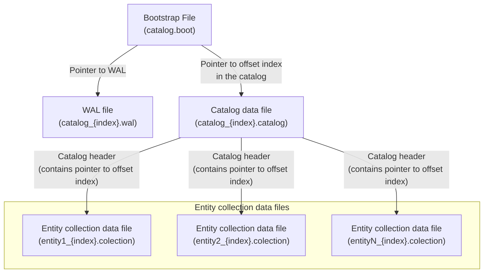

## Basic File Types and Their Relationships

evitaDB stores data in files on disk in a data directory specified in the configuration. The top level of this directory contains subdirectories for individual catalogs. Each catalog directory holds all the files required for working with that catalog (no external information outside of its directory is needed). The directory always contains:

1. **[Bootstrap file](#bootstrap-file)** – a file corresponding to the catalog name with the `.boot` extension containing critical pointers to the other files
2. **[Write-ahead log (WAL)](#write-ahead-log-wal)** – a file corresponding to the catalog name with the suffix `_{index}.wal`, where `index` is an ascending number starting from zero; the file contains a sequence of catalog changes over time
3. **[Catalog data file](#data-files)** – a file corresponding to the catalog name with the suffix `_{index}.catalog`, where `index` is an ascending number starting from zero; the file contains data tied to the catalog, such as the catalog schema and global indexes
4. **[Entity collection data files](#data-files)** – files corresponding to an entity name with the suffix `_{index}.colection`, where `index` is an ascending number starting from zero; these files contain all data associated with the given entity collection—its schema, indexes, and entity data

The files contain mutual references in the form of pointers to key positions within the file. The bootstrap file includes a pointer to the WAL file as well as to the location of the [offset index](#offset-index) in the catalog file. The catalog data file contains a catalog header, which then includes pointers to key positions in the individual entity collection data files. The pointer mechanism is depicted in the diagram below:

The content of each file type is described in more detail in the following sections.

### Record Structure in the Storage

All records in the bootstrap file, WAL, and all data files are stored in a binary format based on the [Kryo](https://github.com/EsotericSoftware/kryo) library and have the following structure:

| Information             | Data type | Length in bytes |
|-------------------------|-----------|-----------------|
| Record length in Bytes  | int32     | 4B              |
| Control Byte            | int32     | 1B              |
| Generation Id           | int64     | 8B              |
| Payload                 | byte[]    | *               |
| Checksum – CRC32C       | int64     | 8B              |

Below is an explanation of the individual items:

<dl>
    <dt>Record length in Bytes</dt>
    <dd>The length of the record in bytes. This is compared against the value of <em>Record pointer: length</em> and must match; otherwise, data integrity has been compromised.</dd>
    <dt>Control Byte</dt>
    <dd>This byte contains flags with key information about the nature of the record. The flags represent individual bits in this byte: 
        <ol>
            <li>the last record in a series of records</li>
            <li>a continuous record, with the payload continuing in the immediately following record</li>
            <li>a computed checksum is available for the record</li>
            <li>the record is compressed</li>
        </ol>
    </dd>
    <dt>Generation Id</dt>
    <dd>A generation number assigned to each record. This number is not actively used but can be utilized for possible data reconstruction. It typically matches the version of the <a href="#offset-index">offset index</a> that points to this record.</dd>
    <dt>Payload</dt>
    <dd>The actual record data. This section can have variable length and contains the specific information corresponding to the record type. The payload has a maximum size limited by the size of the output buffer (see <a href="/documentation/operate/configure?lang=evitaql#storage-configuration" target="_blank">outputBufferSize</a>).</dd>
    <dt>Checksum - CRC32C</dt>
    <dd>A checksum used to verify the integrity of data within the record. It is used to detect errors when reading data in the payload section.</dd>
</dl>

#### Reason for the Maximum Record Size Restriction

The maximum record size is limited by the fact that data is written to disk in a strictly append-only manner. The first piece of information in the record is its size, which is not known until the record is fully created. Practically, this means the record is formed in a memory buffer, the final size is then written to the first position of the record, and only afterward is the record written to disk.

#### Splitting the Payload into Multiple Records

There are numerous scenarios in which the amount of data in the payload exceeds the maximum allowed payload size. During storage, we can often split the payload across multiple records at serialization time, placing them consecutively. Each of these records is compressed individually and has its own checksum. The linkage between records is maintained by setting control bit no. 2. However, it’s crucial for the deserialization mechanism to detect the need to load the next record.

#### Costs of Checksums and Compression

An optimized variant of CRC32 (specifically <a href="https://www.ietf.org/rfc/rfc3720.txt" target="_blank">CRC32C</a>) included in the JDK is used for checksum calculations. The overhead of computing and verifying checksums is minimal, so we recommend keeping them always enabled (which is the default configuration). Still, it can be disabled via the <code>computeCRC32C</code> setting in the <a href="/documentation/operate/configure?lang=evitaql#storage-configuration" target="_blank">storage configuration</a>. If disabled, existing checksums in records are ignored on read, and new checksums will not be computed on write.

Enabling compression increases the memory requirements for the output buffer, because it must be allocated twice—once for writing the uncompressed data, and again for the compressed version. If the data is poorly compressible, you might find that the compressed data is the same size or even larger than the original. In such cases, the original uncompressed data is stored, though the overhead of attempting compression remains. During reading, this is determined by checking control bit no. 4—making it clear in advance whether the record needs to be decompressed before deserialization. Apart from the CPU cost of decompression, no additional overhead is incurred during reading. In short, most of the expense related to compression arises during data writes. Data compression can be enabled via the <code>compress</code> setting in the <a href="/documentation/operate/configure?lang=evitaql#storage-configuration" target="_blank">storage configuration</a>. By default, compression is turned off. If you try to read compressed data while compression is disabled, a read error will occur.

### Bootstrap File

The bootstrap file is the first file created during catalog initialization. It is the only file with a fixed record size, where its records (lines) are stored consecutively. These records are strictly uncompressed (otherwise it would be impossible to maintain a fixed size), are written using the <a href="#record-structure-in-the-storage">unified format</a>, include a checksum, and are stored in the order they were created. The data portion of each record contains the following:

| Information                     | Data type | Length in bytes |
|--------------------------------|-----------|-----------------|
| Storage protocol version       | int32     | 4B              |
| Catalog version                | int64     | 8B              |
| Catalog file index             | int32     | 4B              |
| Timestamp                      | int64     | 8B              |
| Record pointer: start position | int64     | 8B              |
| Record pointer: length         | int32     | 4B              |

Below is an explanation of the individual items:

<dl>
    <dt>Storage protocol version</dt>
    <dd>The version of the data format in which the catalog data is stored. This version changes only if there have been significant modifications in naming or structure of data files, or changes to the general structure of the records in the storage. This information allows us to detect when a running evitaDB instance expects data in a newer format than what is actually on disk. If such a situation arises, evitaDB contains a conversion mechanism to migrate data from the old format to the current one. 
     Currently, the data format version is <code>3</code>.
    </dd>
    <dt>Catalog version</dt>
    <dd>The catalog version is incremented upon completion of each committed transaction that pushes the catalog to the next version. There isn’t necessarily one bootstrap record per transaction. If the system manages to process multiple transactions within a time frame, the jumps between consecutive catalog versions in the bootstrap file can be greater than 1. 
     If the catalog is in <em>warm-up</em> mode, each of the bootstrap records may have a catalog version set to <code>0</code>.
    </dd>
    <dt>Catalog file index</dt>
    <dd>Contains the index of the catalog data file. Using this information, you can construct the file name corresponding to the catalog’s data file in the format <code>catalogName_{index}.catalog</code>. Multiple data files for the same catalog can coexist in the directory with different indexes, indicating the availability of the <a href="#time-travel">time travel</a> feature.
    </dd>
    <dt>Timestamp</dt>
    <dd>A timestamp set to the time the bootstrap record was created, measured in milliseconds from <code>1970-01-01 00:00:00 UTC</code>. This is used to locate the correct bootstrap record when performing <a href="#time-travel">time travel</a>.</dd>
    <dt>Offset index pointer: start position</dt>
    <dd>A pointer to the first byte of the initiating record of the <a href="#offset-index">offset index</a> in the catalog’s data file.</dd>
    <dt>Offset index pointer: length</dt>
    <dd>The length, in bytes, of the initiating record of the offset index in the catalog’s data file. This is crucial for properly reading the offset index from the catalog’s data file.</dd>
</dl>

### Data Files

All data files have records of variable length and lack any internal organization. Data is written sequentially as individual <a href="#data-records">data records</a> in the <a href="#record-structure-in-the-storage">defined structure</a>. To later access these records, a so-called <a href="#offset-index">offset index</a> is maintained, containing information about the position of each record in the data file. This index is written incrementally at predetermined times, appended after the data records themselves. A pointer to the initiating (last) offset index record must be stored in some external location—for the entity collection data files, that location is the catalog header; for the catalog data file (including the mentioned header), it’s the bootstrap file.

#### Offset Index

<SourceClass>evita_store/evita_store_key_value/src/main/java/io/evitadb/store/offsetIndex/OffsetIndex.java</SourceClass> is a simple data structure in the <a href="#record-structure-in-the-storage">standardized format</a> whose payload is a straightforward collection of:

| Information                     | Data type | Length in bytes |
|--------------------------------|-----------|-----------------|
| Primary key                    | int64     | 8B              |
| Record type                    | byte      | 1B              |
| Record pointer: start position | int64     | 8B              |
| Record pointer: length         | int32     | 4B              |

Always preceded by this header:

| Information                     | Data type | Length in bytes |
|--------------------------------|-----------|-----------------|
| Effective length               | int32     | 4B              |
| Record pointer: start position | int64     | 8B              |
| Record pointer: length         | int32     | 4B              |

The <em>Effective length</em> value is key for determining how many records are in the payload, because when the record is compressed, the on-disk size of the record cannot be used for that calculation. This size is divided by the size of a single record in the collection to derive the number of records to load from the payload. The <em>Record pointer</em> indicates the position of the previous offset index fragment recorded in the data file. All offset index fragments are always located in the same file.

Specific offset index entries have the following meaning:

<dl>
    <dt>Primary key</dt>
    <dd>The primary key of the record. evitaDB typically represents primary keys as <code>int32</code>, but for some keys, two such identifiers are needed. In these cases, two <code>int32</code> values are merged into a single <code>int64</code>.</dd>
    <dt>Record type</dt>
    <dd>The record type. It is used internally to distinguish the type of the record—specifically, it stores the type of <SourceClass>evita_store/evita_store_common/src/main/java/io/evitadb/store/model/StoragePart.java</SourceClass>. Because the numeric mapping uses only positive numbers starting from 1, the negative of these types marks “removed value.” The principle of loading and handling removed items is explained later.</dd>
    <dt>Record pointer: start position</dt>
    <dd>A pointer to the first byte of the previous offset index fragment in the current data file.</dd>
    <dt>Record pointer: length</dt>
    <dd>The length of the previous offset index fragment.</dd>
</dl>

Reading all the available record information in the data file goes as follows:

1. Load the initiating fragment of the offset index (typically the most recent one in the file).
2. Read all pointer information for the records in this fragment:
    - if the record type is negative, it indicates a removed record—this is noted in a hash table of removed records.
3. Load the previous offset index fragment using its pointer and process it similarly:
    - if a fragment entry references a record that appears in the removed records hash table, that record’s information is ignored during loading.
4. Repeat this until you reach the very first offset index fragment, which no longer holds a pointer to a previous fragment.

Offset index fragments are usually written at the end of transaction processing (or a set of consecutive transactions, if handled within a dedicated time window). Only new/modified/removed records from that transaction set are stored in the fragment.

#### Data Records

Data records contain the actual data payload for each record type and are used to store schemas, entities, and all other infrastructural data structures such as search indexes, and so on. The record itself does not indicate whether it is valid or not—this information is available only at the offset index level.

### Write-Ahead Log (WAL)

The write-ahead log is a separate data structure to which all transactional changes are written in the form of serialized “mutations” when a transaction commit is accepted. Individual mutations are written using the <a href="#record-structure-in-the-storage">standard structure</a>, one after the other, in the order they were performed in the transaction. Transactions are separated by a header that contains the overall transaction length in bytes (<code>int32</code>). Also, at the start of each transaction, a <SourceClass>evita_api/src/main/java/io/evitadb/api/requestResponse/transaction/TransactionMutation.java</SourceClass> record is written, containing basic information about the transaction itself for easier orientation. After this, the list of individual mutations follows. The transaction length header allows fast navigation between transactions in the WAL file without deserializing each mutation.

The write-ahead log has a maximum file size set by the <a href="https://evitadb.io/documentation/operate/configure#transaction-configuration" target="_blank">walFileSizeBytes</a> setting. Once this limit is reached, the file is closed and a new one is created with the next index number in its name. The maximum number of WAL files is determined by <a href="https://evitadb.io/documentation/operate/configure#transaction-configuration" target="_blank">walFileCountKept</a>. When this maximum is reached, the oldest file is removed. This mechanism ensures WAL files never grow excessively large and do not accumulate indefinitely on disk.

At the end of each WAL file, there is a pair of <code>int32</code> values representing the first and last catalog versions recorded in that WAL file. This allows quick navigation among WAL files if you need to locate a particular transaction that made changes to the catalog matching a specific version.

If the end of a WAL file contains a partially written record—i.e., its size does not match the size specified in the transaction header or in a transaction mutation—the WAL file is truncated to the last valid WAL entry upon database startup.

## Data Mechanics

Data writes in evitaDB are strictly append-only, meaning once written, data is never overwritten. This has both positive and negative implications.

On the positive side, you don’t need to handle file locking during concurrent reads and writes, nor do you need to manage free space information or optimize data layout for defragmentation. Records themselves can have variable length, which grants flexibility in the stored data (e.g., we can allow compression). The fact that older (overwritten) versions of logical records remain in the file also enables <a href="#time-travel">time travel</a> and point-in-time <a href="#backup-and-restore">backup and restore</a>.

On the negative side, there is the gradual accumulation of “outdated” data in the files. This data must be periodically cleaned up so it does not slow down the database startup (unused records still appear in the <a href="#offset-index">offset index</a>) and so it doesn’t occupy file cache space that could otherwise be used for relevant data. This cleanup is handled by <a href="#cleaning-up-the-clutter">cleaning up the clutter</a>, which involves copying the current records into a new file (still strictly append-only). Additionally, we need to maintain an <a href="#offset-index">offset index</a> containing positional information for every record, since variable record lengths make it impossible to simply compute record positions directly.

Deflate compression (part of the JDK) is used to compress data in the payload section. The payload size limit enforced by the output buffer remains in effect—compression only occurs once the buffer is filled or when the payload has been completely written. If the compressed payload ends up the same size or larger, the uncompressed version is used instead.

### Cleaning Up the Clutter

Cleaning up the clutter is the process of preventing an excessive amount of “outdated” data from piling up in data files. Large amounts of stale data slow down database startup (because it has to be traversed and then ignored), and it also consumes space in the operating system’s file cache, reducing the likelihood that truly needed data is cached. Therefore, evitaDB includes an automatic <em>compaction</em> process that regularly cleans up this data whenever the configured <a href="/documentation/operate/configure#storage-configuration" target="_blank">thresholds</a> for <code>minimalActiveRecordShare</code> are exceeded and the file size surpasses <code>fileSizeCompactionThresholdBytes</code>.

This process takes place during transaction processing if it’s found that these conditions are met after the transaction completes. On the one hand, this prevents backlog and overgrowth of data in the file. On the other hand, it means the transaction’s completion may take longer than usual because it includes the compaction work.

Compaction itself is relatively fast. A new data file with an index one higher is created, and all current records that the in-memory <a href="#offset-index">offset index</a> for the current version references are copied into it. Finally, a single consecutive fragment representing the state of this offset index is appended. Then, the relevant pointers in the corresponding header (stored in another, parent data file—either the catalog data file or the bootstrap file) are updated to point to the new file. Because copying takes place at the block level, contents of the records need not be deserialized and reserialized, which speeds up the entire process. Checksums are also verified at this stage if checksums are enabled in the configuration.

The original data file is either removed, or—if <a href="#time-travel">time travel</a> is enabled—remains on disk even if it is no longer actively used.

### Time Travel

Because data is stored in an append-only manner, it is possible to access data that has been changed or even removed in the current version, as long as the original data file still exists. The entire principle of time travel is based on locating the corresponding record in the bootstrap file, reading the appropriate offset index in the relevant data file (whether actively used or left on disk after <a href="#cleaning-up-the-clutter">compaction</a>), finding the relevant entry in the offset index, and finally reading the data record from the data file.

This process is not heavily optimized for speed—rather, it simply takes advantage of the append-only nature of the data for historical record lookup (this feature alone does not make evitaDB a fully temporal database specialized in time-based queries). However, it does allow you to retroactively track the history of a record (or set of records), and also enables you to perform point-in-time backups of the database.

### Backup and Restore

Handling files also permits a naive backup method—simply copying the files in this order:

1. The bootstrap file
2. The catalog data files
3. The entity collection data files
4. The WAL files

Even while the database is running, copying the on-disk data this way captures the current state consistently. That’s because if the bootstrap file is copied first, it necessarily contains a correct pointer to fully written data at the respective location it references. The database writes the bootstrap record last—i.e., only after all data it references has been completely written. If additional data exists that nothing points to, the database won’t mind during the next startup. Moreover, if WAL files are copied last, you also capture the most recent changes. During restore, evitaDB attempts to replay them. Any partially written transaction at the end of a WAL file is automatically dropped, so even if a transaction was only half-written, it should not impede the database from starting up from these copied data files.

There are two ways to handle backups:

1. **Full backup** – a backup of all data files and WAL files, including historical ones.
2. **Active backup** – a backup of only the currently used data files and WAL files.

A full backup employs the naive approach described earlier, but it can be quite large if there is a significant amount of historical data. On the other hand, it can be performed while the database is running since it’s purely a file-copying operation.

An active backup more closely resembles <a href="#cleaning-up-the-clutter">cleaning up the clutter</a>. For each data file, a new file is first created that holds only the current set of records for the (latest) version of the <a href="#offset-index">offset index</a>. This is done first for the entity collection files, then for the catalog data file, and finally a new bootstrap file is created containing only a single historical record. The system continues running normally (transactions are still being processed) while the backup is taking place. Thanks to immutability, the backup will represent the data as it was at the moment the backup started, ignoring any subsequent changes. At the end of the backup process, however, the WAL files produced from the time the backup started until it finished are also included. Thus, upon restoration, those WAL entries are replayed, ensuring the active backup is fully current regardless of how long the backup process took.
