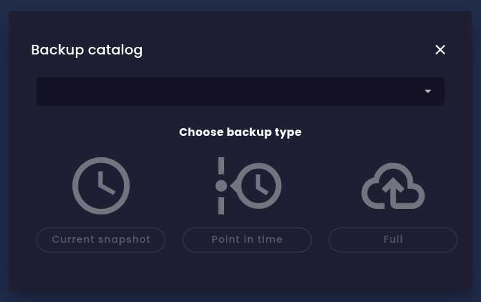

evitaDB offers multiple ways to back up your data. Ultimately, all such administrative operations will be accessible via all client APIs, but currently only the gRPC/Java API supports them (see [issue #627](https://github.com/FgForrest/evitaDB/issues/627)). There are three main ways to back up your data - the PIT (point-in-time) backup is available only when the *time-travel* option is enabled in the [configuration](configure.md#storage-configuration):

None of these backup options interferes with normal database operations; you can continue to read and write data while the backup is being created. Because of the append-only storage architecture, the backup process can run safely without blocking any operations. However, keep in mind that creating a backup may have some performance impact.

<Note type="info">

If you need to know more about the storage architecture and internals that these backup options are based on, please refer to the [storage model documentation](../deep-dive/storage-model.md#backup-and-restore).

</Note>

## Current snapshot

The current snapshot contains a copy of the current data and, optionally, the contents of the transaction log (WAL), if you request that option when the backup is created. The contents of the transaction log are copied in full, and they may contain operations already reflected in the snapshot as well as operations that haven't been applied yet. When you restore data from such a backup, the snapshot is restored first, and then all unprocessed operations from the transaction log are applied in the order they were originally executed. This way, you can restore the database to the exact state it was in at the moment of backup creation. If you don't include the transaction log in the backup, the database is restored to the state it was in at the time of snapshot creation but might miss some unprocessed updates. The benefit of this approach is that a snapshot backup without WAL is the smallest possible backup you can create.

## Point-in-time snapshot

A point-in-time (PIT) snapshot is a special type of backup that can be created only when the *time-travel* option is enabled in the [configuration](configure.md#storage-configuration). This type of backup contains a copy of the database at a specific point in the past. When you create such a backup, you specify the exact timestamp you want to back up. The system then creates a snapshot of the database as it was at that moment. This is particularly useful when you need to restore the database to a specific historical state, such as after accidental data deletion or corruption.

There is a limited time window in the past for which you can create PIT snapshots. This window is determined by the retention period of historical data, configured in the [storage configuration](configure.md#transaction-configuration) via the parameters *walFileSizeBytes* and *walFileCountKept*. The database keeps all historical data for all committed transactions that are still present in the transaction log (WAL) files. When a WAL file is deleted, all files with historical data referenced from that WAL file are deleted as well. If you try to create a PIT snapshot for a timestamp older than the oldest retained historical data, the operation will fail. By tuning these two configuration parameters, you can control how far back in time you can create PIT snapshots. The period is highly dependent on database activity - the more updates you perform, the more historical data is generated, and the faster the WAL files are rotated.

<Note type="info">

You can include transaction log (WAL) files in the PIT snapshot backup as well, but this is intended only for debugging use cases. When you restore from a PIT snapshot that includes WAL files, the database is restored to the specified point in time, and then all operations from the included WAL files that were executed after that point are applied. You will end up with the current state of the database, just like with a current snapshot backup that includes WAL files.

</Note>

## Full file system copy

The full file system copy is the simplest way to back up the database. It copies and compresses the entire catalog storage directory, with files processed in the correct order. It might be quite large, but it contains all data, including historical data. When you restore from such a backup, the database is restored to the exact state it was in at the moment of backup creation. You can still perform PIT backups from a database restored this way, as all historical data is still present.