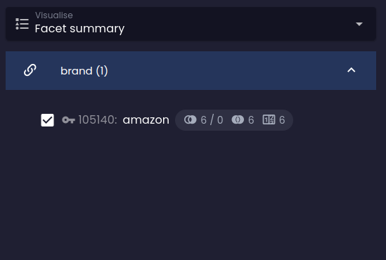

### Scope

```evitaql-syntax
scope(
    argument:enum(LIVE|ARCHIVED)+
)
```

<dl>
    <dt>argument:enum(LIVE|ARCHIVED)+</dt>
    <dd>
        mandatory one or more enum arguments representing the scope to be searched for the result
    </dd>
</dl>

The `scope` (<LS to="e,j,r,g"><SourceClass>evita_query/src/main/java/io/evitadb/api/query/filtering/Scope.java</SourceClass></LS>
<LS to="c"><SourceClass>EvitaDB.Client/Queries/Filtering/Scope.cs</SourceClass></LS>) filtering allows you to specify 
the scope in which the result is searched. Two scopes are available:

- `LIVE` - the default scope, which searches the live data for the result
- `ARCHIVED` - the scope that searches for the result in the archived data.

Scopes represent the means how evitaDB handles so called "soft deletes". The application can choose between a hard 
delete and archiving the entity, which simply moves the entity to the archive scope. The details of the archiving 
process are described in the chapter [Archiving](../../use/schema.md#scopes) and the reasons why this feature 
exists are explained in the [dedicated blog post](blog/en/15-soft-delete.md).

There are a few archived entities in our demo dataset. Our schema is configured to index only the `URL` and `code`
attributes in the archived scope, so we can search for archived entities using only these attributes and, of course, 
the primary key.

<SourceCodeTabs requires="evita_functional_tests/src/test/resources/META-INF/documentation/evitaql-init.java" langSpecificTabOnly>

[Accessing archived entities example](/documentation/user/en/query/filtering/examples/fetching/archived-entities-listing.evitaql)

</SourceCodeTabs>

<Note type="info">

<NoteTitle toggles="true">

##### The result of querying archived entities
</NoteTitle>

<LS to="e,j,c">

<MDInclude sourceVariable="recordPage">[The result of querying archived entities](/documentation/user/en/query/filtering/examples/fetching/archived-entities-listing.evitaql.md)</MDInclude>

</LS>
<LS to="r">

<MDInclude sourceVariable="recordPage">[The result of querying archived entities](/documentation/user/en/query/filtering/examples/fetching/archived-entities-listing.rest.json.md)</MDInclude>

</LS>

</Note>

When we need to look up by the `URL` attribute, which is usually unique, there's an important difference, and that is 
that the `URL` is only unique within its scope. This means that the same URL can be used for different entities in 
different scopes. This is the case for some of our entities in our demo data set. The conflict for the unique key 
between different entities is resolved by evitaDB by favouring the live entity over the archived one. See the following
example:

<SourceCodeTabs requires="evita_functional_tests/src/test/resources/META-INF/documentation/evitaql-init.java" langSpecificTabOnly>

[Resolving conflicting entities example](/documentation/user/en/query/filtering/examples/fetching/archived-entities-conflict.evitaql)

</SourceCodeTabs>

Producing the following result:

<LS to="e,j,c">

<MDInclude sourceVariable="recordPage">[The result of querying conflicting entities](/documentation/user/en/query/filtering/examples/fetching/archived-entities-conflict.evitaql.md)</MDInclude>

</LS>
<LS to="r">

<MDInclude sourceVariable="recordPage">[The result of querying conflicting entities](/documentation/user/en/query/filtering/examples/fetching/archived-entities-conflict.rest.json.md)</MDInclude>

</LS>

We can still access the archived entity via its `URL` property if we are only looking in the archived scope:

<SourceCodeTabs requires="evita_functional_tests/src/test/resources/META-INF/documentation/evitaql-init.java" langSpecificTabOnly>

[Accessing archived entity by URL](/documentation/user/en/query/filtering/examples/fetching/archived-entity-conflict-access.evitaql)

</SourceCodeTabs>

Producing the following result:

<LS to="e,j,c">

<MDInclude sourceVariable="recordPage">[The result of querying archived entity by URL](/documentation/user/en/query/filtering/examples/fetching/archived-entity-conflict-access.evitaql.md)</MDInclude>

</LS>
<LS to="r">

<MDInclude sourceVariable="recordPage">[The result of querying archived entity by URL](/documentation/user/en/query/filtering/examples/fetching/archived-entity-conflict-access.rest.json.md)</MDInclude>

</LS>

## User filter

```evitaql-syntax
userFilter(
    filterConstraint:any+
)
```

<dl>
    <dt>filterConstraint:any+</dt>
    <dd>
        one or more mandatory filter constraints that will produce logical conjunction
    </dd>
</dl>


The <LS to="e,j,r,g"><SourceClass>evita_query/src/main/java/io/evitadb/api/query/filter/UserFilter.java</SourceClass></LS><LS to="c"><SourceClass>EvitaDB.Client/Queries/Filter/UserFilter.cs</SourceClass></LS>
works identically to the [`and`](logical.md#and) constraint, but it distinguishes the filter scope, which is controlled by the user
through some kind of user interface, from the rest of the query, which contains the mandatory constraints on the result
set. The user-defined scope can be modified during certain calculations (such as the [facet](../filtering/facet.md)
or [histogram](../filtering/histogram.md) calculation), while the mandatory part outside of `userFilter` cannot.

Let's look at the example where the [`facetHaving`](references.md#facet-having) constraint is used inside
the `userFilter` container:

<SourceCodeTabs requires="evita_functional_tests/src/test/resources/META-INF/documentation/evitaql-init.java" langSpecificTabOnly>

[User filter container example](/documentation/user/en/query/filtering/examples/behavioral/user-filter.evitaql)

</SourceCodeTabs>

And compare it to the situation when we remove the `userFilter` container:

| Facet summary with `facetHaving` in `userFilter`  | Facet summary without `userFilter` scope       |
|---------------------------------------------------|------------------------------------------------|
|  |  |

As you can see in the second image, the facet summary is greatly reduced to a single facet option that is selected by
the user. Because the facet is considered a "mandatory" constraint in this case, it behaves the same as
the [`referenceHaving`](references.md#reference-having) constraint, which is combined with other constraints via logical
disjunction. Since there is no other entity that would refer to both the *amazon* brand and another brand (of course,
a product can only have a single brand), the other possible options are automatically removed from the facet summary
because they would produce an empty result set.
