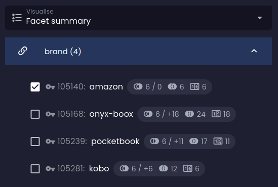
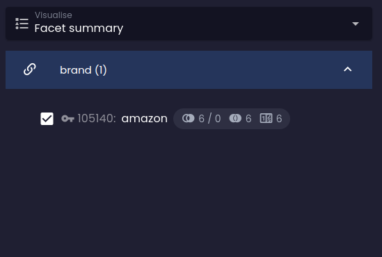

## In Scope

```evitaql-syntax
inScope(
    argument:enum(LIVE|ARCHIVED)
    filterConstraint:any+
)
```

<dl>
    <dt>argument:enum(LIVE|ARCHIVED)</dt>
    <dd>
        mandatory enum argument representing the scope to which the filter constraints in the second and subsequent
        arguments are applied
    </dd>
    <dt>filterConstraint:any+</dt>
    <dd>
        one or more mandatory filter conditions, combined by a logical link, used to filter entities only in 
        a specific scope
    </dd>
</dl>

The `inScope` (<LS to="e,j,r,g"><SourceClass>evita_query/src/main/java/io/evitadb/api/query/filtering/FilterInScope.java</SourceClass></LS>
<LS to="c"><SourceClass>EvitaDB.Client/Queries/Filtering/FilterInScope.cs</SourceClass></LS>) filter container is used 
to restrict filter conditions so that they only apply to a specific scope.

The evitaDB query engine is strict about indexes and does not allow you to filter or sort on data (attributes, references,
etc.) for which no index has been prepared in advance (it tries to avoid situations where a full scan would degrade query 
performance). Scopes, on the other hand, allows us to get rid of unnecessary indexes when we know we will not need them 
(archived data is not expected to be queried as extensively as live data) and free up some resources for more important
tasks.

The [scope](#in-scope) filter constraint allows us to query entities in both scopes at once, which would be impossible if 
we couldn't tell which filter constraint to apply to which scope. The `inScope` container is designed to handle this 
situation.

<Note type="info">

It's obvious that the `inScope` container is not necessary if we are only querying entities in one scope. However, if 
you do use it in this case, it must match the scope of the query. If you use the `inScope` container with the `LIVE` 
scope, but the query is executed in the `ARCHIVED` scope, the engine will return an error.

</Note>


For example, in our demo dataset we have only a few attributes indexed in the archive - namely `url` and `code` and 
a few others. We don't index references, hierarchy or prices in archive scope. If we want to search for entities in both 
scopes and use appropriate filter constraints, we need to use the `inScope` container in the following way:

<SourceCodeTabs requires="evita_test/evita_functional_tests/src/test/resources/META-INF/documentation/evitaql-init.java" langSpecificTabOnly>

[Disginguishing filters in different scopes](/documentation/user/en/query/filtering/examples/behavioral/archived-entities-filtering.evitaql)

</SourceCodeTabs>

<Note type="info">

<NoteTitle toggles="true">

##### The result of selected entities in multiple scopes
</NoteTitle>

The result contains two entities selected by the URL attribute. The entity in the live scope also satisfies 
the hierarchy and price constraints specified in the `inScope` container. However, these constraints may not be valid 
for the entity in the archive scope, as can be seen by looking at the input query.

<LS to="e,j,c">

<MDInclude sourceVariable="recordPage">[The result of selected entities in multiple scopes](/documentation/user/en/query/filtering/examples/behavioral/archived-entities-filtering.evitaql.md)</MDInclude>

</LS>
<LS to="g">

<MDInclude sourceVariable="data.queryProduct.recordPage">[The result of selected entities in multiple scopes](/documentation/user/en/query/filtering/examples/behavioral/archived-entities-listing.graphql.json.md)</MDInclude>

</LS>
<LS to="r">

<MDInclude sourceVariable="recordPage">[The result of selected entities in multiple scopes](/documentation/user/en/query/filtering/examples/behavioral/archived-entities-filtering.rest.json.md)</MDInclude>

</LS>

</Note>

<Note type="info">

Similar `scope` containers are available for [order constraints](../ordering/behavioral.md#in-scope) 
and [requirements constraints](../requirements/behavioral.md#in-scope) with the same purpose and meaning.

</Note>

## User filter

```evitaql-syntax
userFilter(
    filterConstraint:any+
)
```

<dl>
    <dt>filterConstraint:any+</dt>
    <dd>
        one or more mandatory filter constraints that will produce logical conjunction
    </dd>
</dl>


The <LS to="e,j,r,g"><SourceClass>evita_query/src/main/java/io/evitadb/api/query/filter/UserFilter.java</SourceClass></LS><LS to="c"><SourceClass>EvitaDB.Client/Queries/Filter/UserFilter.cs</SourceClass></LS>
works identically to the [`and`](logical.md#and) constraint, but it distinguishes the filter scope, which is controlled by the user
through some kind of user interface, from the rest of the query, which contains the mandatory constraints on the result
set. The user-defined scope can be modified during certain calculations (such as the [facet](../requirements/facet.md#facet-summary)
or [histogram](../requirements/histogram.md) calculation), while the mandatory part outside of `userFilter` cannot.

Let's look at the example where the [`facetHaving`](references.md#facet-having) constraint is used inside
the `userFilter` container:

<SourceCodeTabs requires="evita_test/evita_functional_tests/src/test/resources/META-INF/documentation/evitaql-init.java" langSpecificTabOnly>

[User filter container example](/documentation/user/en/query/filtering/examples/behavioral/user-filter.evitaql)

</SourceCodeTabs>

And compare it to the situation when we remove the `userFilter` container:

| Facet summary with `facetHaving` in `userFilter`  | Facet summary without `userFilter` scope       |
|---------------------------------------------------|------------------------------------------------|
|  |  |

As you can see in the second image, the facet summary is greatly reduced to a single facet option that is selected by
the user. Because the facet is considered a "mandatory" constraint in this case, it behaves the same as
the [`referenceHaving`](references.md#reference-having) constraint, which is combined with other constraints via logical
disjunction. Since there is no other entity that would refer to both the *amazon* brand and another brand (of course,
a product can only have a single brand), the other possible options are automatically removed from the facet summary
because they would produce an empty result set.
