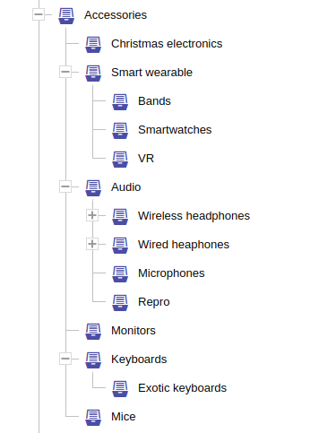
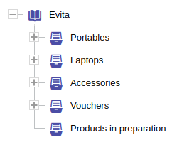
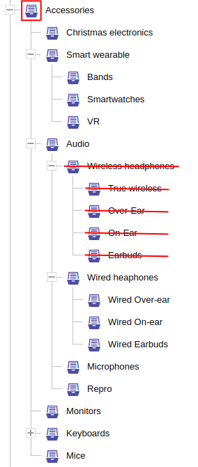

Hierarchy filtering can be applied only to entities [marked as hierarchical](../../use/data-model.md#hierarchy-placement) 
or to entities that [reference](../../use/data-model.md#references) these hierarchical entities. Hierarchy filtering 
allows filtering all direct or transitive children of a given hierarchy node, or entities that are directly or 
transitively related to the requested hierarchy node or its children. Filtering allows to exclude (hide) several parts 
of the tree from evaluation, which can be useful in situation when part of the store should be (temporarily) hidden 
from (some of) clients.

In addition to filtering, there are query [requirement extensions](../requirements/hierarchy.md) that allow you to 
compute data to help render (dynamic or static) menus that describe the hierarchy context you request in the query.

**The typical use-cases related to hierarchy constraints:**

- [list products in category](../../solve/filtering-products-in-category.md)
- [render category menus](../../solve/render-category-menu.md)
- [list categories for products of a specific brand](../../solve/render-referenced-brand.md)

<Note type="warning">
There could be at most one single `hierarchyWithin` or `hierarchyRoot` filter constraint in the entire query.
</Note>

## Hierarchy within

<LanguageSpecific to="evitaql,java,rest,graphql">
The constraint <SourceClass>evita_query/src/main/java/io/evitadb/api/query/filter/HierarchyWithin.java</SourceClass> 
allows you to restrict the search to only those entities that are part of the hierarchy tree starting with the root 
node identified by the first argument of this constraint. In e-commerce systems the typical representative of 
a hierarchical entity is a *category*, which will be used in all of our examples. The examples in this chapter will
focus on the category *Accessories* in our [demo dataset](../../get-started/query-our-dataset) with following layout:
</LanguageSpecific>
<LanguageSpecific to="csharp">
The constraint <SourceClass>EvitaDB.Client/Queries/Filter/HierarchyWithin.cs</SourceClass> 
allows you to restrict the search to only those entities that are part of the hierarchy tree starting with the root 
node identified by the first argument of this constraint. In e-commerce systems the typical representative of 
a hierarchical entity is a *category*, which will be used in all of our examples. The examples in this chapter will
focus on the category *Accessories* in our [demo dataset](../../get-started/query-our-dataset) with following layout:
</LanguageSpecific>



### Self

```evitaql-syntax
hierarchyWithin(
    filterConstraint:any!,
    filterConstraint:(directRelation|having|excluding|excludingRoot)*
)
```

<dl>
    <dt>filterConstraint:any!</dt>
    <dd>
        a single mandatory filter constraint that identifies **one or more** hierarchy nodes that act as hierarchy roots; 
        multiple constraints must be enclosed in [AND](../logical.md#and) / [OR](../logical.md#or) containers
    </dd>
    <dt>filterConstraint:(directRelation|having|excluding|excludingRoot)*</dt>
    <dd>
        optional constraints allow you to narrow the scope of the hierarchy; 
        none or all of the constraints may be present:
        <ul>
            <li>[directRelation](#direct-relation)</li>
            <li>[having](#having)</li>
            <li>[excluding](#excluding)</li>
            <li>[excludingRoot](#excluding-root)</li>
        </ul>
    </dd>
</dl>

The most straightforward usage is filtering the hierarchical entities themselves. 

To list all nested categories of *Accessories* category issue this query:

<SourceCodeTabs requires="evita_functional_tests/src/test/resources/META-INF/documentation/evitaql-init.java" langSpecificTabOnly>

[Transitive category listing](/documentation/user/en/query/filtering/examples/hierarchy/hierarchy-within-self-simple.evitaql)
</SourceCodeTabs>

... and you should get slightly more than one page of categories in the response.

<Note type="info">

<NoteTitle toggles="true">

##### List of all subcategories of the *Accessories* category
</NoteTitle>

<LanguageSpecific to="evitaql,java,csharp">

<MDInclude>[Single root hierarchy example](/documentation/user/en/query/filtering/examples/hierarchy/hierarchy-within-self-simple.evitaql.md)</MDInclude>

</LanguageSpecific>

<LanguageSpecific to="graphql">

<MDInclude>[Single root hierarchy example](/documentation/user/en/query/filtering/examples/hierarchy/hierarchy-within-self-simple.graphql.json.md)</MDInclude>

</LanguageSpecific>

<LanguageSpecific to="rest">

<MDInclude>[Single root hierarchy example](/documentation/user/en/query/filtering/examples/hierarchy/hierarchy-within-self-simple.rest.json.md)</MDInclude>

</LanguageSpecific>

</Note>

The first argument specifies the filter targets the attributes of the `Category` entity. In this example we used
[attributeEquals](comparable.md#attribute-equals) for unique attribute `code`, but you can select the category
by localized `url` attribute (but then you need to provide also [entityLocaleEquals](locale.md#entity-locale-equals)
constraint for determining the proper language), or using [entityPrimaryKeyInSet](constant.md#entity-primary-key-in-set)
and passing category primary key. 

<Note type="info">

<NoteTitle toggles="true">

##### Can the parent node filter constraint match multiple ones? 
</NoteTitle>

Yes, it can. Although, it's apparently one of the edge cases, it's possible. This query:

<SourceCodeTabs requires="evita_functional_tests/src/test/resources/META-INF/documentation/evitaql-init.java" langSpecificTabOnly>

[Multiple category listing](/documentation/user/en/query/filtering/examples/hierarchy/hierarchy-within-self-multi.evitaql)
</SourceCodeTabs>

... will return all subcategories of the *Wireless headphones* and *Wired headphones* and their subcategories:

<LanguageSpecific to="evitaql,java,csharp">

<MDInclude>[Multi-root hierarchy example](/documentation/user/en/query/filtering/examples/hierarchy/hierarchy-within-self-multi.evitaql.md)</MDInclude>

</LanguageSpecific>

<LanguageSpecific to="graphql">

<MDInclude>[Multi-root hierarchy example](/documentation/user/en/query/filtering/examples/hierarchy/hierarchy-within-self-multi.graphql.json.md)</MDInclude>

</LanguageSpecific>

<LanguageSpecific to="rest">

<MDInclude>[Multi-root hierarchy example](/documentation/user/en/query/filtering/examples/hierarchy/hierarchy-within-self-multi.rest.json.md)</MDInclude>

</LanguageSpecific>


</Note>

### Referenced entity

```evitaql-syntax
hierarchyWithin(
    argument:string!,
    filterConstraint:any!,
    filterConstraint:(directRelation|having|excluding|excludingRoot)*
)
```

<dl>
    <dt>argument:string!</dt>
    <dd>
        a mandatory name of the queried entity [reference schema](../../use/schema.md#reference) that represents 
        the relationship to the hierarchical entity type, your entity may target different hierarchical entities in 
        different reference types, or it may target the same hierarchical entity through multiple semantically different 
        references, and that is why the reference name is used instead of the target entity type.
    </dd>
    <dt>filterConstraint:any!</dt>
    <dd>
        a single mandatory filter constraint that identifies **one or more** hierarchy nodes that act as hierarchy roots; 
        multiple constraints must be enclosed in [AND](../logical.md#and) / [OR](../logical.md#or) containers
    </dd>
    <dt>filterConstraint:(directRelation|having|excluding|excludingRoot)*</dt>
    <dd>
        optional constraints allow you to narrow the scope of the hierarchy; 
        none or all of the constraints may be present:
        <ul>
            <li>[directRelation](#direct-relation)</li>
            <li>[having](#having)</li>
            <li>[excluding](#excluding)</li>
            <li>[excludingRoot](#excluding-root)</li>
        </ul>
    </dd>
</dl>

The `hierarchyWithin` constraint can also be used for entities that directly reference a hierarchical entity type.
The most common use case from the e-commerce world is a product that is assigned to one or more categories. To list all
products in the *Accessories* category of our [demo dataset](../../get-started/query-our-dataset), we issue the following query:

<SourceCodeTabs requires="evita_functional_tests/src/test/resources/META-INF/documentation/evitaql-init.java" langSpecificTabOnly>

[Product listing from *Accessories* category](/documentation/user/en/query/filtering/examples/hierarchy/hierarchy-within-reference-simple.evitaql)
</SourceCodeTabs>

Products assigned to two or more subcategories of *Accessories* category will only appear once in the response (contrary 
to what you might expect if you have experience with SQL).

The query returns the first page of a total of 26 pages of items.

<Note type="info">

<NoteTitle toggles="true">

##### List of all products in the *Accessories* category or its subcategories
</NoteTitle>

<LanguageSpecific to="evitaql,java,csharp">

<MDInclude>[Product listing from *Accessories* category](/documentation/user/en/query/filtering/examples/hierarchy/hierarchy-within-reference-simple.evitaql.md)</MDInclude>

</LanguageSpecific>

<LanguageSpecific to="graphql">

<MDInclude>[Product listing from *Accessories* category](/documentation/user/en/query/filtering/examples/hierarchy/hierarchy-within-reference-simple.graphql.json.md)</MDInclude>

</LanguageSpecific>

<LanguageSpecific to="rest">

<MDInclude>[Product listing from *Accessories* category](/documentation/user/en/query/filtering/examples/hierarchy/hierarchy-within-reference-simple.rest.json.md)</MDInclude>

</LanguageSpecific>

</Note>

The category filter constraint specifies a condition that targets the referenced entity (i.e., category attributes,
category references). Currently, it's not possible to specify a filter constraint that takes into account the product
reference that leads to its category. An [issue #105](https://github.com/FgForrest/evitaDB/issues/105) is planned to
address this shortcoming.

## Hierarchy within root

<LanguageSpecific to="evitaql,java,rest,graphql">
The constraint <SourceClass>evita_query/src/main/java/io/evitadb/api/query/filter/HierarchyWithinRoot.java</SourceClass>
allows you to restrict the search to only those entities that are part of the entire hierarchy tree. In e-commerce
systems the typical representative of a hierarchical entity is a *category*, which will be used in all of our examples.
</LanguageSpecific>
<LanguageSpecific to="csharp">
The constraint <SourceClass>EvitaDB.Client/Queries/Filter/HierarchyWithinRoot.cs</SourceClass>
allows you to restrict the search to only those entities that are part of the entire hierarchy tree. In e-commerce
systems the typical representative of a hierarchical entity is a *category*, which will be used in all of our examples.
</LanguageSpecific>

The single difference to [hierarchyWithin constraint](#hierarchy-within) is that it doesn't accept a root node 
specification. Because evitaDB accepts multiple root nodes in your entity hierarchy, it may be helpful to imagine
there is an invisible "virtual" top root above all the top nodes (whose `parent` property remains `NULL`) you have in 
your entity hierarchy and this virtual top root is targeted by this constraint.



### Self

```evitaql-syntax
hierarchyWithinRoot(
    filterConstraint:(directRelation|having|excluding)*
)
```

<dl>
    <dt>filterConstraint:(directRelation|having|excluding)*</dt>
    <dd>
        optional constraints allow you to narrow the scope of the hierarchy; 
        none or all of the constraints may be present:
        <ul>
            <li>[directRelation](#direct-relation)</li>
            <li>[having](#having)</li>
            <li>[excluding](#excluding)</li>
        </ul>
    </dd>
</dl>

The `hierarchyWithinRoot`, which targets the `Category` collection itself, returns all categories except those that 
would point to non-existent parent nodes, such hierarchy nodes are called [orphans](../../use/schema.md#orphan-hierarchy-nodes)
and do not satisfy any hierarchy query.

<SourceCodeTabs requires="evita_functional_tests/src/test/resources/META-INF/documentation/evitaql-init.java" langSpecificTabOnly>

[Category listing](/documentation/user/en/query/filtering/examples/hierarchy/hierarchy-within-root-simple.evitaql)
</SourceCodeTabs>

The query returns the first page of a total of 2 pages of items.

<Note type="info">

<NoteTitle toggles="true">

##### List of all categories in the hierarchy tree
</NoteTitle>

<LanguageSpecific to="evitaql,java,csharp">

<MDInclude>[Category listing](/documentation/user/en/query/filtering/examples/hierarchy/hierarchy-within-root-simple.evitaql.md)</MDInclude>

</LanguageSpecific>

<LanguageSpecific to="graphql">

<MDInclude>[Category listing](/documentation/user/en/query/filtering/examples/hierarchy/hierarchy-within-root-simple.graphql.json.md)</MDInclude>

</LanguageSpecific>

<LanguageSpecific to="rest">

<MDInclude>[Category listing](/documentation/user/en/query/filtering/examples/hierarchy/hierarchy-within-root-simple.rest.json.md)</MDInclude>

</LanguageSpecific>

</Note>

### Referenced entity

```evitaql-syntax
hierarchyWithinRoot(
    argument:string!,   
    filterConstraint:(having|excluding)*
)
```

<dl>
    <dt>argument:string!</dt>
    <dd>
        a mandatory name of the queried entity [reference schema](../../use/schema.md#reference) that represents 
        the relationship to the hierarchical entity type, your entity may target different hierarchical entities in
        different reference types, or it may target the same hierarchical entity through multiple semantically different 
        references, and that is why the reference name is used instead of the target entity type.
    </dd>
    <dt>filterConstraint:(having|excluding)*</dt>
    <dd>
        optional constraints allow you to narrow the scope of the hierarchy; 
        none or all of the constraints may be present:
        <ul>
            <li>[directRelation](#direct-relation)</li>
            <li>[having](#having)</li> 
            <li>[excluding](#excluding)</li> 
        </ul>
    </dd>
</dl>

The `hierarchyWithinRoot` constraint can also be used for entities that directly reference a hierarchical entity type.
The most common use case from the e-commerce world is a product that is assigned to one or more categories. To list all
products assigned to any category of our [demo dataset](../../get-started/query-our-dataset), we issue the following query:

<SourceCodeTabs requires="evita_functional_tests/src/test/resources/META-INF/documentation/evitaql-init.java" langSpecificTabOnly>

[Product listing assigned to a category](/documentation/user/en/query/filtering/examples/hierarchy/hierarchy-within-root-reference-simple.evitaql)
</SourceCodeTabs>

Products assigned to only one [orphan category](../../use/schema.md#orphan-hierarchy-nodes) will be missing from 
the result. Products assigned to two or more categories will only appear once in the response (contrary to what you 
might expect if you have experience with SQL).

The query returns the first page of a total of 212 pages of items:

<Note type="info">

<NoteTitle toggles="true">

##### List of all products assigned to any category in the hierarchy tree
</NoteTitle>

<LanguageSpecific to="evitaql,java,csharp">

<MDInclude>[Product listing assigned to a category](/documentation/user/en/query/filtering/examples/hierarchy/hierarchy-within-root-reference-simple.evitaql.md)</MDInclude>

</LanguageSpecific>

<LanguageSpecific to="graphql">

<MDInclude>[Product listing assigned to a category](/documentation/user/en/query/filtering/examples/hierarchy/hierarchy-within-root-reference-simple.graphql.json.md)</MDInclude>

</LanguageSpecific>

<LanguageSpecific to="rest">

<MDInclude>[Product listing assigned to a category](/documentation/user/en/query/filtering/examples/hierarchy/hierarchy-within-root-reference-simple.rest.json.md)</MDInclude>

</LanguageSpecific>

</Note>

## Direct relation

<LanguageSpecific to="evitaql,java,rest,graphql">
The constraint <SourceClass>evita_query/src/main/java/io/evitadb/api/query/filter/HierarchyDirectRelation.java</SourceClass>
is a constraint that can only be used within `hierarchyWithin` or `hierarchyWithinRoot` parent constraints. It simply 
makes no sense anywhere else because it changes the default behavior of those constraints. Hierarchy constraints return 
all hierarchy children of the parent node or entities that are transitively or directly related to them and the parent 
node itself. If the `directRelation` is used as a sub-constraint, this behavior changes and only direct descendants or 
directly referencing entities are matched.
</LanguageSpecific>
<LanguageSpecific to="csharp">
The constraint <SourceClass>EvitaDB.Client/Queries/Filter/HierarchyDirectRelation.cs</SourceClass>
is a constraint that can only be used within `hierarchyWithin` or `hierarchyWithinRoot` parent constraints. It simply 
makes no sense anywhere else because it changes the default behavior of those constraints. Hierarchy constraints return 
all hierarchy children of the parent node or entities that are transitively or directly related to them and the parent 
node itself. If the `directRelation` is used as a sub-constraint, this behavior changes and only direct descendants or 
directly referencing entities are matched.
</LanguageSpecific>

```evitaql-syntax
directRelation()
```

### Self

If the hierarchy constraint targets the hierarchy entity, the `directRelation` will cause only the children of a direct
parent node to be returned. In the case of the `hierarchyWithinRoot` constraint, the parent is an invisible "virtual"
top root - so only the top-level categories are returned.

<SourceCodeTabs requires="evita_functional_tests/src/test/resources/META-INF/documentation/evitaql-init.java" langSpecificTabOnly>

[Top categories listing](/documentation/user/en/query/filtering/examples/hierarchy/hierarchy-within-self-top-categories.evitaql)
</SourceCodeTabs>

<Note type="info">

<NoteTitle toggles="true">

##### List of all root categories of the hierarchy
</NoteTitle>

<LanguageSpecific to="evitaql,java,csharp">

<MDInclude>[Top categories listing](/documentation/user/en/query/filtering/examples/hierarchy/hierarchy-within-self-top-categories.evitaql.md)</MDInclude>

</LanguageSpecific>

<LanguageSpecific to="graphql">

<MDInclude>[Top categories listing](/documentation/user/en/query/filtering/examples/hierarchy/hierarchy-within-self-top-categories.graphql.json.md)</MDInclude>

</LanguageSpecific>

<LanguageSpecific to="rest">

<MDInclude>[Top categories listing](/documentation/user/en/query/filtering/examples/hierarchy/hierarchy-within-self-top-categories.rest.json.md)</MDInclude>

</LanguageSpecific>

</Note>

In the case of the `hierarchyWithin` the result will contain direct children of the filtered category (or categories).

<SourceCodeTabs requires="evita_functional_tests/src/test/resources/META-INF/documentation/evitaql-init.java" langSpecificTabOnly>

[Accessories children categories listing](/documentation/user/en/query/filtering/examples/hierarchy/hierarchy-within-self-direct-categories.evitaql)
</SourceCodeTabs>

<Note type="info">

<NoteTitle toggles="true">

##### List of all direct subcategories of the *Accessories* category
</NoteTitle>

<LanguageSpecific to="evitaql,java,csharp">

<MDInclude>[Accessories children categories listing](/documentation/user/en/query/filtering/examples/hierarchy/hierarchy-within-self-direct-categories.evitaql.md)</MDInclude>

</LanguageSpecific>

<LanguageSpecific to="graphql">

<MDInclude>[Accessories children categories listing](/documentation/user/en/query/filtering/examples/hierarchy/hierarchy-within-self-direct-categories.graphql.json.md)</MDInclude>

</LanguageSpecific>

<LanguageSpecific to="rest">

<MDInclude>[Accessories children categories listing](/documentation/user/en/query/filtering/examples/hierarchy/hierarchy-within-self-direct-categories.rest.json.md)</MDInclude>

</LanguageSpecific>

</Note>

### Referenced entity

If the hierarchy constraint targets a non-hierarchical entity that references the hierarchical one (typical example is 
a product assigned to a category), it can only be used in the `hierarchyWithin` parent constraint.

In the case of `hierarchyWithinRoot`, the `directRelation` constraint makes no sense because no entity can be assigned 
to a "virtual" top parent root.

So we can only list products that are directly related to a certain category - if we try to list products that have 
*Accessories* category assigned:

<SourceCodeTabs requires="evita_functional_tests/src/test/resources/META-INF/documentation/evitaql-init.java" langSpecificTabOnly>

[Products directly assigned to Accessories category](/documentation/user/en/query/filtering/examples/hierarchy/hierarchy-within-reference-direct-categories.evitaql)
</SourceCodeTabs>

... we get an empty result. There are no products directly assigned to the *Accessories* category, they all refer to 
some of its subcategories. Let's try the *Smartwatches* subcategory:

<SourceCodeTabs requires="evita_functional_tests/src/test/resources/META-INF/documentation/evitaql-init.java" langSpecificTabOnly>

[Products directly assigned to Smartwatches category](/documentation/user/en/query/filtering/examples/hierarchy/hierarchy-within-reference-direct-categories-smart.evitaql)
</SourceCodeTabs>

... and we get the list of all products related directly to a *Smartwatches* category.

<Note type="info">

<NoteTitle toggles="true">

##### List of all products directly related to the *Smartwatches* category
</NoteTitle>

<LanguageSpecific to="evitaql,java,csharp">

<MDInclude>[Product directly assigned to Smartwatches category](/documentation/user/en/query/filtering/examples/hierarchy/hierarchy-within-reference-direct-categories-smart.evitaql.md)</MDInclude>

</LanguageSpecific>

<LanguageSpecific to="graphql">

<MDInclude>[Product directly assigned to Smartwatches category](/documentation/user/en/query/filtering/examples/hierarchy/hierarchy-within-reference-direct-categories-smart.graphql.json.md)</MDInclude>

</LanguageSpecific>

<LanguageSpecific to="rest">

<MDInclude>[Product directly assigned to Smartwatches category](/documentation/user/en/query/filtering/examples/hierarchy/hierarchy-within-reference-direct-categories-smart.rest.json.md)</MDInclude>

</LanguageSpecific>

</Note>

## Excluding root

<LanguageSpecific to="evitaql,java,rest,graphql">
The constraint <SourceClass>evita_query/src/main/java/io/evitadb/api/query/filter/HierarchyExcludingRoot.java</SourceClass>
is a constraint that can only be used within `hierarchyWithin` or `hierarchyWithinRoot` parent constraints. It simply
makes no sense anywhere else because it changes the default behavior of those constraints. Hierarchy constraints return
all hierarchy children of the parent node or entities that are transitively or directly related to them and the parent 
node itself. When the `excludingRoot` is used as a sub-constraint, this behavior changes and the parent node itself or the
entities directly related to that parent node are be excluded from the result.
</LanguageSpecific>
<LanguageSpecific to="csharp">
The constraint <SourceClass>EvitaDB.Client/Queries/Filter/HierarchyExcludingRoot.cs</SourceClass>
is a constraint that can only be used within `hierarchyWithin` or `hierarchyWithinRoot` parent constraints. It simply
makes no sense anywhere else because it changes the default behavior of those constraints. Hierarchy constraints return
all hierarchy children of the parent node or entities that are transitively or directly related to them and the parent 
node itself. When the `excludingRoot` is used as a sub-constraint, this behavior changes and the parent node itself or the
entities directly related to that parent node are be excluded from the result.
</LanguageSpecific>

```evitaql-syntax
excludingRoot()
```

### Self

If the hierarchy constraint targets the hierarchy entity, the `excludingRoot` will omit the requested parent node from 
the result. In the case of the `hierarchyWithinRoot` constraint, the parent is an invisible "virtual" top root, and this 
constraint makes no sense.

<SourceCodeTabs requires="evita_functional_tests/src/test/resources/META-INF/documentation/evitaql-init.java" langSpecificTabOnly>

[Category listing excluding parent](/documentation/user/en/query/filtering/examples/hierarchy/hierarchy-within-self-excluding-root.evitaql)
</SourceCodeTabs>

As we can see the requested parent category *Accessories* is excluded from the result.

<Note type="info">

<NoteTitle toggles="true">

##### List of all subcategories of the *Accessories* category except the *Accessories* category itself
</NoteTitle>

<LanguageSpecific to="evitaql,java,csharp">

<MDInclude>[Category listing excluding parent](/documentation/user/en/query/filtering/examples/hierarchy/hierarchy-within-self-excluding-root.evitaql.md)</MDInclude>

</LanguageSpecific>

<LanguageSpecific to="graphql">

<MDInclude>[Category listing excluding parent](/documentation/user/en/query/filtering/examples/hierarchy/hierarchy-within-self-excluding-root.graphql.json.md)</MDInclude>

</LanguageSpecific>

<LanguageSpecific to="rest">

<MDInclude>[Category listing excluding parent](/documentation/user/en/query/filtering/examples/hierarchy/hierarchy-within-self-excluding-root.rest.json.md)</MDInclude>

</LanguageSpecific>

</Note>

### Referenced entity

If the hierarchy constraint targets a non-hierarchical entity that references the hierarchical one (typical example is
a product assigned to a category), the `excludingRoot` constraint can only be used in the `hierarchyWithin` parent 
constraint.

In the case of `hierarchyWithinRoot`, the `excludingRoot` constraint makes no sense because no entity can be assigned
to a "virtual" top parent root.

Because we learned that *Accessories* category has no directly assigned products, the `excludingRoot` constraint presence
would not affect the query result. Therefore, we choose *Keyboard* category for our example. When we list all products
in *Keyboard* category using `hierarchyWithin` constraint, we obtain **20 items**. When the `excludingRoot` constraint
is used:

<SourceCodeTabs requires="evita_functional_tests/src/test/resources/META-INF/documentation/evitaql-init.java" langSpecificTabOnly>

[Products in subcategories of Keyboard category](/documentation/user/en/query/filtering/examples/hierarchy/hierarchy-within-reference-excluding-root.evitaql)
</SourceCodeTabs>

... we get only **4 items**, which means that 16 were assigned directly to *Keyboards* category and only 4 of them were
assigned to *Exotic keyboards*:

<Note type="info">

<NoteTitle toggles="true">

##### List of all products related to subcategories of the *Keyboard* category except to the *Keyboard* category itself
</NoteTitle>

<LanguageSpecific to="evitaql,java,csharp">

<MDInclude>[Products in subcategories of Keyboard category](/documentation/user/en/query/filtering/examples/hierarchy/hierarchy-within-reference-excluding-root.evitaql.md)</MDInclude>

</LanguageSpecific>

<LanguageSpecific to="graphql">

<MDInclude>[Products in subcategories of Keyboard category](/documentation/user/en/query/filtering/examples/hierarchy/hierarchy-within-reference-excluding-root.graphql.json.md)</MDInclude>

</LanguageSpecific>

<LanguageSpecific to="rest">

<MDInclude>[Products in subcategories of Keyboard category](/documentation/user/en/query/filtering/examples/hierarchy/hierarchy-within-reference-excluding-root.rest.json.md)</MDInclude>

</LanguageSpecific>

</Note>

## Having

<LanguageSpecific to="evitaql,java,rest,graphql">
The constraint <SourceClass>evita_query/src/main/java/io/evitadb/api/query/filter/HierarchyHaving.java</SourceClass>
is a constraint that can only be used within `hierarchyWithin` or `hierarchyWithinRoot` parent constraints. It simply
makes no sense anywhere else because it changes the default behavior of those constraints. Hierarchy constraints return
all hierarchy children of the parent node or entities that are transitively or directly related to them, and the parent
node itself.
</LanguageSpecific>
<LanguageSpecific to="csharp">
The constraint <SourceClass>EvitaDB.Client/Queries/Filter/HierarchyHaving.cs</SourceClass>
is a constraint that can only be used within `hierarchyWithin` or `hierarchyWithinRoot` parent constraints. It simply
makes no sense anywhere else because it changes the default behavior of those constraints. Hierarchy constraints return
all hierarchy children of the parent node or entities that are transitively or directly related to them, and the parent
node itself.
</LanguageSpecific>

The `having` constraint allows you to set a constraint that must be fulfilled by all categories in the category scope
in order to be accepted by hierarchy within filter. This constraint is especially useful if you want to conditionally 
display certain parts of the tree. Imagine you have a category *Christmas Sale* that should only be available during 
a certain period of the year, or a category *B2B Partners* that should only be accessible to a certain role of users.
All of these scenarios can take advantage of the `having` constraint (but there are other approaches to solving the 
above use cases).

<Note type="warning">

<NoteTitle toggles="false">

##### The lookup stops at the first node that doesn't satisfy the constraint!
</NoteTitle>

The hierarchical query traverses from the root nodes to the leaf nodes. For each of the nodes, the engine checks whether 
the `having` constraint is still valid, and if not, it excludes that hierarchy node and all of its child nodes (entire 
subtree).

</Note>

```evitaql-syntax
having(
    filterConstraint:+
)
```

<dl>
    <dt>filterConstraint:+</dt>
    <dd>
        one or more mandatory constraints that must be satisfied by all returned hierarchy nodes and that mark 
        the visible part of the tree, the implicit relation between constraints is logical conjunction (boolean AND)
    </dd>
</dl>

### Self

When the hierarchy constraint targets the hierarchy entity, the children that don't satisfy the inner constraints (and 
their children, whether they satisfy them or not) are excluded from the result.

For demonstration purposes, let's list all categories within the *Accessories* category, but only those that are valid 
at 01:00 AM on October 1, 2023.


<SourceCodeTabs requires="evita_functional_tests/src/test/resources/META-INF/documentation/evitaql-init.java" langSpecificTabOnly>

[Category listing excluding parent](/documentation/user/en/query/filtering/examples/hierarchy/hierarchy-within-self-having.evitaql)
</SourceCodeTabs>

Because the category *Christmas electronics* has its validity set to be valid only between December 1st and December 
24th, it will be omitted from the result. If it had subcategories, they would also be omitted (even if they had no 
validity restrictions).

<Note type="info">

<NoteTitle toggles="true">

##### List of all valid subcategories of the *Accessories* category
</NoteTitle>

<LanguageSpecific to="evitaql,java,csharp">

<MDInclude>[Accessories category listing with validity constraint](/documentation/user/en/query/filtering/examples/hierarchy/hierarchy-within-self-having.evitaql.md)</MDInclude>

</LanguageSpecific>

<LanguageSpecific to="graphql">

<MDInclude>[Accessories category listing with validity constraint](/documentation/user/en/query/filtering/examples/hierarchy/hierarchy-within-self-having.graphql.json.md)</MDInclude>

</LanguageSpecific>

<LanguageSpecific to="rest">

<MDInclude>[Accessories category listing with validity constraint](/documentation/user/en/query/filtering/examples/hierarchy/hierarchy-within-self-having.rest.json.md)</MDInclude>

</LanguageSpecific>

</Note>

### Referenced entity

If the hierarchy constraint targets a non-hierarchical entity that references the hierarchical one (typical example is 
a product assigned to a category), the `having` constraint is evaluated against the hierarchical entity (category), but 
affects the queried non-hierarchical entities (products). It excludes all products referencing categories that don't 
satisfy the `having` inner constraints.

Let's use again our example with *Christmas electronics* that is valid only between 1st and 24th December. To list all
products available at 01:00 AM on October 1, 2023, issue a following query:

<SourceCodeTabs requires="evita_functional_tests/src/test/resources/META-INF/documentation/evitaql-init.java" langSpecificTabOnly>

[Category listing excluding parent](/documentation/user/en/query/filtering/examples/hierarchy/hierarchy-within-reference-having.evitaql)
</SourceCodeTabs>

You can see that Christmas products like *Retlux Blue christmas lightning*, *Retlux Warm white christmas lightning* or 
*Emos Candlestick* are not present in the listing.

<Note type="info">

<NoteTitle toggles="true">

##### List of all *Accessories* products valid in October 2023
</NoteTitle>

<LanguageSpecific to="evitaql,java,csharp">

<MDInclude>[Accessories category product listing with validity constraint](/documentation/user/en/query/filtering/examples/hierarchy/hierarchy-within-reference-having.evitaql.md)</MDInclude>

</LanguageSpecific>

<LanguageSpecific to="graphql">

<MDInclude>[Accessories category product listing with validity constraint](/documentation/user/en/query/filtering/examples/hierarchy/hierarchy-within-reference-having.graphql.json.md)</MDInclude>

</LanguageSpecific>

<LanguageSpecific to="rest">

<MDInclude>[Accessories category product listing with validity constraint](/documentation/user/en/query/filtering/examples/hierarchy/hierarchy-within-reference-having.rest.json.md)</MDInclude>

</LanguageSpecific>

</Note>

When you change the date and time in range constraint for *validity* attribute to 2nd December:

<SourceCodeTabs requires="evita_functional_tests/src/test/resources/META-INF/documentation/evitaql-init.java" langSpecificTabOnly>

[Category listing excluding parent](/documentation/user/en/query/filtering/examples/hierarchy/hierarchy-within-reference-having-december.evitaql)
</SourceCodeTabs>

... you will see all those products in *Christmas electronics* category.

<Note type="info">

<NoteTitle toggles="true">

##### List of all *Accessories* products valid in December 2023
</NoteTitle>

<LanguageSpecific to="evitaql,java,csharp">

<MDInclude>[Accessories category product listing with validity constraint](/documentation/user/en/query/filtering/examples/hierarchy/hierarchy-within-reference-having-december.evitaql.md)</MDInclude>

</LanguageSpecific>

<LanguageSpecific to="graphql">

<MDInclude>[Accessories category product listing with validity constraint](/documentation/user/en/query/filtering/examples/hierarchy/hierarchy-within-reference-having-december.graphql.json.md)</MDInclude>

</LanguageSpecific>

<LanguageSpecific to="rest">

<MDInclude>[Accessories category product listing with validity constraint](/documentation/user/en/query/filtering/examples/hierarchy/hierarchy-within-reference-having-december.rest.json.md)</MDInclude>

</LanguageSpecific>

</Note>

<Note type="warning">

<NoteTitle toggles="true">

##### What if the product is linked to two categories - one that meets the constraint and one that does not?
</NoteTitle>

In the situation where the single product, let's say *Garmin Vivosmart 5*, is in both the excluded category *Christmas 
Electronics* and the included category *Smartwatches*, as on the following schematics:


... it will remain in the query result because there is at least one product reference that is part of the visible part 
of the tree.

</Note>

## Excluding

<LanguageSpecific to="evitaql,java,rest,graphql">
The constraint <SourceClass>evita_query/src/main/java/io/evitadb/api/query/filter/HierarchyExcluding.java</SourceClass>
is a constraint that can only be used within `hierarchyWithin` or `hierarchyWithinRoot` parent constraints. It simply
makes no sense anywhere else because it changes the default behavior of those constraints. Hierarchy constraints return
all hierarchy children of the parent node or entities that are transitively or directly related to them, and the parent
node itself.
</LanguageSpecific>
<LanguageSpecific to="csharp">
The constraint <SourceClass>EvitaDB.Client/Queries/Filter/HierarchyExcluding.cs</SourceClass>
is a constraint that can only be used within `hierarchyWithin` or `hierarchyWithinRoot` parent constraints. It simply
makes no sense anywhere else because it changes the default behavior of those constraints. Hierarchy constraints return
all hierarchy children of the parent node or entities that are transitively or directly related to them, and the parent
node itself.
</LanguageSpecific>

The `excluding` constraint allows you to exclude one or more subtrees from the scope of the filter. This constraint is
the exact opposite of the [`having`](#having) constraint. If the constraint is true for a hierarchy entity, it and all
of its children are excluded from the query. The `excluding` constraint is the same as declaring 
`having(not(expression))`, but for the sake of readability it has its own constraint.

<Note type="warning">

<NoteTitle toggles="false">

##### The lookup stops at the first node that satisfies the constraint!
</NoteTitle>

The hierarchical query traverses from the root nodes to the leaf nodes. For each of the nodes, the engine checks whether
the `excluding` constraint is satisfied valid, and if so, it excludes that hierarchy node and all of its child nodes 
(entire subtree).

</Note>

```evitaql-syntax
excluding(
    filterConstraint:+
)
```

<dl>
    <dt>filterConstraint:+</dt>
    <dd>
        one or more mandatory constraints that must be satisfied by all returned hierarchy nodes and that mark 
        the visible part of the tree, the implicit relation between constraints is logical conjunction (boolean AND)
    </dd>
</dl>

### Self

When the hierarchy constraint targets the hierarchy entity, the children that satisfy the inner constraints (and
their children, whether they satisfy them or not) are excluded from the result.

For demonstration purposes, let's list all categories within the *Accessories* category, but exclude exactly
the *Wireless headphones* subcategory.



<SourceCodeTabs requires="evita_functional_tests/src/test/resources/META-INF/documentation/evitaql-init.java" langSpecificTabOnly>

[Category listing excluding parent](/documentation/user/en/query/filtering/examples/hierarchy/hierarchy-within-self-excluding.evitaql)
</SourceCodeTabs>

The category *Wireless Headphones* and all its subcategories will not be shown in the results list.

<Note type="info">

<NoteTitle toggles="true">

##### List of all subcategories of the *Accessories* category except *Wireless headphones*
</NoteTitle>

<LanguageSpecific to="evitaql,java,csharp">

<MDInclude>[Accessories category listing excluding *Wireless headphones*](/documentation/user/en/query/filtering/examples/hierarchy/hierarchy-within-self-excluding.evitaql.md)</MDInclude>

</LanguageSpecific>

<LanguageSpecific to="graphql">

<MDInclude>[Accessories category listing excluding *Wireless headphones*](/documentation/user/en/query/filtering/examples/hierarchy/hierarchy-within-self-excluding.graphql.json.md)</MDInclude>

</LanguageSpecific>

<LanguageSpecific to="rest">

<MDInclude>[Accessories category listing excluding *Wireless headphones*](/documentation/user/en/query/filtering/examples/hierarchy/hierarchy-within-self-excluding.rest.json.md)</MDInclude>

</LanguageSpecific>

</Note>

### Referenced entity

If the hierarchy constraint targets a non-hierarchical entity that references the hierarchical one (typical example is
a product assigned to a category), the `excluding` constraint is evaluated against the hierarchical entity (category), 
but affects the queried non-hierarchical entities (products). It excludes all products referencing categories that 
satisfy the `excluding` inner constraints.

Let's go back to our example query that excludes the *Wireless Headphones* category subtree. To list all products 
available in the *Accessories* category except those related to the *Wireless Headphones* category or its subcategories,
issue the following query:

<SourceCodeTabs requires="evita_functional_tests/src/test/resources/META-INF/documentation/evitaql-init.java" langSpecificTabOnly>

[Category listing excluding parent](/documentation/user/en/query/filtering/examples/hierarchy/hierarchy-within-reference-except.evitaql)
</SourceCodeTabs>

You can see that wireless headphone products like *Huawei FreeBuds 4*, *Jabra Elite 3* or *Adidas FWD-02 Sport* are not 
present in the listing.

<Note type="info">

<NoteTitle toggles="true">

##### List of all *Accessories* products except *Wireless headphones*
</NoteTitle>

<LanguageSpecific to="evitaql,java,csharp">

<MDInclude>[Accessories category product listing except *Wireless headphones*](/documentation/user/en/query/filtering/examples/hierarchy/hierarchy-within-reference-except.evitaql.md)</MDInclude>

</LanguageSpecific>

<LanguageSpecific to="graphql">

<MDInclude>[Accessories category product listing except *Wireless headphones*](/documentation/user/en/query/filtering/examples/hierarchy/hierarchy-within-reference-except.graphql.json.md)</MDInclude>

</LanguageSpecific>

<LanguageSpecific to="rest">

<MDInclude>[Accessories category product listing except *Wireless headphones*](/documentation/user/en/query/filtering/examples/hierarchy/hierarchy-within-reference-except.rest.json.md)</MDInclude>

</LanguageSpecific>

</Note>

When the product is assigned to two categories - one excluded and one part of the visible category tree, the product
remains in the result. See [the example](#what-if-the-product-is-linked-to-two-categories---one-that-meets-the-constraint-and-one-that-does-not).