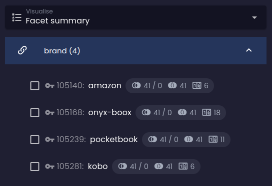

## Reference having

```evitaql-syntax
referenceHaving(
    argument:string!,
    filterConstraint:any+
)
```

<dl>
    <dt>argument:string!</dt>
    <dd>
        the name of the [entity reference](../../use/schema.md#reference) that will be subjected to the filtering
        constraints in the second and subsequent arguments
    </dd>
    <dt>filterConstraint:any+</dt>
    <dd>
        one or more filter constraints that must be satisfied by one of the entity references with name specified in
        the first argument
    </dd>
</dl>

The <LS to="e,j,r,g"><SourceClass>evita_query/src/main/java/io/evitadb/api/query/filter/ReferenceHaving.java</SourceClass></LS><LS to="c"><SourceClass>EvitaDB.Client/Queries/Filter/ReferenceHaving.cs</SourceClass></LS> constraint
eliminates entities which has no reference of particular name satisfying set of filtering constraints. You can examine
either the attributes specified on the relation itself or wrap the filtering constraint
in [`entityHaving`](#entity-having)
constraint to examine the attributes of the referenced entity. The constraint is similar to
SQL [`EXISTS`](https://www.w3schools.com/sql/sql_exists.asp) operator.

To demonstrate how the `referenceHaving` constraint works, let's query for products that have at least one alternative
product specified. The alternative products are stored in the `relatedProducts` reference on the `Product` entity and
have the `category` attribute set to `alternativeProduct`. There can be different types of related products other than
alternative products, for example spare parts and so on - that's why we need to specify the `category` attribute in
the filtering constraint.

<SourceCodeTabs requires="evita_functional_tests/src/test/resources/META-INF/documentation/evitaql-init.java" langSpecificTabOnly>

[Product with at least one `relatedProducts` reference of `alternativeProduct` category](/documentation/user/en/query/filtering/examples/references/reference-having.evitaql)
</SourceCodeTabs>

Returns the following result:

<Note type="info">

<NoteTitle toggles="true">

##### Products with at least one `relatedProducts` reference of `alternativeProduct` category

</NoteTitle>

<LS to="e,j,c">

<MDInclude>[Products with at least one `relatedProducts` reference of `alternativeProduct` category](/documentation/user/en/query/filtering/examples/references/reference-having.evitaql.md)</MDInclude>

</LS>

<LS to="g">

<MDInclude>[Products with at least one `relatedProducts` reference of `alternativeProduct` category](/documentation/user/en/query/filtering/examples/references/reference-having.graphql.json.md)</MDInclude>

</LS>

<LS to="r">

<MDInclude>[Products with at least one `relatedProducts` reference of `alternativeProduct` category](/documentation/user/en/query/filtering/examples/references/reference-having.rest.json.md)</MDInclude>

</LS>

</Note>

If we wanted to query for products that have at least one related product reference of any `category` type, we could use
the following simplified query:

<SourceCodeTabs requires="evita_functional_tests/src/test/resources/META-INF/documentation/evitaql-init.java" langSpecificTabOnly>

[Product with at least one `relatedProducts` reference of any category](/documentation/user/en/query/filtering/examples/references/reference-having-any.evitaql)
</SourceCodeTabs>

Which returns the following result:

<Note type="info">

<NoteTitle toggles="true">

##### Products with at least one `relatedProducts` reference of any category

</NoteTitle>

<LS to="e,j,c">

<MDInclude>[Products with at least one `relatedProducts` reference of any category](/documentation/user/en/query/filtering/examples/references/reference-having-any.evitaql.md)</MDInclude>

</LS>

<LS to="g">

<MDInclude>[Products with at least one `relatedProducts` reference of any category](/documentation/user/en/query/filtering/examples/references/reference-having-any.graphql.json.md)</MDInclude>

</LS>

<LS to="r">

<MDInclude>[Products with at least one `relatedProducts` reference of any category](/documentation/user/en/query/filtering/examples/references/reference-having-any.rest.json.md)</MDInclude>

</LS>

</Note>

Another frequently used use-case is to query for entities that have at least one reference to another entity with
certain primary key. For example, we want to query for products that are related to `brand` with primary key `66465`.
This can be achieved by following query:

<SourceCodeTabs requires="evita_functional_tests/src/test/resources/META-INF/documentation/evitaql-init.java" langSpecificTabOnly>

[Products referencing `brand` of particular primary key](/documentation/user/en/query/filtering/examples/references/reference-having-exact-id.evitaql)
</SourceCodeTabs>

Which returns the following result:

<Note type="info">

<NoteTitle toggles="true">

##### Products with at least one `relatedProducts` reference of any category

</NoteTitle>

<LS to="e,j,c">

<MDInclude>[Products referencing `brand` of particular primary key](/documentation/user/en/query/filtering/examples/references/reference-having-exact-id.evitaql.md)</MDInclude>

</LS>

<LS to="g">

<MDInclude>[Products referencing `brand` of particular primary key](/documentation/user/en/query/filtering/examples/references/reference-having-exact-id.graphql.json.md)</MDInclude>

</LS>

<LS to="r">

<MDInclude>[Products referencing `brand` of particular primary key](/documentation/user/en/query/filtering/examples/references/reference-having-exact-id.rest.json.md)</MDInclude>

</LS>

</Note>

## Entity having

```evitaql-syntax
entityHaving(
    filterConstraint:any+
)
```

<dl>
    <dt>filterConstraint:any+</dt>
    <dd>
        one or more filter constraints that must be satisfied by the target referenced entity of any of the source
        entity references identified by the parent `referenceHaving` constraint
    </dd>
</dl>

The `entityHaving` constraint is used to examine the attributes or other filterable properties of the referenced entity.
It can only be used within the [`referenceHaving`](#reference-having) constraint, which defines the name of the entity
reference that identifies the target entity to be subjected to the filtering restrictions in the `entityHaving`
constraint. The filtering constraints for the entity can use entire range
of [filtering operators](../basics.md#filter-by).

Let's use our previous example to query for products that relate to `brand` with particular attribute `code`:

<SourceCodeTabs requires="evita_functional_tests/src/test/resources/META-INF/documentation/evitaql-init.java" langSpecificTabOnly>

[Products referencing `brand` of with code `apple`](/documentation/user/en/query/filtering/examples/references/entity-having.evitaql)

</SourceCodeTabs>

Which returns the following result:

<Note type="info">

<NoteTitle toggles="true">

##### Products with at least one `relatedProducts` reference of any category

</NoteTitle>

<LS to="e,j,c">

<MDInclude>[Products referencing `brand` of with code `apple`](/documentation/user/en/query/filtering/examples/references/entity-having.evitaql.md)</MDInclude>

</LS>

<LS to="g">

<MDInclude>[Products referencing `brand` of with code `apple`](/documentation/user/en/query/filtering/examples/references/entity-having.graphql.json.md)</MDInclude>

</LS>

<LS to="r">

<MDInclude>[Products referencing `brand` of with code `apple`](/documentation/user/en/query/filtering/examples/references/entity-having.rest.json.md)</MDInclude>

</LS>

</Note>

## Facet having

```evitaql-syntax
facetHaving(
    argument:string!,
    filterConstraint:any+
)
```

<dl>
    <dt>argument:string!</dt>
    <dd>
        the name of the [entity reference](../../use/schema.md#reference) that will be subject to the filtering
        constraints in the second and subsequent arguments
    </dd>
    <dt>filterConstraint:any*</dt>
    <dd>
        zero or more filter constraints that identify the facet (reference) that must be present on the entities in
        the result set
    </dd>
</dl>

The <LS to="e,j,r,g"><SourceClass>evita_query/src/main/java/io/evitadb/api/query/filter/FacetHaving.java</SourceClass></LS><LS to="c"><SourceClass>EvitaDB.Client/Queries/Filter/FacetHaving.cs</SourceClass></LS> filtering
constraint is typically placed inside the [`userFilter`](behavioral.md#user-filter) constraint container and represents
the user's request to drill down the result set by a particular facet. The `facetHaving` constraint works exactly like
the [`referenceHaving`](#reference-having) constraint, but works in conjunction with
the [`facetSummary`](../requirements/facet.md#facet-summary) requirement to correctly calculate the facet statistics
and impact predictions. When used outside the [`userFilter`](behavioral.md#user-filter) constraint container,
the `facetHaving` constraint behaves like the [`referenceHaving`](#reference-having) constraint.

To demonstrate the cooperation between the `facetHaving` constraint inside `userFilter` and the `facetSummary`
requirement, let's query for products in category *e-readers* and request the facet summary for reference `brand`.
At the same time, let's pretend that the user has already checked the *amazon* facet:

<SourceCodeTabs requires="evita_functional_tests/src/test/resources/META-INF/documentation/evitaql-init.java" langSpecificTabOnly>

[Facet having example](/documentation/user/en/query/filtering/examples/references/facet-having.evitaql)

</SourceCodeTabs>

As you can see, when the `facetHaving` constraint is detected in the query and the corresponding facet statistics result
is marked as `requested`, our visualizer chooses to display the facet as checked. The other facet option statistics
reflect the fact that the user has already checked the *amazon* facet option and the predicted numbers are changed
accordingly:

| Facet summary without facet requested              | Facet summary after facet requested             |
|----------------------------------------------------|-------------------------------------------------|
|  |  |

<Note type="info">

<NoteTitle toggles="true">

##### The result of facet having filtering constraint

</NoteTitle>

Because the facet summary JSON is quite long and not very readable, we will only show a simplified version of the facet
summary result in this documentation. As you can see, the selected facet is checked and the predicted numbers have
changed accordingly:

<LS to="e,j,c">

<MDInclude sourceVariable="extraResults.FacetSummary">[The result of facet having filtering constraint](/documentation/user/en/query/filtering/examples/references/facet-having.evitaql.string.md)</MDInclude>

</LS>

<LS to="g">

<MDInclude sourceVariable="data.queryProduct.extraResults.facetSummary">[The result of facet having filtering constraint](/documentation/user/en/query/filtering/examples/references/facet-having.graphql.json.md)</MDInclude>

</LS>

<LS to="r">

<MDInclude sourceVariable="extraResults.facetSummary">[The result of facet having filtering constraint](/documentation/user/en/query/filtering/examples/references/facet-having.rest.json.md)</MDInclude>

</LS>

</Note>