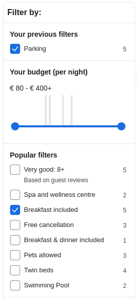
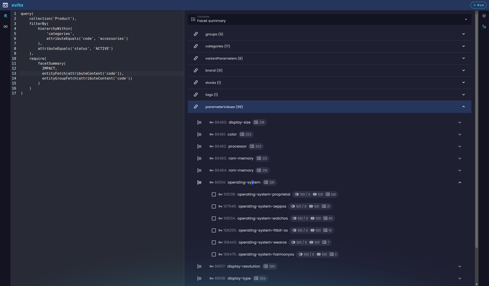
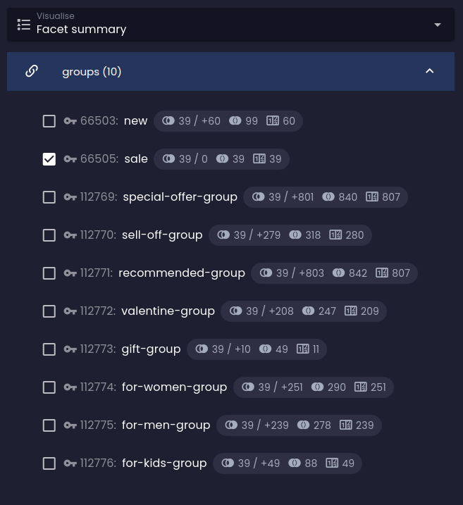
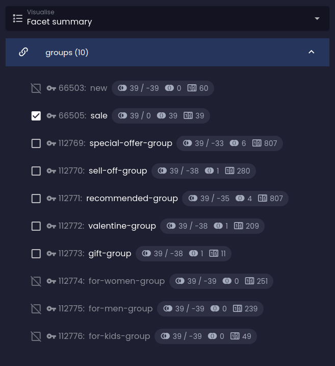
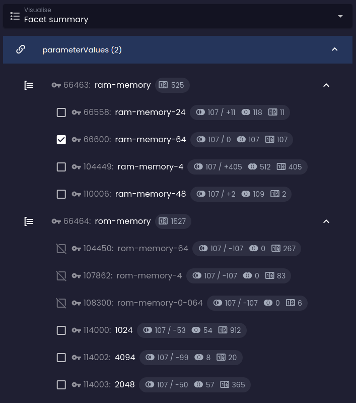
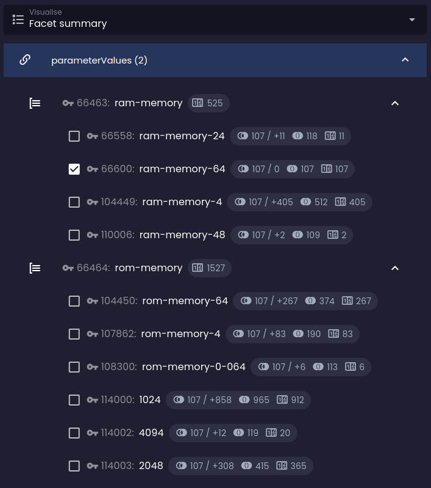
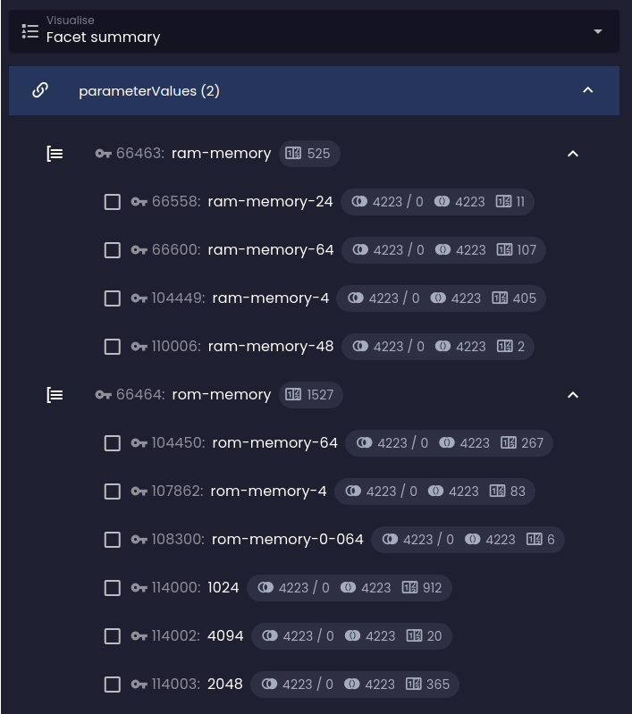
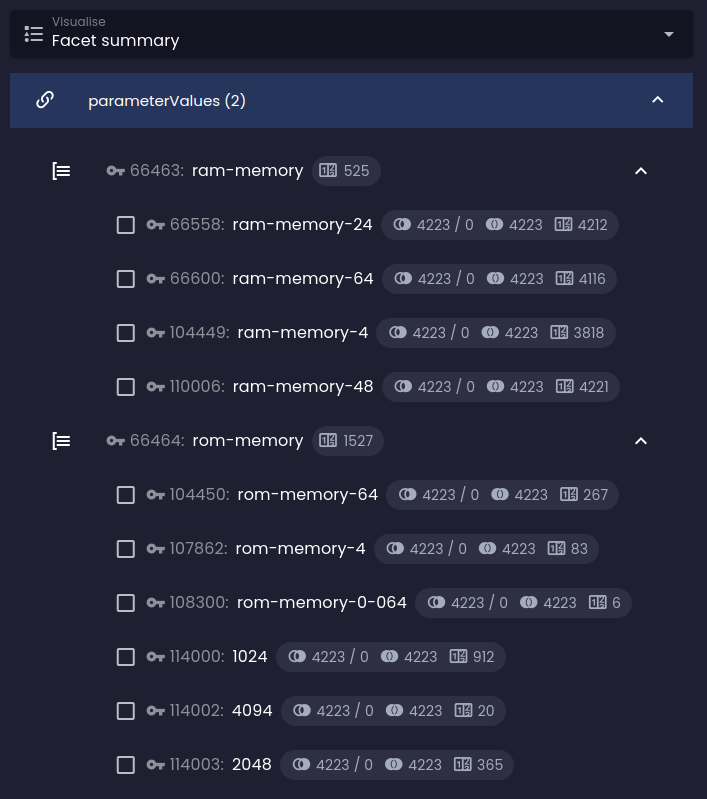

The key success factor of faceted search is to help users avoid situations where their filter combination returns no
results. It works best when we gradually limit the facet options that don't make sense with the ones already selected,
and also provide accurate, on-the-spot, real-time feedback about the number of results that will expand or limit
the current selection when another facet is selected.

Facets are usually displayed as a list of checkboxes, radio buttons, drop-down menus, or sliders, and are organized into
groups. The options within a group usually expand the current selection (logical disjunction), and the groups are usually
combined with logical conjunction. Some of the facets can be negated (logical negation) to exclude results that match
the facet option.

High cardinality facets are sometimes presented in the form of a search box or interval slider (sometimes with
a [histogram](histogram.md) of the distribution of values) to allow users to specify the exact value or range of values
they are looking for.

evitaDB supports all of the above forms of facet search using the operators documented in this chapter and
in [histogram](histogram.md).

## evitaLab visualization

If you want to get more familiar with the facet summary calculation, you can try to play with the query and see how it affects the visualization tab you can find in our [evitaLab](https://demo.evitadb.io) console:



The visualization is organized in the same way as the facet summary itself:

| Icon                                                                                          | Meaning                                                                                                                                                                                                         |
|-----------------------------------------------------------------------------------------------|-----------------------------------------------------------------------------------------------------------------------------------------------------------------------------------------------------------------|
|                                                   | At the top level, you can see the links marked with the chain icon.                                                                                                                                          |
|                                            | Below them are the groups found within these reference types, marked with the group icon, and finally below the groups are the facet options themselves.                                     |
|                                           | Represents the number of entities returned that match this facet option when the user has no other facets selected (i.e., has an empty [`userFilter`](../filtering/behavioral.md#user-filter) constraint). |
|  | Represents the current number of entities returned that match the filter constraints, next to the slash there is a difference in the number of results when this facet option is added to the user filter.             |
|                 | Represents the total number of entities that will be displayed in the result when this facet option is selected (i.e., the number of entities that match the facet option in the entire dataset). )                   |

### Facet calculation rules

1. The facet summary is calculated only for entities that are returned in the current query result (excluding the effect of `userFilter` part of the query if present)
2. The calculation respects any filter constraints placed outside the [`userFilter`](../filtering/behavioral.md#user-filter)
   container.
3. The default relation between facets within a group is logical disjunction (logical OR).
4. The default relation between facets in different groups / references is a logical AND.

## Facet summary

<LanguageSpecific to="evitaql,java,csharp">

```evitaql-syntax
facetSummary(
    argument:enum(COUNTS|IMPACT),
    filterConstraint:filterBy,
    filterConstraint:filterGroupBy,
    orderConstraint:orderBy,
    orderConstraint:orderGroupBy,
    requireConstraint:entityFetch,
    requireConstraint:entityGroupFetch
)
```

<dl>
    <dt>argument:enum(COUNTS|IMPACT)</dt>
    <dd>
        <p>**Default:** `COUNTS`</p>

        <p>optional argument of type <LanguageSpecific to="java,evitaql,rest,graphql"><SourceClass>evita_query/src/main/java/io/evitadb/api/query/require/FacetStatisticsDepth.java</SourceClass></LanguageSpecific><LanguageSpecific to="csharp"><SourceClass>EvitaDB.Client/Queries/Requires/FacetStatisticsDepth.cs</SourceClass></LanguageSpecific>
            that allows you to specify the computation depth of the facet summary:</p>

        <p>
        - **COUNTS**: each facet contains the number of results that match the facet option only
        - **IMPACT**: each non-selected facet contains the prediction of the number of results that would be returned
            if the facet option were selected (the impact analysis), this calculation is affected by the required
            constraints that change the default facet calculation behavior: [conjunction](#facet-groups-conjunction),
            [disjunction](#facet-groups-disjunction), [negation](#facet-groups-negation).
        </p>

    </dd>
    <dt>filterConstraint:filterBy</dt>
    <dd>
        optional filter constraint that limits the facets displayed and calculated in the summary to those that match
        the specified filter constraint.
    </dd>
    <dt>filterConstraint:filterGroupBy</dt>
    <dd>
        optional filter constraint that restricts the entire facet group whose facets are displayed and calculated in
        the summary to those that belong to the facet group matching the filter constraint.
    </dd>
    <dt>orderConstraint:orderBy</dt>
    <dd>
        optional order constraint that specifies the order of the facet options within each facet group
    </dd>
    <dt>orderConstraint:orderGroupBy</dt>
    <dd>
        optional order constraint that specifies the order of the facet groups
    </dd>
	<dt>requireConstraint:entityFetch</dt>
    <dd>
        optional requirement constraint that allows you to fetch the referenced entity body; the `entityFetch`
        constraint can contain nested `referenceContent` with an additional `entityFetch` / `entityGroupFetch`
        constraints that allows you to fetch the entities in a graph-like manner to an "infinite" depth
    </dd>
    <dt>requireConstraint:entityGroupFetch</dt>
    <dd>
        optional requirement constraint that allows you to fetch the referenced entity group body; the `entityGroupFetch`
        constraint can contain nested `referenceContent` with an additional `entityFetch` / `entityGroupFetch`
        constraints that allows you to fetch the entities in a graph-like manner to an "infinite" depth
    </dd>
</dl>

</LanguageSpecific>
<LS to="r">

```evitaql-syntax
facetSummary(
    argument:enum(COUNTS|IMPACT),
    requireConstraint:entityFetch,
    requireConstraint:entityGroupFetch
)
```

<dl>
    <dt>argument:enum(COUNTS|IMPACT)</dt>
    <dd>
        <p>**Default:** `COUNTS`</p>

        <p>optional argument of type <SourceClass>evita_query/src/main/java/io/evitadb/api/query/require/FacetStatisticsDepth.java</SourceClass>
            that allows you to specify the computation depth of the facet summary:</p>

        <p>
        - **COUNTS**: each facet contains the number of results that match the facet option only
        - **IMPACT**: each non-selected facet contains the prediction of the number of results that would be returned
            if the facet option were selected (the impact analysis), this calculation is affected by the required
            constraints that change the default facet calculation behavior: [conjunction](#facet-groups-conjunction),
            [disjunction](#facet-groups-disjunction), [negation](#facet-groups-negation).
        </p>

    </dd>
	<dt>requireConstraint:entityFetch</dt>
    <dd>
        optional requirement constraint that allows you to fetch the referenced entity body; the `entityFetch`
        constraint can contain nested `referenceContent` with an additional `entityFetch` / `entityGroupFetch`
        constraints that allows you to fetch the entities in a graph-like manner to an "infinite" depth
    </dd>
    <dt>requireConstraint:entityGroupFetch</dt>
    <dd>
        optional requirement constraint that allows you to fetch the referenced entity group body; the `entityGroupFetch`
        constraint can contain nested `referenceContent` with an additional `entityFetch` / `entityGroupFetch`
        constraints that allows you to fetch the entities in a graph-like manner to an "infinite" depth
    </dd>
</dl>

</LS>

<LS to="e,j,r,c">

The request triggers the calculation of the <LanguageSpecific to="java,evitaql,rest"><SourceClass>evita_api/src/main/java/io/evitadb/api/requestResponse/extraResult/FacetSummary.java</SourceClass></LanguageSpecific><LanguageSpecific to="csharp"><SourceClass>EvitaDB.Client/Models/ExtraResults/FacetSummary.cs</SourceClass></LanguageSpecific>
containing the facet summary calculation. The calculated facet summary will contain all entity references marked as
`faceted` in the [entity schema](../../use/schema.md). The facet summary can be further modified by the
[facet summary of reference](#facet-summary-of-reference) constraint, which allows you to override the general facet
summary behavior specified in the generic facet summary require constraint.

</LS>

<LS to="g">

The facet summary can be requested with the `facetSummary` field within extra results. This request triggers the calculation
of the facet summary object, which contains the facet summary calculation.
The calculated facet summary can contain all entity references marked as
`faceted` in the [entity schema](../../use/schema.md). The facet summary calculation is requested separately for each reference, so
each reference can have its own behaviour defined.

</LS>

<Note type="warning">

The `faceted` property affects the size of the indexes kept in memory and the scale / complexity of the general facet
summary (i.e. the summary generated by the `facetSummary` request). It is recommended to mark only the references used
for faceted filtering as `faceted` to keep the indexes small and the calculation of the facet summary in the user
interface fast and simple. The combinatorial complexity of the facet summary is quite high for large datasets, and you
may be forced to optimize it by narrowing the summary using the [filtering](#filtering-facet-summary) facility or
selecting only [a few references](#facet-summary-of-reference) for the summary.

</Note>

### Facet summary structure

The facet summary contains only entities referenced by entities returned in the current query response (excluding the
effect of userFilter part of the query if present) and is organized in a three-tier structure:

- **[reference](#1st-tier-reference)**: the top-level contains the names of the references that are marked as `faceted`
  in the [entity schema](../../use/schema.md)
- **[facet group](#2nd-tier-facet-group)**: the second-level contains the groups that are specified in
  the returned [entity's references](../../use/data-model.md#references)
- **[facet](#3rd-tier-facet)**: the third-level contains the facet options that represent entities of the returned
  [entity's references](../../use/data-model.md#references)

#### 1st tier: reference

For each entity reference marked as `faceted` in the facet summary, there is a separate data container for collection of
the [2nd-tier facet groups](#2nd-tier-facet-group). If the facets for this reference are not organized in groups
(the reference lacks the group information), the facet summary will contain only one facet group named "non-grouped
facets".

#### 2nd tier: facet group

Facet group lists all [facet options](#3rd-tier-facet) available for the given group and reference combination. It also
contains a `count` of all entities in the current query result that match at least one facet in the group / reference.
<LanguageSpecific to="evitaql,java,csharp,rest">
Optionally, it can contain the body of the group entity if the [`entityGroupFetch`](#entity-group-fetch) requirement is
specified.
</LanguageSpecific>
<LanguageSpecific to="graphql">
Optionally, it can contain the body of the group entity if the `groupEntity` field is specified.
</LanguageSpecific>

There may also be a special "group" for facets that are not related to a group.
<LanguageSpecific to="evitaql,java,csharp">
This group will be placed in the facet summary as a `nonGroupedStatistics` property.
</LanguageSpecific>
<LanguageSpecific to="graphql,rest">
This group will be returned as a single group for the reference.
</LanguageSpecific>

#### 3rd tier: facet

Facet contains the statistics for that facet option:

<dl>
  <dt>count</dt>
  <dd>
    It represents the number of all entities in the current query result that match this facet (have reference to entity
    with this primary key).
  </dd>
  <dt>requested</dt>
  <dd>
    `TRUE` if this facet is requested in the [`user filter`](../filtering/behavioral.md#user-filter) container of this
    query, `FALSE` otherwise (this property allows you to easily mark the facet checkbox as checked in the user
    interface).
  </dd>
</dl>

<LanguageSpecific to="evitaql,java,csharp,rest">
And optionally the body of the facet (referenced) entity if the [`entityFetch`](#entity-fetch) requirement is specified.
If the `IMPACT` statistics depth is requested in the facet summary, the statistics will also include the impact analysis
calculation, which contains the following data:
</LanguageSpecific>
<LanguageSpecific to="graphql">
And optionally the body of the facet (referenced) entity if the `facetEntity` field is specified.
If the `impact` object is requested in the facet summary, the statistics will also include the impact analysis
calculation, which can contains the following data:
</LanguageSpecific>

<dl>
  <dt>matchCount</dt>
  <dd>
    It represents the number of all entities that would match a new query derived from the current query if this
    particular facet option were selected (has reference to entity with this primary key). The current query is left
    intact, including the [`user filter`](../filtering/behavioral.md#user-filter) part, but a new facet query is
    virtually added to the user filter to calculate the hypothetical impact of selecting the facet option.
  </dd>
  <dt>difference</dt>
  <dd>
    It represents the difference between the `matchCount` (hypothetical result should this facet be selected) and
    the current number of entities returned. It represents the size of the impact on the current result. It can be
    either positive (the facet option would expand the current result) or negative (the facet option would limit
    the current result). The difference can be `0` if the facet option doesn't change the current result.
  </dd>
  <dt>hasSense</dt>
  <dd>
    `TRUE` if the facet option combined with the current query still returns some results (matchCount > 0), `FALSE`
    otherwise. This property allows you to easily mark the facet checkbox as "disabled" in the user interface.
  </dd>
</dl>

<LS to="e,j,r,c">

The <LanguageSpecific to="java,evitaql,rest,graphql"><SourceClass>evita_query/src/main/java/io/evitadb/api/query/require/FacetSummary.java</SourceClass></LanguageSpecific><LanguageSpecific to="csharp"><SourceClass>EvitaDB.Client/Queries/Requires/FacetSummary.cs</SourceClass></LanguageSpecific> requirement
triggers the calculation of the <LanguageSpecific to="java,evitaql,rest,graphql"><SourceClass>evita_api/src/main/java/io/evitadb/api/requestResponse/extraResult/FacetSummary.java</SourceClass></LanguageSpecific><LanguageSpecific to="csharp"><SourceClass>EvitaDB.Client/Models/ExtraResults/FacetSummary.cs</SourceClass></LanguageSpecific>
extra result. The facet summary is always computed as a side result of the main entity query and respects any filtering
constraints placed on the queried entities. To demonstrate the facet summary calculation, we will use the following
example:

<SourceCodeTabs requires="evita_functional_tests/src/test/resources/META-INF/documentation/evitaql-init.java" langSpecificTabOnly>

[Facet summary calculation for products in "e-readers" category](/documentation/user/en/query/requirements/examples/facet/facet-summary.evitaql)

</SourceCodeTabs>

</LS>

<LanguageSpecific to="graphql">

When the `facetSummary` field is specified with specific references within the `extraResults` field is specified, it triggers the calculation
of the facet summary extra result.
The facet summary is always computed as a side result of the main entity query, and respects any filter
constraints placed on the queried entities. To demonstrate the facet summary calculation, we will use the following
example:

<SourceCodeTabs requires="evita_functional_tests/src/test/resources/META-INF/documentation/evitaql-init.java" langSpecificTabOnly>

[Facet summary calculation for products in "e-readers" category](/documentation/user/en/query/requirements/examples/facet/facet-summary-of-reference-simple.evitaql)

</SourceCodeTabs>

</LanguageSpecific>

<Note type="info">

<NoteTitle toggles="true">

##### The result of the facet summarization in the "e-readers" category

</NoteTitle>

The query returns a list of "active" products in the "e-readers" category, and in the extra results index it also
includes the facet summary calculation:

<LanguageSpecific to="evitaql,java,csharp">

<MDInclude sourceVariable="extraResults.FacetSummary">[The result of the facet summarization in the "e-readers" category](/documentation/user/en/query/requirements/examples/facet/facet-summary.evitaql.string.md)</MDInclude>

</LanguageSpecific>
<LanguageSpecific to="graphql">

<MDInclude sourceVariable="data.queryProduct.extraResults.facetSummary">[The result of the facet summarization in the "e-readers" category](/documentation/user/en/query/requirements/examples/facet/facet-summary-of-reference-simple.graphql.json.md)</MDInclude>

</LanguageSpecific>
<LanguageSpecific to="rest">

<MDInclude sourceVariable="extraResults.facetSummary">[The result of the facet summarization in the "e-readers" category](/documentation/user/en/query/requirements/examples/facet/facet-summary.rest.json.md)</MDInclude>

</LanguageSpecific>

<LanguageSpecific to="evitaql,java,csharp">

The format has been simplified because the raw JSON result would be too long and hard to read. This is the output format
of the `prettyPrint` method of <SourceClass>evita_api/src/main/java/io/evitadb/api/requestResponse/extraResult/FacetSummary.java</SourceClass>
and you can see the summary organized in a three-tier structure, along with the information about the number of result
entities for each of the facets and facet groups. No facet is currently selected and therefore the lead `[ ]` is
not checked anywhere. The listing doesn't contain any human-readable information except the primary keys of
the references, facet groups, and facets - to get them we would have to add [their bodies](#fetching-facet-group-bodies).

</LanguageSpecific>
<LanguageSpecific to="graphql,rest">

You can see the summary organized in a three-tier structure, along with the information about the number of result
entities for each of the facets and facet groups. No facet is currently selected and therefore the `requested` property is
`false` everywhere. The listing doesn't contain any human-readable information except the primary keys of
the references, facet groups, and facets - to get them we would have to add [their bodies](#fetching-facet-group-bodies).

</LanguageSpecific>

</Note>

### Fetching facet (group) bodies

<LanguageSpecific to="evitaql,java,csharp,rest">

The facet summary makes little sense without the bodies of the facet groups and facets. To get those bodies, you need to
add [`entityFetch`](#entity-fetch) or [`entityGroupFetch`](#entity-group-fetch) requirement to the query. Let's modify
the example to fetch the facet summary along with the codes of the facets and their groups:

</LanguageSpecific>
<LanguageSpecific to="graphql">

The facet summary makes little sense without the bodies of the facet groups and facets. To get those bodies, you need to
request [`facetEntity`](#entity-fetch) or [`groupEntity`](#entity-group-fetch) fields. Let's modify
the example to fetch the facet summary along with the codes of the facets and their groups:

</LanguageSpecific>

<LanguageSpecific to="evitaql,java,rest,csharp">

<SourceCodeTabs requires="evita_functional_tests/src/test/resources/META-INF/documentation/evitaql-init.java" langSpecificTabOnly>

[Facet summary calculation with bodies for products in "e-readers" category](/documentation/user/en/query/requirements/examples/facet/facet-summary-bodies.evitaql)

</SourceCodeTabs>

</LanguageSpecific>
<LanguageSpecific to="graphql">

<SourceCodeTabs langSpecificTabOnly>

[Facet summary calculation with bodies for products in "e-readers" category](/documentation/user/en/query/requirements/examples/facet/facet-summary-of-reference-bodies.evitaql)

</SourceCodeTabs>

</LanguageSpecific>

<Note type="info">

<NoteTitle toggles="true">

##### The result of the facet summarization in the "e-readers" category including the referenced entity bodies

</NoteTitle>

Now you can see that the facet summary contains not only the primary keys, but also the somewhat comprehensible codes
of the facets and their respective groups:

<LanguageSpecific to="evitaql,java,csharp">

<MDInclude sourceVariable="extraResults.FacetSummary">[The result of the facet summarization in the "e-readers" category including the referenced entity bodies](/documentation/user/en/query/requirements/examples/facet/facet-summary-bodies.evitaql.string.md)</MDInclude>

</LanguageSpecific>
<LanguageSpecific to="graphql">

<MDInclude sourceVariable="data.queryProduct.extraResults.facetSummary">[The result of the facet summarization in the "e-readers" category including the referenced entity bodies](/documentation/user/en/query/requirements/examples/facet/facet-summary-of-reference-bodies.graphql.json.md)</MDInclude>

</LanguageSpecific>
<LanguageSpecific to="rest">

<MDInclude sourceVariable="extraResults.facetSummary">[The result of the facet summarization in the "e-readers" category including the referenced entity bodies](/documentation/user/en/query/requirements/examples/facet/facet-summary-bodies.rest.json.md)</MDInclude>

</LanguageSpecific>

If you add the desired locale to the query and also list localized names, you'll get a result that's very close to
the version you want to see in the user interface:

<LanguageSpecific to="evitaql,java,rest,csharp">

<SourceCodeTabs requires="evita_functional_tests/src/test/resources/META-INF/documentation/evitaql-init.java" langSpecificTabOnly>

[Facet summary calculation with localized names for products in the "e-readers" category](/documentation/user/en/query/requirements/examples/facet/facet-summary-localized-bodies.evitaql)

</SourceCodeTabs>

</LanguageSpecific>
<LanguageSpecific to="graphql">

<SourceCodeTabs langSpecificTabOnly>

[Facet summary calculation with localized names for products in the "e-readers" category](/documentation/user/en/query/requirements/examples/facet/facet-summary-of-reference-localized-bodies.evitaql)

</SourceCodeTabs>

</LanguageSpecific>

<LanguageSpecific to="evitaql,java,csharp">

<MDInclude sourceVariable="extraResults.FacetSummary">[The result of facet summary with localized names for products in the "e-readers" category](/documentation/user/en/query/requirements/examples/facet/facet-summary-localized-bodies.evitaql.string.md)</MDInclude>

</LanguageSpecific>
<LanguageSpecific to="graphql">

<MDInclude sourceVariable="data.queryProduct.extraResults.facetSummary">[The result of facet summary with localized names for products in the "e-readers" category](/documentation/user/en/query/requirements/examples/facet/facet-summary-of-reference-localized-bodies.graphql.json.md)</MDInclude>

</LanguageSpecific>
<LanguageSpecific to="rest">

<MDInclude sourceVariable="extraResults.facetSummary">[The result of facet summary with localized names for products in the "e-readers" category](/documentation/user/en/query/requirements/examples/facet/facet-summary-localized-bodies.rest.json.md)</MDInclude>

</LanguageSpecific>

</Note>

<LS to="e,j,g,c">

### Filtering facet summary

The facet summary sometimes gets very big, and besides the fact that it is not very useful to show all facet options in
the user interface, it also takes a lot of time to calculate it.
To limit the facet summary, you can use
the [`filterBy`](../basics.md#filter-by) and `filterGroupBy` (which is the same as `filterBy`, but it filters the entire
facet group instead of individual facets) constraints.

<LanguageSpecific to="graphql">

The `filterGroupBy` can be specified on each reference field returning facet groups. The `filterBy` can be specified
deeper in the facet summary structure, specifically within the group definition on the `facetStatistics` field, which
returns the actual facet options.

</LanguageSpecific>

<Note type="warning">

<LanguageSpecific to="evitaql,java,csharp">

If you add the filtering constraints to the `facetSummary` requirement, you can only refer to filterable properties that
are shared by all referenced entities. This may not be feasible in some cases, and you will need to split the generic
`facetSummary` requirement into multiple individual [`facetSummaryOfReference`](#facet-summary-of-reference)
requirements with specific filters for each reference type.

</LanguageSpecific>

<MDInclude>[Behaviour of filtering on referenced entities in facet summary constraint](/documentation/user/en/query/requirements/assets/referenced-filter-note.md)</MDInclude>

</Note>

It's hard to find a good example for filtering a generic facet summary even for our demo dataset, so the example will be
a bit artificial. Let's say we want to display only the facet options whose *code* attribute contains the substring
*ar*, and only those that are within groups with *code* starting with the letter *o*:

<LanguageSpecific to="evitaql,java,csharp">

<SourceCodeTabs requires="evita_functional_tests/src/test/resources/META-INF/documentation/evitaql-init.java" langSpecificTabOnly>

[Filtering facet summary options](/documentation/user/en/query/requirements/examples/facet/facet-summary-filtering.evitaql)

</SourceCodeTabs>

</LanguageSpecific>
<LanguageSpecific to="graphql">

<SourceCodeTabs langSpecificTabOnly>

[Filtering facet summary options](/documentation/user/en/query/requirements/examples/facet/facet-summary-of-reference-filtering.evitaql)

</SourceCodeTabs>

</LanguageSpecific>

<Note type="info">

<NoteTitle toggles="true">

##### The result of facet summary filtering

</NoteTitle>

We don't limit the search to a specific hierarchy because the filter is quite selective, as you can see in the result:

<LanguageSpecific to="evitaql,java,csharp">

<MDInclude sourceVariable="extraResults.FacetSummary">[The result of facet summary filtering](/documentation/user/en/query/requirements/examples/facet/facet-summary-filtering.evitaql.string.md)</MDInclude>

</LanguageSpecific>
<LanguageSpecific to="graphql">

<MDInclude sourceVariable="data.queryProduct.extraResults.facetSummary">[The result of facet summary filtering](/documentation/user/en/query/requirements/examples/facet/facet-summary-of-reference-filtering.graphql.json.md)</MDInclude>

</LanguageSpecific>

</Note>

</LS>

<LS to="e,j,g,c">

### Ordering facet summary

<MDInclude>[Ordering facet summary](/documentation/user/en/query/requirements/assets/ordering-facet-summary.md)</MDInclude>

<LanguageSpecific to="graphql">
The `orderGroupBy` can be specified on each reference field returning facet groups. The `orderBy` can be specified
deeper in the facet summary structure, specifically inside the group definition on `facetStatistics` field returning actual
facet options.
</LanguageSpecific>

<Note type="warning">

<LanguageSpecific to="evitaql,java,csharp">

If you add the ordering constraints to the `facetSummary` requirement, you can only refer to sortable properties that
are shared by all referenced entities. This may not be feasible in some cases, and you will need to split the generic
`facetSummary` requirement into multiple individual [`facetSummaryOfReference`](#facet-summary-of-reference)
requirements with specific ordering constraints for each reference type.

</LanguageSpecific>

<MDInclude>[Behaviour of ordering on referenced entities in facet summary constraint](/documentation/user/en/query/requirements/assets/referenced-order-note.md)</MDInclude>

</Note>

Let's sort both facet groups and facets alphabetically by their English names:

<LanguageSpecific to="evitaql,java,csharp">

<SourceCodeTabs requires="evita_functional_tests/src/test/resources/META-INF/documentation/evitaql-init.java" langSpecificTabOnly>

[Sort facet summary options](/documentation/user/en/query/requirements/examples/facet/facet-summary-ordering.evitaql)

</SourceCodeTabs>

</LanguageSpecific>
<LanguageSpecific to="graphql,rest">

<SourceCodeTabs langSpecificTabOnly>

[Sort facet summary options](/documentation/user/en/query/requirements/examples/facet/facet-summary-of-reference-ordering.evitaql)

</SourceCodeTabs>

</LanguageSpecific>

<Note type="info">

<NoteTitle toggles="true">

##### The result of facet summary sorting

</NoteTitle>

You can see that the facet summary is now sorted where appropriate:

<LanguageSpecific to="evitaql,java,csharp">

<MDInclude sourceVariable="extraResults.FacetSummary">[The result of facet summary sorting](/documentation/user/en/query/requirements/examples/facet/facet-summary-ordering.evitaql.string.md)</MDInclude>

</LanguageSpecific>
<LanguageSpecific to="graphql">

<MDInclude sourceVariable="data.queryProduct.extraResults.facetSummary">[The result of facet summary sorting](/documentation/user/en/query/requirements/examples/facet/facet-summary-of-reference-ordering.graphql.json.md)</MDInclude>

</LanguageSpecific>
<LanguageSpecific to="rest">

<MDInclude sourceVariable="extraResults.facetSummary">[The result of facet summary sorting](/documentation/user/en/query/requirements/examples/facet/facet-summary-of-reference-ordering.rest.json.md)</MDInclude>

</LanguageSpecific>

</Note>

</LS>

<LanguageSpecific to="evitaql,java,rest,csharp">

## Facet summary of reference

```evitaql-syntax
facetSummaryOfReference(
    argument:string!,
    argument:enum(COUNTS|IMPACT),
    filterConstraint:filterBy,
    filterConstraint:filterGroupBy,
    orderConstraint:orderBy,
    orderConstraint:orderGroupBy,
    requireConstraint:entityFetch,
    requireConstraint:entityGroupFetch
)
```

<dl>
    <dt>argument:string!</dt>
    <dd>
      mandatory argument specifying the name of the [reference](../../use/schema.md#reference) that is requested by this
      constraint, the reference must be marked as `faceted` in the [entity schema](../../use/schema.md)
    </dd>
    <dt>argument:enum(COUNTS|IMPACT)</dt>
    <dd>
        <p>**Default:** `COUNTS`</p>

        <p>optional argument of type <LS to="e,j,r"><SourceClass>evita_query/src/main/java/io/evitadb/api/query/require/FacetStatisticsDepth.java</SourceClass></LS><LS to="c"><SourceClass>EvitaDB.Client/Queries/Requires/FacetStatisticsDepth.cs</SourceClass></LS>
            that allows you to specify the computation depth of the facet summary:</p>

        <p>
        - **COUNTS**: each facet contains the number of results that match the facet option only
        - **IMPACT**: each non-selected facet contains the prediction of the number of results that would be returned
            if the facet option were selected (the impact analysis), this calculation is affected by the required
            constraints that change the default facet calculation behavior: [conjunction](#facet-groups-conjunction),
            [disjunction](#facet-groups-disjunction), [negation](#facet-groups-negation).
        </p>
    </dd>
    <dt>filterConstraint:filterBy</dt>
    <dd>
        optional filter constraint that limits the facets displayed and calculated in the summary to those that match
        the specified filter constraint.
    </dd>
    <dt>filterConstraint:filterGroupBy</dt>
    <dd>
        optional filter constraint that restricts the entire facet group whose facets are displayed and calculated in
        the summary to those that belong to the facet group matching the filter constraint.
    </dd>
    <dt>orderConstraint:orderBy</dt>
    <dd>
        optional order constraint that specifies the order of the facet options within each facet group
    </dd>
    <dt>orderConstraint:orderGroupBy</dt>
    <dd>
        optional order constraint that specifies the order of the facet groups
    </dd>
    <dd>
        optional requirement constraint that allows you to fetch the referenced entity body; the `entityFetch`
        constraint can contain nested `referenceContent` with an additional `entityFetch` / `entityGroupFetch`
        constraints that allows you to fetch the entities in a graph-like manner to an "infinite" depth
    </dd>
    <dt>requireConstraint:entityGroupFetch</dt>
    <dd>
        optional requirement constraint that allows you to fetch the referenced entity group body; the `entityGroupFetch`
        constraint can contain nested `referenceContent` with an additional `entityFetch` / `entityGroupFetch`
        constraints that allows you to fetch the entities in a graph-like manner to an "infinite" depth
    </dd>
</dl>

The <LS to="e,j,r"><SourceClass>evita_query/src/main/java/io/evitadb/api/query/require/FacetSummaryOfReference.java</SourceClass></LS><LanguageSpecific to="csharp"><SourceClass>EvitaDB.Client/Queries/Requires/FacetSummaryOfReference.cs</SourceClass></LanguageSpecific>
requirement triggers the calculation of the <LanguageSpecific to="java,evitaql,rest"><SourceClass>evita_api/src/main/java/io/evitadb/api/requestResponse/extraResult/FacetSummary.java</SourceClass></LanguageSpecific><LanguageSpecific to="csharp"><SourceClass>EvitaDB.Client/Models/ExtraResults/FacetSummary.cs</SourceClass></LanguageSpecific>
for a specific reference. When a generic [`facetSummary`](#facet-summary) requirement is specified, this require constraint
overrides the default constraints from the generic requirement to constraints specific to this particular reference.
By combining the generic [`facetSummary`](#facet-summary) and `facetSummaryOfReference`, you define common requirements
for the facet summary calculation, and redefine them only for references where they are insufficient.
The `facetSummaryOfReference` requirements redefine all constraints from the generic `facetSummary` requirement.

Let's say we want to display the facet summary for products in the _e-readers_ category, but we want the summary to be
computed only for the `brand` and `parameterValues` references. The facets within the `brand` reference should be
ordered by name in alphabetical order, and the facets within the `parameterValues` reference should be ordered by their
`order` attribute, both at the group level and at the facet level. Only the facets inside facet groups (`parameter`)
with `isVisible` attribute equal to `TRUE` should be calculated for the summary:

<SourceCodeTabs requires="evita_functional_tests/src/test/resources/META-INF/documentation/evitaql-init.java" langSpecificTabOnly>

[Calculate facet summary for selected references](/documentation/user/en/query/requirements/examples/facet/facet-summary-of-reference.evitaql)

</SourceCodeTabs>

<Note type="info">

<NoteTitle toggles="true">

##### The result of facet summarization of named references

</NoteTitle>

As you can see, this is a fairly complex scenario that uses all the key features of the facet summary calculation:

<LS to="e,j,c">

<MDInclude sourceVariable="extraResults.FacetSummary">[The result of facet summarization of named references](/documentation/user/en/query/requirements/examples/facet/facet-summary-of-reference.evitaql.string.md)</MDInclude>

</LS>
<LS to="r">

<MDInclude sourceVariable="extraResults.facetSummary">[The result of facet summarization of named references](/documentation/user/en/query/requirements/examples/facet/facet-summary-of-reference.rest.json.md)</MDInclude>

</LS>
</Note>

</LanguageSpecific>

<LS to="r">

### Filtering facet summary

The facet summary sometimes gets very big, and besides the fact that it is not very useful to show all facet options in
the user interface, it also takes a lot of time to calculate it.
To limit the facet summary, you can use
the [`filterBy`](../basics.md#filter-by) and `filterGroupBy` (which is the same as `filterBy`, but it filters the entire
facet group instead of individual facets) constraints.

<Note type="warning">

You can only filter facets and groups using `facetSummaryOfReference` because a filter container is specific to specific
entity collection which is not known beforehand in the generic `facetSummary`.

<MDInclude>[Behaviour of filtering on referenced entities in facet summary constraint](/documentation/user/en/query/requirements/assets/referenced-filter-note.md)</MDInclude>

</Note>

It's hard to find a good example for filtering a generic facet summary even for our demo dataset, so the example will be
a bit artificial. Let's say we want to display only the facet options whose *code* attribute contains the substring
*ar*, and only those that are within groups with *code* starting with the letter *o*:

<SourceCodeTabs langSpecificTabOnly>

[Filtering facet summary options](/documentation/user/en/query/requirements/examples/facet/facet-summary-of-reference-filtering.evitaql)

</SourceCodeTabs>

<Note type="info">

<NoteTitle toggles="true">

##### The result of facet summary filtering

</NoteTitle>

We don't limit the search to a specific hierarchy because the filter is quite selective, as you can see in the result:

<MDInclude sourceVariable="extraResults.facetSummary">[The result of facet summary filtering](/documentation/user/en/query/requirements/examples/facet/facet-summary-of-reference-filtering.rest.json.md)</MDInclude>

</Note>

</LS>

<LS to="r">

### Ordering facet summary

<MDInclude>[Ordering facet summary](/documentation/user/en/query/requirements/assets/ordering-facet-summary.md)</MDInclude>

<Note type="warning">

You can only sort facets and groups using `facetSummaryOfReference` because a filter container is specific to specific
entity collection which is not known beforehand in the generic `facetSummary`.

<MDInclude>[Behaviour of ordering on referenced entities in facet summary constraint](/documentation/user/en/query/requirements/assets/referenced-order-note.md)</MDInclude>

</Note>

Let's sort both facet groups and facets alphabetically by their English names:

<SourceCodeTabs langSpecificTabOnly>

[Sort facet summary options](/documentation/user/en/query/requirements/examples/facet/facet-summary-of-reference-ordering.evitaql)

</SourceCodeTabs>

<Note type="info">

<NoteTitle toggles="true">

##### The result of facet summary sorting

</NoteTitle>

You can see that the facet summary is now sorted where appropriate:

<MDInclude sourceVariable="extraResults.facetSummary">[The result of facet summary sorting](/documentation/user/en/query/requirements/examples/facet/facet-summary-of-reference-ordering.rest.json.md)</MDInclude>

</Note>

</LS>

</LanguageSpecific>

## Entity group fetch

<LanguageSpecific to="evitaql,java,csharp,rest">

The `entityGroupFetch` constraint used within the [`facetSummary`](#facet-summary) or
[`facetSummaryOfReference`](#facet-summary-of-reference) requirement is identical to
the [`entityFetch`](fetching.md#entity-fetch) requirement described in the referenced chapter. The only difference is
that the `entityGroupFetch` refers to the related group entity schema specified by the faceted
[reference schema](../../use/schema.md#reference), and is named `entityGroupFetch` instead of `entityFetch` to
distinguish the requirements for referenced (facet) entity and referenced (facet) entity group.

</LanguageSpecific>
<LanguageSpecific to="graphql">

The `groupEntity` field used within the facet group object in the [`facetSummary`](#facet-summary) has same meaning
as [standard entity fetching](fetching.md#entity-fetch). The only difference is
that the `groupEntity` refers to the related group entity schema specified by the faceted
[reference schema](../../use/schema.md#reference).

</LanguageSpecific>

## Entity fetch

<LanguageSpecific to="evitaql,java,csharp,rest">

The `entityFetch` constraint used within the [`facetSummary`](#facet-summary) or
[`facetSummaryOfReference`](#facet-summary-of-reference) requirement is identical to
the [`entityFetch`](fetching.md#entity-fetch) requirement described in the referenced chapter. The only difference
is that the `entityFetch` refers to the related entity schema specified by the faceted [reference schema](../../use/schema.md#reference).

</LanguageSpecific>

<LanguageSpecific to="graphql">

The `facetEntity` field used within the facet object in the [`facetSummary`](#facet-summary) has same meaning
as [standard entity fetching](fetching.md#entity-fetch). The only difference is that the `facetEntity` refers to the
related entity schema specified by the faceted [reference schema](../../use/schema.md#reference).

</LanguageSpecific>

## Facet groups conjunction

```evitaql-syntax
facetGroupsConjunction(
    argument:string!,
    filterConstraint:filterBy
)
```

<dl>
    <dt>argument:string!</dt>
    <dd>
        Mandatory argument specifying the name of the [reference](../../use/schema.md#reference) to which this
        constraint refers.
    </dd>
    <dt>filterConstraint:filterBy</dt>
    <dd>
        Optional filter constraint that selects one or more facet groups whose facets will be combined with logical AND
        instead of the default logical OR.

        If the filter is not defined, the behavior applies to all groups of a given reference in the facet summary.
    </dd>
</dl>

The <LanguageSpecific to="java,evitaql,rest,graphql"><SourceClass>evita_query/src/main/java/io/evitadb/api/query/require/FacetGroupsConjunction.java</SourceClass></LanguageSpecific><LanguageSpecific to="csharp"><SourceClass>EvitaDB.Client/Queries/Requires/FacetGroupsConjunction.cs</SourceClass></LanguageSpecific>
changes the default behavior of the facet summary calculation for the facet groups specified in the `filterBy`
constraint. Instead of logical disjunction (logical OR), the facet options in the facet groups are combined with logical
conjunction (logical AND).

<Note type="warning">

<MDInclude>[Behaviour of filtering on referenced entities in facet groups conjunction constraint](/documentation/user/en/query/requirements/assets/referenced-filter-note.md)</MDInclude>

</Note>

To understand the difference between the default behavior and the behavior of this requirement, let's compare the facet
summary calculation for the same query with and without this requirement. We will need a query that targets some
reference (let's say `groups`) and pretend that the user has already requested (checked) some of the facets. If we now
want to calculate the `IMPACT` analysis for the rest of the facets in the group, we will see that changing the default
behavior changes the numbers produced:

<SourceCodeTabs requires="evita_functional_tests/src/test/resources/META-INF/documentation/evitaql-init.java" langSpecificTabOnly>

[Facet groups conjunction example](/documentation/user/en/query/requirements/examples/facet/facet-groups-conjunction.evitaql)

</SourceCodeTabs>

<Note type="info">

Note that the `facetGroupsConjunction` in the example doesn't contain a `filterBy` constraint, so it applies to all
the facet groups in the facet summary, or in this particular case to facets in the reference `groups` that are not
part of any group.

</Note>

| Default behaviour                                      | Altered behaviour                                    |
|--------------------------------------------------------|------------------------------------------------------|
|  |  |

<Note type="info">

<NoteTitle toggles="true">

##### The result of facet summarization with inverted facet relation behavior

</NoteTitle>

You can see that instead of increasing the number of results in the final set, the impact analysis predicts their
reduction:

<LanguageSpecific to="evitaql,java,csharp">

<MDInclude sourceVariable="extraResults.FacetSummary">[The result of facet summarization with inverted facet relation behavior](/documentation/user/en/query/requirements/examples/facet/facet-groups-conjunction.evitaql.string.md)</MDInclude>

</LanguageSpecific>
<LanguageSpecific to="graphql">

<MDInclude sourceVariable="data.queryProduct.extraResults.facetSummary">[The result of facet summarization with inverted facet relation behavior](/documentation/user/en/query/requirements/examples/facet/facet-groups-conjunction.graphql.json.md)</MDInclude>

</LanguageSpecific>
<LanguageSpecific to="rest">

<MDInclude sourceVariable="extraResults.facetSummary">[The result of facet summarization with inverted facet relation behavior](/documentation/user/en/query/requirements/examples/facet/facet-groups-conjunction.rest.json.md)</MDInclude>

</LanguageSpecific>

</Note>

## Facet groups disjunction

```evitaql-syntax
facetGroupsDisjunction(
    argument:string!,
    filterConstraint:filterBy
)
```

<dl>
    <dt>argument:string!</dt>
    <dd>
        Mandatory argument specifying the name of the [reference](../../use/schema.md#reference) to which this
        constraint refers.
    </dd>
    <dt>filterConstraint:filterBy</dt>
    <dd>
        Optional filter constraint that selects one or more facet groups whose facet options will be combined with logical
        disjunction (logical OR) with facets of different groups instead of the default logical conjunction (logical
        AND).

        If the filter is not defined, the behavior applies to all groups of a given reference in the facet summary.
    </dd>
</dl>

The <LanguageSpecific to="java,evitaql,rest,graphql"><SourceClass>evita_query/src/main/java/io/evitadb/api/query/require/FacetGroupsDisjunction.java</SourceClass></LanguageSpecific><LanguageSpecific to="csharp"><SourceClass>EvitaDB.Client/Queries/Requires/FacetGroupsDisjunction.cs</SourceClass></LanguageSpecific>
changes the default behavior of the facet summary calculation for the facet groups specified in the `filterBy` constraint.
Instead of logical AND, the facet options in the facet groups are combined with logical OR with facets from different
facet groups.

<Note type="warning">

<MDInclude>[Behaviour of filtering on referenced entities in facet groups disjunction constraint](/documentation/user/en/query/requirements/assets/referenced-filter-note.md)</MDInclude>

</Note>

To understand the difference between the default behavior and the behavior of this constraint, let's compare the facet
summary calculation for the same query with and without this constraint. We will need a query that targets some
reference (let's say `parameterValues`) and pretend that the user has already requested (checked) some of the facets.
Now, if we want to calculate the `IMPACT` analysis for the other group in the facet summary, we will see that instead of
reducing the numbers, the impact analysis predicts their expansion:

<SourceCodeTabs requires="evita_functional_tests/src/test/resources/META-INF/documentation/evitaql-init.java" langSpecificTabOnly>

[Facet groups disjunction example](/documentation/user/en/query/requirements/examples/facet/facet-groups-disjunction.evitaql)

</SourceCodeTabs>

| Default behaviour                                       | Altered behaviour                                    |
|---------------------------------------------------------|------------------------------------------------------|
|  |  |

<Note type="info">

<NoteTitle toggles="true">

##### The result of facet summarization with inverted facet group relation behavior

</NoteTitle>

You can see that instead of reducing the number of results in the final set, the impact analysis predicts their
expansion:

<LanguageSpecific to="evitaql,java,csharp">

<MDInclude sourceVariable="extraResults.FacetSummary">[The result of facet summarization with inverted facet group relation behavior](/documentation/user/en/query/requirements/examples/facet/facet-groups-disjunction.evitaql.string.md)</MDInclude>

</LanguageSpecific>
<LanguageSpecific to="graphql">

<MDInclude sourceVariable="data.queryProduct.extraResults.facetSummary">[The result of facet summarization with inverted facet group relation behavior](/documentation/user/en/query/requirements/examples/facet/facet-groups-disjunction.graphql.json.md)</MDInclude>

</LanguageSpecific>
<LanguageSpecific to="rest">

<MDInclude sourceVariable="extraResults.facetSummary">[The result of facet summarization with inverted facet group relation behavior](/documentation/user/en/query/requirements/examples/facet/facet-groups-disjunction.rest.json.md)</MDInclude>

</LanguageSpecific>

</Note>

## Facet groups negation

```evitaql-syntax
facetGroupsNegation(
    argument:string!,
    filterConstraint:filterBy
)
```

<dl>
    <dt>argument:string!</dt>
    <dd>
        Mandatory argument specifying the name of the [reference](../../use/schema.md#reference) to which this
        constraint refers.
    </dd>
    <dt>filterConstraint:filterBy</dt>
    <dd>
        Optional filter constraint that selects one or more facet groups whose facet options are negated. Thus, instead
        of returning only those items that reference that particular faceted entity, the query result will return only
        those items that don't reference it.

        If the filter is not defined, the behavior applies to all groups of a particular reference in the facet summary.
    </dd>
</dl>

The <LanguageSpecific to="java,evitaql,rest,graphql"><SourceClass>evita_query/src/main/java/io/evitadb/api/query/require/FacetGroupsNegation.java</SourceClass></LanguageSpecific><LanguageSpecific to="csharp"><SourceClass>EvitaDB.Client/Queries/Requires/FacetGroupsNegation.cs</SourceClass></LanguageSpecific>
changes the behavior of the facet option in all facet groups specified in the `filterBy` constraint. Instead of returning only
those items that have a reference to that particular faceted entity, the query result will return only those items that
don't have a reference to it.

<Note type="warning">

<MDInclude>[Behaviour of filtering on referenced entities in facet groups negation constraint](/documentation/user/en/query/requirements/assets/referenced-filter-note.md)</MDInclude>

</Note>

To demonstrate this effect, we need a query that targets some reference (let's say `parameterValues`) and makes some of
the listed group as negated.

<SourceCodeTabs requires="evita_functional_tests/src/test/resources/META-INF/documentation/evitaql-init.java" langSpecificTabOnly>

[Facet groups disjunction example](/documentation/user/en/query/requirements/examples/facet/facet-groups-negation.evitaql)

</SourceCodeTabs>

| Default behaviour                                    | Altered behaviour                                    |
|------------------------------------------------------|------------------------------------------------------|
|  |  |

<Note type="info">

<NoteTitle toggles="true">

##### The result of facet summarization with negated facet relation behavior in the group

</NoteTitle>

The predicted results in the negated groups are far greater than the numbers produced by the default behavior. As you
can see, selecting any option in the RAM facet group predicts returning thousands of results, while the ROM facet group
with default behavior predicts only a dozen of them:

<LanguageSpecific to="evitaql,java,csharp">

<MDInclude sourceVariable="extraResults.FacetSummary">[The result of facet summarization with negated facet relation behavior in the group](/documentation/user/en/query/requirements/examples/facet/facet-groups-negation.evitaql.string.md)</MDInclude>

</LanguageSpecific>
<LanguageSpecific to="graphql">

<MDInclude sourceVariable="data.queryProduct.extraResults.facetSummary">[The result of facet summarization with negated facet relation behavior in the group](/documentation/user/en/query/requirements/examples/facet/facet-groups-negation.graphql.json.md)</MDInclude>

</LanguageSpecific>
<LanguageSpecific to="rest">

<MDInclude sourceVariable="extraResults.facetSummary">[The result of facet summarization with negated facet relation behavior in the group](/documentation/user/en/query/requirements/examples/facet/facet-groups-negation.rest.json.md)</MDInclude>

</LanguageSpecific>

</Note>