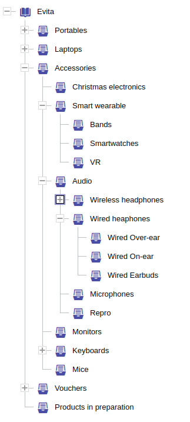
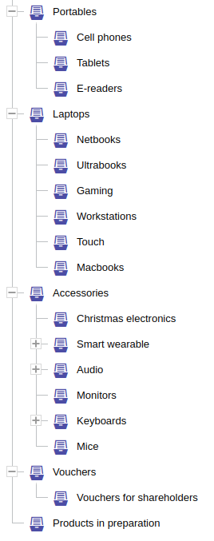
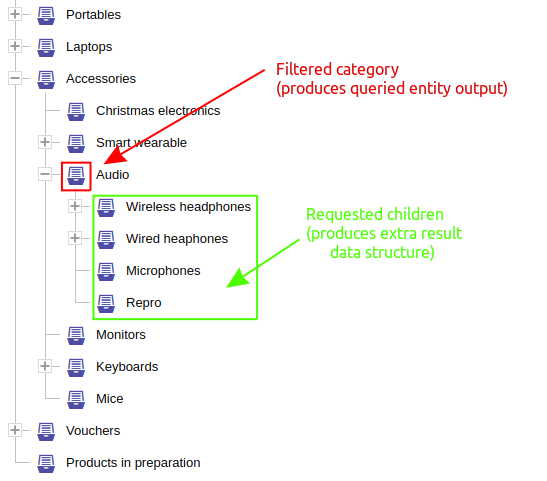
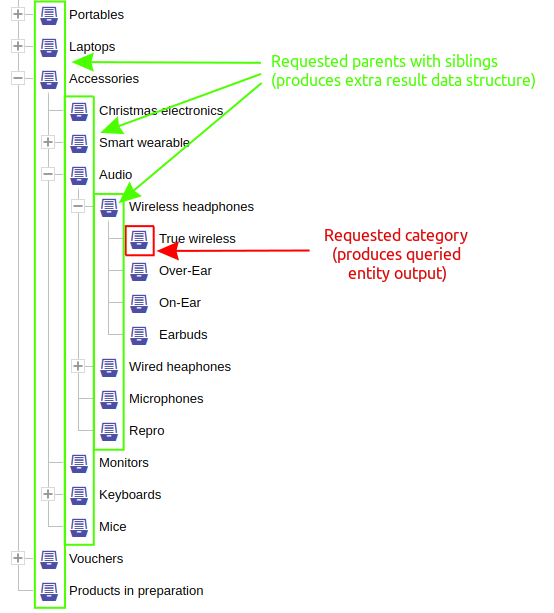
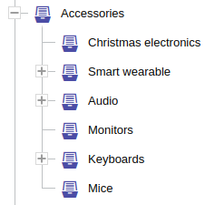

There are many types of menus that can be found on e-commerce sites. Starting with mega menus of various types ...


... direct subcategory menus ...


... over a highly dynamic menu that could be rolled out gradually using plus/minus signs without affecting the real item
listing on the right side of the screen (it's updated by category after selection) ...



... to a hybrid menu that partially opens to a currently selected category and displays only a direct sibling category 
on the parent axis:


There are a huge number of possible variations, and it is difficult to support all of them with a single constraint.
That's why there is an extensible mechanism by which you can request the computation of multiple different parts of the 
hierarchy tree, as you actually need it for your particular user interface use case.

There are two type of top hierarchy requirements:

<dl>
    <dt>[`hierarchyOfSelf`](#hierarchy-of-self)</dt>
    <dd>
        realized by <SourceClass>evita_query/src/main/java/io/evitadb/api/query/require/HierarchyOfSelf.java</SourceClass>
        and is used to compute data structures from the data of the directly queried hierarchical entity
    </dd>
    <dt>[`hierarchyOfReference`](#hierarchy-of-reference)</dt>
    <dd>
        realized by <SourceClass>evita_query/src/main/java/io/evitadb/api/query/require/HierarchyOfReference.java</SourceClass>
        and is used to compute data structures from the data of the entities referencing hierarchical entity
    </dd>
</dl>

These top hierarchy requirements must have at least one of the following hierarchy sub-constraints:

- [`fromRoot`](#from-root)
- [`fromNode`](#from-node)
- [`siblings`](#siblings)
- [`children`](#children)
- [`parents`](#parents)

#### Constraint to result association

<LanguageSpecific to="evitaql,java,csharp,rest">
There can be multiple sub-constraints, and each constraint can be duplicated (usually with different settings).
Each hierarchy sub-constraint defines a [String](https://docs.oracle.com/en/java/javase/17/docs/api/java.base/java/lang/String.html) 
argument with a named value that allows to associate the request constraint with the computed result data structure
in <SourceClass>evita_api/src/main/java/io/evitadb/api/requestResponse/extraResult/Hierarchy.java</SourceClass>
extra result.
</LanguageSpecific>
<LanguageSpecific to="graphql">
There can be multiple sub-requirements, and each requirement can be duplicated (usually with different settings), but in
such case, each requirement must be aliased with unique name (see examples below). Each such sub-requirements then returns
a list of hierarchy tree nodes.

<Note type="info">

<NoteTitle toggles="true">

##### Result hierarchy tree structure
</NoteTitle>

In GraphQL, returning tree data structures of unknown depth is problematic and cannot be solved in developer-friendly way.
That's why we opted for a solution where the tree is returned as a flat list of nodes. Each node contains information
about its depth level in the original tree, so that the tree can be reconstructed on the client side.

Note that the list of nodes is sorted in [depth-first](https://en.wikipedia.org/wiki/Depth-first_search) order, which 
can be used to simplify the reconstruction of the tree on the client side.

</Note>
</LanguageSpecific>

<Note type="info">

<NoteTitle toggles="true">

##### Example of request/response association
</NoteTitle>

The following code snippet contains a query that lists all (transitive) categories in the *Audio* category and also 
returns menu items that contain direct children of the *Audio* category and its direct parent category (which is 
*Accessories*):

<SourceCodeTabs requires="/documentation/user/en/get-started/example/connect-demo-server.java" langSpecificTabOnly>

[Hierarchy request association](/documentation/user/en/query/requirements/examples/hierarchy/hierarchy-data-structure-association.java)
</SourceCodeTabs>

<LanguageSpecific to="evitaql,java,csharp,rest">
Both menu components are stored in the <SourceClass>evita_api/src/main/java/io/evitadb/api/requestResponse/extraResult/Hierarchy.java</SourceClass>
extra result data structure and are available under the labels that correspond to those used in request constraints.
</LanguageSpecific>
<LanguageSpecific to="graphql">
Using the custom aliases for hierarchies, you can easily create custom menu data structures.
</LanguageSpecific>

<LanguageSpecific to="evitaql,java,csharp">

<MDInclude sourceVariable="extraResults.Hierarchy.selfHierarchy">[Output with multiple menu parts](/documentation/user/en/query/requirements/examples/hierarchy/hierarchy-data-structure-association.evitaql.json.md)</MDInclude>

</LanguageSpecific>

<LanguageSpecific to="graphql">

<MDInclude sourceVariable="data.queryCategory.extraResults.hierarchy.self">[Output with multiple menu parts](/documentation/user/en/query/requirements/examples/hierarchy/hierarchy-data-structure-association.graphql.json.md)</MDInclude>

</LanguageSpecific>

<LanguageSpecific to="rest">

<MDInclude sourceVariable="extraResults.hierarchy.self">[Output with multiple menu parts](/documentation/user/en/query/requirements/examples/hierarchy/hierarchy-data-structure-association.rest.json.md)</MDInclude>

</LanguageSpecific>

</Note>

## Hierarchy of self

```evitaql-syntax
hierarchyOfSelf(
    orderConstraint:any,
    requireConstraint:(fromRoot|fromNode|siblings|children|parents)+
)
```

<dl>
    <dt>orderConstraint:any</dt>
    <dd>
        optional ordering constraint that allows you to specify an order of 
        <SourceClass>evita_api/src/main/java/io/evitadb/api/requestResponse/extraResult/Hierarchy.java</SourceClass> 
        `LevelInfo` elements in the result hierarchy data structure
    </dd>
    <dt>requireConstraint:(fromRoot|fromNode|siblings|children|parents)+</dt>
    <dd>
        mandatory one or more constraints allowing you to instruct evitaDB to calculate menu components; 
        one or all of the constraints may be present:
        <ul>
            <li>[fromRoot](#from-root)</li>
            <li>[fromNode](#from-node)</li>
            <li>[siblings](#siblings)</li>
            <li>[children](#children)</li>
            <li>[parents](#parents)</li>
        </ul>
    </dd>
</dl>

The requirement triggers the calculation of the 
<SourceClass>evita_api/src/main/java/io/evitadb/api/requestResponse/extraResult/Hierarchy.java</SourceClass> data 
structure for the hierarchy of which it is a part.

The hierarchy of self can still be combined with [`hierarchyOfReference`](#hierarchy-of-reference) if the queried entity 
is a hierarchical entity that is also connected to another hierarchical entity. Such situations are rather sporadic in 
reality.

## Hierarchy of reference

```evitaql-syntax
hierarchyOfReference(
    argument:string+,
    argument:enum(LEAVE_EMPTY|REMOVE_EMPTY),
    orderConstraint:any,
    requireConstraint:(fromRoot|fromNode|siblings|children|parents)+
)
```

<dl>
    <dt>argument:string+</dt>
    <dd>
        specification of one or more [reference names](../../use/schema.md#reference) that identify the reference
        to the target hierarchical entity for which the menu calculation should be performed;
        usually only one reference name makes sense, but to adapt the constraint to the behavior of other similar 
        constraints, evitaQL accepts multiple reference names for the case that the same requirements apply to different 
        references of the queried entity.
    </dd>
    <dt>argument:enum(LEAVE_EMPTY|REMOVE_EMPTY)</dt>
    <dd>
        optional argument of type <SourceClass>evita_query/src/main/java/io/evitadb/api/query/require/EmptyHierarchicalEntityBehaviour.java</SourceClass>
        enum allowing you to specify whether or not to return empty hierarchical entities (e.g., those that do not have
        any queried entities that satisfy the current query filter constraint assigned to them - either directly or 
        transitively):

        - **LEAVE_EMPTY**: empty hierarchical nodes will remain in computed data structures 
        - **REMOVE_EMPTY**: empty hierarchical nodes are omitted from computed data structures (default behaviour)
    </dd>
    <dt>orderConstraint:any</dt>
    <dd>
        optional ordering constraint that allows you to specify an order of 
        <SourceClass>evita_api/src/main/java/io/evitadb/api/requestResponse/extraResult/Hierarchy.java</SourceClass> 
        `LevelInfo` elements in the result hierarchy data structure
    </dd>
    <dt>requireConstraint:(fromRoot|fromNode|siblings|children|parents)+</dt>
    <dd>
        mandatory one or more constraints allowing you to instruct evitaDB to calculate menu components; 
        one or all of the constraints may be present:
        <ul>
            <li>[fromRoot](#from-root)</li>
            <li>[fromNode](#from-node)</li>
            <li>[siblings](#siblings)</li>
            <li>[children](#children)</li>
            <li>[parents](#parents)</li>
        </ul>
    </dd>
</dl>

The requirement triggers the calculation of the
<SourceClass>evita_api/src/main/java/io/evitadb/api/requestResponse/extraResult/Hierarchy.java</SourceClass> data
structure for the hierarchies of the [referenced entity type](../../use/schema.md#reference).

The hierarchy of reference can still be combined with [`hierarchyOfSelf`](#hierarchy-of-self) if the queried entity
is a hierarchical entity that is also connected to another hierarchical entity. Such situations are rather sporadic in
reality. 

The `hierarchyOfReference` can be repeated multiple times in a single query if you need different calculation
settings for different reference types.

## From root

```evitaql-syntax
fromRoot(
    argument:string!,
    requireConstraint:(entityFetch|stopAt|statistics)*
)
```

<dl>
    <dt>argument:string!</dt>
    <dd>
        mandatory [String](https://docs.oracle.com/en/java/javase/17/docs/api/java.base/java/lang/String.html) argument
        specifying the output name for the calculated data structure 
        (see [constraint to result association](#constraint-to-result-association))
    </dd>
    <dt>requireConstraint:(entityFetch|stopAt|statistics)*</dt>
    <dd>
        optional one or more constraints that allow you to define the completeness of the hierarchy entities, the scope 
        of the traversed hierarchy tree, and the statistics computed along the way; 
        any or all of the constraints may be present:
        <ul>
            <li>[entityFetch](fetching.md#entity-fetch)</li>
            <li>[stopAt](#stop-at)</li>
            <li>[statistics](#statistics)</li>
        </ul>
    </dd>
</dl>

The `fromRoot` requirement computes the hierarchy tree starting from the "virtual" invisible top root of the hierarchy, 
regardless of the potential use of the `hierarchyWithin` constraint in the filtering part of the query. The scope of 
the calculated information can be controlled by the [`stopAt`](#stop-at) constraint. By default, the traversal goes all 
the way to the bottom of the hierarchy tree unless you tell it to stop at anywhere. If you need to access statistical data, 
use [`statistics`](#statistics) constraint. Calculated data is not affected by the `hierarchyWithin` filter constraint - 
the query can filter entities using `hierarchyWithin` from category *Accessories*, while still allowing you to correctly
compute menu at root level.

Please keep in mind that the full statistic calculation can be particularly expensive in the case of the `fromRoot`
requirement - it usually requires aggregation for the entire queried dataset
(see [more information about the calculation](#computational-complexity-of-statistical-data-calculation)).

<Note type="info">

<NoteTitle toggles="true">

##### How the result would look like when using `hierarchyWithin` and `fromRoot` in a single query?
</NoteTitle>

The following query lists products in category *Audio* and its subcategories. Along with the returned products, it also
requires a computed *megaMenu* data structure that lists the top 2 levels of the *Category* hierarchy tree with 
a computed count of child categories for each menu item and an aggregated count of all filtered products that would 
fall into the given category.

<SourceCodeTabs  requires="/documentation/user/en/get-started/example/connect-demo-server.java" langSpecificTabOnly>

[Example of using `hierarchyWithin` and `fromRoot` in a single query](/documentation/user/en/query/requirements/examples/hierarchy/hierarchy-from-root.java)
</SourceCodeTabs>

The computed result of the *megaMenu* looks like this:



... and here is the data structure output in JSON format:

<LanguageSpecific to="evitaql,java,csharp">

<MDInclude sourceVariable="extraResults.Hierarchy.referenceHierarchies.categories.megaMenu">[Example of using `hierarchyWithin` and `fromRoot` in a single query](/documentation/user/en/query/requirements/examples/hierarchy/hierarchy-from-root.evitaql.json.md)</MDInclude>

</LanguageSpecific>

<LanguageSpecific to="graphql">

<MDInclude sourceVariable="data.queryProduct.extraResults.hierarchy.categories.megaMenu">[Example of using `hierarchyWithin` and `fromRoot` in a single query](/documentation/user/en/query/requirements/examples/hierarchy/hierarchy-from-root.graphql.json.md)</MDInclude>

</LanguageSpecific>

<LanguageSpecific to="rest">

<MDInclude sourceVariable="extraResults.hierarchy.categories.megaMenu">[Example of using `hierarchyWithin` and `fromRoot` in a single query](/documentation/user/en/query/requirements/examples/hierarchy/hierarchy-from-root.rest.json.md)</MDInclude>

</LanguageSpecific>

</Note>

The calculated result for `fromRoot` is not affected by the [`hierarchyWithin`](../filtering/hierarchy.md#hierarchy-within)
pivot hierarchy node. If the [`hierarchyWithin`](../filtering/hierarchy.md#hierarchy-within) contains inner constraints
[`having`](../filtering/hierarchy.md#having) or [`excluding`](../filtering/hierarchy.md#excluding), the `fromRoot` respects
them. The reason is simple: when you render a menu for the query result, you want the calculated [statistics](#statistics)
to respect the rules that apply to the [`hierarchyWithin`](../filtering/hierarchy.md#hierarchy-within) so that
the calculated number remains consistent for the end user.

## From node

```evitaql-syntax
fromNode(
    argument:string!,
    requireConstraint:node!,
    requireConstraint:(entityFetch|stopAt|statistics)*
)
```

<dl>
    <dt>argument:string!</dt>
    <dd>
        mandatory [String](https://docs.oracle.com/en/java/javase/17/docs/api/java.base/java/lang/String.html) argument
        specifying the output name for the calculated data structure 
        (see [constraint to result association](#constraint-to-result-association))
    </dd>
    <dt>requireConstraint:node!</dt>
    <dd>
        mandatory require constraint [`node`](#node) that must match exactly one pivot hierarchical entity that 
        represents the root node of the traversed hierarchy subtree.
    </dd>
    <dt>requireConstraint:(entityFetch|stopAt|statistics)*</dt>
    <dd>
        optional one or more constraints that allow you to define the completeness of the hierarchy entities, the scope 
        of the traversed hierarchy tree, and the statistics computed along the way; 
        any or all of the constraints may be present:
        <ul>
            <li>[entityFetch](fetching.md#entity-fetch)</li>
            <li>[stopAt](#stop-at)</li>
            <li>[statistics](#statistics)</li>
        </ul>
    </dd>
</dl>

The `fromNode` requirement computes the hierarchy tree starting from the pivot node of the hierarchy, that is identified
by the [`node`](#node) inner constraint. The `fromNode` calculates the result regardless of the potential use of 
the `hierarchyWithin` constraint in the filtering part of the query. The scope of the calculated
information can be controlled by the [`stopAt`](#stop-at) constraint. By default, the traversal goes all the way to
the bottom of the hierarchy tree unless you tell it to stop at anywhere. Calculated data is not affected by 
the `hierarchyWithin` filter constraint - the query can filter entities using `hierarchyWithin` from category 
*Accessories*, while still allowing you to correctly compute menu at different node defined in a `fromNode` requirement. 
If you need to access statistical data, use [`statistics`](#statistics) constraint.

<Note type="info">

<NoteTitle toggles="true">

##### How to compute different sub-menus using `hierarchyWithin` and `fromNode` in a single query?
</NoteTitle>

The following query lists products in category *Audio* and its subcategories. Along with the products returned, it also 
returns a computed *sideMenu1* and *sideMenu2* data structure that lists the flat category list for the categories 
*Portables* and *Laptops* with a computed count of child categories for each menu item and an aggregated count of all 
products that would fall into the given category.

<SourceCodeTabs  requires="/documentation/user/en/get-started/example/connect-demo-server.java" langSpecificTabOnly>

[Example of using `hierarchyWithin` and `fromNode` in a single query](/documentation/user/en/query/requirements/examples/hierarchy/hierarchy-from-node.java)
</SourceCodeTabs>

The computed result both of the *sideMenu1* and *sideMenu2* looks like this:


... and here is the data structure output in JSON format:

<LanguageSpecific to="evitaql,java,csharp">

<MDInclude sourceVariable="extraResults.Hierarchy.referenceHierarchies.categories">[Example of using `hierarchyWithin` and `fromNode` in a single query](/documentation/user/en/query/requirements/examples/hierarchy/hierarchy-from-node.evitaql.json.md)</MDInclude>

</LanguageSpecific>

<LanguageSpecific to="graphql">

<MDInclude sourceVariable="data.queryProduct.extraResults.hierarchy.categories">[Example of using `hierarchyWithin` and `fromNode` in a single query](/documentation/user/en/query/requirements/examples/hierarchy/hierarchy-from-node.graphql.json.md)</MDInclude>

</LanguageSpecific>

<LanguageSpecific to="rest">

<MDInclude sourceVariable="extraResults.hierarchy.categories">[Example of using `hierarchyWithin` and `fromNode` in a single query](/documentation/user/en/query/requirements/examples/hierarchy/hierarchy-from-node.rest.json.md)</MDInclude>

</LanguageSpecific>

</Note>

The calculated result for `fromNode` is not affected by the [`hierarchyWithin`](../filtering/hierarchy.md#hierarchy-within)
pivot hierarchy node. If the [`hierarchyWithin`](../filtering/hierarchy.md#hierarchy-within) contains inner constraints
[`having`](../filtering/hierarchy.md#having) or [`excluding`](../filtering/hierarchy.md#excluding), the `fromNode` respects
them. The reason is simple: when you render a menu for the query result, you want the calculated [statistics](#statistics)
to respect the rules that apply to the [`hierarchyWithin`](../filtering/hierarchy.md#hierarchy-within) so that
the calculated number remains consistent for the end user.

## Children

```evitaql-syntax
children
    argument:string!,   
    requireConstraint:(entityFetch|stopAt|statistics)*
)
```

<dl>
    <dt>argument:string!</dt>
    <dd>
        mandatory [String](https://docs.oracle.com/en/java/javase/17/docs/api/java.base/java/lang/String.html) argument
        specifying the output name for the calculated data structure 
        (see [constraint to result association](#constraint-to-result-association))
    </dd>
    <dt>requireConstraint:(entityFetch|stopAt|statistics)*</dt>
    <dd>
        optional one or more constraints that allow you to define the completeness of the hierarchy entities, the scope 
        of the traversed hierarchy tree, and the statistics computed along the way; 
        any or all of the constraints may be present:
        <ul>
            <li>[entityFetch](fetching.md#entity-fetch)</li>
            <li>[stopAt](#stop-at)</li>
            <li>[statistics](#statistics)</li>
        </ul>
    </dd>
</dl>

The `children` requirement computes the hierarchy tree starting at the same hierarchy node that is targeted by the
filtering part of the same query using the [`hierarchyWithin`](../filtering/hierarchy.md#hierarchy-within) or 
[`hierarchyWithinRoot`](../filtering/hierarchy.md#hierarchy-within-root) constraints. The scope of the calculated
information can be controlled by the [`stopAt`](#stop-at) constraint. By default, the traversal goes all the way to 
the bottom of the hierarchy tree unless you tell it to stop at anywhere. If you need to access statistical data, use
the [`statistics`](#statistics) constraint.

<Note type="info">

<NoteTitle toggles="true">

##### How to get direct sub-categories of current category using a `children` requirement?
</NoteTitle>

The following query lists products in category *Audio* and its subcategories. Along with the products returned, it also
returns a computed *subcategories* data structure that lists the flat category list the currently focused category
*Audio* with a computed count of child categories for each menu item and an aggregated count of all products that
would fall into the given category.

<SourceCodeTabs  requires="/documentation/user/en/get-started/example/connect-demo-server.java" langSpecificTabOnly>

[Example of using `children` requirement](/documentation/user/en/query/requirements/examples/hierarchy/hierarchy-children.java)
</SourceCodeTabs>

The computed result *subcategories* looks like this:



... and here is the data structure output in JSON format:

<LanguageSpecific to="evitaql,java,csharp">

<MDInclude sourceVariable="extraResults.Hierarchy.referenceHierarchies.categories.subcategories">[Example of using `children` requirement](/documentation/user/en/query/requirements/examples/hierarchy/hierarchy-children.evitaql.json.md)</MDInclude>

</LanguageSpecific>

<LanguageSpecific to="graphql">

<MDInclude sourceVariable="data.queryProduct.extraResults.hierarchy.categories.subcategories">[Example of using `children` requirement](/documentation/user/en/query/requirements/examples/hierarchy/hierarchy-children.graphql.json.md)</MDInclude>

</LanguageSpecific>

<LanguageSpecific to="rest">

<MDInclude sourceVariable="extraResults.hierarchy.categories.subcategories">[Example of using `children` requirement](/documentation/user/en/query/requirements/examples/hierarchy/hierarchy-children.rest.json.md)</MDInclude>

</LanguageSpecific>

</Note>

The calculated result for `children` is connected with the [`hierarchyWithin`](../filtering/hierarchy.md#hierarchy-within)
pivot hierarchy node (or the "virtual" invisible top root referred to by the 
[`hierarchyWithinRoot`](../filtering/hierarchy.md#hierarchy-within-root) constraint). 
If the [`hierarchyWithin`](../filtering/hierarchy.md#hierarchy-within) contains inner constraints
[`having`](../filtering/hierarchy.md#having) or [`excluding`](../filtering/hierarchy.md#excluding), the `children` 
will respect them as well. The reason is simple: when you render a menu for the query result, you want the calculated 
[statistics](#statistics) to respect the rules that apply to the [`hierarchyWithin`](../filtering/hierarchy.md#hierarchy-within) 
so that the calculated number remains consistent for the end user.

## Parents

```evitaql-syntax
parents
    argument:string!,   
    requireConstraint:(siblings|entityFetch|stopAt|statistics)*
)
```

<dl>
    <dt>argument:string!</dt>
    <dd>
        mandatory [String](https://docs.oracle.com/en/java/javase/17/docs/api/java.base/java/lang/String.html) argument
        specifying the output name for the calculated data structure 
        (see [constraint to result association](#constraint-to-result-association))
    </dd>
    <dt>requireConstraint:(siblings|entityFetch|stopAt|statistics)*</dt>
    <dd>
        optional one or more constraints that allow you to define the completeness of the hierarchy entities, the scope 
        of the traversed hierarchy tree, and the statistics computed along the way; 
        any or all of the constraints may be present:
        <ul>
            <li>[siblings](#siblings)</li>
            <li>[entityFetch](fetching.md#entity-fetch)</li>
            <li>[stopAt](#stop-at)</li>
            <li>[statistics](#statistics)</li>
        </ul>
    </dd>
</dl>

The `parents` requirement computes the hierarchy tree starting at the same hierarchy node that is targeted by the
filtering part of the same query using the [`hierarchyWithin`](../filtering/hierarchy.md#hierarchy-within) constraint
towards the root of the hierarchy. The scope of the calculated information can be controlled by the [`stopAt`](#stop-at)
constraint. By default, the traversal goes all the way to the top of the hierarchy tree unless you tell it to stop at
anywhere. If you need to access statistical data, use the [`statistics`](#statistics) constraint.

<Note type="info">

<NoteTitle toggles="true">

##### How to get direct parents of current category using a `parents` requirement?
</NoteTitle>

The following query lists products in the category *Audio* and its subcategories. Along with the products returned, it 
also returns a computed *parentAxis* data structure that lists all the parent nodes of the currently focused category
*True wireless* with a computed count of child categories for each menu item and an aggregated count of all products that
would fall into the given category.

<SourceCodeTabs  requires="/documentation/user/en/get-started/example/connect-demo-server.java" langSpecificTabOnly>

[Example of using `children` requirement](/documentation/user/en/query/requirements/examples/hierarchy/hierarchy-parents.java)
</SourceCodeTabs>

The computed result *parentAxis* looks like this:


... and here is the data structure output in JSON format:

<LanguageSpecific to="evitaql,java,csharp">

<MDInclude sourceVariable="extraResults.Hierarchy.referenceHierarchies.categories.parentAxis">[Example of using `parents` requirement](/documentation/user/en/query/requirements/examples/hierarchy/hierarchy-parents.evitaql.json.md)</MDInclude>

</LanguageSpecific>

<LanguageSpecific to="graphql">

<MDInclude sourceVariable="data.queryProduct.extraResults.hierarchy.categories.parentAxis">[Example of using `parents` requirement](/documentation/user/en/query/requirements/examples/hierarchy/hierarchy-parents.graphql.json.md)</MDInclude>

</LanguageSpecific>

<LanguageSpecific to="rest">

<MDInclude sourceVariable="extraResults.hierarchy.categories.parentAxis">[Example of using `parents` requirement](/documentation/user/en/query/requirements/examples/hierarchy/hierarchy-parents.rest.json.md)</MDInclude>

</LanguageSpecific>

You can also list all siblings of the parent node as you move up the tree:

<SourceCodeTabs  requires="/documentation/user/en/get-started/example/connect-demo-server.java" langSpecificTabOnly>

[Example of using `children` requirement](/documentation/user/en/query/requirements/examples/hierarchy/hierarchy-parents-siblings.java)
</SourceCodeTabs>

The computed result *parentAxis* with siblings now looks like this:



... and here is the data structure output in JSON format:

<LanguageSpecific to="evitaql,java,csharp">

<MDInclude sourceVariable="extraResults.Hierarchy.referenceHierarchies.categories.parentAxis">[Example of using `parents` requirement](/documentation/user/en/query/requirements/examples/hierarchy/hierarchy-parents-siblings.evitaql.json.md)</MDInclude>

</LanguageSpecific>

<LanguageSpecific to="graphql">

<MDInclude sourceVariable="data.queryProduct.extraResults.hierarchy.categories.parentAxis">[Example of using `parents` requirement](/documentation/user/en/query/requirements/examples/hierarchy/hierarchy-parents-siblings.graphql.json.md)</MDInclude>

</LanguageSpecific>

<LanguageSpecific to="rest">

<MDInclude sourceVariable="extraResults.hierarchy.categories.parentAxis">[Example of using `parents` requirement](/documentation/user/en/query/requirements/examples/hierarchy/hierarchy-parents-siblings.rest.json.md)</MDInclude>

</LanguageSpecific>

If you need each of these siblings to fetch their child nodes as well (no matter if they are only one level deep or 
more), you can do this by adding a `stopAt` constraint to the `siblings` constraint container. However, this scenario 
is too complex to cover in this documentation.

</Note>

The calculated result for `parents` is connected with the [`hierarchyWithin`](../filtering/hierarchy.md#hierarchy-within)
pivot hierarchy node. If the [`hierarchyWithin`](../filtering/hierarchy.md#hierarchy-within) contains inner constraints
[`having`](../filtering/hierarchy.md#having) or [`excluding`](../filtering/hierarchy.md#excluding), the `parents`
will respect them as well during child nodes / queried entities statistics calculation. The reason is simple: when you 
render a menu for the query result, you want the calculated [statistics](#statistics) to respect the rules that apply 
to the [`hierarchyWithin`](../filtering/hierarchy.md#hierarchy-within) so that the calculated number remains consistent 
for the end user.

## Siblings

```evitaql-syntax
siblings(
    argument:string!,   
    requireConstraint:(entityFetch|stopAt|statistics)*
)
```

<Note type="warning">

<NoteTitle toggles="false">

##### Different `siblings` syntax when used within `parents` parent constraint
</NoteTitle>

```evitaql-syntax
siblings(      
    requireConstraint:(entityFetch|stopAt|statistics)*
)
```

The `siblings` constraint can be used separately as a child of `hierarchyOfSelf` or `hierarchyOfReference`, or it can be
used as a child constraint of [`parents`](#parents). In such a case, the `siblings` constraint lacks the first string 
argument that defines the name for the output data structure. The reason is that this name is already defined on the 
enclosing `parents` constraint, and the `siblings` constraint simply extends the data available in its data structure.

</Note>

<dl>
    <dt>argument:string!</dt>
    <dd>
        mandatory [String](https://docs.oracle.com/en/java/javase/17/docs/api/java.base/java/lang/String.html) argument
        specifying the output name for the calculated data structure 
        (see [constraint to result association](#constraint-to-result-association))
    </dd>
    <dt>requireConstraint:(entityFetch|stopAt|statistics)*</dt>
    <dd>
        optional one or more constraints that allow you to define the completeness of the hierarchy entities, the scope 
        of the traversed hierarchy tree, and the statistics computed along the way; 
        any or all of the constraints may be present:
        <ul>
            <li>[entityFetch](fetching.md#entity-fetch)</li>
            <li>[stopAt](#stop-at)</li>
            <li>[statistics](#statistics)</li>
        </ul>
    </dd>
</dl>

The `siblings` requirement computes the hierarchy tree starting at the same hierarchy node that is targeted by the
filtering part of the same query using the [`hierarchyWithin`](../filtering/hierarchy.md#hierarchy-within). 
It lists all sibling nodes to the node that is requested by `hierarchyWithin` constraint (that's why the `siblings`
has no sense with `hierarchyWithinRoot` constraint - "virtual" top level node cannot have any siblings). Siblings
will produce a flat list of siblings unless the [`stopAt`](#stop-at) constraint is used as an inner constraint. 
The [`stopAt`](#stop-at) constraint triggers a top-down hierarchy traversal from each of the sibling nodes until 
the [`stopAt`](#stop-at) is satisfied. If you need to access statistical data, use the [`statistics`](#statistics) 
constraint.

<Note type="info">

<NoteTitle toggles="true">

##### How to get sibling nodes of current category using a `siblings` requirement?
</NoteTitle>

The following query lists products in category *Audio* and its subcategories. Along with the products returned, it also
returns a computed *audioSiblings* data structure that lists the flat category list the currently focused category
*Audio* with a computed count of child categories for each menu item and an aggregated count of all products that
would fall into the given category.

<SourceCodeTabs  requires="/documentation/user/en/get-started/example/connect-demo-server.java" langSpecificTabOnly>

[Example of using `siblings` requirement](/documentation/user/en/query/requirements/examples/hierarchy/hierarchy-siblings.java)
</SourceCodeTabs>

The computed result *audioSiblings* looks like this:


... and here is the data structure output in JSON format:

<LanguageSpecific to="evitaql,java,csharp">

<MDInclude sourceVariable="extraResults.Hierarchy.referenceHierarchies.categories.audioSiblings">[Example of using `siblings` requirement](/documentation/user/en/query/requirements/examples/hierarchy/hierarchy-siblings.evitaql.json.md)</MDInclude>

</LanguageSpecific>

<LanguageSpecific to="graphql">

<MDInclude sourceVariable="data.queryProduct.extraResults.hierarchy.categories.audioSiblings">[Example of using `siblings` requirement](/documentation/user/en/query/requirements/examples/hierarchy/hierarchy-siblings.graphql.json.md)</MDInclude>

</LanguageSpecific>

<LanguageSpecific to="rest">

<MDInclude sourceVariable="extraResults.hierarchy.categories.audioSiblings">[Example of using `siblings` requirement](/documentation/user/en/query/requirements/examples/hierarchy/hierarchy-siblings.rest.json.md)</MDInclude>

</LanguageSpecific>

If you need to return all siblings and also the level below them (their children), just use `stopAt` constraint and
extend the default scope of the `siblings` constraint.

<SourceCodeTabs  requires="/documentation/user/en/get-started/example/connect-demo-server.java" langSpecificTabOnly>

[Example of using `siblings` subtree requirement](/documentation/user/en/query/requirements/examples/hierarchy/hierarchy-siblings-with-subtree.java)
</SourceCodeTabs>

The computed result *audioSiblings* with their direct children looks like this (visualized in JSON format):

<LanguageSpecific to="evitaql,java,csharp">

<MDInclude sourceVariable="extraResults.Hierarchy.referenceHierarchies.categories.audioSiblings">[Example of using `siblings` subtree requirement](/documentation/user/en/query/requirements/examples/hierarchy/hierarchy-siblings-with-subtree.evitaql.json.md)</MDInclude>

</LanguageSpecific>

<LanguageSpecific to="graphql">

<MDInclude sourceVariable="data.queryProduct.extraResults.hierarchy.categories.audioSiblings">[Example of using `siblings` subtree requirement](/documentation/user/en/query/requirements/examples/hierarchy/hierarchy-siblings-with-subtree.graphql.json.md)</MDInclude>

</LanguageSpecific>

<LanguageSpecific to="rest">

<MDInclude sourceVariable="extraResults.hierarchy.categories.audioSiblings">[Example of using `siblings` subtree requirement](/documentation/user/en/query/requirements/examples/hierarchy/hierarchy-siblings-with-subtree.rest.json.md)</MDInclude>

</LanguageSpecific>

</Note>

The calculated result for `siblings` is connected with the [`hierarchyWithin`](../filtering/hierarchy.md#hierarchy-within)
pivot hierarchy node. If the [`hierarchyWithin`](../filtering/hierarchy.md#hierarchy-within) contains inner constraints
[`having`](../filtering/hierarchy.md#having) or [`excluding`](../filtering/hierarchy.md#excluding), the `children`
will respect them as well. The reason is simple: when you render a menu for the query result, you want the calculated
[statistics](#statistics) to respect the rules that apply to the [`hierarchyWithin`](../filtering/hierarchy.md#hierarchy-within)
so that the calculated number remains consistent for the end user.

## Stop at

```evitaql-syntax
stopAt(
    requireConstraint:(distance|level|node)!
)
```

<dl>
    <dt>requireConstraint:(distance|level|node)!</dt>
    <dd>
        mandatory constraint that defines the constraint that stops traversing the hierarchy tree when it's satisfied by 
        a currently traversed node; one of the following constraints must be present
        <ul>
            <li>[distance](#distance)</li>
            <li>[level](#level)</li>
            <li>[node](#node)</li>
        </ul>
    </dd>
</dl>

The `stopAt` container constraint is a service wrapping constraint container that only makes sense in combination with 
one of the allowed nested constraints. See the usage examples for specific nested constraints.

## Distance

```evitaql-syntax
distance(
    argument:int!
)
```

<dl>
    <dt>argument:int!</dt>
    <dd>
        defines a maximum relative distance from the pivot node that can be traversed; 
        the pivot node itself is at distance zero, its direct child or direct parent is at distance one, each additional 
        step adds a one to the distance
    </dd>
</dl>

The `distance` constraint can only be used within the `stopAt` container and limits the hierarchy traversal to stop when
the number of levels traversed reaches the specified constant. The distance is always relative to the pivot node 
(the node where the hierarchy traversal starts) and is the same whether we are traversing the hierarchy top-down or 
bottom-up. The distance between any two nodes in the hierarchy can be calculated as `abs(level(nodeA) - level(nodeB))`.
See the following figure when the pivot node is *Audio*:

<Note type="info">

<NoteTitle toggles="true">

##### What are the significant usage examples of the `distance` constraint?
</NoteTitle>

The following query lists products in category *Audio* and its subcategories. Along with the products returned, it also
returns a computed *subcategories* data structure that lists the flat category list the currently focused category
*Audio*.

<SourceCodeTabs  requires="/documentation/user/en/get-started/example/connect-demo-server.java" langSpecificTabOnly>

[Example of using `distance` with `children` requirement](/documentation/user/en/query/requirements/examples/hierarchy/hierarchy-direct-children.java)
</SourceCodeTabs>

Which returns following output:

<LanguageSpecific to="evitaql,java,csharp">

<MDInclude sourceVariable="extraResults.Hierarchy.referenceHierarchies.categories.subcategories">[Direct children](/documentation/user/en/query/requirements/examples/hierarchy/hierarchy-direct-children.evitaql.json.md)</MDInclude>

</LanguageSpecific>

<LanguageSpecific to="graphql">

<MDInclude sourceVariable="data.queryProduct.extraResults.hierarchy.categories.subcategories">[Direct children](/documentation/user/en/query/requirements/examples/hierarchy/hierarchy-direct-children.graphql.json.md)</MDInclude>

</LanguageSpecific>

<LanguageSpecific to="rest">

<MDInclude sourceVariable="extraResults.hierarchy.categories.subcategories">[Direct children](/documentation/user/en/query/requirements/examples/hierarchy/hierarchy-direct-children.rest.json.md)</MDInclude>

</LanguageSpecific>

The following query lists products in the category *Audio* and its subcategories. Along with the products returned, it
also returns a computed *parent* data structure that lists single direct parent category of the currently focused 
*Audio* category.

<SourceCodeTabs requires="/documentation/user/en/get-started/example/connect-demo-server.java" langSpecificTabOnly>

[Example of using `distance` with `parents` requirement](/documentation/user/en/query/requirements/examples/hierarchy/hierarchy-parent.java)
</SourceCodeTabs>

That returns simply:

<LanguageSpecific to="evitaql,java,csharp">

<MDInclude sourceVariable="extraResults.Hierarchy.referenceHierarchies.categories.parent">[Direct parent](/documentation/user/en/query/requirements/examples/hierarchy/hierarchy-parent.evitaql.json.md)</MDInclude>

</LanguageSpecific>

<LanguageSpecific to="graphql">

<MDInclude sourceVariable="data.queryProduct.extraResults.hierarchy.categories.parent">[Direct parent](/documentation/user/en/query/requirements/examples/hierarchy/hierarchy-parent.graphql.json.md)</MDInclude>

</LanguageSpecific>

<LanguageSpecific to="rest">

<MDInclude sourceVariable="extraResults.hierarchy.categories.parent">[Direct parent](/documentation/user/en/query/requirements/examples/hierarchy/hierarchy-parent.rest.json.md)</MDInclude>

</LanguageSpecific>

</Note>

## Level

```evitaql-syntax
level(
    argument:int!
)
```

<dl>
    <dt>argument:int!</dt>
    <dd>
        defines an absolute level number where the traversal should stop;
        if the level is equal to or less (for top-down traversals) / equal to or greater (for bottom-up traversals)
        than the level of the starting (pivot) node, the traversal stops immediately.
    </dd>
</dl>

The `level` constraint can only be used within the `stopAt` container and limits the hierarchy traversal to stop when
the actual level of the traversed node is equal to a specified constant. The "virtual" top invisible node has level 
zero, the top nodes (nodes with `NULL` parent) have level one, their children have level two, and so on. See the 
following figure:

<Note type="info">

<NoteTitle toggles="true">

##### What are the significant usage examples of the `level` constraint?
</NoteTitle>

The following query lists products in *Audio* category and its subcategories. Along with the products returned, it also
returns a computed *megaMenu* data structure that lists top two levels of the entire hierarchy.

<SourceCodeTabs  requires="/documentation/user/en/get-started/example/connect-demo-server.java" langSpecificTabOnly>

[Example of using `level` with `fromRoot` requirement](/documentation/user/en/query/requirements/examples/hierarchy/hierarchy-level.java)
</SourceCodeTabs>

Which returns:

<LanguageSpecific to="evitaql,java,csharp">

<MDInclude sourceVariable="extraResults.Hierarchy.referenceHierarchies.categories.megaMenu">[Top 2 level of categories](/documentation/user/en/query/requirements/examples/hierarchy/hierarchy-level.evitaql.json.md)</MDInclude>

</LanguageSpecific>

<LanguageSpecific to="graphql">

<MDInclude sourceVariable="data.queryProduct.extraResults.hierarchy.categories.megaMenu">[Top 2 level of categories](/documentation/user/en/query/requirements/examples/hierarchy/hierarchy-level.graphql.json.md)</MDInclude>

</LanguageSpecific>

<LanguageSpecific to="rest">

<MDInclude sourceVariable="extraResults.hierarchy.categories.megaMenu">[Top 2 level of categories](/documentation/user/en/query/requirements/examples/hierarchy/hierarchy-level.rest.json.md)</MDInclude>

</LanguageSpecific>

The following query lists products in the *Audio* category and its subcategories. Along with the products returned, it
also returns a computed *parent* data structure that lists all the parents of the currently focused *True wireless*
category up to level two.

<SourceCodeTabs  requires="/documentation/user/en/get-started/example/connect-demo-server.java" langSpecificTabOnly>

[Example of using `level` with `parents` requirement](/documentation/user/en/query/requirements/examples/hierarchy/hierarchy-level-parent.java)
</SourceCodeTabs>

... returns output:

<LanguageSpecific to="evitaql,java,csharp">

<MDInclude sourceVariable="extraResults.Hierarchy.referenceHierarchies.categories.parents">[Parents up to level 2](/documentation/user/en/query/requirements/examples/hierarchy/hierarchy-level-parent.evitaql.json.md)</MDInclude>

</LanguageSpecific>

<LanguageSpecific to="graphql">

<MDInclude sourceVariable="data.queryProduct.extraResults.hierarchy.categories.parents">[Parents up to level 2](/documentation/user/en/query/requirements/examples/hierarchy/hierarchy-level-parent.graphql.json.md)</MDInclude>

</LanguageSpecific>

<LanguageSpecific to="rest">

<MDInclude sourceVariable="extraResults.hierarchy.categories.parents">[Parents up to level 2](/documentation/user/en/query/requirements/examples/hierarchy/hierarchy-level-parent.rest.json.md)</MDInclude>

</LanguageSpecific>

</Note>

## Node

```evitaql-syntax
node(
    filterConstraint:any+
)
```

<dl>
    <dt>filterConstraint:any+</dt>
    <dd>
        defines a criterion that determines the point in a hierarchical structure where the traversal should stop; 
        the traversal stops at the first node that satisfies the filter condition specified in this container
    </dd>
</dl>

The `node` filtering container is an alternative to the [`distance`](#distance) and [`level`](#level) termination 
constraints, which is much more dynamic and can produce hierarchy trees of non-uniform depth. Because the filtering 
constraint can be satisfied by nodes of widely varying depths, traversal can be highly dynamic.

<Note type="info">

<NoteTitle toggles="true">

##### How to dynamically limit hierarchy traversal by `node` filter constraint?
</NoteTitle>

The situations where you'd need this dynamic behavior are few and far between. Unfortunately, we do not have 
a meaningful example of this in the demo dataset, so our example query will be slightly off. But for the sake of 
demonstration, let's list the entire *Accessories* hierarchy, but stop traversing at the nodes whose code starts with 
the letter *w*.

<SourceCodeTabs  requires="/documentation/user/en/get-started/example/connect-demo-server.java" langSpecificTabOnly>

[Example of using `node` with `children` requirement](/documentation/user/en/query/requirements/examples/hierarchy/hierarchy-node.java)
</SourceCodeTabs>

The computed result *subMenu* looks like this (visualized in JSON format):

<LanguageSpecific to="evitaql,java,csharp">

<MDInclude sourceVariable="extraResults.Hierarchy.referenceHierarchies.categories.subMenu">[Example of using `node` requirement](/documentation/user/en/query/requirements/examples/hierarchy/hierarchy-node.evitaql.json.md)</MDInclude>

</LanguageSpecific>

<LanguageSpecific to="graphql">

<MDInclude sourceVariable="data.queryProduct.extraResults.hierarchy.categories.subMenu">[Example of using `node` requirement](/documentation/user/en/query/requirements/examples/hierarchy/hierarchy-node.graphql.json.md)</MDInclude>

</LanguageSpecific>

<LanguageSpecific to="rest">

<MDInclude sourceVariable="extraResults.hierarchy.categories.subMenu">[Example of using `node` requirement](/documentation/user/en/query/requirements/examples/hierarchy/hierarchy-node.rest.json.md)</MDInclude>

</LanguageSpecific>

</Note>

## Statistics

```evitaql-syntax
statistics(
    argument:enum(COMPLETE_FILTER|WITHOUT_USER_FILTER),
    argument:enum(CHILDREN_COUNT|QUERIED_ENTITY_COUNT)+,
)
```

<dl>
    <dt>argument:enum(COMPLETE_FILTER|WITHOUT_USER_FILTER)</dt>
    <dd>
        optional argument of type <SourceClass>evita_query/src/main/java/io/evitadb/api/query/require/StatisticsBase.java</SourceClass>
        enum allowing you to specify the base queried entity set that is the source for statistics calculations:

        - **COMPLETE_FILTER**: complete filtering query constraint
        - **WITHOUT_USER_FILTER**: filtering query constraint where the contents of optional 
            [`userFilter`](../filtering/special.md#user-filter) are ignored

        The calculation always ignores `hierarchyWithin` because the focused part of the hierarchy tree is
        defined on the requirement constraint level, but including having/excluding constraints. The having/excluding 
        constraints are crucial for the calculation of `queriedEntityCount` (and therefore also affects the value of 
        `childrenCount` transitively)
    </dd>
    <dt>argument:enum(CHILDREN_COUNT|QUERIED_ENTITY_COUNT)+</dt>
    <dd>
        mandatory argument of type <SourceClass>evita_query/src/main/java/io/evitadb/api/query/require/StatisticsType.java</SourceClass> 
        enum that specifies which statistics to compute for each node in the returned hierarchy:

        - **CHILDREN_COUNT**: triggers calculation of the count of child hierarchy nodes that exist in the hierarchy 
            tree below the given node; the count is correct regardless of whether the children themselves are 
            requested/traversed by the constraint definition, and respects [`hierarchyOfReference`](#hierarchy-of-reference)
            settings for automatic removal of hierarchy nodes that would contain empty result set of queried entities 
            (REMOVE_EMPTY)
        - **QUERIED_ENTITY_COUNT**: triggers the calculation of the total number of queried entities that will be 
            returned if the current query is focused on this particular hierarchy node using the `hierarchyWithin`
            filter constraint (the possible refining constraint in the form of [`directRelation`](../filtering/hierarchy.md#direct-relation)
            and [`excluding-root`](../filtering/hierarchy.md#excluding-root) is not taken into account).

        one or all possible enum values can be used
    </dd>
</dl>

The `statistics` constraint with `CHILDREN_COUNT` allows you to easily render collapsed menu showing the nodes
available for opening without actually requesting the child nodes from the database:



As you can see, the *Smart wearable*, *Audio*, and *Keyboards* nodes have a plus sign next to them, indicating that 
the user can expand this category.

The `statistics` constraint with `QUERIED_ENTITY_COUNT` allows you to display the number of items hidden behind 
the given hierarchy node (category):


From the series listing, the end user can clearly see how many products make up the series category, no matter how 
branched the series category may be.

<Note type="warning">

<NoteTitle toggles="false">

##### Computational complexity of statistical data calculation
</NoteTitle>

The performance price paid for calculating statistics is not negligible. The calculation of `CHILDREN_COUNT` is cheaper
because it allows to eliminate "dead branches" early and thus conserve the computation cycles. The calculation of
the `QUERIED_ENTITY_COUNT` is more expensive because it requires counting items up to the last one and must be precise.

**We strongly recommend that you avoid using `QUERIED_ENTITY_COUNT` for root hierarchy nodes for large datasets.**

This query actually has to filter and aggregate all the records in the database, which is obviously quite expensive, 
even considering that all the indexes are in-memory. Caching is probably the only way out if you really need to crunch 
these numbers.

</Note>