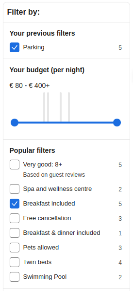
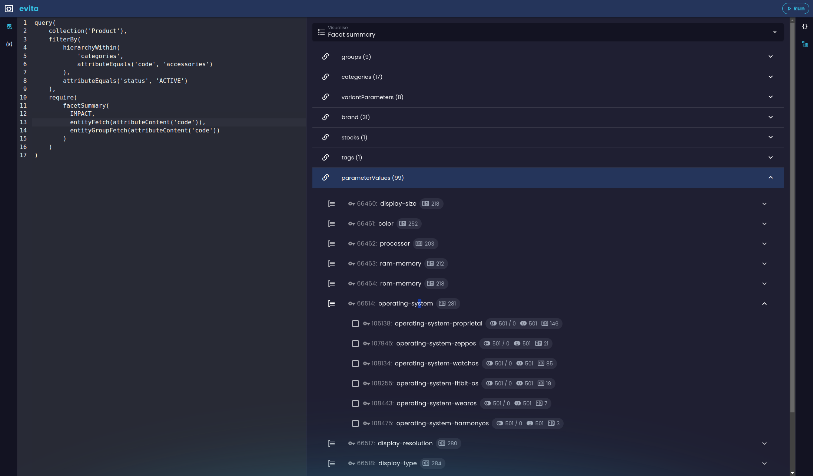
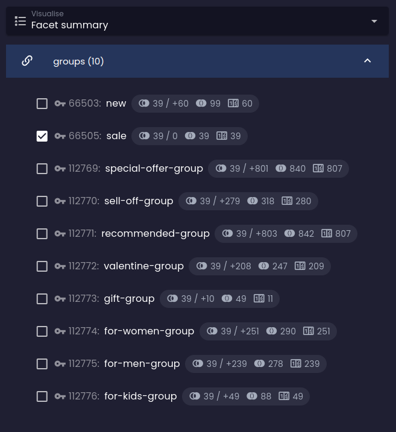
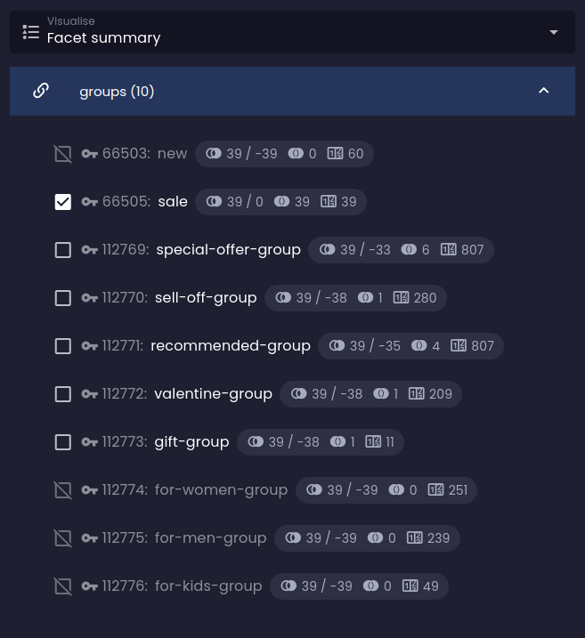
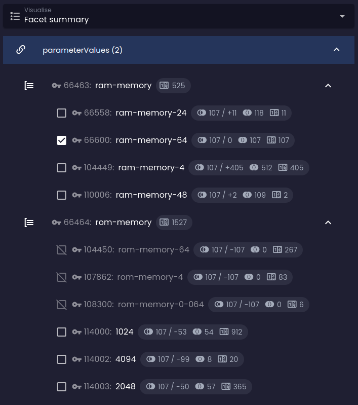
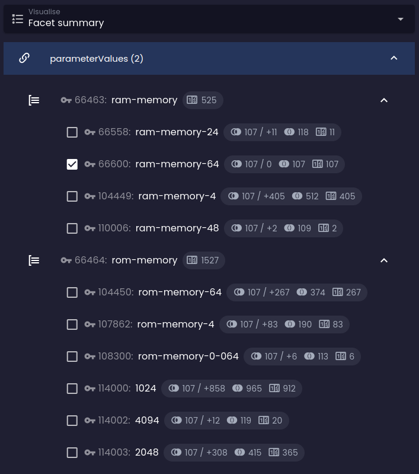
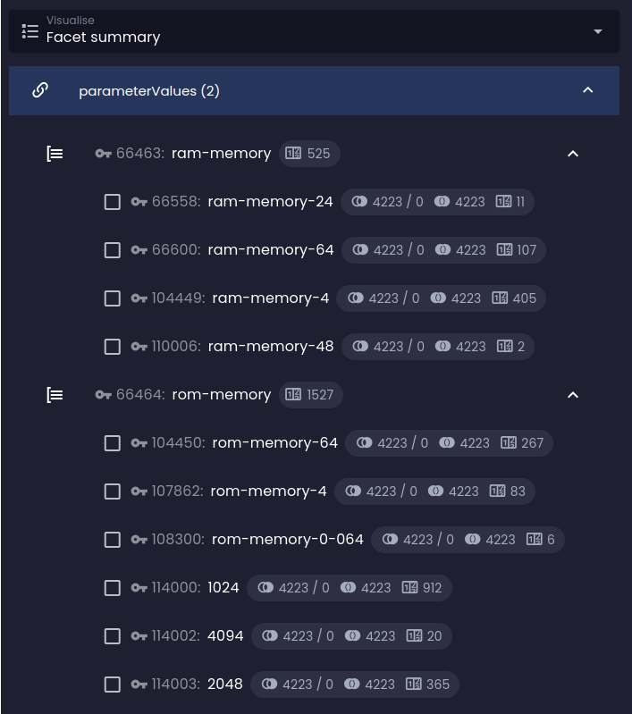
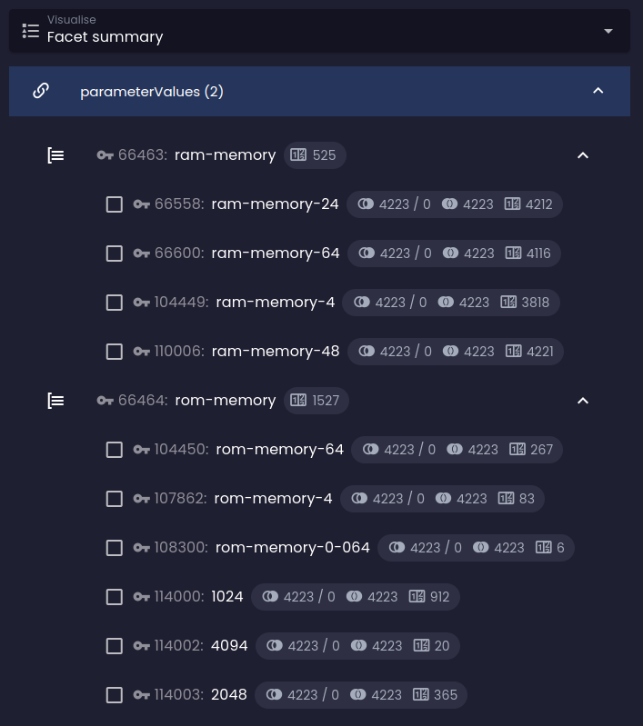
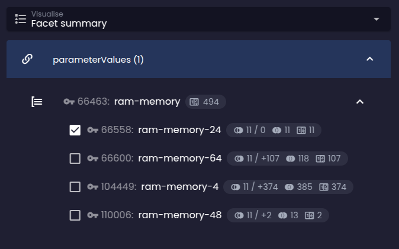

The key success factor of a reference-driven (faceted) search is to help users avoid combinations that return zero
results. It works best when the UI gradually limits the options that wouldn't make sense given what's already been
selected, and provides accurate, on-the-spot, real-time feedback about the number of results that selecting another
option would expand or restrict the current result by.

References are usually presented as lists of checkboxes, radio buttons, drop-down menus, or sliders, and are organised
into groups. Options within a group typically expand the current selection (logical disjunction), and groups are
typically combined with logical conjunction. Some options can be negated (logical negation) to exclude entities that
match them.

High-cardinality options are sometimes presented as a search box or interval slider, often paired with a histogram
of value distribution to let users specify an exact value or numeric range. evitaDB supports all of these shapes
through the constraints documented in this chapter.

## evitaLab visualization

If you want to get a feel for how the reference summary is calculated, try the visualization tab in
[evitaLab](https://demo.evitadb.io):



The visualization mirrors the structure of the summary itself:

| Icon                                                                                          | Meaning                                                                                                                                                                                                              |
|-----------------------------------------------------------------------------------------------|----------------------------------------------------------------------------------------------------------------------------------------------------------------------------------------------------------------------|
|                                                   | At the top level you see the references, marked with the chain icon.                                                                                                                                                 |
|                                        | Below them are the groups found inside those references, marked with the group icon, and below the groups are the individual reference options.                                                                     |
|                                      | The number of returned entities that match this reference option when the user has no other options selected (i.e. the [`userFilter`](../filtering/behavioral.md#user-filter) is empty).                              |
|           | The current number of entities matching the filter constraints; the slash separates this from the difference in result count if this option were added to the user filter.                                          |
|                | The total number of entities the result would contain if this option were selected (i.e. the size of the dataset that matches the option).                                                                          |

### Default reference calculation rules

1. The reference summary is calculated only for entities returned by the current query (excluding the effect of
   the [`userFilter`](../filtering/behavioral.md#user-filter) part of the query if present).
2. The calculation respects every filter constraint placed outside the
   [`userFilter`](../filtering/behavioral.md#user-filter) container.
3. The default relation between options within a group is logical disjunction (logical OR), unless changed.
4. The default relation between options in different groups / references is logical conjunction (logical AND),
   unless changed.

<Note type="info">

You can change the default calculation relations with [`facetCalculationRules`](#facet-calculation-rules) in the
require part of the query. The historical `facet*` naming is kept on the four behaviour-altering constraints
(`facetGroupsConjunction`, `facetGroupsDisjunction`, `facetGroupsNegation`, `facetGroupsExclusivity`,
`facetCalculationRules`) for backwards compatibility — they apply to references regardless of the
constraint's name.

</Note>

## Reference summary

<LS to="e,j,c">

```evitaql-syntax
referenceSummary(
    argument:enum(COUNTS|IMPACT)?,
    filterConstraint:filterBy,
    filterConstraint:filterGroupBy,
    orderConstraint:orderBy,
    orderConstraint:orderGroupBy,
    requireConstraint:entityFetch,
    requireConstraint:entityGroupFetch,
    requireConstraint:histogramStatistics*
)
```

<dl>
    <dt>argument:enum(COUNTS|IMPACT)?</dt>
    <dd>
        <p>**Default:** `COUNTS`</p>
        <p>optional argument of type <LS to="j,e,r,g"><SourceClass>evita_query/src/main/java/io/evitadb/api/query/require/FacetStatisticsDepth.java</SourceClass></LS><LS to="c"><SourceClass>EvitaDB.Client/Queries/Requires/FacetStatisticsDepth.cs</SourceClass></LS>
            controlling how deep the per-option statistics go:</p>
        <p>
        - **COUNTS** *(default, implicit)*: each option carries only the number of returned entities that contain it
        - **IMPACT**: each non-selected option additionally carries an impact prediction (`matchCount`,
            `difference`, `hasSense`) showing what would happen if the user selected it; affected by
            [conjunction](#facet-groups-conjunction), [disjunction](#facet-groups-disjunction),
            [negation](#facet-groups-negation) and [calculation rules](#facet-calculation-rules)
        </p>
    </dd>
    <dt>filterConstraint:filterBy</dt>
    <dd>
        optional filter limiting which **individual reference options** appear in the summary; can only target
        properties shared by **all** referenced entity types — for reference-specific filters use
        [`referenceSummaryOfReference`](#reference-summary-of-reference) instead
    </dd>
    <dt>filterConstraint:filterGroupBy</dt>
    <dd>
        optional filter limiting which **reference groups** appear in the summary; same cross-reference restriction
        as above applies
    </dd>
    <dt>orderConstraint:orderBy</dt>
    <dd>
        optional order constraint that controls the sort order of reference options within each group
    </dd>
    <dt>orderConstraint:orderGroupBy</dt>
    <dd>
        optional order constraint that controls the sort order of reference groups
    </dd>
    <dt>requireConstraint:entityFetch</dt>
    <dd>
        at most one `entityFetch` requirement that controls which fields of the **reference (option) entity** are
        loaded; identical semantics to [`entityFetch`](fetching.md#entity-fetch) elsewhere — supports nested
        `referenceContent` with further `entityFetch` / `entityGroupFetch` to follow the entity graph
    </dd>
    <dt>requireConstraint:entityGroupFetch</dt>
    <dd>
        at most one `entityGroupFetch` requirement that controls which fields of the **reference group entity** are
        loaded
    </dd>
    <dt>requireConstraint:histogramStatistics*</dt>
    <dd>
        zero or more [`histogramStatistics`](#histogram-statistics) children, one per **named bucketed index**
        declared on the reference schema (`bucketed` on the reference). Each child produces a per-group histogram
        keyed by the group entity's primary key and is the data source for slider widgets driven by
        [`histogramHaving`](../filtering/references.md#histogram-having). Only allowed when the targeted reference is
        configured with `bucketed` indexes; otherwise rejected at construction time.
    </dd>
</dl>

</LS>
<LS to="r">

```evitaql-syntax
referenceSummary(
    argument:enum(COUNTS|IMPACT)?,
    requireConstraint:entityFetch,
    requireConstraint:histogramStatistics*
)
```

<dl>
    <dt>argument:enum(COUNTS|IMPACT)?</dt>
    <dd>
        <p>**Default:** `COUNTS`</p>
        <p>statistics depth — see the *Java/EvitaQL/C#* tab for full semantics</p>
    </dd>
    <dt>requireConstraint:entityFetch</dt>
    <dd>
        optional reference-entity fetch
    </dd>
    <dt>requireConstraint:histogramStatistics*</dt>
    <dd>
        zero or more [`histogramStatistics`](#histogram-statistics) children, one per named bucketed index on the
        reference schema; produces per-group histograms keyed by group entity primary key
    </dd>
</dl>

</LS>

<LS to="e,j,r,c">

The <LS to="j,e,r,g"><SourceClass>evita_query/src/main/java/io/evitadb/api/query/require/ReferenceSummary.java</SourceClass></LS><LS to="c"><SourceClass>EvitaDB.Client/Queries/Requires/ReferenceSummary.cs</SourceClass></LS>
requirement triggers the calculation of the <LS to="j,e,r"><SourceClass>evita_api/src/main/java/io/evitadb/api/requestResponse/extraResult/ReferenceSummary.java</SourceClass></LS><LS to="c"><SourceClass>EvitaDB.Client/Models/ExtraResults/ReferenceSummary.cs</SourceClass></LS>
extra result. The summary is **always computed as a side effect of the main entity query** and respects the same
filtering scope as the main result (excluding the [`userFilter`](../filtering/behavioral.md#user-filter) part). It
covers every reference whose schema marks it as `faceted`. Per-reference overrides — different fetch / filter /
ordering settings or different histogram requirements — can be supplied with
[`referenceSummaryOfReference`](#reference-summary-of-reference); the per-reference constraint **completely
replaces** the matching configuration from a generic `referenceSummary` rather than merging with it.

</LS>

<LS to="g">

The reference summary is exposed as the `referenceSummary` field within `extraResults`. Each faceted reference is
queried separately, so per-reference fetch / filter / ordering / histogram configurations sit on the matching
reference field directly (no separate `referenceSummaryOfReference` is needed in GraphQL).

</LS>

To demonstrate the calculation, let's request the summary for products in the *e-readers* category:

<SourceCodeTabs requires="evita_test/evita_documentation_tests/src/test/resources/META-INF/documentation/evitaql-init.java" langSpecificTabOnly>

[Reference summary calculation for products in the *e-readers* category](/documentation/user/en/query/requirements/examples/facet/reference-summary.evitaql)

</SourceCodeTabs>

<Note type="info">

<NoteTitle toggles="true">

##### The reference summary in the *e-readers* category

</NoteTitle>

<LS to="e,j,c">

<MDInclude sourceVariable="extraResults.ReferenceSummary">[Reference summary in the *e-readers* category](/documentation/user/en/query/requirements/examples/facet/reference-summary.evitaql.string.md)</MDInclude>

</LS>
<LS to="g">

<MDInclude sourceVariable="data.queryProduct.extraResults.referenceSummary">[Reference summary in the *e-readers* category](/documentation/user/en/query/requirements/examples/facet/reference-summary.graphql.json.md)</MDInclude>

</LS>
<LS to="r">

<MDInclude sourceVariable="extraResults.referenceSummary">[Reference summary in the *e-readers* category](/documentation/user/en/query/requirements/examples/facet/reference-summary.rest.json.md)</MDInclude>

</LS>

</Note>

### Reference summary structure

The summary contains only entities referenced by entities returned in the current query response (excluding the
effect of the `userFilter` part) and is organised into a three-tier structure:

- **[reference](#1st-tier-reference)**: the top tier — names of the references marked as `faceted` in the
  [entity schema](../../use/schema.md)
- **[reference group](#2nd-tier-reference-group)**: the second tier — groups specified in the returned
  [entity's references](../../use/data-model.md#references)
- **[reference option](#3rd-tier-reference-option)**: the third tier — entities of the returned entity's
  [references](../../use/data-model.md#references)

#### 1st tier: reference

For every reference marked as `faceted`, there is a separate container holding the
[2nd-tier reference groups](#2nd-tier-reference-group). If the options for this reference aren't organised into
groups (the reference lacks group information), the summary contains a single group named *non-grouped options*.

#### 2nd tier: reference group

A reference group lists every [reference option](#3rd-tier-reference-option) available for the given group /
reference combination. It also carries a `count` of all entities in the current query result that match at least
one option in the group / reference.
<LS to="e,j,c,r">
Optionally, it includes the body of the group entity if the [`entityGroupFetch`](#entity-group-fetch) requirement
is specified.
</LS>
<LS to="g">
Optionally, it includes the body of the group entity if the `groupEntity` field is specified.
</LS>

There may also be a special "group" for options that aren't related to a group.
<LS to="e,j,c">
This group sits on the summary as a `nonGroupedStatistics` property.
</LS>
<LS to="g,r">
This group is returned as a single group inside the reference.
</LS>

#### 3rd tier: reference option

A reference option contains the per-option statistics:

<dl>
  <dt>count</dt>
  <dd>
    The number of entities in the current query result (including user-filter constraints) that have this option
    (i.e. reference an entity with this primary key).
  </dd>
  <dt>requested</dt>
  <dd>
    `TRUE` if this option appears in the [`userFilter`](../filtering/behavioral.md#user-filter) container of this
    query, `FALSE` otherwise (so the UI can render the corresponding checkbox as checked).
  </dd>
</dl>

<LS to="e,j,c,r">
Optionally the body of the option entity if the [`entityFetch`](#entity-fetch) requirement is specified.
If the `IMPACT` statistics depth is requested in the summary, the per-option statistics also include the impact
analysis with the following data:
</LS>
<LS to="g">
Optionally the body of the option entity if the `facetEntity` field is specified.
If the `impact` object is requested, the per-option statistics also include the impact analysis with the
following data:
</LS>

<dl>
  <dt>matchCount</dt>
  <dd>
    The number of entities that would match a new query derived from the current one if this option were selected
    (had a reference to the entity with this primary key). The current query is left intact, including the
    [`userFilter`](../filtering/behavioral.md#user-filter), but the option is virtually added to it to compute the
    hypothetical impact.
  </dd>
  <dt>difference</dt>
  <dd>
    The difference between `matchCount` (the hypothetical result) and the current number of returned entities — the
    impact size. It can be positive (the option would expand the result), negative (the option would restrict it),
    or `0` (no change).
  </dd>
  <dt>hasSense</dt>
  <dd>
    `TRUE` if the option combined with the current query still returns some results (matchCount > 0), `FALSE`
    otherwise. Lets the UI mark the corresponding checkbox as *disabled* when selecting it would yield zero results.
  </dd>
</dl>

### Fetching reference (group) bodies

<LS to="e,j,c,r">

The bare summary makes little sense without the bodies of reference options and their groups. To retrieve them, add
[`entityFetch`](#entity-fetch) or [`entityGroupFetch`](#entity-group-fetch) to the query. Let's extend the basic
example so we get the *codes* of the options and their groups:

</LS>
<LS to="g">

The bare summary makes little sense without the bodies of reference options and their groups. To retrieve them,
request the [`facetEntity`](#entity-fetch) or [`groupEntity`](#entity-group-fetch) fields. Let's extend the basic
example so we get the *codes* of the options and their groups:

</LS>

<SourceCodeTabs requires="evita_test/evita_documentation_tests/src/test/resources/META-INF/documentation/evitaql-init.java" langSpecificTabOnly>

[Reference summary with bodies for products in the *e-readers* category](/documentation/user/en/query/requirements/examples/facet/reference-summary-bodies.evitaql)

</SourceCodeTabs>

<Note type="info">

<NoteTitle toggles="true">

##### The reference summary in the *e-readers* category including referenced entity bodies

</NoteTitle>

Now the summary contains not only primary keys but also the readable codes of the options and their groups:

<LS to="e,j,c">

<MDInclude sourceVariable="extraResults.ReferenceSummary">[Reference summary including referenced entity bodies](/documentation/user/en/query/requirements/examples/facet/reference-summary-bodies.evitaql.string.md)</MDInclude>

</LS>
<LS to="g">

<MDInclude sourceVariable="data.queryProduct.extraResults.referenceSummary">[Reference summary including referenced entity bodies](/documentation/user/en/query/requirements/examples/facet/reference-summary-bodies.graphql.json.md)</MDInclude>

</LS>
<LS to="r">

<MDInclude sourceVariable="extraResults.referenceSummary">[Reference summary including referenced entity bodies](/documentation/user/en/query/requirements/examples/facet/reference-summary-bodies.rest.json.md)</MDInclude>

</LS>

</Note>

If you add the desired locale to the query and request the localised names instead of the codes, you'll get a
result that's very close to what the user would see in the UI:

<SourceCodeTabs requires="evita_test/evita_documentation_tests/src/test/resources/META-INF/documentation/evitaql-init.java" langSpecificTabOnly>

[Reference summary with localised names for products in the *e-readers* category](/documentation/user/en/query/requirements/examples/facet/reference-summary-localized-bodies.evitaql)

</SourceCodeTabs>

<Note type="info">

<NoteTitle toggles="true">

##### The reference summary with localised names

</NoteTitle>

<LS to="e,j,c">

<MDInclude sourceVariable="extraResults.ReferenceSummary">[Reference summary with localised names](/documentation/user/en/query/requirements/examples/facet/reference-summary-localized-bodies.evitaql.string.md)</MDInclude>

</LS>
<LS to="g">

<MDInclude sourceVariable="data.queryProduct.extraResults.referenceSummary">[Reference summary with localised names](/documentation/user/en/query/requirements/examples/facet/reference-summary-localized-bodies.graphql.json.md)</MDInclude>

</LS>
<LS to="r">

<MDInclude sourceVariable="extraResults.referenceSummary">[Reference summary with localised names](/documentation/user/en/query/requirements/examples/facet/reference-summary-localized-bodies.rest.json.md)</MDInclude>

</LS>

</Note>

### Filtering the reference summary

The summary can grow very large; besides being useless to display in full, it is also expensive to compute. To
narrow it down, use the [`filterBy`](../basics.md#filter-by) and `filterGroupBy` constraints (the latter is the same
as `filterBy` but operates on whole reference groups instead of individual options).

<LS to="g">

`filterGroupBy` can be specified on each per-reference field returning groups; `filterBy` lives deeper inside the
group definition on the `facetStatistics` field that returns the actual options.

</LS>

<Note type="warning">

<LS to="e,j,c">

When you put filtering inside the generic `referenceSummary` requirement, the constraints can only target filterable
properties **shared by every** referenced entity type. If that's not workable, split the generic `referenceSummary`
into one or more [`referenceSummaryOfReference`](#reference-summary-of-reference) requirements, each with its own
reference-specific filters.

</LS>

<LS to="r">

You can only filter options and groups via `referenceXxxSummary` (the per-reference REST field), because the filter
container is specific to a particular entity collection — and that collection isn't known in advance for the generic
`referenceSummary`.

</LS>

<MDInclude>[Behaviour of filtering on referenced entities](/documentation/user/en/query/requirements/assets/referenced-filter-note.md)</MDInclude>

</Note>

It's hard to find a non-artificial example for filtering the *generic* reference summary even on our demo dataset,
so the example is intentionally contrived. Let's display only options whose *code* attribute contains the substring
*ar*, and only inside groups whose *code* starts with the letter *o*:

<SourceCodeTabs requires="evita_test/evita_documentation_tests/src/test/resources/META-INF/documentation/evitaql-init.java" langSpecificTabOnly>

[Filtering the reference summary options](/documentation/user/en/query/requirements/examples/facet/reference-summary-filtering.evitaql)

</SourceCodeTabs>

<Note type="info">

<NoteTitle toggles="true">

##### The result of filtering the reference summary

</NoteTitle>

We don't restrict the search to a specific hierarchy — the filter alone is selective enough:

<LS to="e,j,c">

<MDInclude sourceVariable="extraResults.ReferenceSummary">[The result of filtering the reference summary](/documentation/user/en/query/requirements/examples/facet/reference-summary-filtering.evitaql.string.md)</MDInclude>

</LS>
<LS to="g">

<MDInclude sourceVariable="data.queryProduct.extraResults.referenceSummary">[The result of filtering the reference summary](/documentation/user/en/query/requirements/examples/facet/reference-summary-filtering.graphql.json.md)</MDInclude>

</LS>
<LS to="r">

<MDInclude sourceVariable="extraResults.referenceSummary">[The result of filtering the reference summary](/documentation/user/en/query/requirements/examples/facet/reference-summary-filtering.rest.json.md)</MDInclude>

</LS>

</Note>

### Ordering the reference summary

Typically, the summary is ordered to surface the most relevant options first; the same goes for ordering reference
groups. Use [`orderBy`](../basics.md#order-by) to sort options and `orderGroupBy` (same shape, applied to groups
instead of options) for the group level.

<LS to="g">

`orderGroupBy` can be specified on each per-reference field returning groups; `orderBy` lives deeper inside the
group definition on the `facetStatistics` field returning the actual options.

</LS>

<Note type="warning">

<LS to="e,j,c">

When ordering inside the generic `referenceSummary`, the constraints can only target sortable properties **shared
by every** referenced entity type. If that's not workable, split the generic `referenceSummary` into one or more
[`referenceSummaryOfReference`](#reference-summary-of-reference) requirements with reference-specific ordering.

</LS>

<LS to="r">

You can only sort options and groups via `referenceXxxSummary` (the per-reference REST field), because the order
container is specific to a particular entity collection — and that collection isn't known in advance for the generic
`referenceSummary`.

</LS>

<MDInclude>[Behaviour of ordering on referenced entities](/documentation/user/en/query/requirements/assets/referenced-order-note.md)</MDInclude>

</Note>

Let's sort both reference groups and options alphabetically by their English names:

<SourceCodeTabs requires="evita_test/evita_documentation_tests/src/test/resources/META-INF/documentation/evitaql-init.java" langSpecificTabOnly>

[Sort reference summary options](/documentation/user/en/query/requirements/examples/facet/reference-summary-ordering.evitaql)

</SourceCodeTabs>

<Note type="info">

<NoteTitle toggles="true">

##### The result of sorting the reference summary

</NoteTitle>

The summary is now sorted where it makes sense:

<LS to="e,j,c">

<MDInclude sourceVariable="extraResults.ReferenceSummary">[The result of sorting the reference summary](/documentation/user/en/query/requirements/examples/facet/reference-summary-ordering.evitaql.string.md)</MDInclude>

</LS>
<LS to="g">

<MDInclude sourceVariable="data.queryProduct.extraResults.referenceSummary">[The result of sorting the reference summary](/documentation/user/en/query/requirements/examples/facet/reference-summary-ordering.graphql.json.md)</MDInclude>

</LS>
<LS to="r">

<MDInclude sourceVariable="extraResults.referenceSummary">[The result of sorting the reference summary](/documentation/user/en/query/requirements/examples/facet/reference-summary-ordering.rest.json.md)</MDInclude>

</LS>

</Note>

### Histogram statistics

```evitaql-syntax
histogramStatistics(
    argument:int!,
    argument:enum(STANDARD|OPTIMIZED|EQUALIZED|EQUALIZED_OPTIMIZED)?,
    requireConstraint:entityFetch?,
    argument:string!+
)
```

<dl>
    <dt>argument:int!</dt>
    <dd>
        mandatory `requestedBucketCount` — the desired number of histogram columns to compute. Pick a value that
        matches the pixel width of the histogram widget in the UI; typical values are **10–50**. The actual bucket
        count may be lower under `OPTIMIZED` / `EQUALIZED_OPTIMIZED` (empty buckets dropped) but never higher.
    </dd>
    <dt>argument:enum(STANDARD|OPTIMIZED|EQUALIZED|EQUALIZED_OPTIMIZED)?</dt>
    <dd>
        <p>**Default:** `STANDARD`</p>

        <p>optional <LS to="j,e,r,g"><SourceClass>evita_query/src/main/java/io/evitadb/api/query/require/HistogramBehavior.java</SourceClass></LS><LS to="c"><SourceClass>EvitaDB.Client/Queries/Requires/HistogramBehavior.cs</SourceClass></LS>
        controlling how the bucket boundaries are placed and whether empty buckets are kept:</p>

        <p>
        - **STANDARD**: exactly `requestedBucketCount` equal-width buckets, including empty ones
        - **OPTIMIZED**: same as `STANDARD`, but empty buckets are removed for a denser display (actual count ≤
            requested)
        - **EQUALIZED**: exactly `requestedBucketCount` buckets with **frequency-equalised** boundaries (each bucket
            ends up with roughly the same number of occurrences)
        - **EQUALIZED_OPTIMIZED**: frequency-equalised boundaries with empty-bucket suppression
        </p>
    </dd>
    <dt>requireConstraint:entityFetch?</dt>
    <dd>
        optional fetch describing how richly the **referenced (option) entities** that contributed to the histogram
        should be loaded; mirrors the standard [`entityFetch`](fetching.md#entity-fetch)
    </dd>
    <dt>argument:string!+</dt>
    <dd>
        one or more **histogram index names** as declared on the reference schema's `bucketed` clause. Each name
        produces a separate histogram entry in the result, keyed by the histogram name; an instance with no index
        names is rejected at construction time.
    </dd>
</dl>

The <LS to="j,e,r,g"><SourceClass>evita_query/src/main/java/io/evitadb/api/query/require/ReferenceHistogramStatistics.java</SourceClass></LS><LS to="c"><SourceClass>EvitaDB.Client/Queries/Requires/ReferenceHistogramStatistics.cs</SourceClass></LS>
require constraint can only appear as a child of [`referenceSummary`](#reference-summary) or
[`referenceSummaryOfReference`](#reference-summary-of-reference) and only on references that declare at least one
`bucketed` index. Each histogram is computed **per group** of the targeted reference: if the reference is
`parameterValues` and the bucketed index is `intervalParameterValues`, you get one histogram per parameter group
(*height*, *weight*, *thickness*, …) inside the corresponding reference group of the summary.

The numeric value plotted in each bucket comes from the `valueExpression` declared on the reference schema's
bucketed index (typically a numeric attribute on the reference or its referenced entity, such as `basicUnitValue`).
The output histogram exposes:

- the catalog-wide `[min, max]` span of the underlying value (the slider's outer handles)
- the bucket list with `threshold` (lower bound, inclusive), `occurrences` and `relativeFrequency`
- a `requested` flag per bucket indicating whether it intersects an active
  [`histogramHaving`](../filtering/references.md#histogram-having) range carrier

The `[min, max]` span is computed by **peeling out** every value-range carrier under `userFilter` — both
`histogramHaving` and `attributeBetween` siblings — so moving a slider does not contract its own outer handles and
sibling sliders in the same family also keep their catalog-wide spans. See
[the peel-by-family rule in behavioral filtering](../filtering/behavioral.md#how-userfilter-shapes-predictions)
for the full matrix.

To attach histograms to a reference summary, use the dedicated `withHistograms` factory variants in Java / C#
(`referenceSummaryWithHistograms` / `referenceSummaryOfReferenceWithHistograms`), which exist to side-step a varargs
overload ambiguity with the `EntityFetchRequire...` factories — the constraints emitted to EvitaQL are still
ordinary `referenceSummary` / `referenceSummaryOfReference`:

<SourceCodeTabs requires="evita_test/evita_documentation_tests/src/test/resources/META-INF/documentation/evitaql-init.java" langSpecificTabOnly>

[E-reader reference summary with weight, height and thickness histograms](/documentation/user/en/query/requirements/examples/facet/reference-summary-histograms.evitaql)

</SourceCodeTabs>

<Note type="info">

<NoteTitle toggles="true">

##### The histogram statistics for e-readers

</NoteTitle>

<LS to="e,j,c">

<MDInclude sourceVariable="extraResults.ReferenceSummary">[Histogram statistics for e-readers](/documentation/user/en/query/requirements/examples/facet/reference-summary-histograms.evitaql.string.md)</MDInclude>

</LS>
<LS to="g">

<MDInclude sourceVariable="data.queryProduct.extraResults.referenceSummary">[Histogram statistics for e-readers](/documentation/user/en/query/requirements/examples/facet/reference-summary-histograms.graphql.json.md)</MDInclude>

</LS>
<LS to="r">

<MDInclude sourceVariable="extraResults.referenceSummary">[Histogram statistics for e-readers](/documentation/user/en/query/requirements/examples/facet/reference-summary-histograms.rest.json.md)</MDInclude>

</LS>

</Note>

## Reference summary of reference

```evitaql-syntax
referenceSummaryOfReference(
    argument:string!,
    argument:enum(COUNTS|IMPACT)?,
    filterConstraint:filterBy,
    filterConstraint:filterGroupBy,
    orderConstraint:orderBy,
    orderConstraint:orderGroupBy,
    requireConstraint:entityFetch,
    requireConstraint:entityGroupFetch,
    requireConstraint:histogramStatistics*
)
```

<dl>
    <dt>argument:string!</dt>
    <dd>
      mandatory reference name as declared in the [entity schema](../../use/schema.md#reference); the reference must
      be marked as `faceted`
    </dd>
    <dt>argument:enum(COUNTS|IMPACT)?</dt>
    <dd>
        statistics depth, same semantics as in [`referenceSummary`](#reference-summary); defaults to `COUNTS`
    </dd>
    <dt>filterConstraint:filterBy</dt>
    <dd>
        filter on the **referenced (option) entity** — because the constraint targets exactly one reference type, you
        can use any filterable property of that entity, not just properties shared across all faceted references
    </dd>
    <dt>filterConstraint:filterGroupBy</dt>
    <dd>
        filter on the **reference group entity**; same per-reference freedom as above
    </dd>
    <dt>orderConstraint:orderBy</dt>
    <dd>
        ordering of reference options within each group; can use any sortable property of the reference entity
    </dd>
    <dt>orderConstraint:orderGroupBy</dt>
    <dd>
        ordering of reference groups by sortable properties of the group entity
    </dd>
    <dt>requireConstraint:entityFetch / entityGroupFetch</dt>
    <dd>
        at most one of each, identical semantics to [`referenceSummary`](#reference-summary)
    </dd>
    <dt>requireConstraint:histogramStatistics*</dt>
    <dd>
        zero or more [`histogramStatistics`](#histogram-statistics) — same rules as for `referenceSummary`, scoped to
        this reference only
    </dd>
</dl>

The <LS to="e,j,r"><SourceClass>evita_query/src/main/java/io/evitadb/api/query/require/ReferenceSummaryOfReference.java</SourceClass></LS><LS to="c"><SourceClass>EvitaDB.Client/Queries/Requires/ReferenceSummaryOfReference.cs</SourceClass></LS>
requirement either stands alone (when only one reference needs a summary) or coexists with a generic
[`referenceSummary`](#reference-summary) to **override its baseline for that single reference**. The override is
total: every constraint on the per-reference variant replaces the matching constraint from the generic one — they
are never merged. This pattern lets you keep a one-line generic baseline and customise only the references that
need it.

Let's display the reference summary for products in the *e-readers* category, but compute it only for the `brand`
and `parameterValues` references. Options inside `brand` should be ordered alphabetically by name; options inside
`parameterValues` should be ordered by their `order` attribute (both at the group and option level), and only
groups (`parameter`) whose `isVisibleInFilter` flag is `TRUE` should appear:

<SourceCodeTabs requires="evita_test/evita_documentation_tests/src/test/resources/META-INF/documentation/evitaql-init.java" langSpecificTabOnly>

[Reference summary for selected references](/documentation/user/en/query/requirements/examples/facet/reference-summary-of-reference.evitaql)

</SourceCodeTabs>

<Note type="info">

<NoteTitle toggles="true">

##### The result of summarising selected references

</NoteTitle>

A fairly complex scenario that exercises every key feature of the per-reference summary:

<LS to="e,j,c">

<MDInclude sourceVariable="extraResults.ReferenceSummary">[The result of summarising selected references](/documentation/user/en/query/requirements/examples/facet/reference-summary-of-reference.evitaql.string.md)</MDInclude>

</LS>
<LS to="g">

<MDInclude sourceVariable="data.queryProduct.extraResults.referenceSummary">[The result of summarising selected references](/documentation/user/en/query/requirements/examples/facet/reference-summary-of-reference.graphql.json.md)</MDInclude>

</LS>
<LS to="r">

<MDInclude sourceVariable="extraResults.referenceSummary">[The result of summarising selected references](/documentation/user/en/query/requirements/examples/facet/reference-summary-of-reference.rest.json.md)</MDInclude>

</LS>

</Note>

## Entity group fetch

<LS to="e,j,c,r">

The `entityGroupFetch` constraint used inside [`referenceSummary`](#reference-summary) or
[`referenceSummaryOfReference`](#reference-summary-of-reference) is identical to
[`entityFetch`](fetching.md#entity-fetch). The only difference is that `entityGroupFetch` refers to the group entity
schema declared on the faceted [reference schema](../../use/schema.md#reference), and is named differently to
distinguish the requirement for the referenced entity from the requirement for its group.

</LS>
<LS to="g">

The `groupEntity` field used inside the reference group object in [`referenceSummary`](#reference-summary) has the
same meaning as [standard entity fetching](fetching.md#entity-fetch). The only difference is that `groupEntity`
refers to the group entity schema declared on the faceted [reference schema](../../use/schema.md#reference).

</LS>

## Entity fetch

<LS to="e,j,c,r">

The `entityFetch` constraint used inside [`referenceSummary`](#reference-summary) or
[`referenceSummaryOfReference`](#reference-summary-of-reference) is identical to
[`entityFetch`](fetching.md#entity-fetch). The only difference is that `entityFetch` refers to the entity schema
declared on the faceted [reference schema](../../use/schema.md#reference).

</LS>

<LS to="g">

The `facetEntity` field used inside the reference option object in [`referenceSummary`](#reference-summary) has the
same meaning as [standard entity fetching](fetching.md#entity-fetch). The only difference is that `facetEntity`
refers to the entity schema declared on the faceted [reference schema](../../use/schema.md#reference).

</LS>

## Facet groups conjunction

```evitaql-syntax
facetGroupsConjunction(
    argument:string!,
    argument:enum(WITH_DIFFERENT_FACETS_IN_GROUP|WITH_DIFFERENT_GROUPS),
    filterConstraint:filterBy
)
```

<dl>
    <dt>argument:string!</dt>
    <dd>
        Mandatory argument specifying the name of the [reference](../../use/schema.md#reference) to which this
        constraint refers.
    </dd>
    <dt>argument:enum(WITH_DIFFERENT_FACETS_IN_GROUP|WITH_DIFFERENT_GROUPS)</dt>
    <dd>
        <p>**Default: `WITH_DIFFERENT_FACETS_IN_GROUP`**</p>
        <p>Optional enumeration argument specifying whether the relationship type should be applied to options at
        a particular level (within the same reference group, or to options in different reference groups /
        references).</p>
    </dd>
    <dt>filterConstraint:filterBy</dt>
    <dd>
        Optional filter constraint that selects one or more reference groups whose options will be combined with
        logical AND instead of the default logical OR.

        If the filter is not defined, the behaviour applies to all groups of a given reference in the summary.
    </dd>
</dl>

The <LS to="j,e,r,g"><SourceClass>evita_query/src/main/java/io/evitadb/api/query/require/FacetGroupsConjunction.java</SourceClass></LS><LS to="c"><SourceClass>EvitaDB.Client/Queries/Requires/FacetGroupsConjunction.cs</SourceClass></LS>
changes the default behaviour of the reference summary calculation for the groups specified in the `filterBy`
constraint. Instead of the default relationship ([either system defaults](#default-reference-calculation-rules) or
[overridden defaults](#facet-calculation-rules)), the options in the targeted groups at the given level are combined
with a logical AND.

<Note type="warning">

<MDInclude>[Behaviour of filtering on referenced entities in facet groups conjunction constraint](/documentation/user/en/query/requirements/assets/referenced-filter-note.md)</MDInclude>

</Note>

To see the difference from the default, compare the same query with and without this requirement. We need a query
that targets some reference (let's say `groups`) and pretends some options have already been requested (checked).
If we now compute the `IMPACT` analysis for the rest of the options in the group, we'll see that the numbers
change:

<SourceCodeTabs requires="evita_test/evita_documentation_tests/src/test/resources/META-INF/documentation/evitaql-init.java" langSpecificTabOnly>

[Facet groups conjunction example](/documentation/user/en/query/requirements/examples/facet/facet-groups-conjunction.evitaql)

</SourceCodeTabs>

<Note type="info">

The `facetGroupsConjunction` in this example doesn't carry a `filterBy`, so it applies to every group in the
summary — or, in this particular case, to the options in the `groups` reference that are not part of any group.
We don't specify a level either, so it defaults to `WITH_DIFFERENT_FACETS_IN_GROUP`.

</Note>

| Default behaviour                                       | Altered behaviour                                    |
|---------------------------------------------------------|------------------------------------------------------|
|  |  |

<Note type="info">

<NoteTitle toggles="true">

##### The result with inverted option-relation behaviour

</NoteTitle>

Instead of increasing the number of results, impact analysis now predicts a reduction:

<LS to="e,j,c">

<MDInclude sourceVariable="extraResults.ReferenceSummary">[The result with inverted option-relation behaviour](/documentation/user/en/query/requirements/examples/facet/facet-groups-conjunction.evitaql.string.md)</MDInclude>

</LS>
<LS to="g">

<MDInclude sourceVariable="data.queryProduct.extraResults.referenceSummary">[The result with inverted option-relation behaviour](/documentation/user/en/query/requirements/examples/facet/facet-groups-conjunction.graphql.json.md)</MDInclude>

</LS>
<LS to="r">

<MDInclude sourceVariable="extraResults.referenceSummary">[The result with inverted option-relation behaviour](/documentation/user/en/query/requirements/examples/facet/facet-groups-conjunction.rest.json.md)</MDInclude>

</LS>

</Note>

## Facet groups disjunction

```evitaql-syntax
facetGroupsDisjunction(
    argument:string!,
    argument:enum(WITH_DIFFERENT_FACETS_IN_GROUP|WITH_DIFFERENT_GROUPS),
    filterConstraint:filterBy
)
```

<dl>
    <dt>argument:string!</dt>
    <dd>
        Mandatory argument specifying the name of the [reference](../../use/schema.md#reference) to which this
        constraint refers.
    </dd>
    <dt>argument:enum(WITH_DIFFERENT_FACETS_IN_GROUP|WITH_DIFFERENT_GROUPS)</dt>
    <dd>
        <p>**Default: `WITH_DIFFERENT_FACETS_IN_GROUP`**</p>
        <p>Optional enumeration argument specifying whether the relationship type should be applied to options at
        a particular level (within the same reference group, or to options in different reference groups /
        references).</p>
    </dd>
    <dt>filterConstraint:filterBy</dt>
    <dd>
        Optional filter constraint that selects one or more reference groups whose options will be combined with
        logical disjunction (logical OR) with options from different groups instead of the default logical
        conjunction (logical AND).

        If the filter is not defined, the behaviour applies to all groups of a given reference in the summary.
    </dd>
</dl>

The <LS to="j,e,r,g"><SourceClass>evita_query/src/main/java/io/evitadb/api/query/require/FacetGroupsDisjunction.java</SourceClass></LS><LS to="c"><SourceClass>EvitaDB.Client/Queries/Requires/FacetGroupsDisjunction.cs</SourceClass></LS>
changes the default behaviour of the reference summary calculation for the groups specified in the `filterBy`
constraint. Instead of the default relationship ([either system defaults](#default-reference-calculation-rules) or
[overridden defaults](#facet-calculation-rules)), options in the targeted groups at the given level are combined
with logical OR.

<Note type="warning">

<MDInclude>[Behaviour of filtering on referenced entities in facet groups disjunction constraint](/documentation/user/en/query/requirements/assets/referenced-filter-note.md)</MDInclude>

</Note>

To compare with the default behaviour, we use a query that targets some reference (let's say `parameterValues`) and
pretends the user has already requested some options. The `IMPACT` analysis for the other group then predicts an
expansion instead of a reduction:

<SourceCodeTabs requires="evita_test/evita_documentation_tests/src/test/resources/META-INF/documentation/evitaql-init.java" langSpecificTabOnly>

[Facet groups disjunction example](/documentation/user/en/query/requirements/examples/facet/facet-groups-disjunction.evitaql)

</SourceCodeTabs>

| Default behaviour                                       | Altered behaviour                                    |
|---------------------------------------------------------|------------------------------------------------------|
|  |  |

<Note type="info">

<NoteTitle toggles="true">

##### The result with inverted group-relation behaviour

</NoteTitle>

Instead of reducing the number of results, impact analysis now predicts an expansion:

<LS to="e,j,c">

<MDInclude sourceVariable="extraResults.ReferenceSummary">[The result with inverted group-relation behaviour](/documentation/user/en/query/requirements/examples/facet/facet-groups-disjunction.evitaql.string.md)</MDInclude>

</LS>
<LS to="g">

<MDInclude sourceVariable="data.queryProduct.extraResults.referenceSummary">[The result with inverted group-relation behaviour](/documentation/user/en/query/requirements/examples/facet/facet-groups-disjunction.graphql.json.md)</MDInclude>

</LS>
<LS to="r">

<MDInclude sourceVariable="extraResults.referenceSummary">[The result with inverted group-relation behaviour](/documentation/user/en/query/requirements/examples/facet/facet-groups-disjunction.rest.json.md)</MDInclude>

</LS>

</Note>

## Facet groups negation

```evitaql-syntax
facetGroupsNegation(
    argument:string!,
    argument:enum(WITH_DIFFERENT_FACETS_IN_GROUP|WITH_DIFFERENT_GROUPS),
    filterConstraint:filterBy
)
```

<dl>
    <dt>argument:string!</dt>
    <dd>
        Mandatory argument specifying the name of the [reference](../../use/schema.md#reference) to which this
        constraint refers.
    </dd>
    <dt>argument:enum(WITH_DIFFERENT_FACETS_IN_GROUP|WITH_DIFFERENT_GROUPS)</dt>
    <dd>
        <p>**Default: `WITH_DIFFERENT_FACETS_IN_GROUP`**</p>
        <p>Optional enumeration argument specifying whether the relationship type should be applied to options at
        a particular level (within the same reference group, or to options in different reference groups /
        references).</p>
    </dd>
    <dt>filterConstraint:filterBy</dt>
    <dd>
        Optional filter constraint that selects one or more reference groups whose options are negated. Instead of
        returning items that reference the entity in question, the result returns items that **do not** reference
        it.

        If the filter is not defined, the behaviour applies to all groups of a given reference in the summary.
    </dd>
</dl>

The <LS to="j,e,r,g"><SourceClass>evita_query/src/main/java/io/evitadb/api/query/require/FacetGroupsNegation.java</SourceClass></LS><LS to="c"><SourceClass>EvitaDB.Client/Queries/Requires/FacetGroupsNegation.cs</SourceClass></LS>
changes the behaviour of the options in every group selected by `filterBy`. Instead of returning items that
reference the entity in question, the query returns items that don't.

<Note type="info">

As long as the other argument stays at the system default, it doesn't matter whether you set NEGATION at the level
within the same reference group or between different groups: by [De Morgan's
laws](https://en.wikipedia.org/wiki/De_Morgan%27s_laws) the result is the same (`!a && !b` is equivalent to
`!(a || b)`).

</Note>

<Note type="warning">

<MDInclude>[Behaviour of filtering on referenced entities in facet groups negation constraint](/documentation/user/en/query/requirements/assets/referenced-filter-note.md)</MDInclude>

</Note>

To demonstrate the effect, we use a query targeting some reference (let's say `parameterValues`) and mark some of
its groups as negated:

<SourceCodeTabs requires="evita_test/evita_documentation_tests/src/test/resources/META-INF/documentation/evitaql-init.java" langSpecificTabOnly>

[Facet groups negation example](/documentation/user/en/query/requirements/examples/facet/facet-groups-negation.evitaql)

</SourceCodeTabs>

| Default behaviour                                    | Altered behaviour                                    |
|------------------------------------------------------|------------------------------------------------------|
|  |     |

<Note type="info">

<NoteTitle toggles="true">

##### The result with negated option-relation behaviour in the group

</NoteTitle>

The predicted results in the negated groups are far larger than under the default behaviour: selecting any option
in the RAM group now predicts thousands of results, whereas the ROM group with default behaviour predicts only a
dozen:

<LS to="e,j,c">

<MDInclude sourceVariable="extraResults.ReferenceSummary">[The result with negated option-relation behaviour in the group](/documentation/user/en/query/requirements/examples/facet/facet-groups-negation.evitaql.string.md)</MDInclude>

</LS>
<LS to="g">

<MDInclude sourceVariable="data.queryProduct.extraResults.referenceSummary">[The result with negated option-relation behaviour in the group](/documentation/user/en/query/requirements/examples/facet/facet-groups-negation.graphql.json.md)</MDInclude>

</LS>
<LS to="r">

<MDInclude sourceVariable="extraResults.referenceSummary">[The result with negated option-relation behaviour in the group](/documentation/user/en/query/requirements/examples/facet/facet-groups-negation.rest.json.md)</MDInclude>

</LS>

</Note>

## Facet groups exclusivity

```evitaql-syntax
facetGroupsExclusivity(
    argument:string!,
    argument:enum(WITH_DIFFERENT_FACETS_IN_GROUP|WITH_DIFFERENT_GROUPS),
    filterConstraint:filterBy
)
```

<dl>
    <dt>argument:string!</dt>
    <dd>
        Mandatory argument specifying the name of the [reference](../../use/schema.md#reference) to which this
        constraint refers.
    </dd>
    <dt>argument:enum(WITH_DIFFERENT_FACETS_IN_GROUP|WITH_DIFFERENT_GROUPS)</dt>
    <dd>
        <p>**Default: `WITH_DIFFERENT_FACETS_IN_GROUP`**</p>
        <p>Optional enumeration argument specifying whether the relationship type should be applied to options at
        a particular level (within the same reference group, or to options in different reference groups /
        references).</p>
    </dd>
    <dt>filterConstraint:filterBy</dt>
    <dd>
        Optional filter constraint that selects one or more reference groups whose options are mutually exclusive.

        If the filter is not defined, the behaviour applies to all groups of a given reference in the summary.
    </dd>
</dl>

The <LS to="j,e,r,g"><SourceClass>evita_query/src/main/java/io/evitadb/api/query/require/FacetGroupsExclusivity.java</SourceClass></LS><LS to="c"><SourceClass>EvitaDB.Client/Queries/Requires/FacetGroupsExclusivity.cs</SourceClass></LS>
changes the behaviour of the options in every group selected by `filterBy`. This relationship doesn't affect the
query output. It's up to the client to ensure only one option is selected at a given level. If the client provides
more than one, the system falls back to the [system defaults](#default-reference-calculation-rules) (logical OR
within the same group, logical AND between different groups).

The [impact statistics](#3rd-tier-reference-option) are calculated for the situation in which only this particular
option is selected and no others in the same group / different groups are.

<Note type="info">

Because this operator doesn't affect the actual result-set output, it can only be used for the impact calculation
when you want to see the effect of selecting only one option at a particular level.

</Note>

To demonstrate the effect, we use a query targeting some reference (let's say `parameterValues`) and mark some of
its groups as exclusive:

<SourceCodeTabs requires="evita_test/evita_documentation_tests/src/test/resources/META-INF/documentation/evitaql-init.java" langSpecificTabOnly>

[Facet groups exclusivity example](/documentation/user/en/query/requirements/examples/facet/facet-groups-exclusivity.evitaql)

</SourceCodeTabs>

| Default behaviour                                     | Altered behaviour                                  |
|-------------------------------------------------------|----------------------------------------------------|
|  |  |

<Note type="info">

<NoteTitle toggles="true">

##### The result with exclusive option-relation behaviour in the group

</NoteTitle>

The predicted results in the exclusive groups differ from the default whenever there is an existing selection. With
exclusivity in place, the current selection of an option in the RAM group does not affect the predicted counts —
they remain identical to the no-selection case:

<LS to="e,j,c">

<MDInclude sourceVariable="extraResults.ReferenceSummary">[The result with exclusive option-relation behaviour in the group](/documentation/user/en/query/requirements/examples/facet/facet-groups-exclusivity.evitaql.string.md)</MDInclude>

</LS>
<LS to="g">

<MDInclude sourceVariable="data.queryProduct.extraResults.referenceSummary">[The result with exclusive option-relation behaviour in the group](/documentation/user/en/query/requirements/examples/facet/facet-groups-exclusivity.graphql.json.md)</MDInclude>

</LS>
<LS to="r">

<MDInclude sourceVariable="extraResults.referenceSummary">[The result with exclusive option-relation behaviour in the group](/documentation/user/en/query/requirements/examples/facet/facet-groups-exclusivity.rest.json.md)</MDInclude>

</LS>

</Note>

## Facet calculation rules

```evitaql-syntax
facetCalculationRules(
    argument:enum(DISJUNCTION|CONJUNCTION|NEGATION|EXCLUSIVITY)!,
    argument:enum(DISJUNCTION|CONJUNCTION|NEGATION|EXCLUSIVITY)!
)
```

<dl>
    <dt>argument:enum(DISJUNCTION|CONJUNCTION|NEGATION|EXCLUSIVITY)!</dt>
    <dd>
        Mandatory argument specifying the default relationship behaviour for options within the same reference
        group. You can change the default logical disjunction (logical OR) to a different value.
    </dd>
    <dt>argument:enum(DISJUNCTION|CONJUNCTION|NEGATION|EXCLUSIVITY)!</dt>
    <dd>
        Mandatory argument specifying the default relationship behaviour for options between different reference
        groups or references. You can change the default logical conjunction (logical AND) to a different value.
    </dd>
</dl>

The <LS to="j,e,r,g"><SourceClass>evita_query/src/main/java/io/evitadb/api/query/require/FacetCalculationRules.java</SourceClass></LS><LS to="c"><SourceClass>EvitaDB.Client/Queries/Requires/FacetCalculationRules.cs</SourceClass></LS>
requirement changes the [default behaviour](#default-reference-calculation-rules) of the reference summary
calculation to the specified logical operators. The first argument sets the default relationship for options within
the same reference group; the second sets it for options between different groups or references.

**Supported logical operators:**

<dl>
    <dt>DISJUNCTION</dt>
    <dd>
        Logical OR.

        Effect on [facet-having behaviour](../filtering/references.md#facet-having): an entity is present in the
        result once it has at least one of the selected options at a particular level (within the same reference
        group / between different groups).

        Effect on [impact statistics](#3rd-tier-reference-option): logical OR is likely to expand the number of
        results in the final set.
    </dd>
    <dt>CONJUNCTION</dt>
    <dd>
        Logical AND.

        Effect on [facet-having behaviour](../filtering/references.md#facet-having): an entity is present in the
        result once it has all selected options at a particular level (within the same reference group / between
        different groups).

        Effect on [impact statistics](#3rd-tier-reference-option): logical AND is likely to reduce the number of
        results in the final set.
    </dd>
    <dt>NEGATION</dt>
    <dd>
        Logical AND NOT.

        Effect on [facet-having behaviour](../filtering/references.md#facet-having): an entity is present in the
        result once it has none of the selected options at a particular level. As long as the other argument stays
        at the system default, it doesn't matter whether NEGATION is set within the same reference group or between
        different groups: by [De Morgan's laws](https://en.wikipedia.org/wiki/De_Morgan%27s_laws) the result is the
        same (`!a && !b` is equivalent to `!(a || b)`).

        Effect on [impact statistics](#3rd-tier-reference-option): logical AND NOT is likely to expand the number of
        results when entities tend to carry only a small fraction of all possible options on average.
    </dd>
    <dt>EXCLUSIVITY</dt>
    <dd>
        Special operator stating that only one option can be selected at a given level (within the same reference
        group / between different groups). Useful for mutually exclusive references.

        Effect on [facet-having behaviour](../filtering/references.md#facet-having): none — it's up to the client to
        ensure that only one option is selected at a given level. If the client provides more than one, the system
        falls back to the system defaults (logical OR within the same group, logical AND between different groups).

        Effect on [impact statistics](#3rd-tier-reference-option): the calculated match count and impact will be
        computed for the situation where only this particular option is selected and no others in the same group /
        in different groups are.

        **Note**: because this operator doesn't affect the actual result-set output, it can only be used for the
        specific impact calculation if you want to see the impact of selecting only one option at a particular
        level.
    </dd>
</dl>

<Note type="info">

Changing the default reference-summary calculation rules is similar to configuring each individual group
relationship via dedicated requirements:

- [Facet groups conjunction](#facet-groups-conjunction)
- [Facet groups disjunction](#facet-groups-disjunction)
- [Facet groups negation](#facet-groups-negation)
- [Facet groups exclusivity](#facet-groups-exclusivity)

</Note>

A sample query that changes the default calculation rules:

<SourceCodeTabs requires="evita_test/evita_documentation_tests/src/test/resources/META-INF/documentation/evitaql-init.java" langSpecificTabOnly>

[Changing default calculation rules example](/documentation/user/en/query/requirements/examples/facet/change-default-calculation-rules.evitaql)

</SourceCodeTabs>
