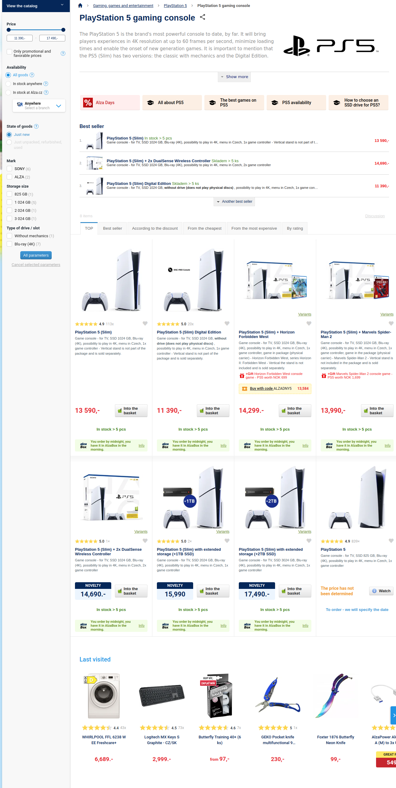

Typical product listing page might look like this:

It usually consists of the following typical blocks:

1. [category description](#category-description) with rich content
2. product listing — sometimes in different flavors:
    - [regular paginated list](#product-listing)
    - [N top-selling products](#top-selling-products)
    - last visited products
3. category menu - on multiple places:
    - [breadcrumb](#breadcrumb)
    - [category tree](render-category-menu.md#hybrid-menu)
    - [sub-category listing](render-category-menu.md#listing-sub-categories)
4. filtering and sorting options:
    - [price filter](#price-filter)
    - [facet filter](#faceted-search)
    - [search box](external-fulltext.md)
    - [sorting options](#sorting-options)

In this article, we will explain what queries could be issued to collect all the necessary data based on the schema of 
our demo dataset. Only the third block - category listing - will be covered in a [separate article](render-category-menu.md),
because its scope is quite large and deserves its own analysis.

## Category description

The product listing page usually starts with the category title and description. This information is easily accessible 
by fetching the category entity in a particular language through its unique URL:

<SourceCodeTabs requires="evita_functional_tests/src/test/resources/META-INF/documentation/evitaql-init.java" langSpecificTabOnly>

[Requesting category description](documentation/user/en/solve/examples/filtering-products-in-category/category-description.evitaql)

</SourceCodeTabs>

That produces the requested data:

<LS to="e,j,c">

<MDInclude sourceVariable="recordPage">[Result for category description](documentation/user/en/solve/examples/filtering-products-in-category/category-description.evitaql.json.md)</MDInclude>

</LS>

<LS to="g">

<MDInclude>[Result for category description](documentation/user/en/solve/examples/filtering-products-in-category/category-description.graphql.json.md)</MDInclude>

</LS>

<LS to="r">

<MDInclude>[Result for category description](documentation/user/en/solve/examples/filtering-products-in-category/category-description.rest.json.md)</MDInclude>

</LS>

## Breadcrumb

Breadcrumb is not a typical category menu, but it is often used in e-commerce applications. It helps to navigate 
the user back to the parent categories. It can be obtained from two sources:

1. from the category entity itself - through entity references and their parent information
2. from the product listing - as a [`parents`](../query/requirements/hierarchy.md#parents) menu requirement

The first option is more generic and could be used not only for category detail page with product listing, but also for
product detail page, where the second option is not applicable, since the product detail query usually doesn't contain 
[`hierarchyWithin`](../query/filtering/hierarchy.md#hierarchy-within) filter (because we don't need it there).

First, let's see how to get the breadcrumb from the category entity:

<SourceCodeTabs requires="evita_functional_tests/src/test/resources/META-INF/documentation/evitaql-init.java" langSpecificTabOnly>

[Requesting data for breadcrumb](documentation/user/en/solve/examples/filtering-products-in-category/breadcrumb-category.evitaql)

</SourceCodeTabs>

As you can see, the requested parent information is part of the category entity itself:

<LS to="e,j,c">

<MDInclude sourceVariable="recordPage">[Result for category breadcrumb](documentation/user/en/solve/examples/filtering-products-in-category/breadcrumb-category.evitaql.json.md)</MDInclude>

</LS>

<LS to="g">

<MDInclude>[Result for category breadcrumb](documentation/user/en/solve/examples/filtering-products-in-category/breadcrumb-category.graphql.json.md)</MDInclude>

</LS>

<LS to="r">

<MDInclude>[Result for category breadcrumb](documentation/user/en/solve/examples/filtering-products-in-category/breadcrumb-category.rest.json.md)</MDInclude>

</LS>

Next, let's see how to get the breadcrumb for a specific product. Here the situation is more complicated because 
the product can (and in our example it does) belong to several categories:

<SourceCodeTabs requires="evita_functional_tests/src/test/resources/META-INF/documentation/evitaql-init.java" langSpecificTabOnly>

[Requesting data for breadcrumb](documentation/user/en/solve/examples/filtering-products-in-category/breadcrumb-product.evitaql)

</SourceCodeTabs>

In this case, the parent information is part of the product's *categories* reference, and you can see that the product 
belongs to two such categories: *Macbooks* and *Products in preparation*. Both have completely different parent category 
paths. To render the breadcrumb, you would have to choose one of these paths using some kind of heuristic method (e.g., 
the longest path, the last visited category, etc.).

<LS to="e,j,c">

<MDInclude sourceVariable="recordPage">[Result for product breadcrumb](documentation/user/en/solve/examples/filtering-products-in-category/breadcrumb-product.evitaql.json.md)</MDInclude>

</LS>

<LS to="g">

<MDInclude>[Result for product breadcrumb](documentation/user/en/solve/examples/filtering-products-in-category/breadcrumb-product.graphql.json.md)</MDInclude>

</LS>

<LS to="r">

<MDInclude>[Result for product breadcrumb](documentation/user/en/solve/examples/filtering-products-in-category/breadcrumb-product.rest.json.md)</MDInclude>

</LS>

## Product listing

To list products in a category, you need to issue a query that retrieves all products assigned to the category. This is
done by querying the `product` entity and filtering it by the `categories` reference - which points to the category by 
its unique URL *"/en/smartwatches"*:

<SourceCodeTabs requires="evita_functional_tests/src/test/resources/META-INF/documentation/evitaql-init.java" langSpecificTabOnly>

[Requesting product listing](documentation/user/en/solve/examples/filtering-products-in-category/product-listing.evitaql)

</SourceCodeTabs>

The query is probably more complex than you might expect. It is not just a simple `categories` reference filter, but
contains a lot of other filters and requirements. So let's break it down:

1. **`entityLocaleEquals("en")`** - constraint filters only products with English localization
2. **`hierarchyWithin("categories", attributeEquals("url", "/en/smartwatches"))`** - filters only products that belong
   to the category with URL *"/en/smartwatches"* or its subcategories
3. **`attributeEquals("status", "ACTIVE")`** - filters only public products, there may also be products in *PRIVATE* 
   status, which can only be seen by employees preparing the product for publication.
4. **`or(attributeInRangeNow("validity"), attributeIsNull("validity"))`** - filters only products that are valid now or
   have no validity set at all
5. **`referenceHaving("stocks", attributeGreaterThan("quantityOnStock", 0))`** - filters only products that are actually 
   in stock (have a positive quantity on stock) - no matter which stock it is (there may be multiple stocks in the system)
6. **`priceInCurrency("EUR"), priceInPriceLists("basic"), priceValidInNow()`** - filters only products that have a valid 
   price in EUR currency and in the *"basic"* price list

In order to render the product tiles, the query also includes the following content set in the `entityFetch` request:

1. **`attributeContent("name")`** - retrieves product name
2. **`referenceContentWithAttributes("stocks", attributeContent("quantityOnStock"))`** - retrieves the quantity on stock
3. **`priceContentRespectingFilter("reference")`** - retrieves the price for sale and reference price to calculate the discount

The query also requests only the first page with 16 products using the requirement `page(1, 16)`.

The query is based on a demo set product model. You'd most likely have a different model in your business domain, but 
the principles of the query would be the same, so you can still use this query as inspiration.

The result of the query is a list of products with their attributes and references:

<LS to="e,j,c">

<MDInclude sourceVariable="recordPage">[Result for product listing](documentation/user/en/solve/examples/filtering-products-in-category/product-listing.evitaql.json.md)</MDInclude>

</LS>

<LS to="g">

<MDInclude>[Result for product listing](documentation/user/en/solve/examples/filtering-products-in-category/product-listing.graphql.json.md)</MDInclude>

</LS>

<LS to="r">

<MDInclude>[Result for product listing](documentation/user/en/solve/examples/filtering-products-in-category/product-listing.rest.json.md)</MDInclude>

</LS>

### Top-selling products

To list the top-selling products, you would use a similar query, but with different sorting options and probably 
a different page size. To increase readability, we want to simplify the product query to the bare minimum:

<SourceCodeTabs requires="evita_functional_tests/src/test/resources/META-INF/documentation/evitaql-init.java" langSpecificTabOnly>

[Requesting top-selling products](documentation/user/en/solve/examples/filtering-products-in-category/top-selling-products.evitaql)

</SourceCodeTabs>

Of course, you'd probably need to add a similar set of constraints as in the standard product listing query.

<Note type="info">

We plan to simplify the solution to this use case by allowing you to return different sets of alternatively sorted 
results in a single query. This feature is documented in [issue #479](https://github.com/FgForrest/evitaDB/issues/479), 
and we will update this article once the feature is implemented.

</Note>

The result of the query is as follows:

<LS to="e,j,c">

<MDInclude sourceVariable="recordPage">[Result for top-selling products](documentation/user/en/solve/examples/filtering-products-in-category/top-selling-products.evitaql.json.md)</MDInclude>

</LS>

<LS to="g">

<MDInclude>[Result for top-selling products](documentation/user/en/solve/examples/filtering-products-in-category/top-selling-products.graphql.json.md)</MDInclude>

</LS>

<LS to="r">

<MDInclude>[Result for top-selling products](documentation/user/en/solve/examples/filtering-products-in-category/top-selling-products.rest.json.md)</MDInclude>

</LS>

## Faceted search

The product listing page usually contains a set of filters that allow the user to narrow down the list of products. 
These filters are called facet filters and evitaDB builds such filters based on entity references marked as *faceted*. 
Although you can request automatically calculated facet filters from all available references, we usually request only 
a few of them. The reason for this is that we want to control the order of the main facet groups, and we also want to 
select only those references that are relevant for the particular view. For example, in our dataset, the `categories` 
reference is faceted, but it doesn't make sense to render category facets on the category detail page. But it makes 
sense to render them on the brand detail page. Of course, the implications for the brand reference are inverse to this 
need.

Let's say we want to render the `brand` and `parameterValues` filters on the category detail page. We start with the 
brand filter first, because it is quite simple and immediately shows the situation when some of the facets are already 
selected by the user:

<SourceCodeTabs requires="evita_functional_tests/src/test/resources/META-INF/documentation/evitaql-init.java" langSpecificTabOnly>

[Requesting brand facet filters](documentation/user/en/solve/examples/filtering-products-in-category/faceted-search-brand.evitaql)

</SourceCodeTabs>

The returned brands are sorted by name in ascending order, the *Apple* brand is marked as requested, which refers to 
the user's selection of one of the brands in the `userFilter' container, and the calculation contains a lot of 
calculated numbers. To render the filter's UI correctly, you'll need to follow these rules:

1. facets marked as `requested` should be rendered as *checked*.
2. facets with `impact.hasSense` set to `false` should be rendered as *disabled* (because if selected, the filter would 
   return no results, so it doesn't make sense to select it)
3. facets in the group that have at least one `requested` and should render the `impact.difference` in parentheses after 
   the facet name (sometimes only the positive impact is presented to the user) - this represents the number of products 
   that would be added to the result set by selecting this particular reference.
4. other facets should render the `count` in the brackets after the facet name - which represents the number of products
   possessing this particular reference.

These rules emerged from user testing as the most intuitive and user-friendly way to render the filter. But feel free to 
experiment with your own settings. The rendered filter using the rules above would look like this:

<MDInclude sourceVariable="extraResults.FacetSummary">[Result for brand facet filters](documentation/user/en/solve/examples/filtering-products-in-category/faceted-search-brand.evitaql.string.md)</MDInclude>

The brand relationship is simple, but parameter values are a different beast. A parameter value (e.g. *blue* or *red*) 
belongs to a parameter used to group similar values (e.g. *color*). We also want to control the presence of 
the parameter in the filter by a property set on the parameter entity, so that the administrator can decide which 
parameters are relevant for filtering and which are not by a simple toggle in the administration interface.

Finally, we want to render the filter with properly localized names of referenced entities and sort the filters
according to an `order` property of those entities. This is one of the reasons why we build our face filters on top of 
entity references and not on top of entity attributes (which is an approach you can see in several database engines).

The final facet query looks like this:

<SourceCodeTabs requires="evita_functional_tests/src/test/resources/META-INF/documentation/evitaql-init.java" langSpecificTabOnly>

[Requesting facet filters](documentation/user/en/solve/examples/filtering-products-in-category/faceted-search.evitaql)

</SourceCodeTabs>

We apply the same rendering logic to the response and the result is as follows:

<MDInclude sourceVariable="extraResults.FacetSummary">[Result for brand facet filters](documentation/user/en/solve/examples/filtering-products-in-category/faceted-search.evitaql.string.md)</MDInclude>

Ultimately, you'll want to have both requirements in a single query, but we'll go through some additional requirements 
for the category detail page [until we combine everything](#complete-product-listing-queries-including-filtering-and-sorting).

## Price filter

Price is usually one of the driving factors in a user's decision to buy a product. Therefore, sorting by price and price
filter is one of the most important filters on the product listing page. We believe that the price filter should be 
rendered as a range slider with a histogram showing the distribution of products in the price range.

Let's demonstrate the situation when the user has already selected a certain price range:

<SourceCodeTabs requires="evita_functional_tests/src/test/resources/META-INF/documentation/evitaql-init.java" langSpecificTabOnly>

[Requesting price filter](documentation/user/en/solve/examples/filtering-products-in-category/price-filter.evitaql)

</SourceCodeTabs>

<Note type="warning">

Note that only the `priceBetween' is inside the `userFilter' container, which means that other price-related filter 
conditions are mandatory and the system must not omit them in any of the calculations of the result data.

</Note>

The result of the query is as follows:

<LS to="e,j,c">

<MDInclude sourceVariable="extraResults.PriceHistogram">[Result for price filter](documentation/user/en/solve/examples/filtering-products-in-category/price-filter.evitaql.json.md)</MDInclude>

</LS>

<LS to="g">

<MDInclude sourceVariable="data.queryProduct.extraResults.priceHistogram">[Result for price filter](documentation/user/en/solve/examples/filtering-products-in-category/price-filter.graphql.json.md)</MDInclude>

</LS>

<LS to="r">

<MDInclude sourceVariable="extraResults.priceHistogram">[Result for price filter](documentation/user/en/solve/examples/filtering-products-in-category/price-filter.rest.json.md)</MDInclude>

</LS>

When rendering the histogram, you'll find the minimum price in the response directly in the `priceHistogram` object 
(`min` and `max`), and individual buckets with the lower bound in the `buckets` array. The `overallCount` represents 
the total number of products in the histogram (and in our case it is equal to the number of products in the category, 
since all product filters are mandatory).

Buckets that are intersected by the user's selection are marked as `requested`, and you can visualize them in 
a different way (for example, with a different color) to indicate the user's selection.

## Sorting options

The last part of the product listing page is the sort options. The sort options are usually displayed as a drop-down 
list or a tabbed interface. The most common sort options are:

1. **Relevance** - the default sort option, which is usually based on some predefined ordering property of the product.
   In our case it would be represented by the sorting constraint: `orderBy(attributeNatural("order", ASC))`.
2. **Price** - Sort by price in ascending or descending order.
   In our case it would be represented by sorting constraint: `orderBy(priceNatural(DESC))`.
3. **Popularity** - Sort by the number of sales or views.
   In our case it would be represented by sorting constraint: `orderBy(attributeNatural("rating", DESC))`.
4. **Alphabetically** - Sort by name in ascending or descending order
   In our case it would be represented by the sorting constraint: `orderBy(attributeNatural("name", ASC))`.

Since sorting is quite simple, we'll skip the full queries in this chapter and move on to the last one, where we can see
all aspects of the product listing page combined.

## Complete product listing queries including filtering and sorting

By combining all of the above queries, you end up with the following two queries:

<SourceCodeTabs requires="evita_functional_tests/src/test/resources/META-INF/documentation/evitaql-init.java" langSpecificTabOnly>

[Category details with breadcrumb](documentation/user/en/solve/examples/filtering-products-in-category/category-details-with-breadcrumb.evitaql)

</SourceCodeTabs>

And the product list query (we omit the top-selling products query because it would just be a simpler version of 
the same query with different sorting options):

<SourceCodeTabs requires="evita_functional_tests/src/test/resources/META-INF/documentation/evitaql-init.java" langSpecificTabOnly>

[Product listing with facet filters and sorting options](documentation/user/en/solve/examples/filtering-products-in-category/product-listing-with-facets-and-sorting.evitaql)

</SourceCodeTabs>

So in the end, to render the category detail page with product listing, you'd need to issue two or three queries. 
The query looks complex, but compared to the complexity of the queries you'd need to issue in different database 
engines, it's quite simple and straightforward.
