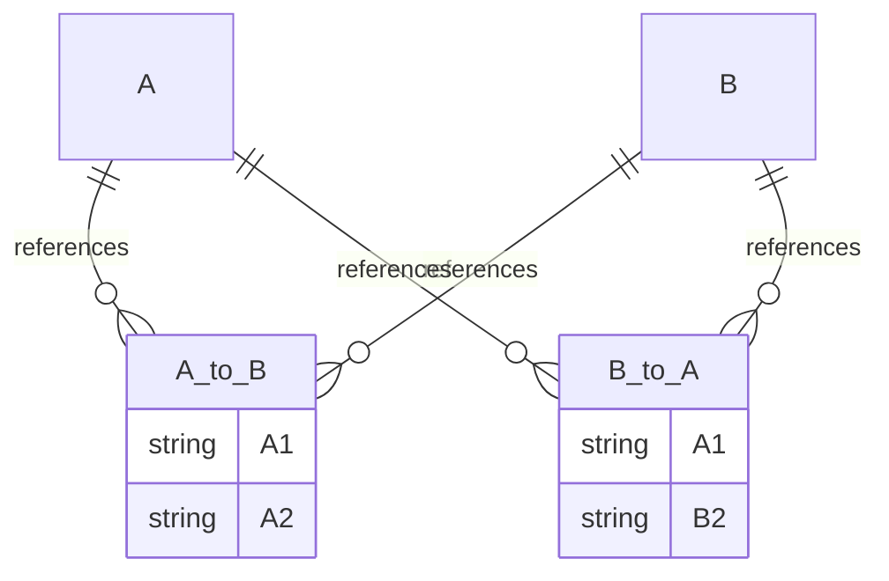

evitaDB internally maintains a schema for each [entity collection](data-model.md#collection) / [catalog](data-model.md#catalog),
although it supports a [relaxed approach](#evolution), where the schema is automatically built according to data
inserted into the database.

The schema is not only crucial for maintaining data consistency, but is also a key source for web API schema
generation. It allows us to create [Open API](connectors/rest.md) and [GraphQL](connectors/graphql.md) schemas. If you
pay close attention to the schema definition, you'll be rewarded with nice, understandable, and self-documented APIs.
Every single piece of information in the schema affects the way the web APIs look. For example, relation cardinality
(zero or one, exactly one, zero or more, one or more) affects whether the API marks the relation as optional, returns
a single value/object, or returns an array of them. Filterable attributes are propagated to the documented query
language blocks, while non-filterable attributes are not. The data types of the attributes affect which query
constraints can be used in relation to this very attribute, and so on. The documentation you write in the evitaDB schema
is propagated to all your APIs. You can read more about this projection in the dedicated Web API chapters of the
documentation.

## Mutations and versioning

The schema can only be changed by what are called *mutations*. While this is a rather cumbersome approach, it has some
big advantages for the system:

- **mutation represents an isolated change to the schema** - this means that the client making the schema change
  only sends deltas to the server, which saves a lot of network traffic and also implies server-side logic that doesn't
  need to resolve deltas internally
- **mutation is directly used as a [WAL](../deep-dive/transactions.md#2-write-ahead-log-persistence) entry** - the mutation
  represents an atomic operation in the transactional log that is distributed across the cluster, and it also
  represents a place where conflict resolution takes place (if the server receives similar mutations from two
  parallel sessions, it easily decides whether to throw a concurrent change exception - if the mutations are equal,
  there is no conflict; if they are different, the first mutation is accepted and the second is rejected with an
  exception)

The schema is versioned - each time a schema mutation is performed, its version number is incremented by one. If you
have two schema instances on the client side, you can easily tell if they're the same by comparing their version
number, and if not, which one is newer.

<Note type="question">

<NoteTitle toggles="true">

##### Do I really have to write all the mutations by hand?
</NoteTitle>

Hopefully not. We're aware that writing mutations is cumbersome, and provide better support in our drivers. The client
drivers wrap the immutable schemas inside the builder objects, so you can just call alter methods on them and
the builder will generate the list of mutations at the end. See [the example](api/schema-api.md#declarative-schema-definition).

However, if you want to use evitaDB on a platform that is not yet supported and covered by a specific client driver,
you have to work directly with our web APIs that only accept mutations, and you have no other options than to write
the mutations directly or to write your own client driver. But you can open source it and help the community. Let us
know about it!

</Note>

All schema mutations implement interface <LS to="j"><SourceClass>evita_api/src/main/java/io/evitadb/api/requestResponse/schema/mutation/SchemaMutation.java</SourceClass></LS><LS to="c"><SourceClass>EvitaDB.Client/Models/Schemas/Mutations/ISchemaMutation.cs</SourceClass></LS>

## Structure

There are following types of schemas:

- [catalog schema](#catalog)
- [entity schema](#entity)
- [attribute schema](#attributes)
- [sortable attribute compound schema](#sortable-attribute-compounds)
- [associated data schema](#associated-data)
- [reference schema](#reference)

### Catalog

Catalog schema contains list of [entity schemas](#entity), the `name` and `description` of the catalog. It also keeps
dictionary of [global attribute schemas](#global-attribute-schema) that can be shared among multiple
[entity schemas](#entity).

<Note type="info">

<NoteTitle toggles="true">

##### Name requirements and name variants
</NoteTitle>

Each named data object - [catalog](#catalog), [entity](#entity), [attribute](#attributes),
[associated data](#associated-data) and [reference](#reference) must be uniquely identifiable by its name within its
parent scope.

The name validation logic and reserved words are present in the class <LS to="j,e,r,g"><SourceClass>evita_common/src/main/java/io/evitadb/utils/ClassifierUtils.java</SourceClass></LS><LS to="c"><SourceClass>EvitaDB.Client/Utils/ClassifierUtils.cs</SourceClass></LS>.

There is also a special property called `nameVariants` in the schema of each named object. It contains variants
of the object name in different "developer" notations such as *camelCase*, *PascalCase*, *snake_case* and so on. See
<LS to="j,e,r,g"><SourceClass>evita_external_api/evita_external_api_core/src/main/java/io/evitadb/externalApi/api/catalog/schemaApi/model/NameVariantsDescriptor.java</SourceClass></LS><LS to="c"><SourceClass>EvitaDB.Client/Utils/NamingConvention.cs</SourceClass></LS>.
for a complete listing.

</Note>

<Note type="info">

<NoteTitle toggles="false">

##### List of mutations related to catalog
</NoteTitle>

Top-level mutations:

- **<LS to="j,e,r,g"><SourceClass>evita_api/src/main/java/io/evitadb/api/requestResponse/schema/mutation/catalog/CreateCatalogSchemaMutation.java</SourceClass></LS><LS to="c"><SourceClass>EvitaDB.Client/Models/Schemas/Mutations/Catalogs/CreateCatalogSchemaMutation.cs</SourceClass></LS>**
- **<LS to="j,e,r,g"><SourceClass>evita_api/src/main/java/io/evitadb/api/requestResponse/schema/mutation/catalog/RemoveCatalogSchemaMutation.java</SourceClass></LS><LS to="c"><SourceClass>EvitaDB.Client/Models/Schemas/Mutations/Catalogs/RemoveCatalogSchemaMutation.cs</SourceClass></LS>**
- **<LS to="j,e,r,g"><SourceClass>evita_api/src/main/java/io/evitadb/api/requestResponse/schema/mutation/catalog/ModifyCatalogSchemaMutation.java</SourceClass></LS><LS to="c"><SourceClass>EvitaDB.Client/Models/Schemas/Mutations/Catalogs/ModifyCatalogSchemaMutation.cs</SourceClass></LS>**

Within `ModifyCatalogSchemaMutation` you can use mutations:

- **<LS to="j,e,r,g"><SourceClass>evita_api/src/main/java/io/evitadb/api/requestResponse/schema/mutation/catalog/ModifyCatalogSchemaNameMutation.java</SourceClass></LS><LS to="c"><SourceClass>EvitaDB.Client/Models/Schemas/Mutations/Catalogs/ModifyCatalogSchemaNameMutation.cs</SourceClass></LS>**
- **<LS to="j,e,r,g"><SourceClass>evita_api/src/main/java/io/evitadb/api/requestResponse/schema/mutation/catalog/ModifyCatalogSchemaDescriptionMutation.java</SourceClass></LS><LS to="c"><SourceClass>EvitaDB.Client/Models/Schemas/Mutations/Catalogs/ModifyCatalogSchemaDescriptionMutation.cs</SourceClass></LS>**

And [entity top-level mutations](#entity).

<LS to="j,c">
The catalog schema is described by:
<LS to="j"><SourceClass>evita_api/src/main/java/io/evitadb/api/requestResponse/schema/CatalogSchemaContract.java</SourceClass></LS><LS to="c"><SourceClass>EvitaDB.Client/Models/Schemas/ICatalogSchema.cs</SourceClass></LS>
</LS>

</Note>

#### Global attribute schema

Global attribute schema has the same structure as [attribute schema](#attributes) except for one additional
characteristic. A global attribute can be made `uniqueGlobally`, which means that values of such an attribute must be
unique across all entities and entity types in the entire catalog.

<Note type="question">

<NoteTitle toggles="true">

##### What is global uniqueness good for?
</NoteTitle>

Well, it is useful for entity URLs that we naturally want to be unique among all entities in the catalog. The globally
unique attribute allows us to ask evitaDB for an entity with a specific value without knowing its type in advance.
This solves the use case when a new request arrives in your application and you need to check if there is an entity
that matches it (no matter if it's a product, category, brand, group or whatever types you have in your project).
</Note>

A global attribute can also be used as a "dictionary definition" for an attribute that is used in multiple entity
collections, and we want to make sure it's named and described the same in all of them. An entity collection cannot
define an attribute with the same name as the global attribute. It can only "use" the global attribute with that name
and thus share its complete definition.

<Note type="info">

<NoteTitle toggles="false">

##### List of mutations related to global attribute
</NoteTitle>

- **<LS to="j,e,r,g"><SourceClass>evita_api/src/main/java/io/evitadb/api/requestResponse/schema/mutation/attribute/CreateGlobalAttributeSchemaMutation.java</SourceClass></LS><LS to="c"><SourceClass>EvitaDB.Client/Models/Schemas/Mutations/Attributes/CreateGlobalAttributeSchemaMutation.cs</SourceClass></LS>**
- **<LS to="j,e,r,g"><SourceClass>evita_api/src/main/java/io/evitadb/api/requestResponse/schema/mutation/attribute/UseGlobalAttributeSchemaMutation.java</SourceClass></LS><LS to="c"><SourceClass>EvitaDB.Client/Models/Schemas/Mutations/Attributes/UseGlobalAttributeSchemaMutation.cs</SourceClass></LS>**
- **<LS to="j,e,r,g"><SourceClass>evita_api/src/main/java/io/evitadb/api/requestResponse/schema/mutation/attribute/SetAttributeSchemaGloballyUniqueMutation.java</SourceClass></LS><LS to="c"><SourceClass>EvitaDB.Client/Models/Schemas/Mutations/Attributes/SetAttributeSchemaGloballyUniqueMutation.cs</SourceClass></LS>**

And of course all [standard attribute mutations](#attributes).

<LS to="j,c">
The global attribute schema is described by:
<LS to="j"><SourceClass>evita_api/src/main/java/io/evitadb/api/requestResponse/schema/GlobalAttributeSchemaContract.java</SourceClass></LS>
<LS to="c"><SourceClass>EvitaDB.Client/Models/Schemas/IGlobalAttributeSchema.cs</SourceClass></LS>
</LS>

</Note>

### Entity

Entity schema contains information about the `name`, `description` and the:

- [enabling primary key generation](#primary-key-generation)
- [evolution limits](#evolution)
- [allowed locales and currencies](#locales-and-currencies)
- [enabling hierarchical structure](#hierarchy-placement)
- [enabling price information](#prices)
- [attributes](#attributes)
- [sortable attribute compound](#sortable-attribute-compounds)
- [associated data](#associated-data)
- [references](#reference)

Entity schema can be made *deprecated*, which will be propagated to generated web API documentation.

<Note type="info">

<NoteTitle toggles="false">

##### List of mutations related to entity type
</NoteTitle>

<LS to="j,e,r,g">

Top-level entity mutations:

- **<LS to="j,e,r,g"><SourceClass>evita_api/src/main/java/io/evitadb/api/requestResponse/schema/mutation/catalog/CreateEntitySchemaMutation.java</SourceClass></LS><LS to="c"><SourceClass>EvitaDB.Client/Models/Schemas/Mutations/Catalogs/CreateEntitySchemaMutation.cs</SourceClass></LS>**
- **<LS to="j,e,r,g"><SourceClass>evita_api/src/main/java/io/evitadb/api/requestResponse/schema/mutation/catalog/RemoveEntitySchemaMutation.java</SourceClass></LS><LS to="c"><SourceClass>EvitaDB.Client/Models/Schemas/Mutations/Catalogs/RemoveEntitySchemaMutation.cs</SourceClass></LS>**
- **<LS to="j,e,r,g"><SourceClass>evita_api/src/main/java/io/evitadb/api/requestResponse/schema/mutation/catalog/ModifyEntitySchemaNameMutation.java</SourceClass></LS><LS to="c"><SourceClass>EvitaDB.Client/Models/Schemas/Mutations/Catalogs/ModifyEntitySchemaNameMutation.cs</SourceClass></LS>**
- **<LS to="j,e,r,g"><SourceClass>evita_api/src/main/java/io/evitadb/api/requestResponse/schema/mutation/catalog/ModifyEntitySchemaMutation.java</SourceClass></LS><LS to="c"><SourceClass>EvitaDB.Client/Models/Schemas/Mutations/Catalogs/ModifyEntitySchemaMutation.cs</SourceClass></LS>**

Within `ModifyEntitySchemaMutation` you can use mutations:

- **<LS to="j,e,r,g"><SourceClass>evita_api/src/main/java/io/evitadb/api/requestResponse/schema/mutation/entity/ModifyEntitySchemaDescriptionMutation.java</SourceClass></LS><LS to="c"><SourceClass>EvitaDB.Client/Models/Schemas/Mutations/Entities/ModifyEntitySchemaDescriptionMutation.cs</SourceClass></LS>**
- **<LS to="j,e,r,g"><SourceClass>evita_api/src/main/java/io/evitadb/api/requestResponse/schema/mutation/entity/ModifyEntitySchemaDeprecationNoticeMutation.java</SourceClass></LS><LS to="c"><SourceClass>EvitaDB.Client/Models/Schemas/Mutations/Entities/ModifyEntitySchemaDeprecationNoticeMutation.cs</SourceClass></LS>**

</LS>

<LS to="j,c">
The entity schema is described by:
<LS to="j"><SourceClass>evita_api/src/main/java/io/evitadb/api/requestResponse/schema/EntitySchemaContract.java</SourceClass></LS>
<LS to="c"><SourceClass>EvitaDB.Client/Models/Schemas/IEntitySchema.cs</SourceClass></LS>
</LS>

</Note>

#### Primary key generation

If primary key generation is enabled, evitaDB assigns a unique
<LS to="j,e,r,g">[int](https://docs.oracle.com/javase/tutorial/java/nutsandbolts/datatypes.html)</LS>
<LS to="c">[int](https://learn.microsoft.com/en-us/dotnet/api/system.int32)</LS> number to a newly inserted entity.
The primary key always starts with `1` and is incremented by `1`. evitaDB guarantees its uniqueness within the same
entity type. The primary keys generated in this way are optimal for binary operations in the data structures used.

<Note type="info">

<NoteTitle toggles="false">

##### List of mutations related to primary key
</NoteTitle>

Within `ModifyEntitySchemaMutation` you can use mutation:

- **<LS to="j,e,r,g"><SourceClass>evita_api/src/main/java/io/evitadb/api/requestResponse/schema/mutation/entity/SetEntitySchemaWithGeneratedPrimaryKeyMutation.java</SourceClass></LS><LS to="c"><SourceClass>EvitaDB.Client/Models/Schemas/Mutations/Entities/SetEntitySchemaWithGeneratedPrimaryKeyMutation.cs</SourceClass></LS>**

</Note>

#### Evolution

We recommend the schema-first approach, but there are cases where you don't want to bother with the schema and just want
to insert and query the data (e.g., rapid prototyping). When a new [catalog](data-model.md#catalog) is created, it is set up
in "auto evolution" mode, where the schema adapts to the data on first insertion. If you want to control the schema
strictly, you have to limit the evolution by changing the default schema. In strict mode, evitaDB throws an exception
if the input data violates the schema.

You still need to create [entity collections](data-model.md#collection) manually, but after that you can immediately insert
your data and the schema will be built accordingly. The existing schemas will still be validated on each entity
insertion/update - you will not be allowed to store the same attribute as a number type the first time and as a string
the next time. The first use will set up the schema, which must be respected from that moment on.

<Note type="info">
If the first entity has its primary key, evitaDB expects all entities to have their primary key set when inserting.
If the first entity has its primary key set to `NULL`, evitaDB will generate primary keys for you and will reject
external primary keys. New attribute schemas are implicitly created as `nullable`, `filterable` and non-array data types
as `sortable`. This means that the client is immediately able to filter/sort on almost anything, but the database itself
will consume a lot of resources. The references will be created as `indexed` but not `faceted`.
</Note>

There are several partial lax modes between strict and fully automatic evolution mode - see
<LS to="j,e,r,g"><SourceClass>evita_api/src/main/java/io/evitadb/api/requestResponse/schema/EvolutionMode.java</SourceClass></LS>
<LS to="c"><SourceClass>EvitaDB.Client/Models/Schemas/EvolutionMode.cs</SourceClass></LS> for details.
For example - you can strictly control the entire schema, except for new locale or currency definitions, which are
allowed to be added automatically on first use.

<Note type="info">

<NoteTitle toggles="false">

##### List of mutations related to evolution mode
</NoteTitle>

Within `ModifyEntitySchemaMutation` you can use mutations:

- **<LS to="j,e,r,g"><SourceClass>evita_api/src/main/java/io/evitadb/api/requestResponse/schema/mutation/entity/AllowEvolutionModeInEntitySchemaMutation.java</SourceClass></LS><LS to="c"><SourceClass>EvitaDB.Client/Models/Schemas/Mutations/Entities/AllowEvolutionModeInEntitySchemaMutation.cs</SourceClass></LS>**
- **<LS to="j,e,r,g"><SourceClass>evita_api/src/main/java/io/evitadb/api/requestResponse/schema/mutation/entity/DisallowEvolutionModeInEntitySchemaMutation.java</SourceClass></LS><LS to="c"><SourceClass>EvitaDB.Client/Models/Schemas/Mutations/Entities/DisallowEvolutionModeInEntitySchemaMutation.cs</SourceClass></LS>**

</Note>

#### Locales and currencies

The schema specifies a list of allowed currencies and locales. We assume that the list of allowed currencies/locales
will be relatively small (units, at most lower tens of them) and if the system knows them in advance, it can generate enums
for each of them in web APIs. This helps developers write queries with auto-completion. There is another positive
effect. E-commerce systems don't often extend the list of used currencies or locales (because there are usually a lot
of manual operations involved), and having the allowed set guarded by the system eliminates the possibility of inserting
invalid prices or localizations by mistake.

<Note type="question">

<NoteTitle toggles="true">

##### Why are price lists not listed in the schema if currencies are?
</NoteTitle>

The price lists are closer to "data" than locales or currencies. The set of price lists is expected to change very
often, and their numbers can reach high cardinality (thousands, tens of thousands). It wouldn't be practical to generate
enumeration values for them and change the Web API schemas every time a price list is added or removed.
</Note>

<Note type="info">

<NoteTitle toggles="false">

##### List of mutations related to locales & currencies
</NoteTitle>

Within `ModifyEntitySchemaMutation` you can use mutations:

- **<LS to="j,e,r,g"><SourceClass>evita_api/src/main/java/io/evitadb/api/requestResponse/schema/mutation/entity/AllowCurrencyInEntitySchemaMutation.java</SourceClass></LS><LS to="c"><SourceClass>EvitaDB.Client/Models/Schemas/Mutations/Entities/AllowCurrencyInEntitySchemaMutation.cs</SourceClass></LS>**
- **<LS to="j,e,r,g"><SourceClass>evita_api/src/main/java/io/evitadb/api/requestResponse/schema/mutation/entity/DisallowCurrencyInEntitySchemaMutation.java</SourceClass></LS><LS to="c"><SourceClass>EvitaDB.Client/Models/Schemas/Mutations/Entities/DisallowCurrencyInEntitySchemaMutation.cs</SourceClass></LS>**
- **<LS to="j,e,r,g"><SourceClass>evita_api/src/main/java/io/evitadb/api/requestResponse/schema/mutation/entity/AllowLocaleInEntitySchemaMutation.java</SourceClass></LS><LS to="c"><SourceClass>EvitaDB.Client/Models/Schemas/Mutations/Entities/AllowLocaleInEntitySchemaMutation.cs</SourceClass></LS>**
- **<LS to="j,e,r,g"><SourceClass>evita_api/src/main/java/io/evitadb/api/requestResponse/schema/mutation/entity/DisallowLocaleInEntitySchemaMutation.java</SourceClass></LS><LS to="c"><SourceClass>EvitaDB.Client/Models/Schemas/Mutations/Entities/DisallowLocaleInEntitySchemaMutation.cs</SourceClass></LS>**

</Note>

#### Hierarchy placement

When hierarchy placement is enabled, entities of this type can form a tree structure. Each entity can have a maximum
of one parent node and zero or more child entities. Neither the depth of the tree nor the number of siblings at each
level is limited.

Enabling hierarchy placement implies the creation of a new
<SourceClass>evita_engine/src/main/java/io/evitadb/index/hierarchy/HierarchyIndex.java</SourceClass> for the involved
entity type. When another entity references a hierarchy entity and the reference is marked as *indexed*, the special
<SourceClass>evita_engine/src/main/java/io/evitadb/index/ReducedEntityIndex.java</SourceClass> is created for each hierarchical entity. This index will
hold reduced attribute and price indices of the referencing entity, allowing quick evaluation of
[`withinHierarchy`](../query/filtering/hierarchy.md) filter conditions.

##### Orphan hierarchy nodes

The typical problem associated with creating a tree structure is the order in which nodes are attached to it. In
order to have a consistent tree, one should start from the root nodes and gradually descend along the axis of their
children. This isn't always easy to do when we need to copy an existing tree to an external system (for scripting
purposes, it's much easier and more performance-effective to index in batches using the natural order of records). A similar
situation occurs when an intermediate tree node needs to be removed, but its children do not. We can force developers to
rewire children to different parents before removing their parent, but they often don't have direct control over the
order of operations and can't easily do that.

That's why evitaDB recognizes so-called **orphan hierarchy nodes**. An orphan node is a node that declares itself to be
a child of a parent node with a certain primary key that evitaDB doesn't know yet (or the orphan node itself). Orphan
nodes do not participate in the evaluation of [queries on hierarchical structures](../query/filtering/hierarchy.md),
but are present in the index. If a node of a referenced primary key is appended to the main hierarchy tree, the
orphan nodes (sub-trees) are also appended. In this way, the hierarchy tree eventually becomes consistent.

<Note type="info">

<NoteTitle toggles="false">

##### List of mutations related to hierarchy placement
</NoteTitle>

Within `ModifyEntitySchemaMutation` you can use mutation:

- **<LS to="j,e,r,g"><SourceClass>evita_api/src/main/java/io/evitadb/api/requestResponse/schema/mutation/entity/SetEntitySchemaWithHierarchyMutation.java</SourceClass></LS><LS to="c"><SourceClass>EvitaDB.Client/Models/Schemas/Mutations/Entities/SetEntitySchemaWithHierarchyMutation.cs</SourceClass></LS>**

</Note>

### Prices

When prices are enabled, entities of this type can have a set of prices associated with them and can be
[filtered](../query/filtering/price.md) and [sorted](../query/ordering/price.md) by price constraints. A single entity
can have zero or more prices (the system is designed for situations where an entity has tens or hundreds of prices attached
to it). For each combination of `priceList` and `currency` there is a special
<SourceClass>evita_engine/src/main/java/io/evitadb/index/price/PriceListAndCurrencyPriceSuperIndex.java</SourceClass>.

<Note type="info">

<NoteTitle toggles="false">

##### List of mutations related to hierarchy placement
</NoteTitle>

Within `ModifyEntitySchemaMutation` you can use mutation:

- **<LS to="j,e,r,g"><SourceClass>evita_api/src/main/java/io/evitadb/api/requestResponse/schema/mutation/entity/SetEntitySchemaWithPriceMutation.java</SourceClass></LS><LS to="c"><SourceClass>EvitaDB.Client/Models/Schemas/Mutations/Entities/SetEntitySchemaWithPriceMutation.cs</SourceClass></LS>**

</Note>

### Attributes

An entity type can have zero or more attributes. The system is designed for situations where an entity has tens of
attributes. You should pay attention to the number of `filterable` / `sortable` / `unique` attributes. There is a
separate instance of
<SourceClass>evita_engine/src/main/java/io/evitadb/index/attribute/FilterIndex.java</SourceClass> for each filterable
attribute, <SourceClass>evita_engine/src/main/java/io/evitadb/index/attribute/SortIndex.java</SourceClass> for each
sortable attribute and <SourceClass>evita_engine/src/main/java/io/evitadb/index/attribute/UniqueIndex.java</SourceClass>
or <SourceClass>evita_engine/src/main/java/io/evitadb/index/attribute/GlobalUniqueIndex.java</SourceClass> for each
unique attribute. Attributes that are neither `filterable` / `sortable` / `unique` don't consume operating memory.

An attribute carrying a filter index may additionally opt in to a [filter accelerator](#filter-accelerators), which buys faster answers to certain constraints for extra memory and extra write-path work.

<LS to="j,e,r,g">

Attribute schema can be marked as `localized`, meaning that it only makes sense in a specific
<LS to="j,e,r,g">[locale](https://docs.oracle.com/en/java/javase/17/docs/api/java.base/java/util/Locale.html)</LS>
<LS to="c">[locale](https://learn.microsoft.com/en-us/dotnet/api/system.globalization.cultureinfo)</LS>.
</LS>

Attribute schema can be made *deprecated*, which will be propagated to generated web API documentation.

<Note type="info">

<NoteTitle toggles="false">

##### List of mutations related to attribute
</NoteTitle>

Within `ModifyEntitySchemaMutation` you can use mutation:

- **<LS to="j,e,r,g"><SourceClass>evita_api/src/main/java/io/evitadb/api/requestResponse/schema/mutation/attribute/CreateAttributeSchemaMutation.java</SourceClass></LS><LS to="c"><SourceClass>EvitaDB.Client/Models/Schemas/Mutations/Attributes/CreateAttributeSchemaMutation.cs</SourceClass></LS>**
- **<LS to="j,e,r,g"><SourceClass>evita_api/src/main/java/io/evitadb/api/requestResponse/schema/mutation/attribute/RemoveAttributeSchemaMutation.java</SourceClass></LS><LS to="c"><SourceClass>EvitaDB.Client/Models/Schemas/Mutations/Attributes/RemoveAttributeSchemaMutation.cs</SourceClass></LS>**
- **<LS to="j,e,r,g"><SourceClass>evita_api/src/main/java/io/evitadb/api/requestResponse/schema/mutation/attribute/ModifyAttributeSchemaNameMutation.java</SourceClass></LS><LS to="c"><SourceClass>EvitaDB.Client/Models/Schemas/Mutations/Attributes/ModifyAttributeSchemaNameMutation.cs</SourceClass></LS>**
- **<LS to="j,e,r,g"><SourceClass>evita_api/src/main/java/io/evitadb/api/requestResponse/schema/mutation/attribute/ModifyAttributeSchemaDescriptionMutation.java</SourceClass></LS><LS to="c"><SourceClass>EvitaDB.Client/Models/Schemas/Mutations/Attributes/ModifyAttributeSchemaDescriptionMutation.cs</SourceClass></LS>**
- **<LS to="j,e,r,g"><SourceClass>evita_api/src/main/java/io/evitadb/api/requestResponse/schema/mutation/attribute/ModifyAttributeSchemaDefaultValueMutation.java</SourceClass></LS><LS to="c"><SourceClass>EvitaDB.Client/Models/Schemas/Mutations/Attributes/ModifyAttributeSchemaDefaultValueMutation.cs</SourceClass></LS>**
- **<LS to="j,e,r,g"><SourceClass>evita_api/src/main/java/io/evitadb/api/requestResponse/schema/mutation/attribute/ModifyAttributeSchemaDeprecationNoticeMutation.java</SourceClass></LS><LS to="c"><SourceClass>EvitaDB.Client/Models/Schemas/Mutations/Attributes/ModifyAttributeSchemaDeprecationNoticeMutation.cs</SourceClass></LS>**
- **<LS to="j,e,r,g"><SourceClass>evita_api/src/main/java/io/evitadb/api/requestResponse/schema/mutation/attribute/ModifyAttributeSchemaTypeMutation.java</SourceClass></LS><LS to="c"><SourceClass>EvitaDB.Client/Models/Schemas/Mutations/Attributes/ModifyAttributeSchemaTypeMutation.cs</SourceClass></LS>**
- **<LS to="j,e,r,g"><SourceClass>evita_api/src/main/java/io/evitadb/api/requestResponse/schema/mutation/attribute/SetAttributeSchemaAcceleratedMutation.java</SourceClass></LS>**
- **<LS to="j,e,r,g"><SourceClass>evita_api/src/main/java/io/evitadb/api/requestResponse/schema/mutation/attribute/SetAttributeSchemaFilterableMutation.java</SourceClass></LS><LS to="c"><SourceClass>EvitaDB.Client/Models/Schemas/Mutations/Attributes/SetAttributeSchemaFilterableMutation.cs</SourceClass></LS>**
- **<LS to="j,e,r,g"><SourceClass>evita_api/src/main/java/io/evitadb/api/requestResponse/schema/mutation/attribute/SetAttributeSchemaLocalizedMutation.java</SourceClass></LS><LS to="c"><SourceClass>EvitaDB.Client/Models/Schemas/Mutations/Attributes/SetAttributeSchemaLocalizedMutation.cs</SourceClass></LS>**
- **<LS to="j,e,r,g"><SourceClass>evita_api/src/main/java/io/evitadb/api/requestResponse/schema/mutation/attribute/SetAttributeSchemaNullableMutation.java</SourceClass></LS><LS to="c"><SourceClass>EvitaDB.Client/Models/Schemas/Mutations/Attributes/SetAttributeSchemaNullableMutation.cs</SourceClass></LS>**
- **<LS to="j,e,r,g"><SourceClass>evita_api/src/main/java/io/evitadb/api/requestResponse/schema/mutation/attribute/SetAttributeSchemaRepresentativeMutation.java</SourceClass></LS><LS to="c"><SourceClass>EvitaDB.Client/Models/Schemas/Mutations/Attributes/SetAttributeSchemaRepresentativeMutation.cs</SourceClass></LS>**
- **<LS to="j,e,r,g"><SourceClass>evita_api/src/main/java/io/evitadb/api/requestResponse/schema/mutation/attribute/SetAttributeSchemaSortableMutation.java</SourceClass></LS><LS to="c"><SourceClass>EvitaDB.Client/Models/Schemas/Mutations/Attributes/SetAttributeSchemaSortableMutation.cs</SourceClass></LS>**
- **<LS to="j,e,r,g"><SourceClass>evita_api/src/main/java/io/evitadb/api/requestResponse/schema/mutation/attribute/SetAttributeSchemaUniqueMutation.java</SourceClass></LS><LS to="c"><SourceClass>EvitaDB.Client/Models/Schemas/Mutations/Attributes/SetAttributeSchemaUniqueMutation.cs</SourceClass></LS>**

<LS to="j,c">
The attribute schema is described by:
<LS to="j"><SourceClass>evita_api/src/main/java/io/evitadb/api/requestResponse/schema/AttributeSchemaContract.java</SourceClass></LS>
<LS to="c"><SourceClass>EvitaDB.Client/Models/Schemas/IAttributeSchema.cs</SourceClass></LS>
</LS>

</Note>

#### Default value

An attribute may have a default value defined. The value is used when a new entity is created and no value has been
assigned to a particular attribute. There is no other situation where the default value matters.

#### Allowed decimal places

The allowed decimal places setting is an optimization that allows rich numeric types (such
as <LS to="j,e,r,g">[BigDecimal](https://docs.oracle.com/en/java/javase/17/docs/api/java.base/java/math/BigDecimal.html)</LS><LS to="c">[decimal](https://learn.microsoft.com/en-us/dotnet/api/system.decimal)</LS> for precise
number representation) to be converted to the primitive <LS to="j,e,r,g">[int](https://docs.oracle.com/javase/tutorial/java/nutsandbolts/datatypes.html)</LS><LS to="c">[int](https://learn.microsoft.com/en-us/dotnet/api/system.int32)</LS> type, which is much more
compact and can be used for fast binary searches in array/bitset representation. The original rich format is still
present in an attribute container, but internally the database uses the primitive form when an attribute is part of
filter or sort conditions.

If a number cannot be converted to a compact form (for example, it has more digits in the fractional part than expected),
an exception is thrown and the entity update is refused.

#### Filter accelerators

Marking an attribute `filterable` or `unique` builds an index that finds entities by an exact value, or by a range of
values, without looking at the others. Not every query can use such an index, though. A *substring* query - "give me
the products whose code contains `epix` somewhere" - cannot, because an index sorted by whole values says nothing
about what sits in the middle of them. evitaDB therefore answers it by examining every distinct value of that
attribute one by one. On a collection with a few thousand distinct values that is perfectly fast; on one with hundreds
of thousands it is the slowest part of the query.

A **filter accelerator** is an additional index that evitaDB maintains next to the ordinary one so that such a query
can be answered directly instead. Accelerators are never switched on for you: each one occupies memory for as long as
the data is loaded, and makes every insert and update of that attribute a little more expensive. You declare the ones
your queries actually need, on the attributes that actually need them, and pay nothing for the rest.

The accelerators that exist are the constants of
<SourceClass>evita_api/src/main/java/io/evitadb/api/requestResponse/schema/AttributeFilterAccelerator.java</SourceClass>.
Each constant names *the capability the index gains*, never the data structure that provides it - the structure is an
internal detail and may change between versions.

##### Declaring an accelerator

An accelerator is declared on the attribute, alongside `filterable` / `unique` / `sortable` but independently of them.

<LS to="j">

```java
entitySchemaBuilder
	.withAttribute(
		"code", String.class,
		whichIs -> whichIs
			.unique()
			.acceleratedFor(AttributeFilterAccelerator.SUBSTRING_SEARCH)
	);
```

</LS>

Four methods are available on the attribute schema builder:

<dl>
    <dt>`acceleratedFor(accelerators...)`</dt>
    <dd>declares the listed accelerators in the default scope - that is, for entities that are alive rather than
    archived</dd>
    <dt>`acceleratedForInScope(scope, accelerators...)`</dt>
    <dd>declares them for one particular [scope](#scopes), so you can accelerate live data without paying for the
    same index over archived data</dd>
    <dt>`nonAcceleratedFor(accelerators...)`</dt>
    <dd>withdraws the listed accelerators from every scope</dd>
    <dt>`nonAcceleratedForInScope(scope, accelerators...)`</dt>
    <dd>withdraws them from one scope only</dd>
</dl>

An accelerator makes an **existing** index faster, so there has to be one to accelerate: the scope you declare it in
must also be `filterable` or `unique`, and the declaration is refused otherwise. Either flag is enough - a `unique`
attribute is indexed in the same structure a `filterable` one is - so there is no need to declare both just to reach
an accelerator.

##### Substring search

`SUBSTRING_SEARCH` is currently the only accelerator. It speeds up
[`attributeContains`](../query/filtering/string.md#attribute-contains) and
[`attributeEndsWith`](../query/filtering/string.md#attribute-ends-with). It never changes *which* entities those
constraints return - the results are identical with and without it - only how quickly they are found.

**How it works.** Every trade-off further down follows directly from this, so it is worth a paragraph. When the
accelerator is enabled, evitaDB splits every value of the attribute into overlapping three-character sequences: `garmin` becomes
`gar`, `arm`, `rmi`, `min`. For each such sequence it remembers which values contain it. A search pattern is split
the same way, and only a value containing *all* of the pattern's sequences can possibly match - so evitaDB intersects
those few lists, and then verifies the handful of surviving candidates exactly. Instead of examining every distinct
value, it examines only the ones that already look plausible.

<Note type="question">

<NoteTitle toggles="true">

##### Why is `attributeStartsWith` not accelerated as well?

</NoteTitle>

Because it is already fast, and the accelerator would slow it down. Values are held in sorted order, so everything
beginning with the same prefix sits together: evitaDB jumps straight to the first such value and reads forward until
the prefix stops matching, never touching the rest. Routing that through the accelerator would mean intersecting
sequence lists and then verifying candidates - more work to reach the same answer.

</Note>

**Where it can be declared.** Each of the following is checked when the schema is changed, and the change is rejected
if it does not hold:

<dl>
    <dt>the attribute type is `String` or `String[]`</dt>
    <dd>only text can be split into substrings; no other data type can</dd>
    <dt>it is an attribute of the entity, not of a reference</dt>
    <dd>attributes shared across the whole catalog qualify too, but attributes attached to a
    [reference](#reference) do not. The index is kept per entity collection and never sees values stored on
    references. The plan is to lift this restriction in a future version</dd>
    <dt>the entity collection does not contain any entities yet</dt>
    <dd>the index is filled as entities are inserted, and evitaDB has no way to rebuild it for data that is already
    there - so the accelerator has to be declared before the first entity is inserted</dd>
</dl>

<Note type="warning">

<NoteTitle toggles="false">

##### You cannot switch this accelerator on for data you already have
</NoteTitle>

Because the declaration is rejected on a collection that already contains entities, there is no way to enable the
accelerator on an existing, populated catalog in place.

The route today is to create a new catalog, declare the accelerator on it before inserting anything, load the data
into it, and then replace the original catalog with the new one. Plan for this when you size a migration - it is a
full re-import, not a schema tweak.

</Note>

**Deciding which attributes to accelerate.** The memory cost is paid per attribute, and it is substantial, so this
decision deserves more thought than the plain `filterable` / `sortable` / `unique` flags do:

- **Short values drawn from many different characters benefit most** - product codes, catalogue numbers, names.
  The more varied the characters, the rarer each three-character sequence is, and the fewer candidates a search has
  to verify.
- **Long values drawn from few different characters benefit least.** A long, purely numeric identifier is the worst
  case measured: with only ten digits to build from, some three-digit sequences occur in a third of all the values,
  so the intersection barely narrows anything down and the verification step does most of the work anyway.
- **Values shorter than three characters cannot be indexed at all**, and neither can search patterns shorter than
  three characters - those queries silently fall back to examining every value. An attribute that is only ever
  queried with one- or two-character patterns gains nothing from the accelerator while still paying for it in full.
- **Think twice about hashes, URLs and long free text.** These are the most expensive attributes to accelerate,
  because almost every value is distinct and long. On a content catalog of roughly a million articles, one long-text
  attribute alone cost about 159 MB of heap, whereas an attribute whose values repeated often cost about 21 MB.
  Accelerating the handful of attributes that were genuinely searched by substring cost about 184 MB in total;
  accelerating every text attribute in the same catalog would have cost 743 MB, most of it spent on hashes,
  identifiers and URLs that nobody ever searched inside.

**evitaDB will not always use the accelerator, by design.** Before using it, the engine estimates how many values the
pattern can rule out. If the pattern is so common that it would match a large share of the values anyway, going
through the accelerator is slower than a plain scan, and the plain scan is used instead. This estimate is
deliberately cautious, so occasionally a query is scanned that the accelerator would in fact have answered faster.
The results are the same either way.

### Sortable attribute compounds

Sortable attribute compound is a virtual attribute composed of the values of several other attributes, which can only be
used for sorting. evitaDB requires a previously prepared sort index to be able to sort entities. This fact makes sorting
much faster than ad-hoc sorting by attribute value. Also, the sorting mechanism of evitaDB is somewhat different from
what you might be used to. If you sort entities by two attributes in an `orderBy` clause of the query, evitaDB sorts
them first by the first attribute (if present) and then by the second (but only those where the first attribute is
missing). If two entities have the same value of the first attribute, they are not sorted by the second attribute, but
by the primary key (in ascending order). If we want to use fast "pre-sorted" indexes, there is no other way to do it,
because the secondary order would not be known until a query time.

This default sorting behavior by multiple attributes is not always desirable, so evitaDB allows you to define a sortable
attribute compound, which is a virtual attribute composed of the values of several other attributes. evitaDB also allows
you to specify the order of the "pre-sorting" behavior (ascending/descending) for each of these attributes, and also
the behavior for NULL values (first/last) if the attribute is completely missing in the entity. The sortable attribute
compound is then used in the `orderBy` clause of the query instead of specifying the multiple individual attributes to
achieve the expected sorting behavior while maintaining the speed of the "pre-sorted" indexes.

A sortable attribute compound is only created if at least one of its attributes is present in the entity. This fact is 
crucial for the standard sorting mechanism of evitaDB, where such entities are passed to the next sorter defined in 
the query (or sorted by the primary key in ascending order if no other sorter is defined).

Sortable attribute compound schema can be made *deprecated*, which will be propagated to generated web API documentation.

<Note type="info">

<NoteTitle toggles="false">

##### List of mutations related to sortable attribute compound
</NoteTitle>

Within `ModifyEntitySchemaMutation` you can use mutation:

- **<LS to="j,e,r,g"><SourceClass>evita_api/src/main/java/io/evitadb/api/requestResponse/schema/mutation/sortableAttributeCompound/CreateSortableAttributeCompoundSchemaMutation.java</SourceClass></LS><LS to="c"><SourceClass>EvitaDB.Client/Models/Schemas/Mutations/SortableAttributeCompounds/CreateSortableAttributeCompoundSchemaMutation.cs</SourceClass></LS>**
- **<LS to="j,e,r,g"><SourceClass>evita_api/src/main/java/io/evitadb/api/requestResponse/schema/mutation/sortableAttributeCompound/RemoveSortableAttributeCompoundSchemaMutation.java</SourceClass></LS><LS to="c"><SourceClass>EvitaDB.Client/Models/Schemas/Mutations/SortableAttributeCompounds/RemoveSortableAttributeCompoundSchemaMutation.cs</SourceClass></LS>**
- **<LS to="j,e,r,g"><SourceClass>evita_api/src/main/java/io/evitadb/api/requestResponse/schema/mutation/sortableAttributeCompound/ModifySortableAttributeCompoundSchemaNameMutation.java</SourceClass></LS><LS to="c"><SourceClass>EvitaDB.Client/Models/Schemas/Mutations/SortableAttributeCompounds/ModifySortableAttributeCompoundSchemaNameMutation.cs</SourceClass></LS>**
- **<LS to="j,e,r,g"><SourceClass>evita_api/src/main/java/io/evitadb/api/requestResponse/schema/mutation/sortableAttributeCompound/ModifySortableAttributeCompoundSchemaDescriptionMutation.java</SourceClass></LS><LS to="c"><SourceClass>EvitaDB.Client/Models/Schemas/Mutations/SortableAttributeCompounds/ModifySortableAttributeCompoundSchemaDescriptionMutation.cs</SourceClass></LS>**
- **<LS to="j,e,r,g"><SourceClass>evita_api/src/main/java/io/evitadb/api/requestResponse/schema/mutation/sortableAttributeCompound/ModifySortableAttributeCompoundSchemaDeprecationNoticeMutation.java</SourceClass></LS><LS to="c"><SourceClass>EvitaDB.Client/Models/Schemas/Mutations/SortableAttributeCompounds/ModifySortableAttributeCompoundSchemaDeprecationNoticeMutation.cs</SourceClass></LS>**
- **<LS to="j,e,r,g"><SourceClass>evita_api/src/main/java/io/evitadb/api/requestResponse/schema/mutation/sortableAttributeCompound/SetSortableAttributeCompoundIndexedMutation.java</SourceClass></LS><LS to="c"><SourceClass>EvitaDB.Client/Models/Schemas/Mutations/SortableAttributeCompounds/SetSortableAttributeCompoundIndexedMutation.cs</SourceClass></LS>**

The sortable attribute compound schema is described by:
<LS to="j"><SourceClass>evita_api/src/main/java/io/evitadb/api/requestResponse/schema/SortableAttributeCompoundSchemaContract.java</SourceClass></LS><LS to="c"><SourceClass>EvitaDB.Client/Models/Schemas/ISortableAttributeCompoundSchema.cs</SourceClass></LS>

</Note>

### Associated data

An entity type may have zero or more associated data. The system is designed for situations where an entity has
tens of associated data items.

Associated data schema can be marked as `localized`, meaning that it only makes sense in a specific
<LS to="j,e,r,g">[locale](https://docs.oracle.com/en/java/javase/17/docs/api/java.base/java/util/Locale.html)</LS>
<LS to="c">[locale](https://learn.microsoft.com/en-us/dotnet/api/system.globalization.cultureinfo)</LS>.

Associated data schema can be made *deprecated*, which will be propagated to generated web API documentation.

<Note type="info">

<NoteTitle toggles="false">

##### List of mutations related to associated data
</NoteTitle>

Within `ModifyEntitySchemaMutation` you can use mutation:

- **<LS to="j,e,r,g"><SourceClass>evita_api/src/main/java/io/evitadb/api/requestResponse/schema/mutation/associatedData/CreateAssociatedDataSchemaMutation.java</SourceClass></LS><LS to="c"><SourceClass>EvitaDB.Client/Models/Schemas/Mutations/AssociatedData/CreateAssociatedDataSchemaMutation.cs</SourceClass></LS>**
- **<LS to="j,e,r,g"><SourceClass>evita_api/src/main/java/io/evitadb/api/requestResponse/schema/mutation/associatedData/RemoveAssociatedDataSchemaMutation.java</SourceClass></LS><LS to="c"><SourceClass>EvitaDB.Client/Models/Schemas/Mutations/AssociatedData/RemoveAssociatedDataSchemaMutation.cs</SourceClass></LS>**
- **<LS to="j,e,r,g"><SourceClass>evita_api/src/main/java/io/evitadb/api/requestResponse/schema/mutation/associatedData/ModifyAssociatedDataSchemaNameMutation.java</SourceClass></LS><LS to="c"><SourceClass>EvitaDB.Client/Models/Schemas/Mutations/AssociatedData/ModifyAssociatedDataSchemaNameMutation.cs</SourceClass></LS>**
- **<LS to="j,e,r,g"><SourceClass>evita_api/src/main/java/io/evitadb/api/requestResponse/schema/mutation/associatedData/ModifyAssociatedDataSchemaDescriptionMutation.java</SourceClass></LS><LS to="c"><SourceClass>EvitaDB.Client/Models/Schemas/Mutations/AssociatedData/ModifyAssociatedDataSchemaDescriptionMutation.cs</SourceClass></LS>**
- **<LS to="j,e,r,g"><SourceClass>evita_api/src/main/java/io/evitadb/api/requestResponse/schema/mutation/associatedData/ModifyAssociatedDataSchemaDeprecationNoticeMutation.java</SourceClass></LS><LS to="c"><SourceClass>EvitaDB.Client/Models/Schemas/Mutations/AssociatedData/ModifyAssociatedDataSchemaDeprecationNoticeMutation.cs</SourceClass></LS>**
- **<LS to="j,e,r,g"><SourceClass>evita_api/src/main/java/io/evitadb/api/requestResponse/schema/mutation/associatedData/ModifyAssociatedDataSchemaTypeMutation.java</SourceClass></LS><LS to="c"><SourceClass>EvitaDB.Client/Models/Schemas/Mutations/AssociatedData/ModifyAssociatedDataSchemaTypeMutation.cs</SourceClass></LS>**
- **<LS to="j,e,r,g"><SourceClass>evita_api/src/main/java/io/evitadb/api/requestResponse/schema/mutation/associatedData/SetAssociatedDataSchemaLocalizedMutation.java</SourceClass></LS><LS to="c"><SourceClass>EvitaDB.Client/Models/Schemas/Mutations/AssociatedData/SetAssociatedDataSchemaLocalizedMutation.cs</SourceClass></LS>**
- **<LS to="j,e,r,g"><SourceClass>evita_api/src/main/java/io/evitadb/api/requestResponse/schema/mutation/associatedData/SetAssociatedDataSchemaNullableMutation.java</SourceClass></LS><LS to="c"><SourceClass>EvitaDB.Client/Models/Schemas/Mutations/AssociatedData/SetAssociatedDataSchemaNullableMutation.cs</SourceClass></LS>**

<LS to="j,c">
The associated data schema is described by: <LS to="j"><SourceClass>evita_api/src/main/java/io/evitadb/api/requestResponse/schema/AssociatedDataSchemaContract.java</SourceClass></LS><LS to="c"><SourceClass>EvitaDB.Client/Models/Schemas/IAssociatedDataSchema.cs</SourceClass></LS>
</LS>

</Note>

### Reference

An entity type may have zero or more references. References can be managed or unmanaged. Managed references refer to entities within the same catalog and can be checked for consistency by evitaDB. Unmanaged references refer to entities that are managed by external systems outside the scope of evitaDB. An entity can have a self-reference that refers to the same entity type. An entity type can have several references to the same entity type.

References can have zero or more attributes that apply only to a particular "link" between these two entity instances. A [global attribute](#global-attribute-schema) cannot be used as a reference attribute. Otherwise, the same rules apply for reference attributes as for regular entity attributes.

<Note type="info">

<NoteTitle toggles="false">

##### List of mutations related to reference
</NoteTitle>

Within `ModifyEntitySchemaMutation` you can use mutation:

- **<LS to="j,e,r,g"><SourceClass>evita_api/src/main/java/io/evitadb/api/requestResponse/schema/mutation/reference/CreateReferenceSchemaMutation.java</SourceClass></LS><LS to="c"><SourceClass>EvitaDB.Client/Models/Schemas/Mutations/References/CreateReferenceSchemaMutation.cs</SourceClass></LS>**
- **<LS to="j,e,r,g"><SourceClass>evita_api/src/main/java/io/evitadb/api/requestResponse/schema/mutation/reference/CreateReflectedReferenceSchemaMutation.java</SourceClass></LS><LS to="c"><SourceClass>EvitaDB.Client/Models/Schemas/Mutations/References/CreateReflectedReferenceSchemaMutation.cs</SourceClass></LS>**
- **<LS to="j,e,r,g"><SourceClass>evita_api/src/main/java/io/evitadb/api/requestResponse/schema/mutation/reference/CreateReflectedReferenceSchemaMutation.java</SourceClass></LS><LS to="c"><SourceClass>(not yet supported in C# driver - see [issue 8](https://github.com/FgForrest/evitaDB-C-Sharp-client/issues/8))</SourceClass></LS>**
- **<LS to="j,e,r,g"><SourceClass>evita_api/src/main/java/io/evitadb/api/requestResponse/schema/mutation/reference/RemoveReferenceSchemaMutation.java</SourceClass></LS><LS to="c"><SourceClass>EvitaDB.Client/Models/Schemas/Mutations/References/RemoveReferenceSchemaMutation.cs</SourceClass></LS>**
- **<LS to="j,e,r,g"><SourceClass>evita_api/src/main/java/io/evitadb/api/requestResponse/schema/mutation/reference/ModifyReferenceSchemaNameMutation.java</SourceClass></LS><LS to="c"><SourceClass>EvitaDB.Client/Models/Schemas/Mutations/References/ModifyReferenceSchemaNameMutation.cs</SourceClass></LS>**
- **<LS to="j,e,r,g"><SourceClass>evita_api/src/main/java/io/evitadb/api/requestResponse/schema/mutation/reference/ModifyReferenceSchemaDescriptionMutation.java</SourceClass></LS><LS to="c"><SourceClass>EvitaDB.Client/Models/Schemas/Mutations/References/ModifyReferenceSchemaDescriptionMutation.cs</SourceClass></LS>**
- **<LS to="j,e,r,g"><SourceClass>evita_api/src/main/java/io/evitadb/api/requestResponse/schema/mutation/reference/ModifyReferenceSchemaDeprecationNoticeMutation.java</SourceClass></LS><LS to="c"><SourceClass>EvitaDB.Client/Models/Schemas/Mutations/References/ModifyReferenceSchemaDeprecationNoticeMutation.cs</SourceClass></LS>**
- **<LS to="j,e,r,g"><SourceClass>evita_api/src/main/java/io/evitadb/api/requestResponse/schema/mutation/reference/ModifyReferenceSchemaCardinalityMutation.java</SourceClass></LS><LS to="c"><SourceClass>EvitaDB.Client/Models/Schemas/Mutations/References/ModifyReferenceSchemaCardinalityMutation.cs</SourceClass></LS>**
- **<LS to="j,e,r,g"><SourceClass>evita_api/src/main/java/io/evitadb/api/requestResponse/schema/mutation/reference/ModifyReferenceSchemaRelatedEntityMutation.java</SourceClass></LS><LS to="c"><SourceClass>EvitaDB.Client/Models/Schemas/Mutations/References/ModifyReferenceSchemaRelatedEntityMutation.cs</SourceClass></LS>**
- **<LS to="j,e,r,g"><SourceClass>evita_api/src/main/java/io/evitadb/api/requestResponse/schema/mutation/reference/ModifyReferenceSchemaRelatedEntityGroupMutation.java</SourceClass></LS><LS to="c"><SourceClass>EvitaDB.Client/Models/Schemas/Mutations/References/ModifyReferenceSchemaRelatedEntityGroupMutation.cs</SourceClass></LS>**
- **<LS to="j,e,r,g"><SourceClass>evita_api/src/main/java/io/evitadb/api/requestResponse/schema/mutation/reference/ModifyReflectedReferenceAttributeInheritanceSchemaMutation.java</SourceClass></LS><LS to="c"><SourceClass>EvitaDB.Client/Models/Schemas/Mutations/References/ModifyReflectedReferenceAttributeInheritanceSchemaMutation.cs</SourceClass></LS>**
- **<LS to="j,e,r,g"><SourceClass>evita_api/src/main/java/io/evitadb/api/requestResponse/schema/mutation/reference/SetReferenceSchemaIndexedMutation.java</SourceClass></LS><LS to="c"><SourceClass>EvitaDB.Client/Models/Schemas/Mutations/References/SetReferenceSchemaIndexedMutation.cs</SourceClass></LS>**
- **<LS to="j,e,r,g"><SourceClass>evita_api/src/main/java/io/evitadb/api/requestResponse/schema/mutation/reference/SetReferenceSchemaFacetedMutation.java</SourceClass></LS><LS to="c"><SourceClass>EvitaDB.Client/Models/Schemas/Mutations/References/SetReferenceSchemaFacetedMutation.cs</SourceClass></LS>**
- **<LS to="j,e,r,g"><SourceClass>evita_api/src/main/java/io/evitadb/api/requestResponse/schema/mutation/reference/SetReferenceSchemaBucketedMutation.java</SourceClass></LS><LS to="c"><SourceClass>(not yet supported in C# driver)</SourceClass></LS>**
- **<LS to="j,e,r,g"><SourceClass>evita_api/src/main/java/io/evitadb/api/requestResponse/schema/mutation/reference/ModifyReferenceAttributeSchemaMutation.java</SourceClass></LS><LS to="c"><SourceClass>EvitaDB.Client/Models/Schemas/Mutations/References/ModifyReferenceAttributeSchemaMutation.cs</SourceClass></LS>**
- **<LS to="j,e,r,g"><SourceClass>evita_api/src/main/java/io/evitadb/api/requestResponse/schema/mutation/reference/ModifyReflectedReferenceAttributeInheritanceSchemaMutation.java</SourceClass></LS><LS to="c"><SourceClass>(not yet supported in C# driver - see [issue 8](https://github.com/FgForrest/evitaDB-C-Sharp-client/issues/8))</SourceClass></LS>**

The `ModifyReferenceAttributeSchemaMutation` expects nested [attribute mutations](#attributes).

<LS to="j,c">
The reference schema is described by:
<LS to="j"><SourceClass>evita_api/src/main/java/io/evitadb/api/requestResponse/schema/ReferenceSchemaContract.java</SourceClass></LS>
<LS to="c"><SourceClass>EvitaDB.Client/Models/Schemas/IReferenceSchema.cs</SourceClass></LS> and
<LS to="j"><SourceClass>evita_api/src/main/java/io/evitadb/api/requestResponse/schema/ReflectedReferenceSchemaContract.java</SourceClass></LS>
<LS to="c"><SourceClass>EvitaDB.Client/Models/Schemas/IReflectedReferenceSchema.cs</SourceClass></LS>
</LS>

</Note>

#### Reference directionality

References are unidirectional in nature, which means that if the reference points from entity A to entity B, it does not mean that entity B automatically references entity A. It is possible to set up a bi-directional reference by creating a so-called "reflected reference" on the other entity type and identifying the original reference that should be reflected. The reflected reference may or may not inherit attributes from the original reference, and it may also define its own separate attributes. This can be described by the following ERD diagram:



Reflected references are automatically created, updated, and removed when the original reference is manipulated. It also works the other way around - when the reflected reference is manipulated, the original reference is updated.

<Note type="warning">

There is a subtle difference between the original reference and the reflected reference. The original reference can exist even if the referenced entity does not (yet) exist (the reference is orphaned). On the other hand, when you create a reflected reference, the referenced entity must exist. This is because the reflected reference immediately creates the original reference, and the original reference must have a valid target. This behavior is needed to maintain
consistency when moving entities between different [scopes](#scopes) that treat original and reflected references differently.

</Note>

If the reference contains an attribute that is not defined on the other side, and the reference is created - the missing attribute on the other side is created with its default value (if no such default value is defined, an exception is thrown).

#### Reference indexing

You need to select the indexing level for each of the references defined in the entity schema. There are three levels of <SourceClass>evita_api/src/main/java/io/evitadb/api/requestResponse/schema/dto/ReferenceIndexType.java</SourceClass> available:

<dl>
    <dt>NONE</dt>
    <dd>Reference has no index available. This means that the reference cannot be used in any query filtering or sorting. Use this type when you do not need to filter nor sort by reference existence or any of the reference attributes, and you want to minimize memory and disk usage.</dd>
    <dt>FOR_FILTERING</dt>
    <dd>Reference has only basic index available that is necessary for [`referencedEntityHaving`](../query/filtering/references.md) filter conditions and [`referenceProperty`](../query/ordering/reference.md) sorting constraint interpretation. This is the minimal indexing level that allows filtering by reference existence and reference attributes. Use this type when you need basic reference filtering capabilities but want to minimize memory and disk usage.	This is suitable for references that are not frequently used in complex queries or when storage optimization is more important than query performance.This is the recommended default indexing type for references and is sufficient for most use cases.</dd>
    <dt>FOR_FILTERING_AND_PARTITIONING</dt>
    <dd>Reference has basic index available that is necessary for [`referencedEntityHaving`](../query/filtering/references.md) filter conditions and [`referenceProperty`](../query/ordering/reference.md) sorting constraint interpretation, and also partitioning indexes for the main entity type (i.e. entity type that contains the reference schema), which may greatly speed up the query execution when the reference is part of the query filtering. This advanced indexing creates additional data structures that allow for more efficient query execution by partitioning the data based on the reference relationships. This can significantly improve performance for complex queries that involve reference filtering, especially when dealing with large datasets. Use this type when reference filtering is frequently used in queries and query performance is critical. Be aware that this option requires more memory and disk space compared to `FOR_FILTERING` level.</dd>
</dl>

Partitioning indexes are represented by <SourceClass>evita_engine/src/main/java/io/evitadb/index/ReducedEntityIndex.java</SourceClass> and such an index is created for each reference used in any entity in the schema, and will contain a subset of the attribute, price and other indexes reduced only to entities with the given reference. Let's describe it with an example - let's say we have entity type `Product` that has reference `categories` to entity type `Category`, which is indexed `FOR_FILTERING_AND_PARTITIONING`. Let's imagine that we need to find all products classified in a specific category that also meet ten other conditions (they are published, currently valid, have an available price in the user's price list and in EUR, etc.). We can evaluate such a query over one large index, where this information is available for all known products in the database, or (if we use partitioning) we can use a much smaller index, in which we can find all the necessary information only for products that have a valid link to the category for which we are evaluating this query. Logically, the response to the query will be significantly faster because the amount of data searched is significantly smaller. The downside of this approach is that it requires a relatively large amount of memory space.

##### Reference facets

If the reference is marked as *faceted*, the special <SourceClass>evita_engine/src/main/java/io/evitadb/index/facet/FacetReferenceIndex.java</SourceClass> is created for the entity type. This index contains optimized data structures for [reference summary](../query/requirements/reference.md#reference-summary) computation — the counts and statistics that power checkbox-style filtering in e-commerce UIs (e.g., "Brand: Nike (42), Adidas (31), Puma (18)").

When a reference is marked as faceted, all its instances are inserted into the facet reference index. References can (but don't have to) be organized into facet groups that refer to a *managed* or *non-managed* entity type. The facet index is built at **indexing time** — when entities are created or updated — so that the [reference summary](../query/requirements/reference.md#reference-summary) computation at query time reads the pre-built index directly and runs at full speed.

By default, **every** instance of a faceted reference participates in the facet index. The [conditional indexing](#conditional-indexing-with-expressions) option described below lets you narrow this down using an expression.

##### Reference histograms

evitaDB can compute [histograms](../query/requirements/histogram.md) for any numeric filterable attribute of an entity via the `attributeHistogram` requirement. However, this approach requires the client to explicitly name every attribute it wants histograms for. When the set of relevant attributes varies dynamically — for example, when different product parameter groups need different filter presentations (some as checkboxes, others as range sliders) — the client must maintain its own mapping logic to decide which attributes to request histograms for. This creates complex middleware and caching logic on the client side.

**Bucketed histogram indexing** on references solves this by making histograms a first-class part of the reference schema. When a reference is marked as *bucketed*, evitaDB builds and maintains a histogram index alongside the facet index. These reference-level histograms are then **automatically included in the [reference summary](../query/requirements/reference.md#reference-summary)** — just like facets are. The client simply requests the summary and receives both checkbox-style facet counts and interval-style histograms in a single response, without naming individual attributes.

<Note type="info">

<NoteTitle toggles="true">

##### Faceted checkboxes and bucketed sliders on a single reference

</NoteTitle>

Consider a Product entity with a `parameterValues` reference to ParameterValue, grouped by Parameter. Each parameter group has an `inputWidgetType` attribute that determines how it should be presented to the user:

- Parameters with `inputWidgetType == 'CHECKBOX'` → the reference is **faceted** (users pick from checkboxes)
- Parameters with `inputWidgetType == 'INTERVAL'` → the reference is **bucketed** for histogram (users slide a range bar)

Both treatments coexist on a single reference definition. The [conditional expressions](#conditional-indexing-with-expressions) (`facetedPartially` and `bucketedPartially`) direct each group to the appropriate index type at indexing time.

</Note>

When defining a histogram, you provide a **value expression** — an [EvitaEL expression](../query/expression-language.md) that identifies which attribute value to store as the histogram bucket value for each reference instance. For example, `$reference.referencedEntity.attributes['basicUnitValue']` extracts the `basicUnitValue` attribute from the referenced entity. Each reference can define multiple **named histogram indexes** in each scope — the histogram name identifies the index slot, and different scopes may use different value expressions for the same name.

The value expression may resolve either to a **scalar numeric** attribute (`Byte`, `Short`, `Integer`, `Long`, `BigDecimal`) or to a **numeric range** attribute (`ByteNumberRange`, `ShortNumberRange`, `IntegerNumberRange`, `LongNumberRange`, `BigDecimalNumberRange`). Any other type — including `DateTimeRange` and non-numeric scalars — is rejected at schema definition time. Like facets, all histogram data is built at **indexing time** — the value expression is evaluated when entities are created or updated, and the query engine reads the pre-built index directly without any expression evaluation.

###### Range-typed histogram sources

When the value expression resolves to a `NumberRange` attribute, the reference instance does not contribute a single point — it contributes the whole interval `[from, to]`. evitaDB indexes the range's endpoints, and at query time each reference instance is counted in **every histogram bucket its interval overlaps**, using closed-interval semantics (a range is counted at both its lower and upper bound). A single reference instance whose range spans several buckets therefore raises the occurrence count of *each* of those buckets. The histogram's `min` / `max` are taken from the lowest `from` and highest `to` across the contributing ranges, and open-ended ranges (unbounded `from` or `to`) participate from / through the relevant end of the span. Scalar and range histograms may coexist on the same reference under different histogram names.

<Note type="info">

Because a single element can land in several buckets at once, a range histogram's `overallCount` (and the sum of bucket occurrences) counts **(instance × overlapped-bucket) attributions**, not distinct reference instances — it is normally larger than the number of contributing instances. This is intentional: an availability or validity range should "fill" every slider position it covers.

Unlike scalar sources, a range source must **not** declare a `?? value` fallback default. A missing range simply contributes nothing rather than collapsing to a point value, so supplying a default is rejected at schema-definition time.

</Note>

The histogram data is maintained in the same reduced entity indexes that hold facet data — `ReducedGroupEntityIndex` for grouped references and `ReferencedTypeEntityIndex` for ungrouped references. This makes histogram computation at query time as fast as facet summary computation: the data is already partitioned and ready.

##### Conditional indexing with expressions

Both [facet indexing](#reference-facets) and [reference histograms](#reference-histograms) support conditional participation via `facetedPartially` and `bucketedPartially` respectively. The `facetedPartially` expression controls which reference instances are included in the facet index; the `bucketedPartially` expression controls which participate in the histogram index. When a reference carries both facets and histograms, the condition expressions can separate reference instances into different index types — for example, directing checkbox parameters to the facet index and interval parameters to the histogram index, all within a single reference definition.

Both expressions use the same [EvitaEL expression](../query/expression-language.md) language and are **evaluated at indexing time** — that is, when entities are created or updated. The expression result determines whether each individual reference instance is added to or removed from the respective index. The expressions play no role at query time; by then the indexes already contain only the reference instances that passed their conditions, and summary computation runs at full speed.

**Per-histogram assignment (`assignedWhen`).** `bucketedPartially` is a *reference-level* gate — it decides which reference instances are eligible for bucketed indexing at all. A named histogram may additionally declare an `assignedWhen` selector that is applied **on top of** that gate: among the already-eligible instances, it decides which ones feed *this specific* histogram. The two are AND-combined (`bucketedPartially && assignedWhen`). Because each named histogram carries its own `assignedWhen`, several histograms on one reference can select overlapping or disjoint instance sets — an instance contributes to *every* histogram whose `assignedWhen` evaluates to `true`, plus any histogram that declares no `assignedWhen` at all. Like the other conditional expressions, `assignedWhen` is evaluated at indexing time and uses the same `$entity` / `$reference` data paths described below.

**Available data paths in the expression:**

The expression receives two context variables — `$entity` (the owner entity) and `$reference` (the specific reference being evaluated). Through these, you can access data on the owner entity, the reference itself, and — up to one entity hop — on the referenced entity, group entity, or parent entity. The paths are listed below from most commonly used to least:

- `$reference.referencedEntity.attributes['x']` — attributes of the referenced entity (e.g., check the referenced category's `status`)
- `$reference.groupEntity?.attributes['x']` — attributes of the group entity (use `?.` for null-safe navigation since group may be absent)
- `$reference.attributes['x']` — reference-level attributes (attributes on the link itself)
- `$entity.attributes['x']` — owner entity attributes
- `$entity.parentEntity.attributes['x']` — attributes of the owner entity's hierarchical parent (the parent is the same entity type — this is a cross-entity path)
- `$entity.parentEntity != null` — check whether the owner entity has a parent at all
- `$entity.parent` — owner entity parent primary key (integer)
- `$reference.referencedPrimaryKey` — the referenced entity's primary key (integer)

You can also navigate into a referenced, group, or parent entity's own references and their attributes. For example, `$reference.referencedEntity.references['tag'].any(($.attributes['weight'] ?? 0) > 5)` checks whether any `tag` reference on the referenced entity has a `weight` attribute greater than 5.

<Note type="info">

Expressions can reach at most **one entity deep** from the owner entity. You can navigate to the referenced entity, group entity, or parent entity and read its properties — including its own references and their attributes — but you cannot follow those references further to reach a third entity. This limitation keeps the dependency graph between entities predictable and ensures that changes can be tracked and re-evaluated efficiently.

</Note>

<Note type="info">

<NoteTitle toggles="true">

###### Automatic re-indexing on data changes
</NoteTitle>

evitaDB analyzes each expression at schema definition time to determine which data it depends on. From that point on, whenever a relevant attribute or reference is modified — even on a *different* entity (e.g., the referenced entity or the group entity) — evitaDB automatically re-evaluates the expression for all affected reference instances and updates the facet or histogram index accordingly. This happens transparently during the write operation, so the indexes are always consistent with the current data and no manual re-indexing is required.

</Note>

<Note type="info">

<NoteTitle toggles="true">

###### Non-translatable expressions
</NoteTitle>

Not all expressions are supported. Each expression must be translatable into an evitaDB `FilterBy` constraint at schema definition time. Expressions with dynamic attribute paths (where the attribute name is not a string literal) or unsupported operators are rejected immediately with a clear error message.

</Note>

<Note type="warning">

###### Reflected references and conditional indexing

[Reflected references](#reference-directionality) **cannot** inherit conditional indexing expressions from the source reference. Both `facetedPartially` and `bucketedPartially` expressions (as well as histogram value expressions) contain direction-specific paths — most notably `$reference.referencedEntity` — that resolve to different entity types depending on which side of the reference they are evaluated from. Inheriting such an expression verbatim on the reflected side would cause it to look up attributes on the wrong entity type.

If the source reference defines `facetedPartially`, the reflected reference must define its own faceted settings explicitly (using `facetedInScope` with its own `facetedPartially` expression written for the reflected direction, or simply `faceted` without a partial expression). Attempting to use `withFacetedInherited()` when the source has `facetedPartially` results in an `InvalidSchemaMutationException`. The same exception is thrown if `facetedPartially` is added to a source reference that already has a reflected reference inheriting its faceted settings.

Histogram definitions (`bucketedInScope`, `bucketedPartiallyInScope`, including each histogram's value and `assignedWhen` expressions) are never inherited by reflected references at all. If a reflected reference needs histogram indexing, it must define its own configuration explicitly.

</Note>

#### Reference cardinality

Each reference schema has a certain cardinality. The cardinality describes the expected number of relations of this type. In evitaDB we define only one-way relations from the perspective of the entity. We follow the ERD modeling [standards](https://www.gleek.io/blog/crows-foot-notation.html). Cardinality affects the design of the Web API schemas (returning only single references or arrays) and also helps us to protect the consistency of the data so that it conforms to the creator's mental model.

When you allow definition of *duplicate* references using one of the cardinality types: `ZERO_OR_MORE_WITH_DUPLICATES` or `ONE_OR_MORE_WITH_DUPLICATES`, you'll be able to define two references to the same target entity within a single entity instance. In such a case you need to select at least one reference attribute that would make the two references distinguishable and set it as `representative`. The representative attribute would then be used to identify the specific reference when querying or manipulating the entity. If no representative attribute is defined, an exception is thrown when you try to create duplicate references.

There are situations when duplicate references come in handy. Imagine you have an entity type `Product` that has a reference `medias` to an entity of type `Media`. You want to be able to link multiple media items to a single product, and you also want to be able to distinguish between them based on their role (e.g., "thumbnail", "gallery", "video", etc.). In such a case you can define reference attribute `role` as `representative`, and then you'll be able to create multiple references to the same `Media` entity with different `role` values.

## Scopes

Scopes are separate areas of memory where entity indexes are stored. Scopes are used to separate live data from archived 
data. Scopes are used to handle so-called "soft deletes" - the application can choose between a hard delete and 
archiving the entity, which simply moves the entity to the archive scope. The reasons for this feature are explained in 
the [dedicated blog post](https://evitadb.io/blog/15-soft-delete).

By default, archived entities have no indexes other than the primary key index. This is because archived entities are 
not normally queried and are only looked up by their primary key. By not maintaining the indexes of archived entities, 
we save memory and CPU resources. There may be cases where you want to query the archived entities and therefore you 
have full control over which indexes are maintained in the archive scope when you define the entity schema. Note that 
the more indexes you maintain, the more memory and CPU resources you will consume as the list of archived entities grows.

### Changes in reference behavior

When you move an entity from one scope to another, the original references are retained, while the reflected references
are removed if either of the following conditions is not met:

- the reflected reference schema is not marked as *indexed* in the target scope
- the primary reference schema (i.e., the original reference being reflected) is not marked as *indexed* in the target scope.

Reflected references are something that is maintained by the evitaDB engine, and it requires appropriate indexes to be 
present in the target scope in order to work. By default, the archive scope does not maintain any indexes other than 
the primary key and a few others explicitly specified by you in the entity schema.

Therefore, the reflected references are usually removed when the entity is moved to the archive scope. The engine can 
recreate them if the entity is moved back to the live scope where appropriate indexes exist.

## What's next?

The next obvious step is to learn [how to define the schema](api/schema-api.md) using the evitaDB API. But you might
be interested in [writing](api/write-data.md) or [querying](api/query-data.md) the data instead.
